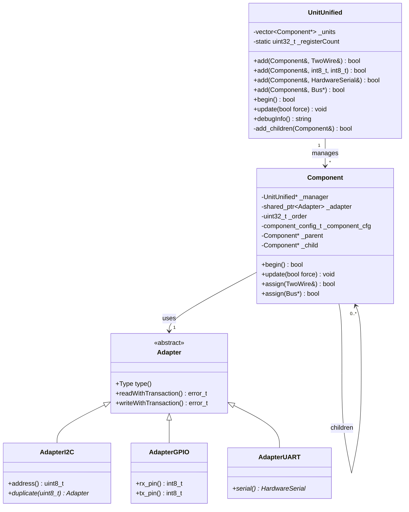
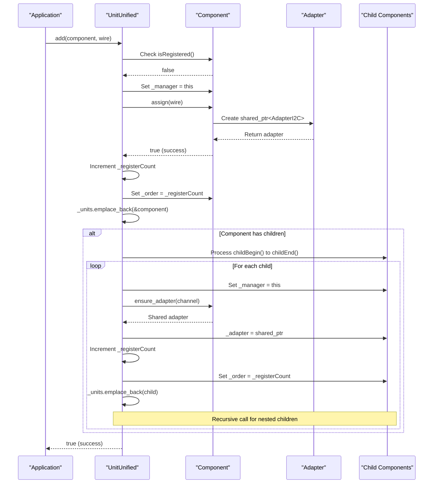
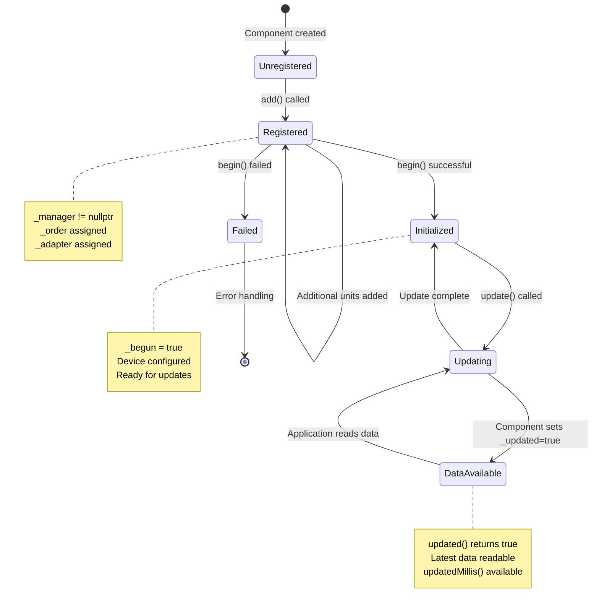

M5UnitUnified UnitUnified API

# UnitUnified API

<details>
<summary>Relevant source files</summary>

The following files were used as context for generating this wiki page:

- [src/M5UnitComponent.cpp](src/M5UnitComponent.cpp)
- [src/M5UnitComponent.hpp](src/M5UnitComponent.hpp)
- [src/M5UnitUnified.cpp](src/M5UnitUnified.cpp)
- [src/M5UnitUnified.hpp](src/M5UnitUnified.hpp)
- [src/m5_unit_component/adapter_base.hpp](src/m5_unit_component/adapter_base.hpp)
- [src/m5_unit_component/adapter_gpio_v1.hpp](src/m5_unit_component/adapter_gpio_v1.hpp)
- [src/m5_unit_component/adapter_i2c.cpp](src/m5_unit_component/adapter_i2c.cpp)

</details>


This page documents the `m5::unit::UnitUnified` class, which serves as the central manager for Component units in the M5UnitUnified library. The UnitUnified manager handles registration, initialization, and update orchestration for multiple sensor units across different communication protocols.

For information about individual Component methods and lifecycle, see [Component API](#9.1). For details on communication protocol implementations, see [Adapter APIs](#9.3). For usage patterns and examples, see [Usage Patterns](#5).

---

## Class Overview

The `UnitUnified` class manages a collection of Component units through a unified interface. It abstracts the complexities of multi-device management, including adapter assignment, parent-child hierarchies (for hub devices), and coordinated update cycles.

**Location**: [src/M5UnitUnified.hpp:47-117]() and [src/M5UnitUnified.cpp:13-169]()

### Key Responsibilities

| Responsibility | Description |
|----------------|-------------|
| **Registration** | Tracks units in registration order with unique identifiers |
| **Adapter Assignment** | Assigns appropriate communication adapters (I2C, GPIO, UART) to units |
| **Hierarchy Management** | Handles parent-child relationships for hub devices like PaHub2 |
| **Lifecycle Coordination** | Orchestrates `begin()` and `update()` calls across all registered units |
| **Debugging Support** | Provides formatted debug output showing complete device tree |

### Class Declaration Structure

```cpp
namespace m5::unit {
    class UnitUnified {
    public:
        using container_type = std::vector<Component*>;
        
        // Registration methods
        bool add(Component& u, TwoWire& wire);
        bool add(Component& u, const int8_t rx_pin, const int8_t tx_pin);
        bool add(Component& u, HardwareSerial& serial);
        bool add(Component& u, m5::hal::bus::Bus* bus);
        
        // Lifecycle methods
        bool begin();
        void update(const bool force = false);
        
        // Debugging
        std::string debugInfo() const;
        
    protected:
        container_type _units{};
        static uint32_t _registerCount;
    };
}
```

Sources: [src/M5UnitUnified.hpp:47-117](), [src/M5UnitUnified.cpp:16]()

---

## UnitUnified Manager Architecture

This diagram shows how the UnitUnified class relates to Component units and their communication infrastructure:



**Key Relationships:**
- UnitUnified maintains a `vector<Component*>` of all registered units
- Each Component has a back-pointer to its `_manager` (UnitUnified instance)
- Components share Adapters via `std::shared_ptr<Adapter>` for efficient bus multiplexing
- Parent-child pointers form linked lists for hub topologies

Sources: [src/M5UnitUnified.hpp:47-117](), [src/M5UnitComponent.hpp:35-588](), [src/m5_unit_component/adapter_base.hpp:25-229]()

---

## Adding Units to Manager

The `add()` methods register Component units with the manager and assign appropriate communication adapters. There are four overloaded variants for different communication protocols.

### add() Method Variants

| Method Signature | Protocol | Adapter Type | Use Case |
|-----------------|----------|--------------|----------|
| `add(Component&, TwoWire&)` | I2C | AdapterI2C (WireImpl) | Arduino I2C using Wire/Wire1 |
| `add(Component&, Bus*)` | I2C | AdapterI2C (BusImpl) | M5HAL I2C bus |
| `add(Component&, int8_t, int8_t)` | GPIO/RMT | AdapterGPIO | Digital/analog pins, pulse timing |
| `add(Component&, HardwareSerial&)` | UART | AdapterUART | Serial communication |

### Registration Flow

This diagram illustrates the registration process when adding a unit:



Sources: [src/M5UnitUnified.cpp:18-122]()

### add() Implementation Details

**I2C Registration (TwoWire)**
```cpp
bool UnitUnified::add(Component& u, TwoWire& wire)
```
- Validates unit is not already registered via `isRegistered()`
- Sets the unit's `_manager` pointer to `this`
- Calls `u.assign(wire)` which creates `AdapterI2C` with WireImpl
- Assigns sequential `_order` from static counter
- Adds unit pointer to `_units` vector
- Recursively processes any children via `add_children()`

Sources: [src/M5UnitUnified.cpp:41-58](), [src/M5UnitComponent.cpp:133-139]()

**GPIO Registration**
```cpp
bool UnitUnified::add(Component& u, const int8_t rx_pin, const int8_t tx_pin)
```
- Similar flow to I2C registration
- Calls `u.assign(rx_pin, tx_pin)` which creates `AdapterGPIO`
- Supports digital/analog I/O and RMT peripheral for pulse timing

Sources: [src/M5UnitUnified.cpp:60-77]()

**UART Registration**
```cpp
bool UnitUnified::add(Component& u, HardwareSerial& serial)
```
- Assigns `AdapterUART` wrapping the HardwareSerial instance
- Enables serial protocol-based sensors

Sources: [src/M5UnitUnified.cpp:79-96]()

**M5HAL Bus Registration**
```cpp
bool UnitUnified::add(Component& u, m5::hal::bus::Bus* bus)
```
- Uses M5HAL abstraction layer instead of Arduino APIs
- Creates `AdapterI2C` with BusImpl
- Null pointer checked before assignment

Sources: [src/M5UnitUnified.cpp:18-39]()

### Child Component Registration

The `add_children()` method handles hierarchical device topologies:

```cpp
bool UnitUnified::add_children(Component& u)
```

**Process:**
1. Iterates through parent's children using `childBegin()` to `childEnd()`
2. For each child:
   - Validates child is not already registered
   - Sets child's `_manager` to `this`
   - Calls parent's `ensure_adapter(channel)` to get shared adapter
   - Assigns sequential `_order`
   - Adds to `_units` vector
   - Recursively calls `add_children()` for nested hierarchies

**Adapter Sharing:**
- Children share parent's adapter via `std::shared_ptr`
- Reference count tracked for debugging (`use_count()`)
- Enables bus multiplexing through hub devices

Sources: [src/M5UnitUnified.cpp:99-122]()

---

## Lifecycle Management

### begin() Method

The `begin()` method initializes all registered units in registration order.

```cpp
bool UnitUnified::begin()
```

**Behavior:**
- Iterates through `_units` vector
- Calls each component's `begin()` method
- Sets internal `_begun` flag on each component
- Returns `false` if any unit fails initialization
- Logs failures with full debug info

**Implementation:**
```cpp
bool UnitUnified::begin()
{
    return !std::any_of(_units.begin(), _units.end(), [](Component* c) {
        M5_LIB_LOGV("Try begin:%s", c->deviceName());
        bool ret = c->_begun = c->begin();
        if (!ret) {
            M5_LIB_LOGE("Failed to begin: %s", c->debugInfo().c_str());
        }
        return !ret;
    });
}
```

**Typical Initialization Tasks:**
- I2C devices: Verify device ID, configure registers
- GPIO devices: Configure pin modes, initialize RMT
- Sensors: Start measurement modes, configure sampling rates
- Periodic sensors: Allocate circular buffers

Sources: [src/M5UnitUnified.cpp:124-134]()

### update() Method

The `update()` method orchestrates data acquisition across all managed units.

```cpp
void UnitUnified::update(const bool force = false)
```

**Parameters:**
- `force`: If true, forces communication even if not in periodic measurement mode

**Behavior:**
- Iterates through `_units` in registration order
- Only updates units where:
  - `_component_cfg.self_update == false` (non-self-updating)
  - `_begun == true` (successfully initialized)
- Self-updating units are skipped (managed by FreeRTOS tasks)

**Implementation:**
```cpp
void UnitUnified::update(const bool force)
{
    for (auto&& u : _units) {
        if (!u->_component_cfg.self_update && u->_begun) {
            u->update(force);
        }
    }
}
```

Sources: [src/M5UnitUnified.cpp:136-144]()

### Lifecycle State Machine



Sources: [src/M5UnitUnified.cpp:124-144](), [src/M5UnitComponent.hpp:100-111]()

---

## Debugging Support

### debugInfo() Method

The `debugInfo()` method generates a formatted string representing the complete device hierarchy.

```cpp
std::string UnitUnified::debugInfo() const
```

**Output Format:**
```
M5UnitUnified: N units
[UnitName]:ID{0xXXXXXXXX}:0xADDR CH:-1 parent:0 children:M/N
    [ChildName]:ID{0xYYYYYYYY}:0xADDR CH:0 parent:1 children:0/0
    [ChildName]:ID{0xZZZZZZZZ}:0xADDR CH:1 parent:1 children:0/0
```

**Information Displayed:**

| Field | Description | Example |
|-------|-------------|---------|
| Unit count | Total registered units | `3 units` |
| Device name | Component class name | `[UnitCO2]` |
| Identifier | Unique 32-bit UID | `ID{0x12345678}` |
| Adapter info | Type-specific details | `0x62` (I2C address) |
| Channel | Parent connection channel | `CH:0` |
| Parent status | Has parent unit? | `parent:1` |
| Children | Current/max children | `children:2/6` |

**Indentation:**
- Root units have no indentation
- Each child level indents by 4 spaces
- Shows hierarchical structure visually

**Implementation:**
```cpp
std::string UnitUnified::debugInfo() const
{
    std::string s = m5::utility::formatString("\nM5UnitUnified: %zu units\n", _units.size());
    for (auto&& u : _units) {
        if (!u->hasParent()) {
            s += make_unit_info(u, 0);
        }
    }
    return m5::utility::trim(s);
}
```

The recursive `make_unit_info()` helper traverses child/sibling pointers to build the hierarchy string.

Sources: [src/M5UnitUnified.cpp:146-166](), [src/M5UnitComponent.cpp:362-381]()

### Component Debug Output

Each Component contributes its own debug string via `Component::debugInfo()`:

**I2C Components:**
```
[UnitCO2]:ID{0xA5C02D00}:0x7FFFFF12:2 ADDR:62 CH:-1 parent:0 children:0/0
```
- Adapter pointer and reference count: `0x7FFFFF12:2`
- I2C address: `ADDR:62`

**GPIO Components:**
```
[UnitAngle]:ID{0xA5A47400}:0x7FFFFF34:1 RX:32 TX:33 CH:-1 parent:0 children:0/0
```
- RX/TX pin numbers: `RX:32 TX:33`

Sources: [src/M5UnitComponent.cpp:362-381]()

---

## Internal Architecture

### Registration Order Tracking

The static member `_registerCount` provides globally unique, sequential order numbers:

```cpp
static uint32_t UnitUnified::_registerCount{0};
```

**Purpose:**
- Ensures deterministic update order
- Useful for debugging and logging
- Persists across multiple UnitUnified instances (if used)

**Assignment:**
- Incremented for each unit (including children)
- Stored in each Component's `_order` member
- Survives component moves (move constructor preserves value)

Sources: [src/M5UnitUnified.cpp:16](), [src/M5UnitComponent.hpp:137-140]()

### Container Management

The `_units` vector stores raw pointers to Component objects:

```cpp
container_type _units{};  // std::vector<Component*>
```

**Design Rationale:**
- **Non-owning pointers**: Components are owned by application code
- **Stable addresses**: Component move constructor is default, no relocation issues
- **Sequential iteration**: Preserves registration order for updates
- **No dynamic allocation**: Units must outlive the UnitUnified instance

Sources: [src/M5UnitUnified.hpp:113]()

### Adapter Sharing Model

Components share adapters through `std::shared_ptr<Adapter>`:

```cpp
// In Component class
std::shared_ptr<m5::unit::Adapter> _adapter{};
```

**Sharing Scenarios:**

1. **Hub Children**: All children of a hub share the parent's adapter
   ```cpp
   it->_adapter = u.ensure_adapter(ch);  // Shared ownership
   ```

2. **Reference Counting**: Tracked for debugging
   ```cpp
   M5_LIB_LOGD("Shared:%u %u", u._adapter.use_count(), it->_adapter.use_count());
   ```

3. **Channel Selection**: Before communication, entire parent chain selects channels
   ```cpp
   selectChannel(channel());  // Recursive up parent chain
   ```

Sources: [src/M5UnitUnified.cpp:111-112](), [src/M5UnitComponent.cpp:157-164]()

---

## Validation and Error Handling

### Registration Validation

The `add()` methods perform several validation checks:

**Duplicate Registration Prevention:**
```cpp
if (u.isRegistered()) {
    M5_LIB_LOGW("Already added");
    return false;
}
```

**Null Parameter Checks:**
```cpp
if (!bus) {
    M5_LIB_LOGE("Bus null");
    return false;
}
```

**Assignment Verification:**
```cpp
if (u.assign(wire)) {
    // Success path
} else {
    M5_LIB_LOGE("Failed to assign %s:%u", u.deviceName(), u.canAccessI2C());
    return false;
}
```

Sources: [src/M5UnitUnified.cpp:20-38]()

### Child Registration Validation

The `add_children()` method validates child components:

```cpp
if (it->isRegistered()) {
    M5_LIB_LOGE("Already registered %s", it->deviceName());
    return false;
}
```

**Prevents:**
- Registering the same child multiple times
- Circular parent-child relationships
- Conflicting adapter assignments

Sources: [src/M5UnitUnified.cpp:106-108]()

---

## Usage Example

Complete example showing typical UnitUnified workflow:

```cpp
#include <M5Unified.h>
#include <M5UnitUnified.hpp>
#include <M5UnitUnifiedENV.hpp>

m5::unit::UnitUnified Units;
m5::unit::UnitCO2 co2;
m5::unit::UnitSHT30 sht30;

void setup() {
    M5.begin();
    
    // Initialize I2C bus
    Wire.begin(M5.getPin(m5::pin_name_t::port_a_sda),
               M5.getPin(m5::pin_name_t::port_a_scl), 400000);
    
    // Register units
    Units.add(co2, Wire);
    Units.add(sht30, Wire);
    
    // Initialize all units
    if (!Units.begin()) {
        Serial.println("Failed to initialize units");
        Serial.println(Units.debugInfo().c_str());
    }
}

void loop() {
    M5.update();
    Units.update();  // Updates both co2 and sht30
    
    if (co2.updated()) {
        Serial.printf("CO2: %d ppm\n", co2.co2());
    }
    if (sht30.updated()) {
        Serial.printf("Temp: %.1f C\n", sht30.temperature());
    }
    
    delay(100);
}
```

For more usage patterns, see:
- [Simple Pattern](#5.1) - Basic single-unit usage
- [Multiple Units Demo](#5.4) - Complex multi-sensor systems with hubs
- [Self-Update Pattern](#5.3) - Asynchronous updates with FreeRTOS

Sources: Examples from typical usage patterns

---

## Member Summary

### Public Methods

| Method | Return Type | Description |
|--------|-------------|-------------|
| `add(Component&, TwoWire&)` | `bool` | Register I2C unit with Arduino Wire |
| `add(Component&, Bus*)` | `bool` | Register I2C unit with M5HAL Bus |
| `add(Component&, int8_t, int8_t)` | `bool` | Register GPIO unit with pin numbers |
| `add(Component&, HardwareSerial&)` | `bool` | Register UART unit with serial port |
| `begin()` | `bool` | Initialize all registered units |
| `update(bool)` | `void` | Update all non-self-updating units |
| `debugInfo()` | `std::string` | Generate debug hierarchy string |

### Protected Members

| Member | Type | Description |
|--------|------|-------------|
| `_units` | `std::vector<Component*>` | Container of registered unit pointers |
| `_registerCount` | `static uint32_t` | Global registration order counter |

### Type Aliases

| Alias | Definition |
|-------|------------|
| `container_type` | `std::vector<Component*>` |

Sources: [src/M5UnitUnified.hpp:47-117]()

---

## Related Classes and Types

The UnitUnified class works closely with these types:

- **Component**: Base class for all units, see [Component API](#9.1)
- **Adapter**: Communication abstraction, see [Adapter APIs](#9.3)
- **component_config_t**: Configuration structure in Component
- **TwoWire**: Arduino I2C interface (Wire.h)
- **HardwareSerial**: Arduino UART interface (HardwareSerial.h)
- **m5::hal::bus::Bus**: M5HAL bus abstraction

Sources: [src/M5UnitUnified.hpp:1-122](), [src/M5UnitComponent.hpp:1-758]()