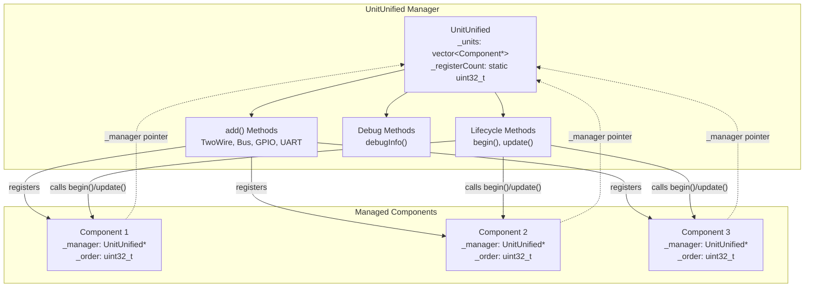
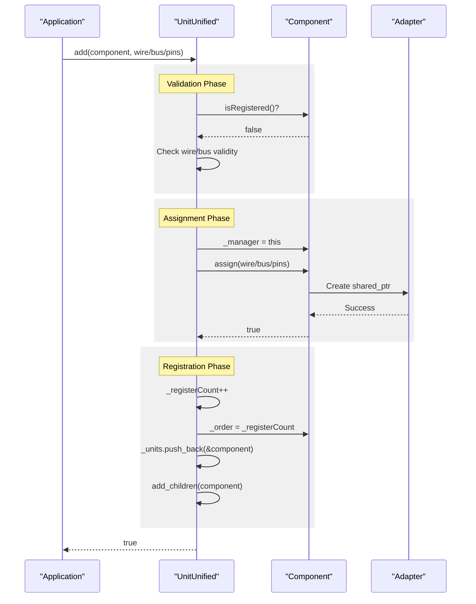
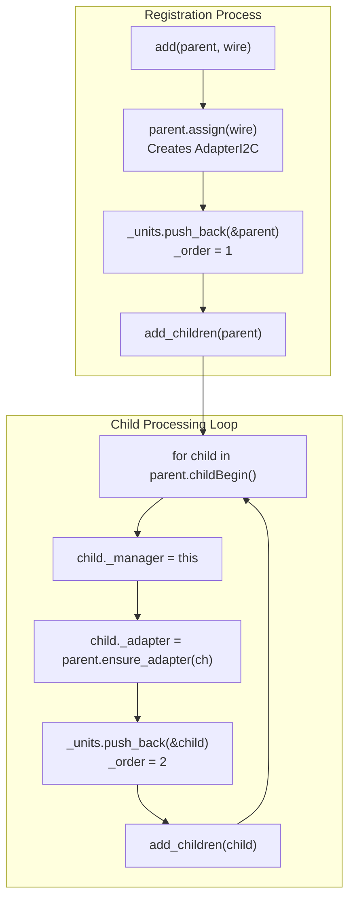
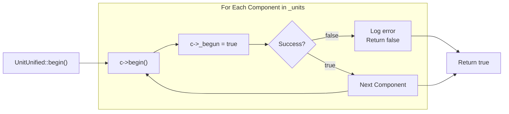
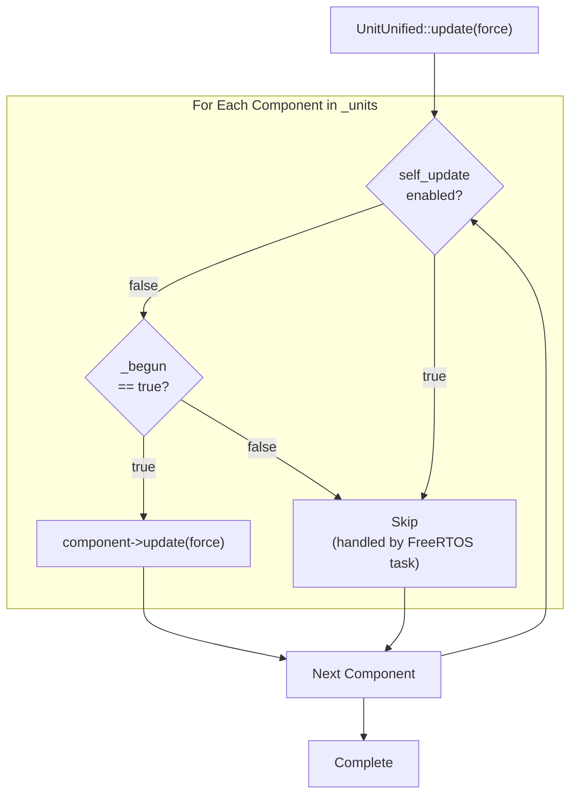
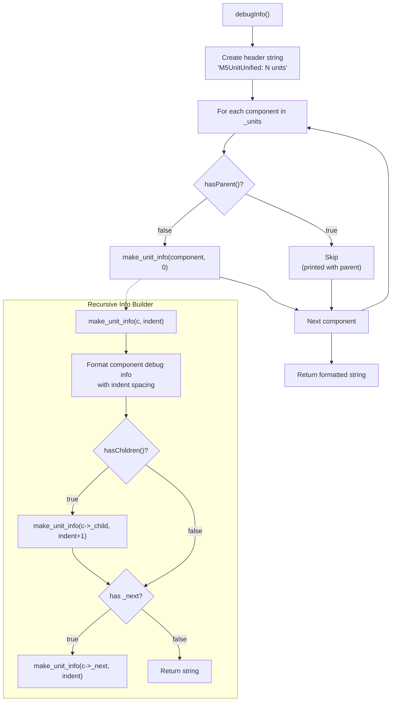

M5UnitUnified UnitUnified Manager

# UnitUnified Manager

<details>
<summary>Relevant source files</summary>

The following files were used as context for generating this wiki page:

- [src/M5UnitComponent.cpp](src/M5UnitComponent.cpp)
- [src/M5UnitComponent.hpp](src/M5UnitComponent.hpp)
- [src/M5UnitUnified.cpp](src/M5UnitUnified.cpp)
- [src/M5UnitUnified.hpp](src/M5UnitUnified.hpp)
- [src/m5_unit_component/adapter_base.hpp](src/m5_unit_component/adapter_base.hpp)
- [src/m5_unit_component/adapter_gpio_v1.hpp](src/m5_unit_component/adapter_gpio_v1.hpp)
- [src/m5_unit_component/adapter_i2c.cpp](src/m5_unit_component/adapter_i2c.cpp)

</details>


## Purpose and Scope

The `UnitUnified` class is the central orchestration manager responsible for registering, initializing, and updating Component instances. This page documents the manager's architecture, registration process, lifecycle coordination, and debugging utilities.

For information about the Component base class and its lifecycle, see [Component System](#3.1). For usage patterns with the manager, see [Simple Pattern](#5.1) and [Component-Only Pattern](#5.2).

---

## Overview

The `UnitUnified` manager provides centralized control over multiple sensor units through a unified interface. Its primary responsibilities include:

1. **Component Registration**: Tracking all Components and assigning communication adapters
2. **Hierarchy Management**: Establishing parent-child relationships for hub devices
3. **Lifecycle Orchestration**: Coordinating `begin()` and `update()` calls across all units
4. **Debug Information**: Generating hierarchical debug output for troubleshooting

The manager is defined in [src/M5UnitUnified.hpp:47-117]() and implemented in [src/M5UnitUnified.cpp]().



**Sources**: [src/M5UnitUnified.hpp:47-117](), [src/M5UnitUnified.cpp:16]()

---

## Class Structure

The `UnitUnified` class maintains minimal state with maximum functionality:

| Member | Type | Purpose |
|--------|------|---------|
| `_units` | `std::vector<Component*>` | Container of all registered Components |
| `_registerCount` | `static uint32_t` | Global counter for registration order tracking |

The class enforces move-only semantics through deleted copy constructors [src/M5UnitUnified.hpp:52-65]().

**Sources**: [src/M5UnitUnified.hpp:49-116](), [src/M5UnitUnified.cpp:16]()

---

## Registration System

### Registration Flow

Components are registered via overloaded `add()` methods that handle different communication protocols:



**Sources**: [src/M5UnitUnified.cpp:18-96]()

### Add Method Signatures

The manager provides four registration methods corresponding to different communication protocols:

| Method | Purpose | Adapter Created |
|--------|---------|-----------------|
| `add(Component&, TwoWire&)` | I2C via Arduino Wire | `AdapterI2C(TwoWire)` |
| `add(Component&, Bus*)` | I2C via M5HAL Bus | `AdapterI2C(Bus)` |
| `add(Component&, int8_t, int8_t)` | GPIO with RX/TX pins | `AdapterGPIO` |
| `add(Component&, HardwareSerial&)` | UART serial | `AdapterUART` |

Each method follows the same pattern [src/M5UnitUnified.cpp:18-96]():

1. **Validation**: Check if Component already registered
2. **Manager Assignment**: Set `Component::_manager` pointer to `this`
3. **Adapter Creation**: Call `Component::assign()` to create appropriate Adapter
4. **Order Tracking**: Increment `_registerCount` and assign to `Component::_order`
5. **Storage**: Add Component pointer to `_units` vector
6. **Child Processing**: Recursively register any child Components

**Sources**: [src/M5UnitUnified.cpp:18-96](), [src/M5UnitUnified.hpp:68-98]()

### Parent-Child Hierarchy Registration

When a Component has children (hub devices), the manager recursively registers them:



The `add_children()` method [src/M5UnitUnified.cpp:99-122]() performs:

1. **Iteration**: Traverse all children via `Component::childBegin()`/`childEnd()` iterators
2. **Manager Assignment**: Set each child's `_manager` pointer
3. **Adapter Sharing**: Call `parent.ensure_adapter(channel)` to get shared adapter
4. **Order Assignment**: Assign sequential `_order` values
5. **Container Addition**: Add to `_units` vector
6. **Recursion**: Process grandchildren if they exist

This enables deeply nested hub topologies where multiple levels share a single I2C bus connection.

**Sources**: [src/M5UnitUnified.cpp:99-122]()

### Registration Order Tracking

The `_registerCount` static member provides globally unique ordering:

```cpp
static uint32_t _registerCount{0};  // Global counter
```

Each registered Component receives:
- `_order = ++_registerCount` during registration
- `_order == 0` indicates unregistered Component

This ordering ensures:
1. **Deterministic Initialization**: `begin()` called in registration order
2. **Deterministic Updates**: `update()` called in registration order
3. **Debug Traceability**: Order visible in `debugInfo()` output

**Sources**: [src/M5UnitUnified.cpp:16](), [src/M5UnitUnified.cpp:33,52,71,90,113](), [src/M5UnitComponent.hpp:137-140]()

---

## Lifecycle Management

### Begin Orchestration

The `begin()` method initializes all registered Components in order:



Implementation [src/M5UnitUnified.cpp:124-134]():

```cpp
bool UnitUnified::begin() {
    return !std::any_of(_units.begin(), _units.end(), [](Component* c) {
        M5_LIB_LOGV("Try begin:%s", c->deviceName());
        bool ret = c->_begun = c->begin();
        if (!ret) {
            M5_LIB_LOGE("Failed to begin: %s", c->debugInfo().c_str());
        }
        return !ret;  // Returns true if begin failed, causing any_of to return true
    });
}
```

The method:
- Uses `std::any_of()` to iterate all Components
- Sets `Component::_begun` flag for each Component
- Returns `false` if any Component fails initialization
- Logs errors with full debug information

**Sources**: [src/M5UnitUnified.cpp:124-134]()

### Update Loop

The `update()` method coordinates periodic data collection:



Implementation [src/M5UnitUnified.cpp:136-144]():

```cpp
void UnitUnified::update(const bool force) {
    // Order of registration
    for (auto&& u : _units) {
        if (!u->_component_cfg.self_update && u->_begun) {
            u->update(force);
        }
    }
}
```

Key behaviors:
- **Sequential Processing**: Updates Components in registration order
- **Self-Update Filtering**: Skips Components with `self_update = true`
- **Begin Check**: Only updates Components that successfully initialized
- **Force Parameter**: Passed through to enable forced communication

The self-update filtering allows high-frequency sensors to run in dedicated FreeRTOS tasks without blocking the main loop. See [Self-Update Pattern](#5.3) for details.

**Sources**: [src/M5UnitUnified.cpp:136-144]()

---

## Internal Data Structures

### Components Container

The `_units` vector stores raw pointers to all registered Components:

```cpp
container_type _units{};  // std::vector<Component*>
```

**Design Rationale**:
- **Non-Owning**: Components remain owned by application code
- **Stable Pointers**: Vector stores pointers, not objects (no moves)
- **Iteration Order**: Maintains registration order for deterministic behavior

**Lifetime Guarantee**: Application must ensure Components outlive the `UnitUnified` instance.

**Sources**: [src/M5UnitUnified.hpp:49,113]()

### Registration Order Table

The following shows how Components are tracked:

| Component | `_order` | `_manager` | Position in `_units` | `_begun` |
|-----------|----------|------------|----------------------|----------|
| Parent Hub | 1 | `&manager` | `_units[0]` | Set by `begin()` |
| Child 1 | 2 | `&manager` | `_units[1]` | Set by `begin()` |
| Child 2 | 3 | `&manager` | `_units[2]` | Set by `begin()` |
| Standalone | 4 | `&manager` | `_units[3]` | Set by `begin()` |

This structure enables:
1. **Bidirectional Lookup**: Component knows manager, manager knows all Components
2. **Order Preservation**: Registration order maintained throughout lifecycle
3. **State Tracking**: `_begun` flag prevents updates of failed Components

**Sources**: [src/M5UnitComponent.hpp:572,575,579]()

---

## Debug Utilities

### Debug Information Generation

The `debugInfo()` method generates hierarchical output showing all Components and their relationships:



Implementation [src/M5UnitUnified.cpp:146-166]():

```cpp
std::string UnitUnified::debugInfo() const {
    std::string s = m5::utility::formatString("\nM5UnitUnified: %zu units\n", _units.size());
    for (auto&& u : _units) {
        if (!u->hasParent()) {  // Only print top-level units
            s += make_unit_info(u, 0);
        }
    }
    return m5::utility::trim(s);
}

std::string UnitUnified::make_unit_info(const Component* u, const uint8_t indent) const {
    std::string s = m5::utility::formatString("%*c%s\n", indent * 4, ' ', u->debugInfo().c_str());
    
    if (u->hasChildren()) {
        s += make_unit_info(u->_child, indent + 1);  // Recurse into children
    }
    u = u->_next;  // Move to sibling
    return u ? s += make_unit_info(u, indent) : s;  // Recurse into siblings
}
```

**Output Format**:
```
M5UnitUnified: 4 units
[UnitPaHub2]:ID{0x12345678}:0x12ab3ffc:2 ADDR:70 CH:-1 parent:0 children:3/8
    [UnitCO2]:ID{0x23456789}:0x12ab3ffc:2 ADDR:62 CH:0 parent:1 children:0/0
    [UnitVmeter]:ID{0x34567890}:0x12ab3ffc:2 ADDR:49 CH:1 parent:1 children:0/0
    [UnitHEART]:ID{0x45678901}:0x12ab3ffc:2 ADDR:57 CH:2 parent:1 children:0/0
```

Each line includes:
- Device name and unique identifier
- Adapter pointer and reference count
- I2C address (for I2C devices)
- Channel number (for hub children)
- Parent existence flag
- Children count and maximum

**Sources**: [src/M5UnitUnified.cpp:146-166](), [src/M5UnitComponent.cpp:362-381]()

---

## Integration with Components

### Component-Side State

Each Component maintains references back to its manager:

```cpp
class Component {
private:
    UnitUnified* _manager{};  // Non-owning pointer to manager
    uint32_t _order{};        // Registration order (0 = unregistered)
    bool _begun{};            // Initialization status
    
    friend class UnitUnified;  // Allows manager to access private members
};
```

**Access Methods** [src/M5UnitComponent.hpp:137-150]():
- `isRegistered()`: Returns `_manager != nullptr`
- `order()`: Returns registration order number

The `friend` declaration [src/M5UnitComponent.hpp:587]() allows `UnitUnified` to:
- Set `_manager` pointer during registration
- Set `_order` value
- Set `_begun` flag during initialization
- Access parent-child chain for hierarchy traversal

**Sources**: [src/M5UnitComponent.hpp:137-150,572,575,579,587]()

### Registration State Diagram

```mermaid
stateDiagram-v2
    [*] --> Unregistered: Component constructed
    
    Unregistered --> Registered: UnitUnified::add()
    
    state Unregistered {
        [*] --> NotManaged
        NotManaged: _manager = nullptr
        NotManaged: _order = 0
        NotManaged: _begun = false
    }
    
    state Registered {
        [*] --> PendingInit
        PendingInit --> Initialized: UnitUnified::begin()
        PendingInit --> Failed: begin() returns false
        
        PendingInit: _manager = &manager
        PendingInit: _order = registerCount
        PendingInit: _begun = false
        
        Initialized: _manager = &manager
        Initialized: _order = registerCount
        Initialized: _begun = true
        
        Failed: _manager = &manager
        Failed: _order = registerCount
        Failed: _begun = false
    }
    
    Initialized --> Active: UnitUnified::update()
    
    state Active {
        [*] --> Updating
        Updating --> Updating: Periodic calls
        
        Updating: update() called if !self_update
    }
```

**Sources**: [src/M5UnitComponent.hpp:572,575,579](), [src/M5UnitUnified.cpp:31,50,69,88,110-113,128,140]()

---

## Usage Patterns Summary

### Standard Pattern

```cpp
// 1. Create manager
UnitUnified Units;

// 2. Create components
UnitCO2 co2;
UnitVmeter vmeter;

// 3. Register with manager
Units.add(co2, Wire);
Units.add(vmeter, Wire);

// 4. Initialize
Units.begin();

// 5. Main loop
loop() {
    Units.update();  // Updates all non-self-update components
}
```

### Hub Pattern

```cpp
// 1. Create hub and sensors
UnitPaHub2 hub;
UnitCO2 co2;
UnitVmeter vmeter;

// 2. Connect sensors to hub
hub.add(co2, 0);   // Channel 0
hub.add(vmeter, 1); // Channel 1

// 3. Register only the hub (children registered automatically)
Units.add(hub, Wire);

// 4. Initialize
Units.begin();  // Initializes hub and all children in order

// 5. Update
loop() {
    Units.update();  // Updates all devices, handling channel selection
}
```

For complete examples, see [Simple Pattern](#5.1) and [Multiple Units Demo](#5.4).

**Sources**: [examples/Simple/Simple.ino](), [examples/MultipleUnits/MultipleUnits.ino]()