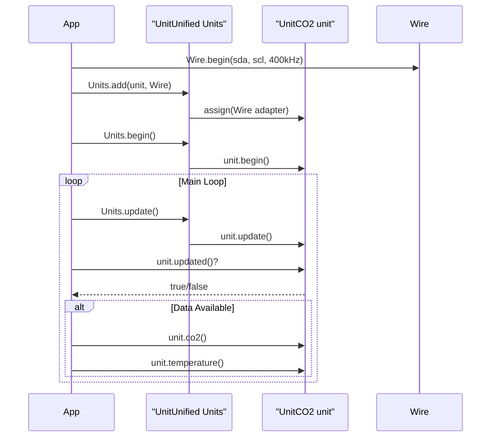
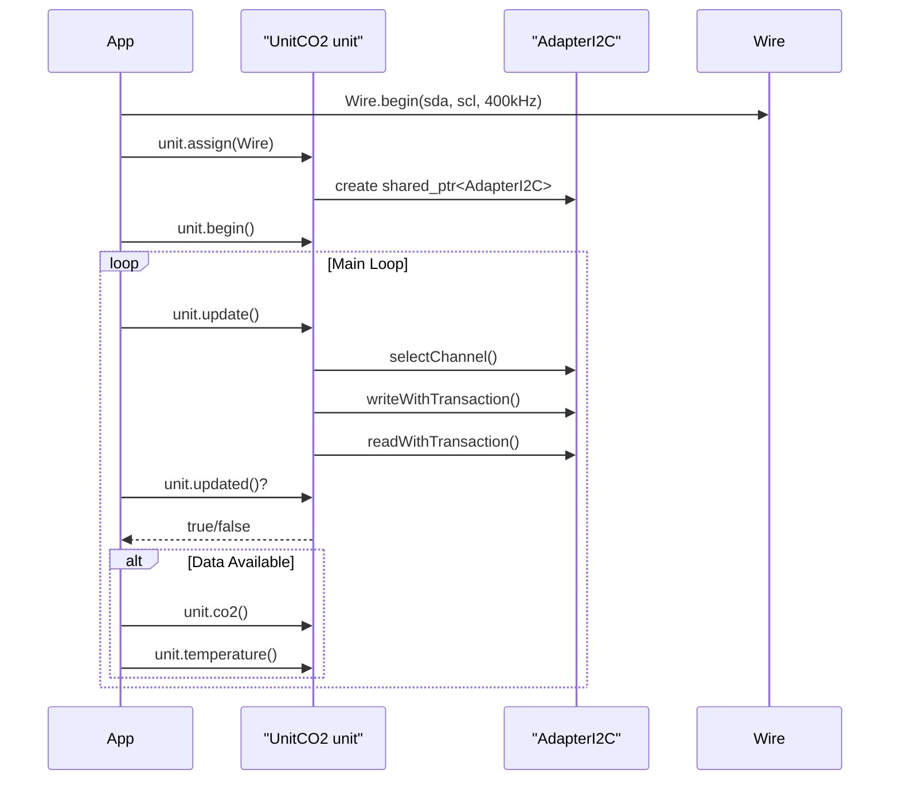
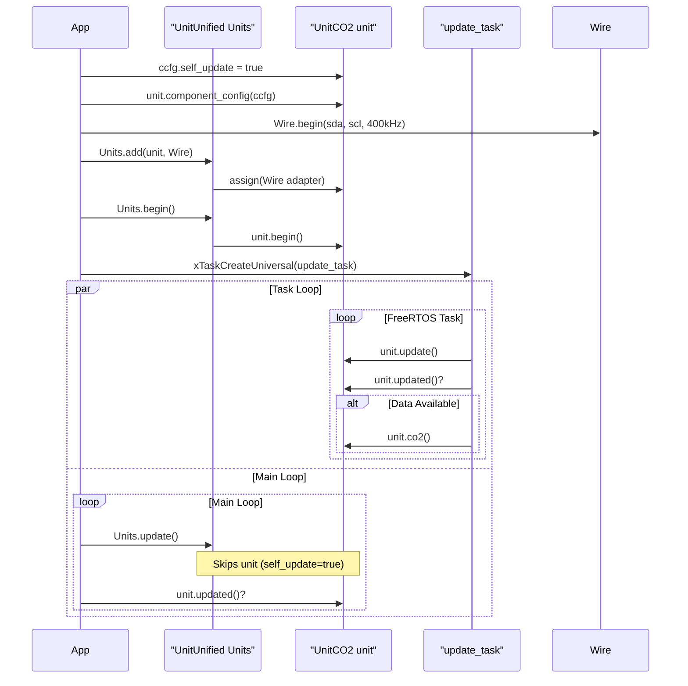
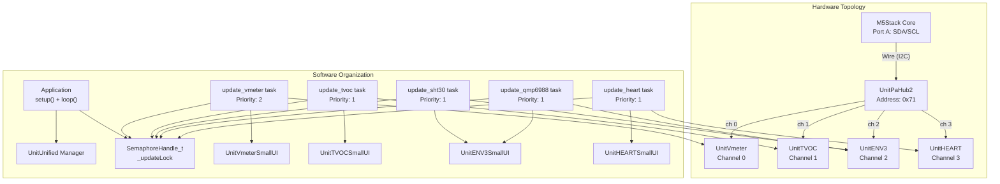
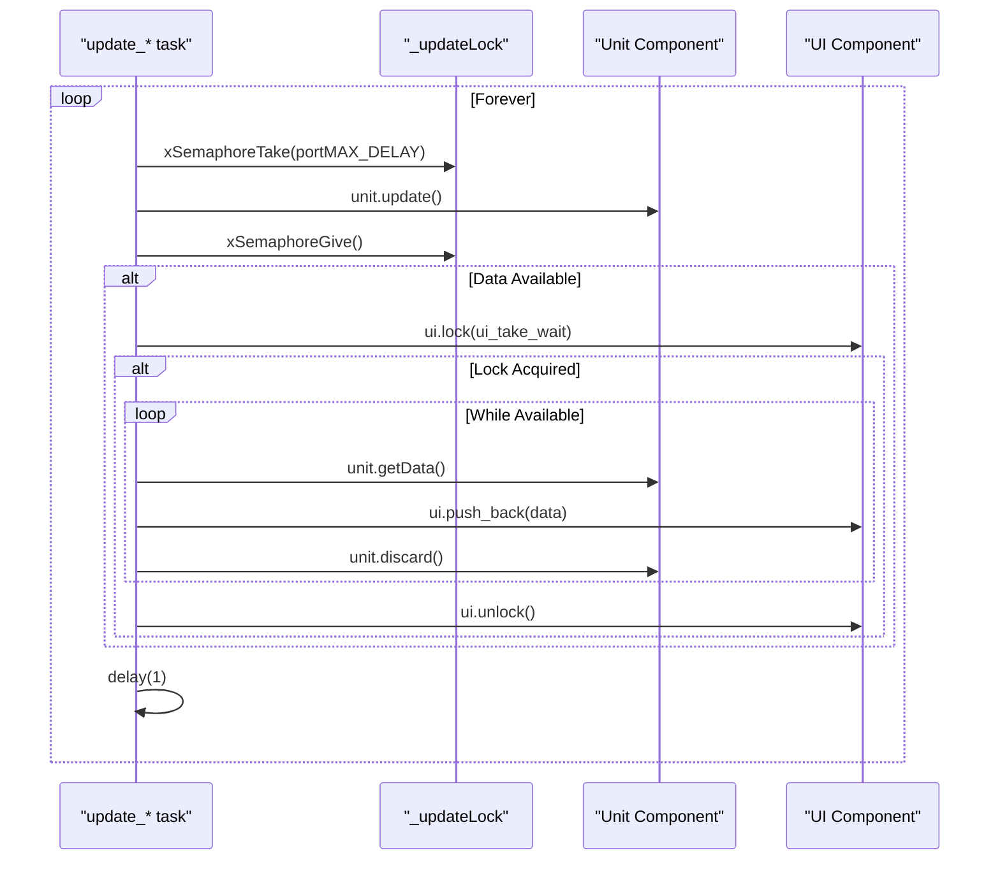
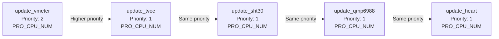
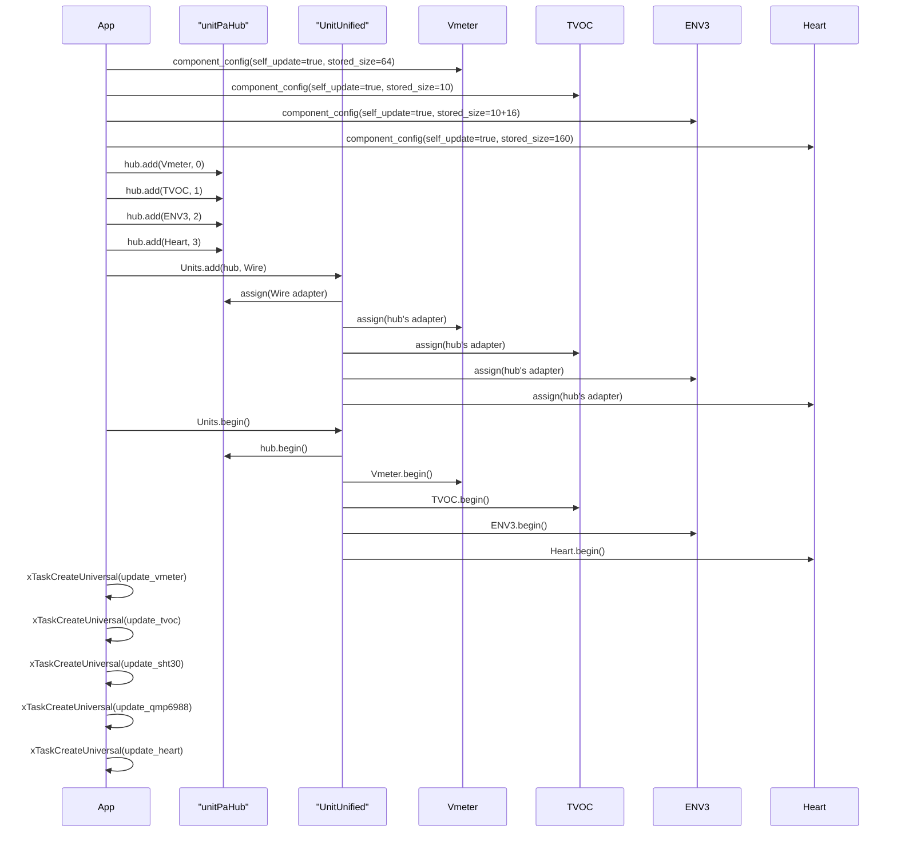
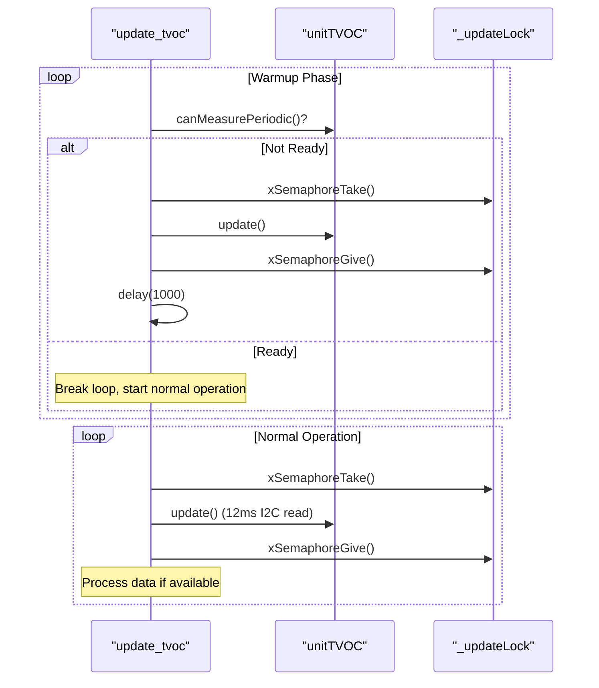

M5UnitUnified Usage Patterns

# Usage Patterns

Relevant source files

The following files were used as context for generating this wiki page:

- [examples/Basic/ComponentOnly/ComponentOnly.ino](examples/Basic/ComponentOnly/ComponentOnly.ino)
- [examples/Basic/ComponentOnly/main/ComponentOnly.cpp](examples/Basic/ComponentOnly/main/ComponentOnly.cpp)
- [examples/Basic/SelfUpdate/SelfUpdate.ino](examples/Basic/SelfUpdate/SelfUpdate.ino)
- [examples/Basic/SelfUpdate/main/SelfUpdate.cpp](examples/Basic/SelfUpdate/main/SelfUpdate.cpp)
- [examples/Basic/Simple/Simple.ino](examples/Basic/Simple/Simple.ino)
- [examples/Basic/Simple/main/Simple.cpp](examples/Basic/Simple/main/Simple.cpp)
- [examples/demo/MultipleUnits/main/MultipleUnits.cpp](examples/demo/MultipleUnits/main/MultipleUnits.cpp)
- [examples/demo/MultipleUnits/src/ui/ui_UnitHEART.cpp](examples/demo/MultipleUnits/src/ui/ui_UnitHEART.cpp)
- [examples/demo/MultipleUnits/src/ui/ui_UnitHEART.hpp](examples/demo/MultipleUnits/src/ui/ui_UnitHEART.hpp)

## Purpose and Scope

This document demonstrates the four primary usage patterns for M5UnitUnified: **Simple Pattern**, **Component-Only Pattern**, **Self-Update Pattern**, and **Multiple Units Demo**. Each pattern addresses different application requirements, from basic sensor polling to complex multi-unit systems with concurrent updates.

For detailed information about the Component lifecycle and configuration options, see [Component System](#3.1). For adapter assignment and communication protocols, see [Adapter Pattern](#3.3). For hub topologies and parent-child relationships, see [Parent-Child Hierarchies](#3.4).

## Pattern Selection Overview

The four patterns differ in how components are managed and when updates occur:

| Pattern | UnitUnified Manager | Update Orchestration | Use Case |
|---------|---------------------|----------------------|----------|
| Simple | Required | Automatic via `Units.update()` | Single/multiple units with synchronized polling |
| Component-Only | Not used | Manual via `unit.update()` | Direct component control, minimal overhead |
| Self-Update | Required | Asynchronous FreeRTOS tasks | High-frequency sensors, background updates |
| Multiple Units | Required | Mixed (self-update + synchronization) | Complex systems with hub, concurrent sensors, UI |

**Sources:** [examples/Basic/Simple/main/Simple.cpp](), [examples/Basic/ComponentOnly/main/ComponentOnly.cpp](), [examples/Basic/SelfUpdate/main/SelfUpdate.cpp](), [examples/demo/MultipleUnits/main/MultipleUnits.cpp]()

## Pattern Comparison Diagram

```mermaid
graph TB
    subgraph "Simple Pattern"
        APP1["Application"]
        UNITS1["UnitUnified Manager"]
        COMP1["UnitCO2"]
        
        APP1 -->|"Units.add(unit, Wire)"| UNITS1
        APP1 -->|"Units.begin()"| UNITS1
        APP1 -->|"Units.update()"| UNITS1
        UNITS1 -->|"calls unit.update()"| COMP1
        APP1 -->|"unit.updated()?"| COMP1
    end
    
    subgraph "Component-Only Pattern"
        APP2["Application"]
        COMP2["UnitCO2"]
        
        APP2 -->|"unit.assign(Wire)"| COMP2
        APP2 -->|"unit.begin()"| COMP2
        APP2 -->|"unit.update()"| COMP2
        APP2 -->|"unit.updated()?"| COMP2
    end
    
    subgraph "Self-Update Pattern"
        APP3["Application"]
        UNITS3["UnitUnified Manager"]
        COMP3["UnitCO2"]
        TASK["FreeRTOS Task"]
        
        APP3 -->|"ccfg.self_update = true"| COMP3
        APP3 -->|"Units.add(unit, Wire)"| UNITS3
        APP3 -->|"Units.begin()"| UNITS3
        APP3 -->|"xTaskCreate(update_task)"| TASK
        TASK -->|"unit.update()"| COMP3
        APP3 -->|"Units.update()"| UNITS3
        UNITS3 -.->|"skips self-update units"| COMP3
        APP3 -->|"unit.updated()?"| COMP3
    end
    
    subgraph "Multiple Units Pattern"
        APP4["Application"]
        UNITS4["UnitUnified Manager"]
        HUB["UnitPaHub2"]
        SENSOR1["UnitVmeter"]
        SENSOR2["UnitTVOC"]
        TASK1["update_vmeter task"]
        TASK2["update_tvoc task"]
        SEM["Semaphore _updateLock"]
        
        APP4 -->|"hub.add(sensor, ch)"| HUB
        APP4 -->|"Units.add(hub, Wire)"| UNITS4
        APP4 -->|"Units.begin()"| UNITS4
        TASK1 -->|"xSemaphoreTake"| SEM
        TASK1 -->|"unit.update()"| SENSOR1
        TASK1 -->|"xSemaphoreGive"| SEM
        TASK2 -->|"xSemaphoreTake"| SEM
        TASK2 -->|"unit.update()"| SENSOR2
        TASK2 -->|"xSemaphoreGive"| SEM
    end
```

**Sources:** [examples/Basic/Simple/main/Simple.cpp:17-42](), [examples/Basic/ComponentOnly/main/ComponentOnly.cpp:16-41](), [examples/Basic/SelfUpdate/main/SelfUpdate.cpp:14-63](), [examples/demo/MultipleUnits/main/MultipleUnits.cpp:38-392]()

## Simple Pattern

The Simple Pattern uses `UnitUnified` manager for centralized lifecycle management. The manager handles initialization and updates for all registered units.

### Structure

### Key Characteristics

- **UnitUnified Manager:** Orchestrates updates via `Units.update()` [examples/Basic/Simple/main/Simple.cpp:37]()
- **Automatic Update:** All added units are updated in registration order
- **Centralized Control:** Single call updates all units synchronously
- **Typical Setup:** Calls to `Units.add()`, `Units.begin()`, `Units.update()` [examples/Basic/Simple/main/Simple.cpp:27-28,37]()

### When to Use

- Multiple units requiring synchronized updates
- Simple application logic without threading
- Default pattern for most use cases

**Sources:** [examples/Basic/Simple/main/Simple.cpp:17-42]()

## Component-Only Pattern

The Component-Only Pattern bypasses `UnitUnified` manager entirely. Applications manage components directly by calling lifecycle methods themselves.

### Structure

### Key Characteristics

- **No Manager:** `UnitUnified` is not instantiated or used
- **Direct Assignment:** Component's `assign()` method creates adapter [examples/Basic/ComponentOnly/main/ComponentOnly.cpp:26]()
- **Manual Update:** Application calls `unit.update()` directly [examples/Basic/ComponentOnly/main/ComponentOnly.cpp:36]()
- **Minimal Overhead:** Eliminates manager's iteration and coordination

### When to Use

- Single unit applications
- Custom update scheduling requirements
- Memory-constrained environments
- Direct control over component lifecycle

**Sources:** [examples/Basic/ComponentOnly/main/ComponentOnly.cpp:14-41]()

## Self-Update Pattern

The Self-Update Pattern enables asynchronous updates via FreeRTOS tasks. Components marked with `self_update = true` are skipped by `Units.update()`, allowing dedicated tasks to call `unit.update()` independently.

### Structure

### Key Characteristics

- **Configuration Flag:** `component_config().self_update = true` [examples/Basic/SelfUpdate/main/SelfUpdate.cpp:38-40]()
- **Task Creation:** Uses `xTaskCreateUniversal()` for platform independence [examples/Basic/SelfUpdate/main/SelfUpdate.cpp:49-54]()
- **Manager Bypass:** `Units.update()` skips self-updating units [examples/Basic/SelfUpdate/main/SelfUpdate.cpp:60]()
- **Concurrent Updates:** Task runs independently on designated CPU core

### Configuration Details

The `component_config()` structure controls self-update behavior:

- `self_update`: Boolean flag enabling task-based updates
- `stored_size`: Circular buffer capacity for time-series data (optional)

**Sources:** [examples/Basic/SelfUpdate/main/SelfUpdate.cpp:14-63]()

### CPU Core Selection

The example demonstrates platform-specific core assignment:

- **ESP32:** `APP_CPU_NUM` for application tasks [examples/Basic/SelfUpdate/main/SelfUpdate.cpp:53]()
- **ESP32-C6:** `PRO_CPU_NUM` (single-core) [examples/Basic/SelfUpdate/main/SelfUpdate.cpp:51]()

### When to Use

- High-frequency sensors requiring rapid polling (heart rate monitors, ADC sampling)
- Background data collection without blocking main loop
- Independent timing for specific sensors
- CPU load distribution across cores

**Sources:** [examples/Basic/SelfUpdate/main/SelfUpdate.cpp:38-54]()

## Multiple Units Demo

The Multiple Units Demo combines self-update pattern with hub topology, semaphore synchronization, and UI rendering. This pattern demonstrates production-grade multi-sensor systems.

### System Architecture

**Sources:** [examples/demo/MultipleUnits/main/MultipleUnits.cpp:38-392]()

### Component Configuration

Each component is configured with self-update and circular buffer sizing:

| Component | self_update | stored_size | Rate | Notes |
|-----------|-------------|-------------|------|-------|
| UnitVmeter | true | 64 | 64 mps | [line 67-69]() |
| UnitTVOC | true | 10 | 10 mps | [line 85-87]() |
| UnitSHT30 | true | 10 | 10 mps | [line 92-94]() |
| UnitQMP6988 | true | 16 | ~16 mps | [line 103-105]() |
| UnitHEART | true | 160 | 100 Hz | [line 116-118]() |

**Sources:** [examples/demo/MultipleUnits/main/MultipleUnits.cpp:65-119]()

### Synchronization Pattern

All update tasks follow the same semaphore-protected pattern:

**Sources:** [examples/demo/MultipleUnits/main/MultipleUnits.cpp:130-164]() (Vmeter task), [examples/demo/MultipleUnits/main/MultipleUnits.cpp:168-215]() (TVOC task)

### Semaphore Protection

The `_updateLock` semaphore prevents concurrent Wire access:

- **Creation:** `xSemaphoreCreateBinary()` [examples/demo/MultipleUnits/main/MultipleUnits.cpp:386]()
- **Initial State:** `xSemaphoreGive()` [examples/demo/MultipleUnits/main/MultipleUnits.cpp:387]()
- **Critical Section:** Wraps `unit.update()` calls [examples/demo/MultipleUnits/main/MultipleUnits.cpp:137-139]()
- **Non-blocking UI:** UI locks use `ui_take_wait = 0` to avoid deadlock [examples/demo/MultipleUnits/main/MultipleUnits.cpp:60,144]()

### Task Priority Assignment

The Vmeter task has higher priority (2) because it runs at 64 mps, while others run at 10-16 mps [examples/demo/MultipleUnits/main/MultipleUnits.cpp:388-392]().

**Sources:** [examples/demo/MultipleUnits/main/MultipleUnits.cpp:388-392]()

### Initialization Sequence

**Sources:** [examples/demo/MultipleUnits/main/MultipleUnits.cpp:62-126](), [examples/demo/MultipleUnits/main/MultipleUnits.cpp:361-392]()

### Main Loop Responsibilities

The main loop handles UI updates without calling `Units.update()`:

1. **UI Update:** Calls `ui.update()` on all UI components [examples/demo/MultipleUnits/main/MultipleUnits.cpp:416-419]()
2. **Rendering:** Uses double-buffered sprites for flicker-free display [examples/demo/MultipleUnits/main/MultipleUnits.cpp:424-431]()
3. **No Unit Updates:** Tasks handle all sensor updates [examples/demo/MultipleUnits/main/MultipleUnits.cpp:411-414]()

**Sources:** [examples/demo/MultipleUnits/main/MultipleUnits.cpp:395-432]()

### Data Flow: Task to UI

The update tasks transfer data to UI components via lock-protected buffers:

1. **Acquire Semaphore:** `xSemaphoreTake(_updateLock, portMAX_DELAY)` ensures exclusive Wire access
2. **Update Unit:** `unit.update()` polls sensor
3. **Release Semaphore:** `xSemaphoreGive(_updateLock)` allows other tasks to run
4. **Check Availability:** `unit.empty()` determines if new data exists
5. **Lock UI:** `ui.lock(ui_take_wait)` attempts non-blocking lock (0 timeout)
6. **Transfer Data:** Loop through `unit.available()`, call `ui.push_back()`, then `unit.discard()`
7. **Unlock UI:** `ui.unlock()` releases UI for rendering

**Sources:** [examples/demo/MultipleUnits/main/MultipleUnits.cpp:136-152]()

### Special Case: TVOC Initialization

The TVOC sensor requires a 15-second warmup before periodic measurements:

**Sources:** [examples/demo/MultipleUnits/main/MultipleUnits.cpp:174-183]()

### When to Use

- Multiple sensors on hub topology
- High-frequency sampling requiring concurrent updates
- Complex UI requiring separated data collection and rendering
- Production applications with semaphore-protected bus access

**Sources:** [examples/demo/MultipleUnits/main/MultipleUnits.cpp:1-432]()