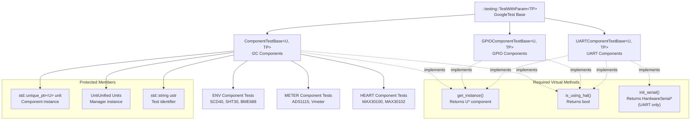
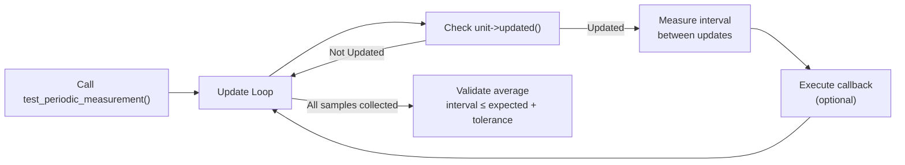
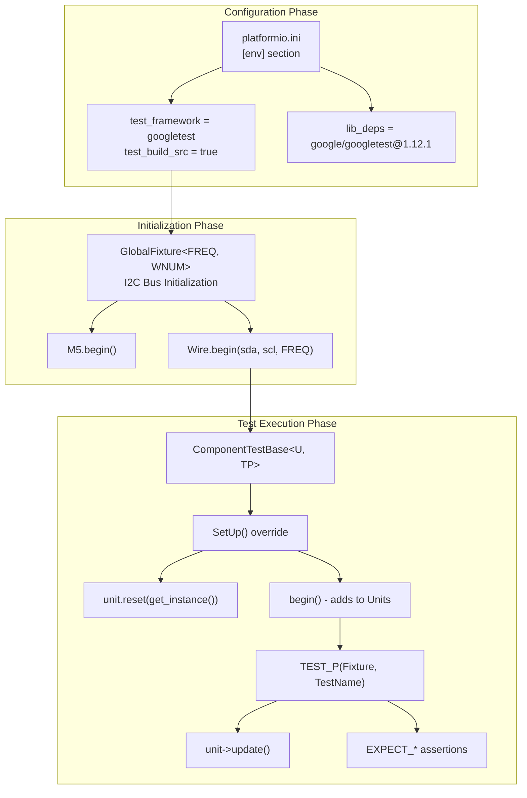

M5UnitUnified Writing Unit Tests

# Writing Unit Tests

<details>
<summary>Relevant source files</summary>

The following files were used as context for generating this wiki page:

- [pio_project/boards/m5stack-atoms3r.json](pio_project/boards/m5stack-atoms3r.json)
- [pio_project/boards/m5stack-nanoc6.json](pio_project/boards/m5stack-nanoc6.json)
- [pio_project/boards/m5stick-cplus2.json](pio_project/boards/m5stick-cplus2.json)
- [pio_project/platformio.ini](pio_project/platformio.ini)
- [pio_project/test/unit_unified_test.cpp](pio_project/test/unit_unified_test.cpp)
- [src/googletest/test_helper.hpp](src/googletest/test_helper.hpp)
- [src/googletest/test_template.hpp](src/googletest/test_template.hpp)
- [src/m5_unit_component/adapter.cpp](src/m5_unit_component/adapter.cpp)
- [src/m5_unit_component/adapter.hpp](src/m5_unit_component/adapter.hpp)
- [src/m5_unit_component/adapter_uart.cpp](src/m5_unit_component/adapter_uart.cpp)

</details>


## Purpose and Scope

This document explains how to write unit tests for new M5Stack sensor components using the GoogleTest framework integrated with M5UnitUnified. It covers test structure, base class usage, validation patterns, and timing verification for components communicating over I2C, GPIO, or UART protocols.

For information about the overall test framework architecture and fixture setup, see [Test Framework](#7.1). For details on the component validation test suite (`unit_unified_test.cpp`), see [Component Validation Tests](#7.3).

---

## Test Structure Overview

All component tests inherit from one of three parameterized test base classes depending on the communication protocol:

| Base Class | Protocol | Template Parameters |
|------------|----------|---------------------|
| `ComponentTestBase<U, TP>` | I2C | `U`: Component class, `TP`: Test parameter type |
| `GPIOComponentTestBase<U, TP>` | GPIO/RMT | `U`: Component class, `TP`: Test parameter type |
| `UARTComponentTestBase<U, TP>` | UART/Serial | `U`: Component class, `TP`: Test parameter type |

Each base class provides:
- Automatic setup/teardown lifecycle management
- Integration with `UnitUnified` manager
- Support for parameterized testing (testing multiple communication backends)
- Helper members: `unit` (component instance), `Units` (manager), `ustr` (test identifier)

**Sources:** [src/googletest/test_template.hpp:56-110](), [src/googletest/test_template.hpp:112-171](), [src/googletest/test_template.hpp:173-226]()

### Test Base Class Hierarchy



**Sources:** [src/googletest/test_template.hpp:62-110](), [src/googletest/test_template.hpp:119-171](), [src/googletest/test_template.hpp:180-226]()

---

## Creating I2C Component Tests

### Step 1: Define Test Parameter Type

Test parameters specify which communication backend to test (Arduino `Wire` vs M5HAL `Bus`):

```cpp
// Example parameter structure
struct TestParam {
    bool use_hal;  // true = M5HAL Bus, false = Arduino Wire
    // Add device-specific parameters if needed
};
```

### Step 2: Create Test Fixture Class

Inherit from `ComponentTestBase` and implement the required virtual methods:

```cpp
class UnitSensorTest : public m5::unit::googletest::ComponentTestBase<
    m5::unit::UnitSensor, TestParam> {
protected:
    // Return component instance based on test parameter
    virtual m5::unit::UnitSensor* get_instance() override {
        return new m5::unit::UnitSensor();
    }
    
    // Indicate which backend to use
    virtual bool is_using_hal() const override {
        return this->GetParam().use_hal;
    }
};
```

The base class `SetUp()` method ([src/googletest/test_template.hpp:67-80]()):
1. Calls `get_instance()` to create component
2. Calls `begin()` which adds component to `Units` manager
3. Initializes with either `Wire` or M5HAL `Bus` based on `is_using_hal()`
4. Stores test identifier in `ustr` (e.g., "UnitSensor:Wire")

**Sources:** [src/googletest/test_template.hpp:62-110]()

### Step 3: Write Test Cases

Use GoogleTest's `TEST_P` macro for parameterized tests:

```cpp
TEST_P(UnitSensorTest, BasicRead) {
    SCOPED_TRACE(ustr);  // Include test identifier in failure messages
    
    // Test initialization state
    EXPECT_TRUE(unit->inPeriodic());
    EXPECT_GT(unit->interval(), 0U);
    
    // Trigger update and verify
    unit->update();
    EXPECT_TRUE(unit->updated());
    
    // Validate data reading
    auto data = unit->getData();
    EXPECT_GE(data, 0.0f);
}
```

### Step 4: Instantiate Parameterized Tests

Define test parameters and instantiate the test suite:

```cpp
INSTANTIATE_TEST_SUITE_P(
    WithParameters,
    UnitSensorTest,
    ::testing::Values(
        TestParam{false},  // Test with Arduino Wire
        TestParam{true}    // Test with M5HAL Bus
    )
);
```

This generates two test instances: `WithParameters/UnitSensorTest.BasicRead/0` (Wire) and `WithParameters/UnitSensorTest.BasicRead/1` (HAL).

**Sources:** [src/googletest/test_template.hpp:62-110]()

---

## Creating GPIO Component Tests

GPIO-based components follow the same pattern but inherit from `GPIOComponentTestBase`:

```cpp
class UnitGPIOSensorTest : public m5::unit::googletest::GPIOComponentTestBase<
    m5::unit::UnitGPIOSensor, TestParam> {
protected:
    virtual m5::unit::UnitGPIOSensor* get_instance() override {
        return new m5::unit::UnitGPIOSensor();
    }
    
    virtual bool is_using_hal() const override {
        return this->GetParam().use_hal;
    }
};
```

The base class `begin()` method ([src/googletest/test_template.hpp:142-161]()):
1. Retrieves GPIO pin numbers from `M5.getPin()` for Port B
2. Falls back to Port A if Port B unavailable
3. Adds component to `Units` with pin numbers: `Units.add(*unit, pin_in, pin_out)`

**GPIO Pin Selection Logic:**
```
Primary: port_b_in, port_b_out
Fallback: port_a_pin1, port_a_pin2
```

**Sources:** [src/googletest/test_template.hpp:119-171]()

---

## Creating UART Component Tests

UART tests require an additional virtual method to initialize the serial port:

```cpp
class UnitUARTSensorTest : public m5::unit::googletest::UARTComponentTestBase<
    m5::unit::UnitUARTSensor, TestParam> {
protected:
    virtual m5::unit::UnitUARTSensor* get_instance() override {
        return new m5::unit::UnitUARTSensor();
    }
    
    virtual bool is_using_hal() const override {
        return this->GetParam().use_hal;
    }
    
    virtual HardwareSerial* init_serial() override {
        // Configure and return serial port
        Serial2.begin(9600, SERIAL_8N1, RX_PIN, TX_PIN);
        return &Serial2;
    }
};
```

The `serial` member is automatically managed by the base class and passed to `Units.add(*unit, *serial)`.

**Sources:** [src/googletest/test_template.hpp:180-226]()

---

## Periodic Measurement Testing

### The `test_periodic_measurement` Helper

For components with periodic updates, validate timing accuracy using the `test_periodic_measurement()` template function:



**Sources:** [src/googletest/test_helper.hpp:22-84]()

### Function Signatures

Three overloaded variants exist ([src/googletest/test_helper.hpp:22-84]()):

```cpp
// Full control version
uint32_t test_periodic_measurement(
    U* unit,                    // Component instance
    const uint32_t times,       // Number of measurements
    const uint32_t tolerance,   // Allowed deviation in ms
    const uint32_t timeout_duration, // Total timeout in ms
    void (*callback)(U*),       // Optional callback per update
    const bool skip_after_test  // Skip EXPECT validation
);

// Simplified version (auto-calculates timeout)
uint32_t test_periodic_measurement(
    U* unit,
    const uint32_t times = 8,
    const uint32_t tolerance = 1,
    void (*callback)(U*) = nullptr,
    const bool skip_after_test = false
);

// Minimal version (tolerance = 1ms)
uint32_t test_periodic_measurement(
    U* unit,
    const uint32_t times = 8,
    void (*callback)(U*) = nullptr,
    const bool skip_after_test = false
);
```

### Usage Example

```cpp
TEST_P(UnitSensorTest, PeriodicTiming) {
    SCOPED_TRACE(ustr);
    
    // Test with 8 measurements, 1ms tolerance
    auto avg_interval = m5::unit::googletest::test_periodic_measurement(
        unit.get(),
        8,  // Number of measurements
        1,  // Tolerance in ms
        [](m5::unit::UnitSensor* u) {
            // Optional: Validate data on each update
            EXPECT_GT(u->getData(), 0.0f);
        }
    );
    
    // Returned value is average measured interval
    M5_LOGI("Average interval: %u ms", avg_interval);
}
```

### Validation Logic

The helper function:
1. Records `updatedMillis()` timestamps for each successful update
2. Calculates intervals between consecutive updates
3. Computes average interval across all measurements
4. Validates: `average_interval ≤ unit->interval() + tolerance`

**Key EXPECT Assertions:**
- `EXPECT_EQ(cnt, 0U)` - All measurements completed
- `EXPECT_EQ(avgCnt, times - 1)` - Correct number of intervals measured
- `EXPECT_LE(avg, interval + tolerance)` - Average within tolerance

**Sources:** [src/googletest/test_helper.hpp:22-65]()

---

## Test Configuration Flow



**Sources:** [pio_project/platformio.ini:10-11](), [pio_project/platformio.ini:189](), [src/googletest/test_template.hpp:34-54](), [src/googletest/test_template.hpp:67-80]()

---

## Running Tests

### PlatformIO Test Commands

Execute tests for specific device configurations:

```bash
# Run all tests on Core device
pio test -e test_Core

# Run all tests on CoreS3
pio test -e test_CoreS3

# Run specific test filter
pio test -e test_Core -f embedded/test_update
```

### Available Test Environments

The test matrix includes 14 device configurations ([pio_project/platformio.ini:205-273]()):

| Environment | Board | Platform |
|-------------|-------|----------|
| `test_Core` | m5stack-grey | ESP32 |
| `test_Core2` | m5stack-core2 | ESP32 |
| `test_CoreS3` | m5stack-cores3 | ESP32-S3 |
| `test_Fire` | m5stack-fire | ESP32 |
| `test_AtomMatrix` | m5stack-atom | ESP32 |
| `test_AtomS3` | m5stack-atoms3 | ESP32-S3 |
| `test_AtomS3R` | m5stack-atoms3r | ESP32-S3 |
| `test_NanoC6` | m5stack-nanoc6 | ESP32-C6 |
| `test_StickCPlus` | m5stick-c | ESP32 |
| `test_StickCPlus2` | m5stick-cplus2 | ESP32 |
| `test_Dial` | m5stack-stamps3 | ESP32-S3 |
| `test_StampS3` | m5stack-stamps3 | ESP32-S3 |
| `test_Paper` | m5stack-fire | ESP32 |
| `test_CoreInk` | m5stack-coreink | ESP32 |

### Test Filter Configuration

Default test filter ([pio_project/platformio.ini:50]()):
```ini
test_filter = embedded/test_update
test_ignore = native/*
```

This runs only embedded tests and excludes native (SDL-based) tests.

**Sources:** [pio_project/platformio.ini:45-56](), [pio_project/platformio.ini:205-273]()

---

## Complete Test Example

Here's a comprehensive example demonstrating all key patterns:

```cpp
#include <gtest/gtest.h>
#include <M5UnitComponent.hpp>
#include <M5UnitUnified.hpp>
#include <M5UnitUnifiedENV.h>  // Example: ENV unit

namespace {

// Test parameter structure
struct SCD40TestParam {
    bool use_hal;
};

// Test fixture
class UnitSCD40Test : public m5::unit::googletest::ComponentTestBase<
    m5::unit::UnitSCD40, SCD40TestParam> {
protected:
    virtual m5::unit::UnitSCD40* get_instance() override {
        return new m5::unit::UnitSCD40();
    }
    
    virtual bool is_using_hal() const override {
        return this->GetParam().use_hal;
    }
};

// Basic functionality test
TEST_P(UnitSCD40Test, BasicOperation) {
    SCOPED_TRACE(ustr);
    
    // Verify initialization
    EXPECT_TRUE(unit->inPeriodic());
    EXPECT_EQ(unit->interval(), 5000U);  // SCD40 has 5s interval
    
    // Wait for first measurement
    m5::unit::googletest::test_periodic_measurement(
        unit.get(),
        2,  // Just 2 measurements for basic test
        100, // Allow 100ms tolerance
        [](m5::unit::UnitSCD40* u) {
            // Validate readings are in reasonable range
            EXPECT_GE(u->co2(), 400U);    // CO2 >= 400 ppm
            EXPECT_LE(u->co2(), 5000U);   // CO2 <= 5000 ppm
            EXPECT_GE(u->temperature(), -40.0f);
            EXPECT_LE(u->temperature(), 125.0f);
        }
    );
}

// Timing accuracy test
TEST_P(UnitSCD40Test, TimingAccuracy) {
    SCOPED_TRACE(ustr);
    
    auto avg = m5::unit::googletest::test_periodic_measurement(
        unit.get(),
        8,   // 8 measurements
        50   // 50ms tolerance
    );
    
    M5_LOGI("Average interval: %u ms (expected: %u ms)", 
            avg, unit->interval());
}

// Instantiate tests for both Wire and HAL
INSTANTIATE_TEST_SUITE_P(
    WireAndHAL,
    UnitSCD40Test,
    ::testing::Values(
        SCD40TestParam{false},  // Arduino Wire
        SCD40TestParam{true}    // M5HAL Bus
    )
);

}  // namespace
```

This example demonstrates:
- Parameterized testing for multiple backends
- Basic operational validation
- Periodic measurement timing verification
- Data range validation via callbacks

**Sources:** [src/googletest/test_template.hpp:62-110](), [src/googletest/test_helper.hpp:22-84]()