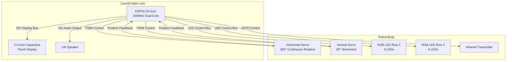
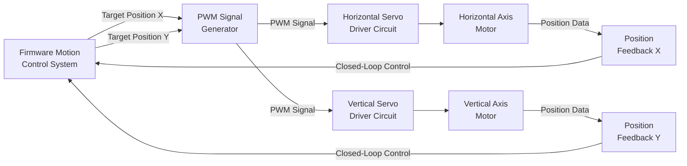
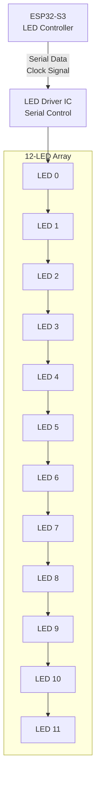
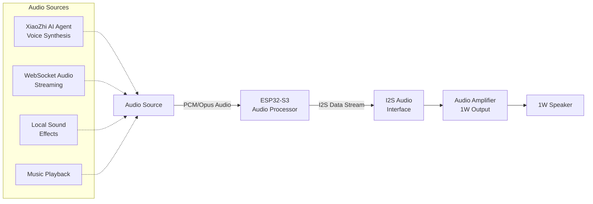
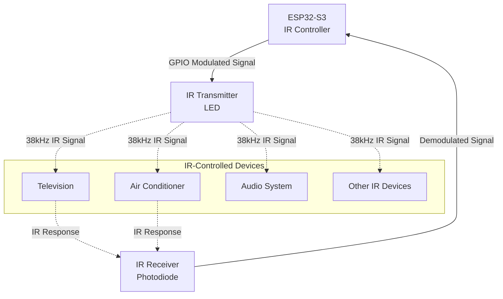
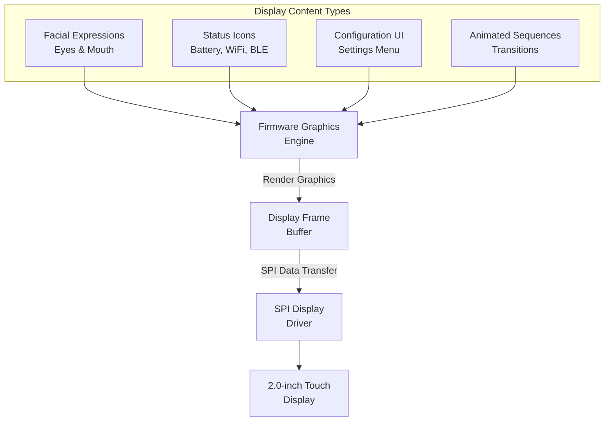
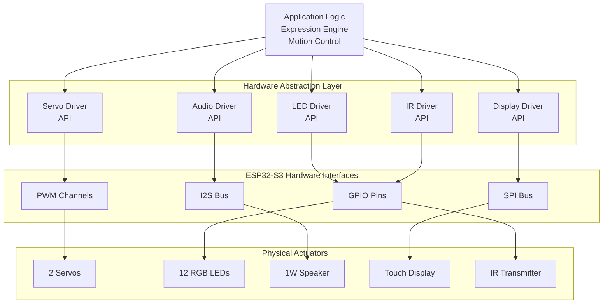
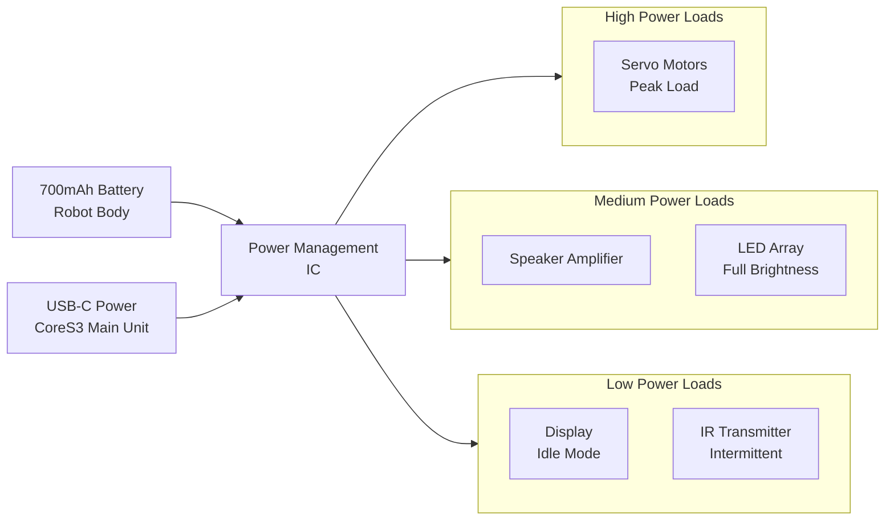

StackChan Actuators and Output Devices

# Actuators and Output Devices

Relevant source files

The following files were used as context for generating this wiki page:

- [README.md](README.md)

## Purpose and Scope

This document details the actuators and output devices integrated into the StackChan robot. These components enable the robot to produce physical motion, visual feedback, audio output, and infrared communication. The document covers the servo motors, RGB LED array, speaker, infrared transmitter, and display hardware specifications.

For information about the CoreS3 controller that manages these devices, see [CoreS3 Controller](#3.1). For details on firmware control systems, see [Factory Firmware Features](#4.1). For communication protocols that transmit output commands, see [WebSocket Protocol](#7.2).

---

## Actuator and Output Device Overview

The StackChan robot integrates five primary output systems that work together to create expressive, interactive behavior:

| Component | Quantity | Function | Location |
|-----------|----------|----------|----------|
| Feedback Servos | 2 | Physical motion control | Robot body |
| RGB LEDs | 12 | Visual status and expression | Robot body (2 rows) |
| Speaker | 1 | Audio output | CoreS3 main unit |
| Infrared Transmitter | 1 | IR signal transmission | Robot body |
| Display | 1 | Visual interface and expressions | CoreS3 main unit |

**Sources:** [README.md:11-13]()

---

## Servo Motors for Motion Control

### Specifications

The robot body incorporates two feedback servos that provide precise motion control:

**Horizontal Axis Servo (X-axis):**
- **Range:** 360-degree continuous rotation
- **Function:** Enables the robot to turn its head left and right
- **Feedback:** Position feedback for closed-loop control

**Vertical Axis Servo (Y-axis):**
- **Range:** 90-degree movement
- **Function:** Enables the robot to tilt its head up and down
- **Feedback:** Position feedback for closed-loop control

### Safety Considerations

**Critical Warning:** Do not forcibly rotate any movable parts connected to the motors by hand when the motors are powered and under control, as this may cause hardware damage. The servos provide active resistance when powered, and manual force can damage the gear train or motor driver circuits.

### Motion Control Applications

The servo system enables multiple robot behaviors:

- **Facial Expressions:** Coordinated servo movements create expressive head positions
- **Tracking Movements:** Follow objects or faces detected by the camera
- **Dance Sequences:** Pre-programmed choreographed movements
- **Interactive Gestures:** Response to touch panel input or remote commands

**Sources:** [README.md:13](), [README.md:17]()

---

## RGB LED Array for Visual Feedback

### Hardware Configuration

The robot body contains **12 RGB LEDs** organized in two rows:

- **Row 1:** 6 RGB LEDs (top row)
- **Row 2:** 6 RGB LEDs (bottom row)
- **Total:** 12 individually addressable RGB LEDs

Each LED can display full RGB color with independent brightness control, enabling:
- Status indicators (connection state, battery level)
- Expression enhancement (eye lights, emotion colors)
- Ambient lighting effects
- Synchronized patterns during dance sequences

### LED Control Characteristics

- **Individual Addressing:** Each LED can be controlled independently
- **Full RGB Color:** 24-bit color depth (8 bits per channel)
- **Brightness Control:** PWM-based intensity adjustment
- **Serial Protocol:** Likely WS2812 or similar addressable LED protocol
- **Low Latency:** Rapid updates for smooth animations

**Sources:** [README.md:13]()

---

## Speaker for Audio Output

### Hardware Specifications

The CoreS3 main unit integrates a **1W speaker** for audio output:

- **Power Output:** 1 watt maximum
- **Location:** Integrated into the CoreS3 main unit
- **Interface:** I2S audio bus from ESP32-S3
- **Use Cases:** Voice synthesis, sound effects, music playback, AI agent speech

### Audio Output Applications

The factory firmware uses the speaker for:
- **XiaoZhi AI Agent:** Text-to-speech output for AI responses
- **Video Call Audio:** Real-time audio during iOS app video calls
- **Sound Effects:** Feedback sounds for user interactions
- **Expression Audio:** Audio cues synchronized with facial expressions

**Sources:** [README.md:11](), [README.md:15]()

---

## Infrared Transmitter and Receiver

### Hardware Configuration

The robot body includes infrared communication capability:

- **Infrared Transmitter (IR TX):** Sends IR signals for device control
- **Infrared Receiver (IR RX):** Receives IR signals from remotes
- **Location:** Integrated into the robot body
- **Protocol Support:** Configurable IR protocols (NEC, Sony, RC5, etc.)

### Applications

The IR system enables:

1. **Remote Control Emulation:** Control TVs, air conditioners, and other IR devices
2. **IR Communication:** Short-range data exchange with other IR-capable devices
3. **Learning Function:** Capture and replay IR signals from existing remotes
4. **Automation Integration:** Integrate StackChan into home automation systems

**Sources:** [README.md:13]()

---

## Display Output

### Display Specifications

The CoreS3 main unit features a **2.0-inch capacitive touch display** that serves dual purposes as both an input and output device:

- **Size:** 2.0 inches diagonal
- **Type:** Capacitive touch screen
- **Cover:** High-strength glass cover for durability
- **Resolution:** [Specific resolution not provided in available files]
- **Interface:** SPI bus connection to ESP32-S3

### Display Output Functions

The display is the primary visual interface for StackChan, used to render:

1. **Facial Expressions:** Animated eyes, mouth, and emotion displays
2. **Status Information:** Connection status, battery level, mode indicators
3. **User Interface:** Configuration menus and settings
4. **Visual Feedback:** Touch response and interaction confirmation

### Expression Rendering

The display is critical to StackChan's personality, rendering expressions that include:

- **Eye Animations:** Blinking, looking around, emotion changes
- **Mouth Shapes:** Speaking animations, smiles, emotional states
- **Full-Face Expressions:** Happy, sad, surprised, angry, sleeping, and more
- **Dynamic Updates:** Real-time expression changes based on AI agent responses or user interaction

**Sources:** [README.md:11](), [README.md:15]()

---

## Actuator and Output Integration Architecture

### Control Flow Overview

The ESP32-S3 SoC orchestrates all actuators and output devices through multiple hardware interfaces:

### Synchronized Multi-Output Control

The firmware coordinates multiple output devices to create cohesive behaviors:

| Behavior Type | Servo | LED | Speaker | Display |
|---------------|-------|-----|---------|---------|
| **Idle Expression** | Subtle motion | Breathing effect | Silent | Eyes blinking |
| **Speaking** | Head nods | Pulse pattern | Voice output | Mouth animation |
| **Dancing** | Choreographed moves | Synchronized colors | Music playback | Expression changes |
| **Alert** | Quick turn | Flash red | Alert tone | Attention icon |
| **Sleeping** | Head down | Dim white | Soft breathing | Closed eyes |

**Sources:** [README.md:11-15]()

---

## Power Considerations for Output Devices

### Power Consumption Hierarchy

Output devices consume power at different rates:

1. **High Power:** Servos during motion (peak current draw)
2. **Medium Power:** Speaker at full volume, bright LED display
3. **Low Power:** Idle display, dim LEDs, idle servos

The robot body includes a **700 mAh battery** to power the actuators, while the CoreS3 main unit can be powered via USB-C. For detailed power management information, see [Power and Safety](#3.5).

**Sources:** [README.md:13]()

---

## Remote Control via WebSocket

Actuators and output devices can be controlled remotely through WebSocket messages sent from the iOS app or other clients. The firmware implements message handlers for:

- **Motion Control Messages:** Command servo positions and velocities
- **Expression Control Messages:** Update facial expressions on the display
- **LED Control Messages:** Set RGB colors and patterns
- **Audio Messages:** Stream audio data to the speaker

For detailed message format specifications, see [WebSocket Protocol](#7.2) and [Message Types Reference](#7.4).

**Sources:** [README.md:15]()