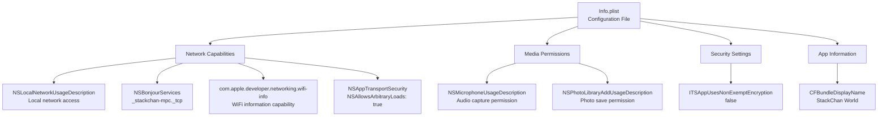
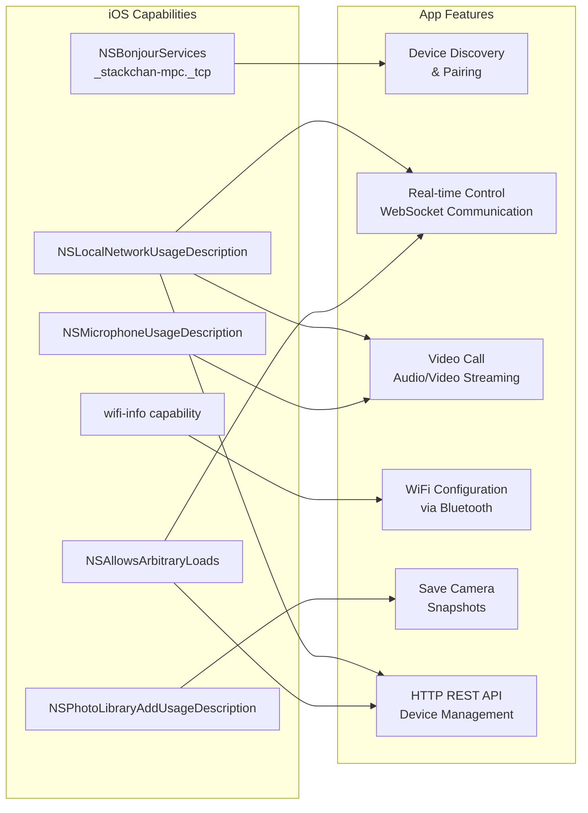
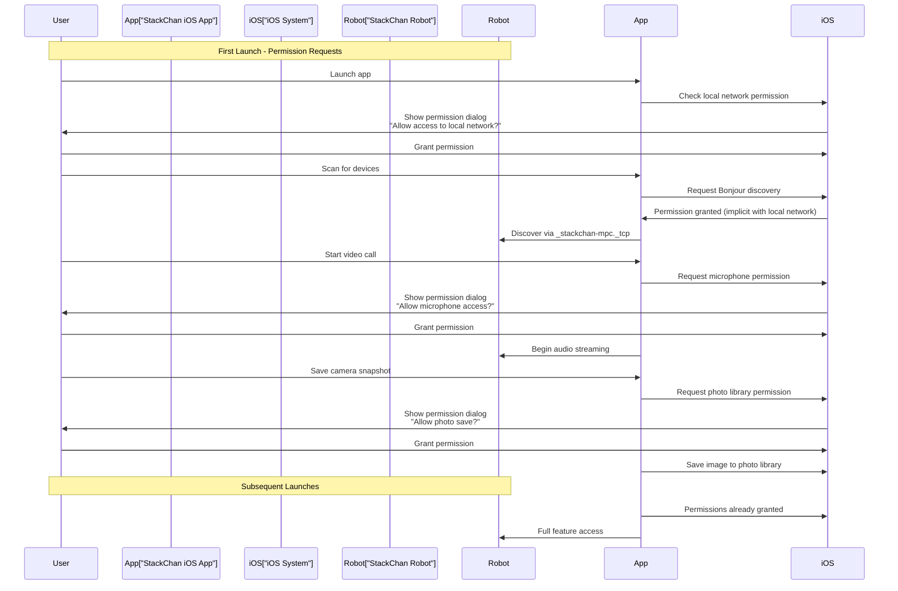

StackChan App Capabilities and Permissions

# App Capabilities and Permissions

Relevant source files

The following files were used as context for generating this wiki page:

- [app/StackChan/Info.plist](app/StackChan/Info.plist)

## Purpose and Scope

This document describes the iOS capabilities and permissions required by the StackChan World application to function properly. It covers the Info.plist configuration, required entitlements, usage descriptions for privacy-sensitive features, and the relationship between these capabilities and the app's features. For information about the overall app architecture, see [iOS Application](#5). For details about network communication protocols, see [Communication Protocols](#7).

## Overview

The StackChan iOS app requires several system capabilities and user permissions to enable device discovery, real-time communication, and media handling. These are configured in the `Info.plist` file and must be granted by the user at runtime for privacy-sensitive features.

**Required Capabilities:**
- Local Network Access
- WiFi Information
- Bonjour Services Discovery
- Microphone Access
- Photo Library Write Access

**Security Configuration:**
- App Transport Security (ATS) settings for local HTTP connections
- Non-exempt encryption declaration

Sources: [app/StackChan/Info.plist:1-29]()

## Info.plist Configuration Structure

Sources: [app/StackChan/Info.plist:1-29]()

## Network Capabilities

### Local Network Access

The app requires local network access to communicate with StackChan robots on the same WiFi network. This capability is declared with the `NSLocalNetworkUsageDescription` key.

| Key | Value | Purpose |
|-----|-------|---------|
| `NSLocalNetworkUsageDescription` | "This app requires access to the local network to communicate with devices." | User-visible explanation for local network permission prompt |

The local network permission enables:
- WebSocket connections to robots and the backend server
- HTTP REST API calls for device management
- Real-time video and audio streaming
- Motion control commands

Sources: [app/StackChan/Info.plist:17-18]()

### Bonjour Services Discovery

The app uses Bonjour (mDNS/DNS-SD) for automatic discovery of StackChan robots on the local network.

| Key | Value | Purpose |
|-----|-------|---------|
| `NSBonjourServices` | `["_stackchan-mpc._tcp"]` | Service type for StackChan device discovery |

The Bonjour service type `_stackchan-mpc._tcp` allows the iOS app to:
- Automatically discover StackChan robots without manual IP configuration
- Receive device advertisements including hostname and port information
- Enable zero-configuration networking for device pairing

Sources: [app/StackChan/Info.plist:10-13]()

### WiFi Information Access

The app requires access to WiFi network information to support device configuration features.

| Key | Value | Purpose |
|-----|-------|---------|
| `com.apple.developer.networking.wifi-info` | `true` | Capability to access SSID and BSSID information |

This capability enables the app to:
- Read the current WiFi network name (SSID)
- Obtain network identifiers for device configuration
- Support the WiFi provisioning flow when configuring new robots via Bluetooth

Sources: [app/StackChan/Info.plist:14-15]()

### App Transport Security Configuration

The app configures App Transport Security (ATS) to allow insecure HTTP connections, necessary for communicating with local devices and development servers.

| Key | Value | Purpose |
|-----|-------|---------|
| `NSAppTransportSecurity` → `NSAllowsArbitraryLoads` | `true` | Allows HTTP connections (not just HTTPS) |

This setting is required because:
- StackChan robots on the local network may use HTTP for WebSocket and REST communication
- Development servers may not have SSL/TLS certificates
- Local network traffic is considered secure within the private network context

**Security Note:** This setting applies to all network connections. Production deployments should consider restricting this to specific domains using `NSExceptionDomains` if possible.

Sources: [app/StackChan/Info.plist:5-9]()

## Media Permissions

### Microphone Access

The app requires microphone access for audio communication features with StackChan robots.

| Key | Value | Purpose |
|-----|-------|---------|
| `NSMicrophoneUsageDescription` | "We need access to the microphone to capture audio data." | User-visible explanation for microphone permission prompt |

Microphone access enables:
- Two-way audio communication during video calls
- Voice commands to the robot
- Audio streaming to the robot's XiaoZhi AI agent
- Real-time voice interaction features

The permission is requested when the user first attempts to use a feature requiring audio input. If denied, audio-related features will not function.

Sources: [app/StackChan/Info.plist:19-20]()

### Photo Library Access

The app requires permission to save images to the user's photo library.

| Key | Value | Purpose |
|-----|-------|---------|
| `NSPhotoLibraryAddUsageDescription` | "Save the photo to the album" | User-visible explanation for photo library write permission prompt |

This permission allows users to:
- Save camera feed snapshots from the robot
- Export captured images during video calls
- Store photos from robot interactions

The app only requires write access (add-only), not full photo library read access. This is a more privacy-preserving permission model.

Sources: [app/StackChan/Info.plist:26-27]()

## Capability-to-Feature Mapping

Sources: [app/StackChan/Info.plist:1-29]()

## Security and Privacy Configuration

### Encryption Declaration

The app declares that it does not use non-exempt encryption.

| Key | Value | Purpose |
|-----|-------|---------|
| `ITSAppUsesNonExemptEncryption` | `false` | Indicates the app does not use encryption requiring export compliance |

This declaration is required for App Store submission. It indicates that:
- The app does not implement custom encryption algorithms
- Standard iOS framework encryption (if used) is exempt from export regulations
- No additional export compliance documentation is required

Sources: [app/StackChan/Info.plist:21-22]()

### App Display Name

The bundle configuration specifies the user-visible app name.

| Key | Value | Purpose |
|-----|-------|---------|
| `CFBundleDisplayName` | "StackChan World" | Name displayed under the app icon on the home screen |

Sources: [app/StackChan/Info.plist:23-24]()

## Runtime Permission Flow

Sources: [app/StackChan/Info.plist:1-29]()

## Configuration Requirements Summary

The following table summarizes all required configurations for the StackChan iOS app to function:

| Configuration | Type | Required | Runtime Prompt | Impact if Denied |
|---------------|------|----------|----------------|------------------|
| Local Network Access | Permission | Yes | Yes | Cannot communicate with robots or server |
| Bonjour Services | Capability | Yes | No (included with local network) | Cannot auto-discover devices |
| WiFi Information | Capability | Yes | No (entitlement only) | Cannot configure robot WiFi settings |
| Microphone Access | Permission | No | Yes | Audio features disabled |
| Photo Library Add | Permission | No | Yes | Cannot save camera snapshots |
| App Transport Security | Configuration | Yes | No | HTTP connections blocked |
| Non-exempt Encryption | Declaration | Yes | No | App Store submission may be rejected |

Sources: [app/StackChan/Info.plist:1-29]()

## Xcode Project Configuration

In addition to the `Info.plist` settings, the Xcode project must have the appropriate capabilities enabled in the project settings:

**Required Capabilities in Xcode:**
1. **Signing & Capabilities** → **+ Capability** → **Access WiFi Information**
   - Adds the `com.apple.developer.networking.wifi-info` entitlement

**Build Settings:**
- The `Info.plist` file must be properly referenced in the project's **INFOPLIST_FILE** build setting

These capabilities are typically configured through the Xcode UI rather than by manually editing entitlement files, ensuring proper signing and provisioning profile configuration.

Sources: [app/StackChan/Info.plist:14-15]()