StackChan Application State Management

# Application State Management

<details>
<summary>Relevant source files</summary>

The following files were used as context for generating this wiki page:

- [app/StackChan/AppState.swift](app/StackChan/AppState.swift)

</details>


## Purpose and Scope

This document describes how the iOS application manages global state through the `AppState` singleton class. It covers the centralized management of device connectivity, WebSocket and Bluetooth communication, navigation state, alert presentation, AR-based distance detection, and message protocol implementation.

For information about the data structures used by AppState, see [Data Models](#5.4). For details about the overall iOS project structure, see [Project Structure](#5.2).

---

## Overview

The StackChan iOS application uses a centralized state management pattern implemented through the `AppState` class [app/StackChan/AppState.swift:19-268](). This singleton class serves as the single source of truth for application-wide state and coordinates communication between the UI layer, network services, and hardware interfaces.

The `AppState` class conforms to `ObservableObject`, allowing SwiftUI views to automatically update when published properties change. It manages five primary categories of state:

| Category | Responsibilities |
|----------|------------------|
| Device State | MAC address storage, device info, online/offline status |
| Navigation State | Navigation paths for different tabs (StackChan, Nearby, Settings) |
| Communication State | WebSocket and Bluetooth connection management |
| Alert State | Global alert presentation and user notifications |
| AR Features | Distance detection and face switching triggers |

**Sources:** [app/StackChan/AppState.swift:19-268]()

---

## AppState Singleton Architecture

The `AppState` class implements the singleton pattern to ensure a single instance manages all global state throughout the application lifecycle.

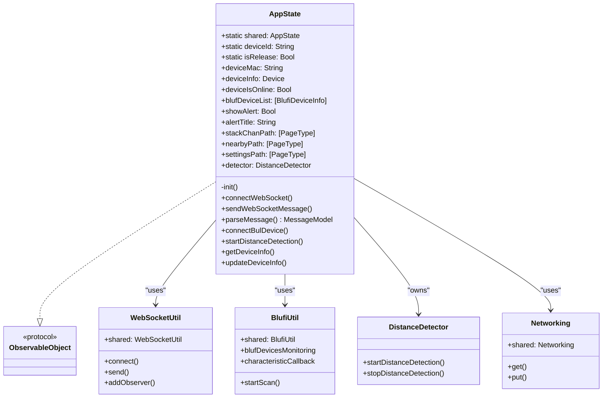

### Singleton Implementation

The singleton is initialized with a private initializer and accessed through the static `shared` property [app/StackChan/AppState.swift:20-21]():

```swift
static let shared = AppState()
private init() {}
```

Additionally, a static `deviceId` property provides a unique identifier for the iOS device [app/StackChan/AppState.swift:23]():

```swift
static let deviceId = UIDevice.current.identifierForVendor?.uuidString ?? UUID().uuidString
```

**Sources:** [app/StackChan/AppState.swift:19-23]()

---

## State Categories

### Device State Management

Device state tracks the currently bound StackChan robot and its connection status.

| Property | Type | Purpose | Storage |
|----------|------|---------|---------|
| `deviceMac` | `String` | MAC address of bound device | `@AppStorage` (persistent) |
| `deviceInfo` | `Device` | Full device information | `@Published` (memory) |
| `deviceIsOnline` | `Bool` | Real-time online status | `@Published` (memory) |
| `showBindingDevice` | `Bool` | Show device binding UI | `@Published` (memory) |
| `forcedDisplayBindingDevice` | `Bool` | Force binding UI display | `@Published` (memory) |

The `deviceMac` property uses `@AppStorage` [app/StackChan/AppState.swift:36]() to persist the MAC address across app launches, ensuring the binding survives app restarts.

**Sources:** [app/StackChan/AppState.swift:36-63]()

### Navigation State Management

Navigation state is managed through three separate path arrays, one for each main tab in the application:

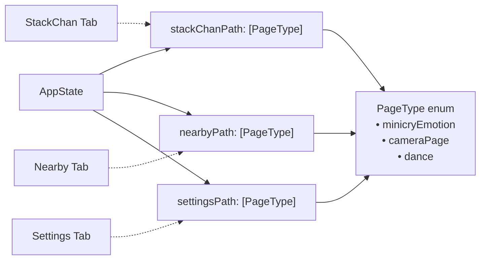

The `PageType` enum [app/StackChan/AppState.swift:13-17]() defines the navigable page types, and each tab maintains its own navigation stack as a `@Published` array [app/StackChan/AppState.swift:38-40]().

**Sources:** [app/StackChan/AppState.swift:13-17](), [app/StackChan/AppState.swift:38-40]()

### Alert State Management

Global alert presentation is managed through three properties that work together:

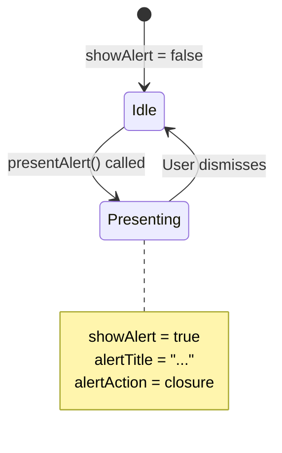

The `presentAlert()` method [app/StackChan/AppState.swift:30-34]() provides a unified interface for triggering alerts from anywhere in the application:

```swift
func presentAlert(title: String, action: (() -> Void)? = nil)
```

**Sources:** [app/StackChan/AppState.swift:26-34](), [app/StackChan/AppState.swift:45](), [app/StackChan/AppState.swift:47]()

### Bluetooth State Management

Bluetooth device discovery state is tracked through two properties:

- `blufDeviceList`: Array of discovered Blufi devices [app/StackChan/AppState.swift:55]()
- `showDeviceWifiSet`: Controls Wi-Fi configuration UI visibility [app/StackChan/AppState.swift:58]()

A `manualShutdownTime` property [app/StackChan/AppState.swift:61]() prevents the Wi-Fi configuration popup from appearing within 5 seconds of a manual dismissal.

**Sources:** [app/StackChan/AppState.swift:55-61]()

---

## WebSocket Communication Management

### Connection Establishment

The `connectWebSocket()` method [app/StackChan/AppState.swift:93-96]() establishes a WebSocket connection to the backend server:

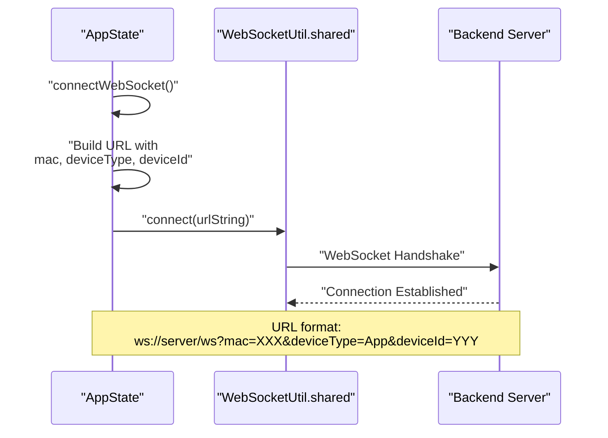

The URL is constructed using the `Urls.getWebSocketUrl()` helper and includes:
- `mac`: The bound device's MAC address
- `deviceType`: Set to "App" to identify as mobile client
- `deviceId`: The iOS device's unique identifier

**Sources:** [app/StackChan/AppState.swift:93-96]()

### Message Sending Protocol

The `sendWebSocketMessage()` method [app/StackChan/AppState.swift:98-114]() implements the binary message protocol:

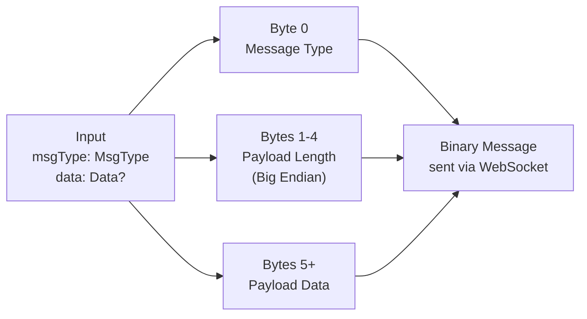

The message structure consists of:
1. **Byte 0**: Message type (from `MsgType` enum)
2. **Bytes 1-4**: Payload length as 32-bit big-endian integer
3. **Bytes 5+**: Optional payload data

**Sources:** [app/StackChan/AppState.swift:98-114]()

### Message Parsing

The `parseMessage()` method [app/StackChan/AppState.swift:117-139]() reverses the encoding process:

| Validation Step | Check | Action |
|----------------|-------|--------|
| Minimum Length | `message.count >= 5` | Return `(nil, nil)` if failed |
| Type Validity | `MsgType(rawValue: typeByte)` | Return `(nil, nil)` if invalid |
| Length Validity | `message.count >= 5 + dataLength` | Return `(nil, nil)` if insufficient |
| Success | All checks pass | Return `(msgType, payload)` |

The method extracts the 32-bit length by reducing bytes 1-4 [app/StackChan/AppState.swift:127-130]():

```swift
let dataLength = lengthData.reduce(0) { (result, byte) -> UInt32 in
    return (result << 8) | UInt32(byte)
}
```

**Sources:** [app/StackChan/AppState.swift:117-139]()

### Message Monitoring

The `webSocketMessageMonitoring()` method [app/StackChan/AppState.swift:246-267]() sets up an observer for incoming WebSocket messages:

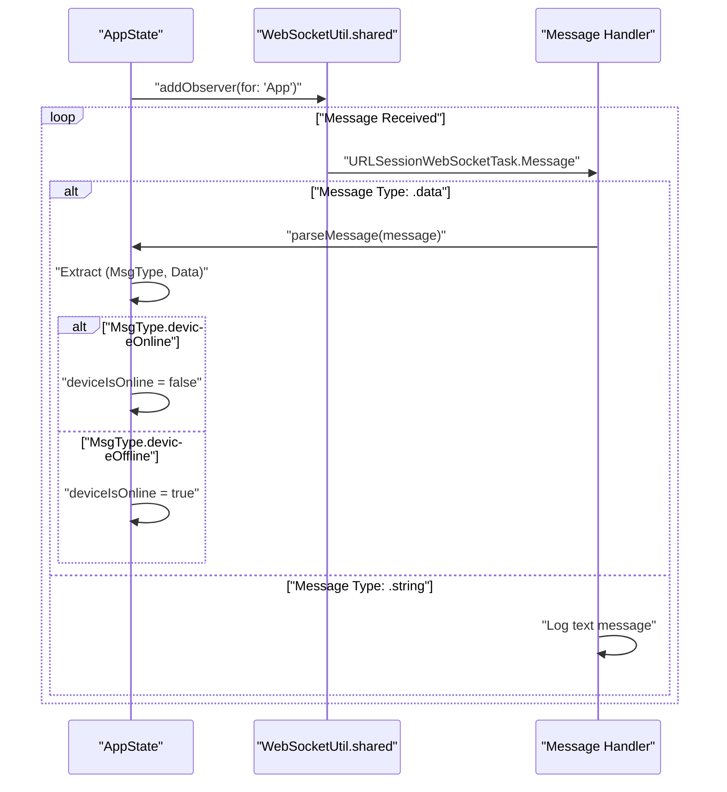

Note: The online/offline logic appears inverted in the implementation [app/StackChan/AppState.swift:253-257]() - when `deviceOnline` message is received, `deviceIsOnline` is set to `false`, and vice versa.

**Sources:** [app/StackChan/AppState.swift:246-267]()

---

## Bluetooth Communication Management

### Blufi Device Discovery

The `openBlufi()` method [app/StackChan/AppState.swift:226-243]() initializes Bluetooth device monitoring:

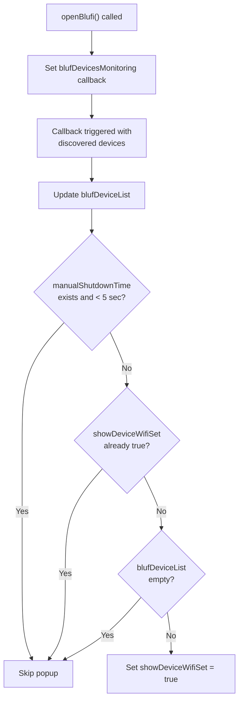

The 5-second cooldown period [app/StackChan/AppState.swift:231-236]() prevents the Wi-Fi configuration popup from reappearing immediately after manual dismissal, improving user experience.

**Sources:** [app/StackChan/AppState.swift:226-243]()

### Blufi Device Connection

The `connectBulDevice()` method [app/StackChan/AppState.swift:65-91]() establishes a connection to a specific device by MAC address:

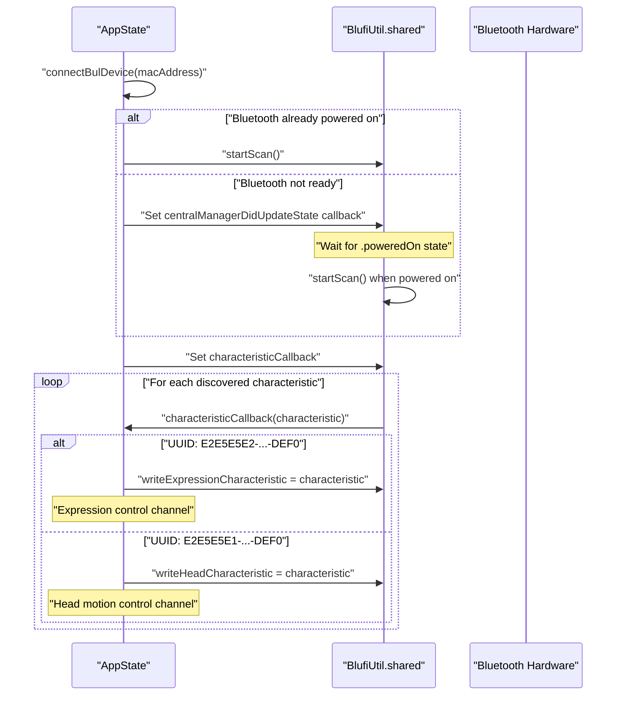

The method identifies and assigns two critical characteristics:
- **Expression Characteristic** (UUID ending in DEF0): Controls facial expressions [app/StackChan/AppState.swift:80-83]()
- **Head Characteristic** (UUID ending in DEF0): Controls head/servo movements [app/StackChan/AppState.swift:85-88]()

**Sources:** [app/StackChan/AppState.swift:65-91]()

---

## Distance Detection and AR Features

### DistanceDetector Integration

The `AppState` owns a `DistanceDetector` instance [app/StackChan/AppState.swift:52]() that uses ARKit for face proximity detection:

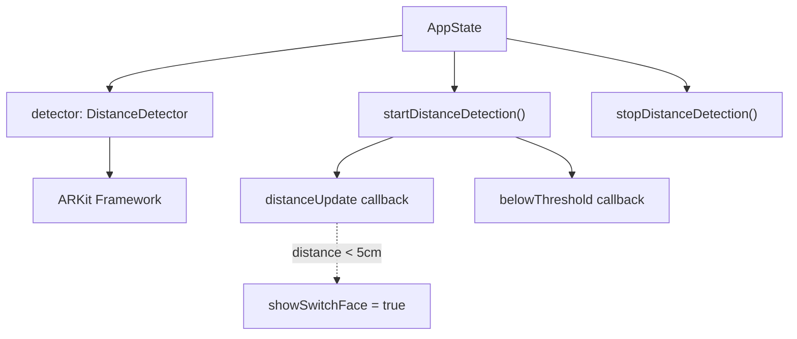

### Distance Detection Lifecycle

The `startDistanceDetection()` method [app/StackChan/AppState.swift:164-179]() initiates AR-based distance monitoring:

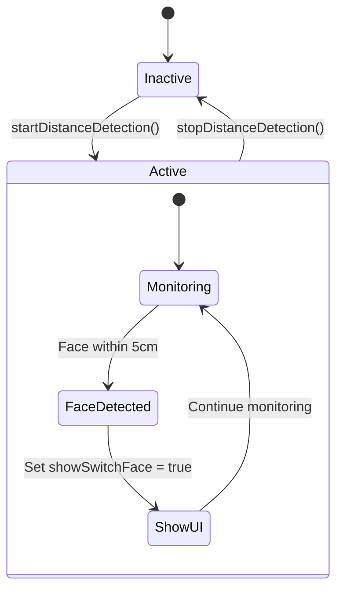

The distance is converted to centimeters [app/StackChan/AppState.swift:167]() and compared against a 5cm threshold [app/StackChan/AppState.swift:168]() to trigger the face switching UI.

**Sources:** [app/StackChan/AppState.swift:52](), [app/StackChan/AppState.swift:53](), [app/StackChan/AppState.swift:164-183]()

---

## Device Information Management

### Fetching Device Information

The `getDeviceInfo()` method [app/StackChan/AppState.swift:198-223]() retrieves device details from the backend server:

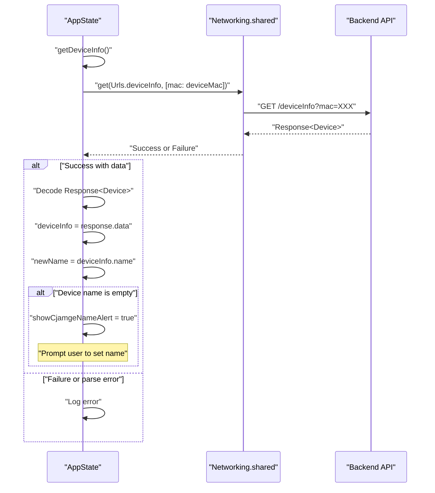

**Sources:** [app/StackChan/AppState.swift:198-223]()

### Updating Device Information

The `updateDeviceInfo()` method [app/StackChan/AppState.swift:141-161]() persists changes to the device name:

| Step | Action | Code Reference |
|------|--------|----------------|
| 1 | Build parameter map with MAC and name | [app/StackChan/AppState.swift:142-145]() |
| 2 | Send PUT request to `/deviceInfo` | [app/StackChan/AppState.swift:146]() |
| 3 | Parse `Response<String>` | [app/StackChan/AppState.swift:150]() |
| 4 | Check `isSuccess` flag | [app/StackChan/AppState.swift:151]() |
| 5 | Log result | [app/StackChan/AppState.swift:152-158]() |

**Sources:** [app/StackChan/AppState.swift:141-161]()

---

## Message Protocol Implementation

### Message Type Enumeration

The binary protocol uses a `MsgType` enum to identify message purposes. Common message types handled by AppState include:

- `deviceOnline`: Robot came online [app/StackChan/AppState.swift:253]()
- `deviceOffline`: Robot went offline [app/StackChan/AppState.swift:255]()

For complete details on all message types, see [Message Types Reference](#7.4).

### Binary Protocol Structure

The message format implemented in `sendWebSocketMessage()` and `parseMessage()` follows this structure:

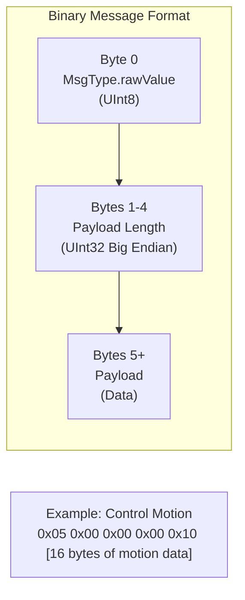

This protocol ensures:
- **Type Safety**: The first byte identifies the message purpose
- **Length Prefix**: Bytes 1-4 specify payload size for proper buffering
- **Variable Payload**: Arbitrary binary data starting at byte 5

**Sources:** [app/StackChan/AppState.swift:98-114](), [app/StackChan/AppState.swift:117-139]()

---

## Summary

The `AppState` singleton provides centralized state management for the StackChan iOS application through:

1. **ObservableObject Pattern**: SwiftUI views automatically react to state changes via `@Published` properties
2. **Persistent Storage**: Device MAC address persists across app launches using `@AppStorage`
3. **WebSocket Communication**: Binary protocol implementation for real-time robot control
4. **Bluetooth Management**: Blufi protocol handling for device discovery and pairing
5. **AR Integration**: Distance detection using ARKit for proximity-based features
6. **REST API Integration**: Device information synchronization with backend server

The class acts as the primary coordination point between UI components, network services, and hardware communication layers, ensuring consistent state across the application.

**Sources:** [app/StackChan/AppState.swift:1-268]()