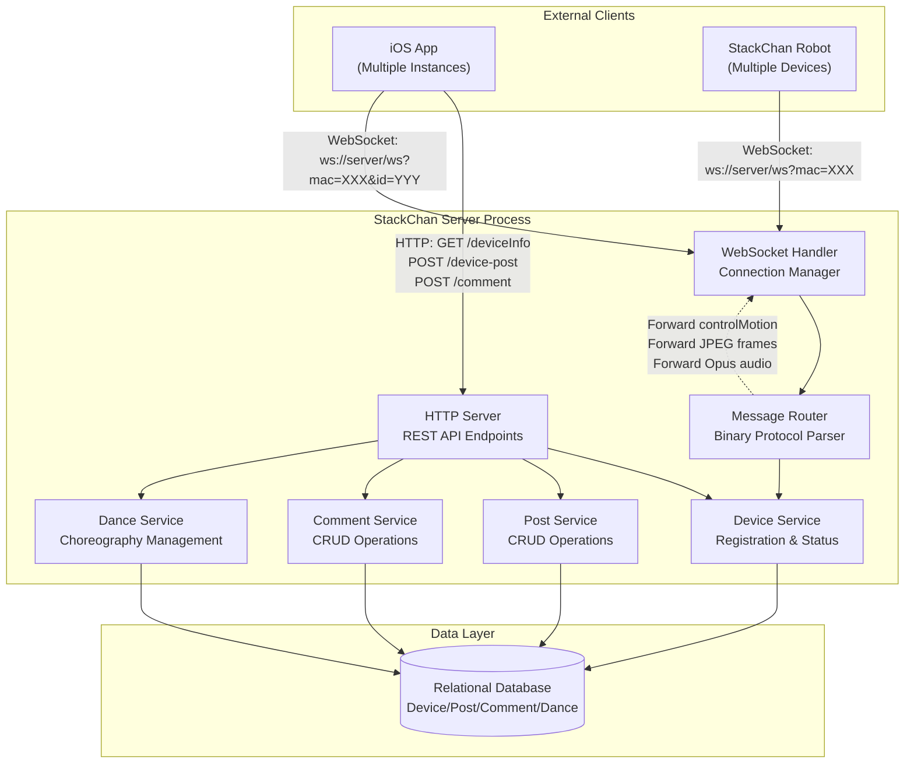
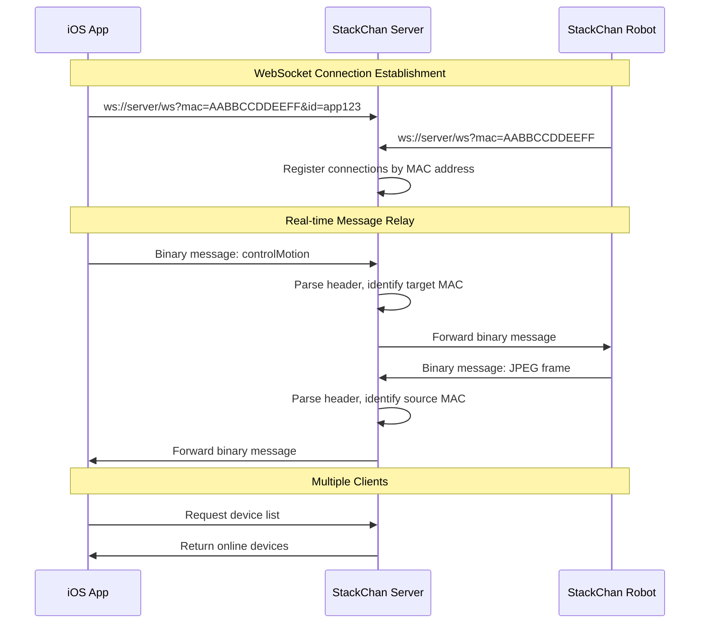
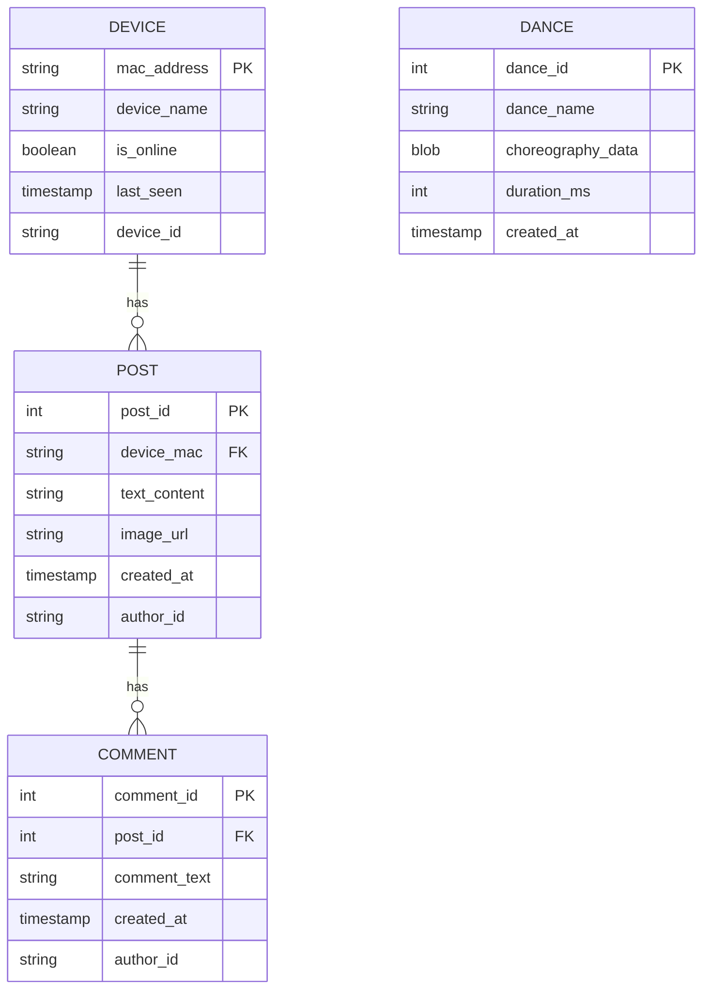
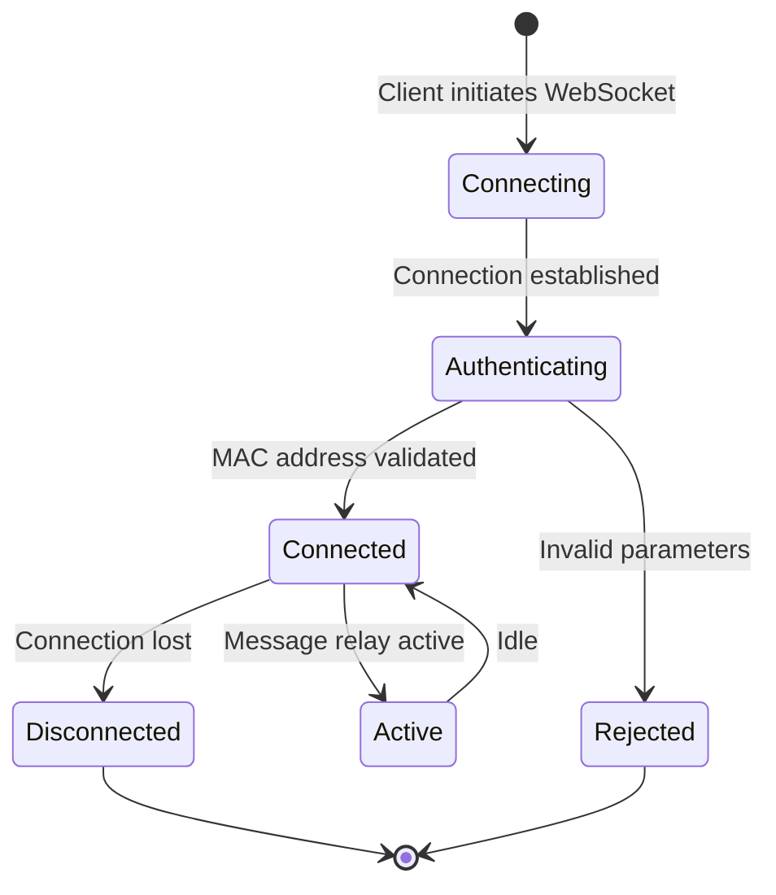
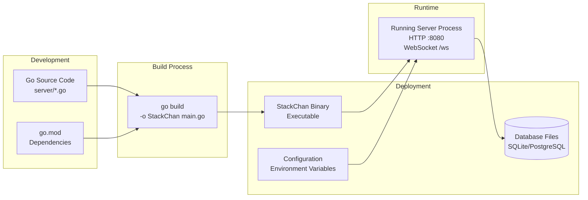

StackChan Backend Server

# Backend Server

Relevant source files

The following files were used as context for generating this wiki page:

- [server/README.md](server/README.md)

## Purpose and Scope

This document provides an overview of the StackChan Backend Server, a Go-based server application that serves as the central coordination hub for the StackChan ecosystem. The server manages device registration and status, relays real-time WebSocket communications between iOS applications and StackChan robots, and provides social networking features including posts and comments.

For detailed information about specific server subsystems, see:
- Server setup and deployment procedures: [Server Setup and Deployment](#6.1)
- Device registration and management endpoints: [Device Management API](#6.2)
- Post and comment functionality: [Social Features API](#6.3)
- Dance choreography management: [Dance Control System](#6.4)

For communication protocol specifications, see [Communication Protocols](#7).

---

## System Role

The Backend Server acts as the central hub in the StackChan distributed architecture, connecting mobile clients (iOS applications) with physical StackChan robots. It performs three primary functions:

1. **Device Management**: Maintains a registry of StackChan devices, tracking their online/offline status, MAC addresses, device names, and configuration
2. **Communication Relay**: Forwards real-time WebSocket messages bidirectionally between iOS apps and robots, including motion control commands, camera frames, audio streams, and status updates
3. **Social Platform**: Provides persistent storage and APIs for user-generated content including device posts (text and images) and comments

The server is implemented in Go and requires Go 1.24 or later. It uses a relational database for persistent storage of device information, posts, comments, and dance choreography data.

**Sources:** [server/README.md:1-45]()

---

## Server Architecture

### Component Overview

**Diagram: StackChan Server Component Architecture**

The server implements a layered architecture where HTTP and WebSocket handlers receive incoming requests, delegate to service components for business logic, and persist data to the database. The Message Router component parses the binary WebSocket protocol and forwards messages between connected clients.

**Sources:** [server/README.md:8-15]()

---

## Core Responsibilities

### Device Management

The server maintains a central registry of all StackChan devices. Each device is identified by its MAC address and can be associated with:
- Device name (user-configurable)
- Current online/offline status
- Connection timestamp
- Device identifier for WebSocket routing

When a StackChan robot connects via WebSocket, the server updates its status to online. When the connection drops, the server marks it offline. iOS apps query device information via HTTP to determine which robots are available for interaction.

### WebSocket Message Relay

The server acts as a transparent relay for real-time communication between iOS apps and robots. It does not process or interpret most message content—it simply forwards binary messages based on routing information:

**Diagram: WebSocket Message Relay Flow**

The WebSocket protocol uses a binary message format where the server examines message headers to determine routing but does not decode the payload. This design allows the server to efficiently relay various message types (opus audio, jpeg images, control commands) without type-specific handling logic.

**Sources:** [server/README.md:10]()

---

## Social Features

### Post Management

The server provides a social feed system where users can create posts associated with StackChan devices. Each post contains:
- Text content
- Optional image attachment
- Associated device identifier
- Creation timestamp
- Author information

Posts are created via HTTP POST requests to `/device-post` and retrieved via feed queries. The server stores post data in the relational database, managing image uploads and associating posts with devices.

### Comment System

Users can add comments to device posts. The comment service provides full CRUD operations:
- **Create**: POST requests to `/comment` endpoint
- **Read**: GET requests to retrieve comments for a post
- **Update**: PUT/PATCH requests to modify comment content
- **Delete**: DELETE requests to remove comments

Comments are stored with references to their parent post, maintaining a hierarchical relationship in the database schema.

### Dance Control

The server manages choreographed movement sequences ("dances") that can be played back on StackChan robots. The Dance Service:
- Stores dance choreography data (servo positions, timing, sequences)
- Provides APIs to upload new dances
- Allows playback initiation via control commands
- Manages dance metadata and versioning

Dance data is persisted in the database and can be referenced by identifier when sending playback commands through the WebSocket relay.

**Sources:** [server/README.md:11-14]()

---

## HTTP API Structure

The server exposes RESTful HTTP endpoints for device and social feature management:

| Endpoint | Method | Purpose | Response |
|----------|--------|---------|----------|
| `/deviceInfo` | GET | Query device status and configuration | Device object with status |
| `/device-post` | POST | Create new device post | Post ID and confirmation |
| `/comment` | POST | Add comment to post | Comment ID |
| `/comment` | GET | Retrieve comments for post | Array of comment objects |
| `/comment` | PUT/PATCH | Update existing comment | Updated comment |
| `/comment` | DELETE | Remove comment | Deletion confirmation |

Additional endpoints exist for device registration, dance management, and feed queries. For complete API documentation, see [Device Management API](#6.2), [Social Features API](#6.3), and [Dance Control System](#6.4).

**Sources:** [server/README.md:8-15]()

---

## Database Schema

The server uses a relational database to persist:

**Diagram: Server Database Entity Relationships**

The database schema maintains referential integrity between devices, posts, and comments. Device MAC addresses serve as the primary identifier, linking devices to their associated posts. Comments reference posts through foreign keys, and dance data is stored independently with choreography information serialized as binary data.

**Sources:** [server/README.md:14-15]()

---

## WebSocket Connection Management

### Connection Lifecycle

**Diagram: WebSocket Connection State Machine**

When clients connect via WebSocket, they provide query parameters including the device MAC address and optionally an app/device identifier. The server validates these parameters, registers the connection in its internal connection pool, and begins routing messages based on MAC address matching.

### Message Routing Strategy

The server maintains concurrent connections from multiple iOS apps and robots. Each WebSocket connection is indexed by:
1. **MAC address**: Identifies which StackChan device the connection represents or targets
2. **Client type**: Distinguishes between robot connections and app connections
3. **Connection ID**: Unique identifier for the specific WebSocket instance

When a message arrives on one WebSocket, the server:
1. Parses the binary message header to extract routing information
2. Looks up target connections matching the destination MAC address
3. Forwards the message to all matching connections (supporting multiple apps controlling one robot)
4. Does not inspect or modify the message payload

This design keeps the server logic simple and allows the binary protocol to evolve independently of server implementation.

**Sources:** [server/README.md:10]()

---

## Technology Stack

| Component | Technology | Purpose |
|-----------|-----------|---------|
| Language | Go 1.24+ | Server implementation |
| Database | Relational DB | Persistent storage |
| Protocol | WebSocket | Real-time bidirectional communication |
| Protocol | HTTP/REST | Device and social API |
| Build System | Go modules | Dependency management |

The server is compiled to a single binary executable (`StackChan` on Linux/macOS, `StackChan.exe` on Windows) that can be deployed on any platform supporting Go. All dependencies are managed through Go modules using `go.mod` and `go.sum` files.

**Sources:** [server/README.md:20-44]()

---

## Deployment Model

**Diagram: Server Build and Deployment Pipeline**

The server follows a standard Go application deployment model:

1. **Build**: Run `go build -o StackChan main.go` in the `server/` directory
2. **Configuration**: Set environment variables for database connection, port numbers, and other runtime settings
3. **Deployment**: Copy the compiled binary and database configuration to the target host
4. **Execution**: Run the binary directly (e.g., `./StackChan` on Unix-like systems)

The server requires network accessibility from both iOS devices (for HTTP/WebSocket from apps) and StackChan robots (for WebSocket connections). Typical deployment involves running the server on a host with a stable IP address or domain name that can be configured in the iOS app and firmware.

For detailed setup instructions, see [Server Setup and Deployment](#6.1).

**Sources:** [server/README.md:31-44]()

---

## Integration Points

The Backend Server integrates with other StackChan components through well-defined interfaces:

### iOS Application Integration
- iOS apps discover the server endpoint through configuration (typically hardcoded or user-entered IP address)
- Apps establish HTTP connections for device queries and social features
- Apps create persistent WebSocket connections for real-time control and monitoring
- See [iOS Application](#5) for client-side implementation details

### Firmware Integration
- StackChan robots connect to the server via WebSocket after Wi-Fi configuration
- Robots send camera frames, audio data, and status updates through the WebSocket
- Robots receive motion control commands and expression changes relayed by the server
- See [Firmware Development](#4) for device-side implementation details

### Protocol Specifications
- WebSocket message format and routing: [WebSocket Protocol](#7.2)
- HTTP endpoint specifications: [HTTP REST API](#7.3)
- Complete message type reference: [Message Types Reference](#7.4)

**Sources:** [server/README.md:1-15]()

---

## Summary

The StackChan Backend Server is a Go-based application that serves three critical functions in the StackChan ecosystem:

1. **Central Device Registry**: Tracks all StackChan devices, their status, and configuration
2. **Communication Hub**: Relays real-time WebSocket messages between iOS apps and robots without inspecting payloads
3. **Social Platform**: Provides persistent storage and APIs for posts, comments, and dance choreographies

The server's architecture emphasizes simplicity and transparency—it routes messages based on MAC address matching without implementing protocol-specific logic, allowing the binary communication protocol to evolve independently. This design makes the server highly maintainable and enables it to efficiently handle multiple concurrent connections from apps and devices.

For implementation details on specific subsystems, refer to the child pages: [Server Setup and Deployment](#6.1), [Device Management API](#6.2), [Social Features API](#6.3), and [Dance Control System](#6.4).

**Sources:** [server/README.md:1-45]()