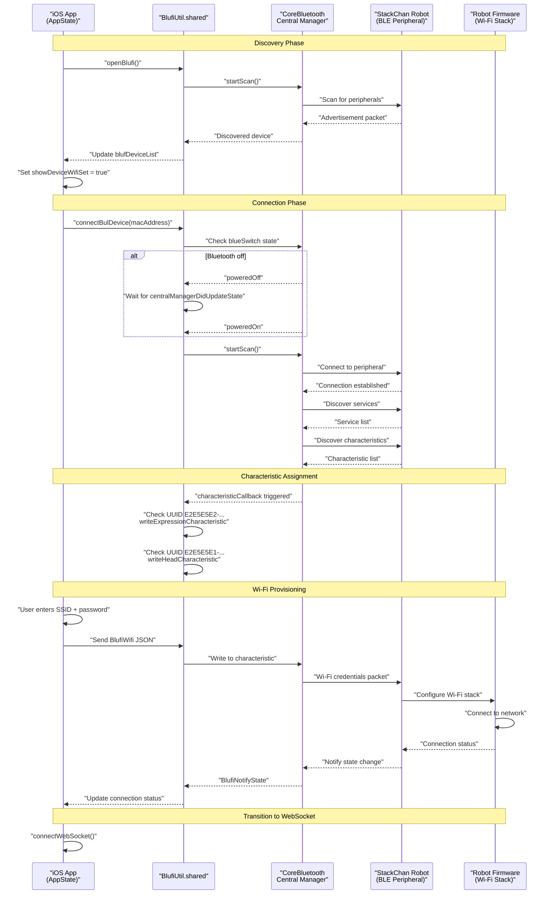
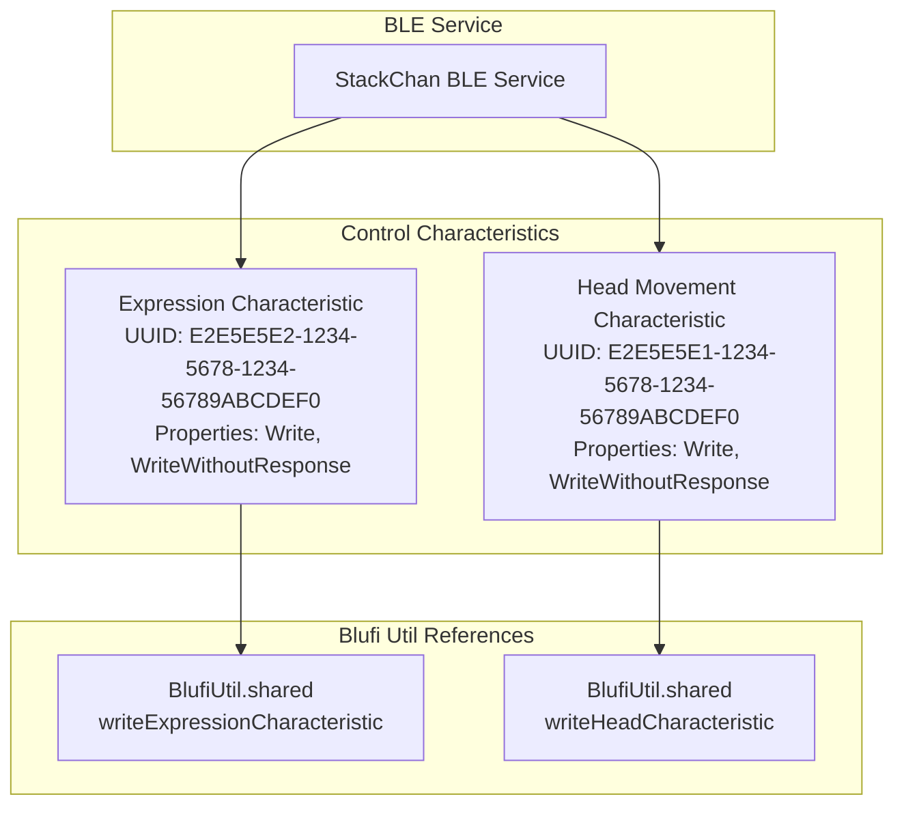
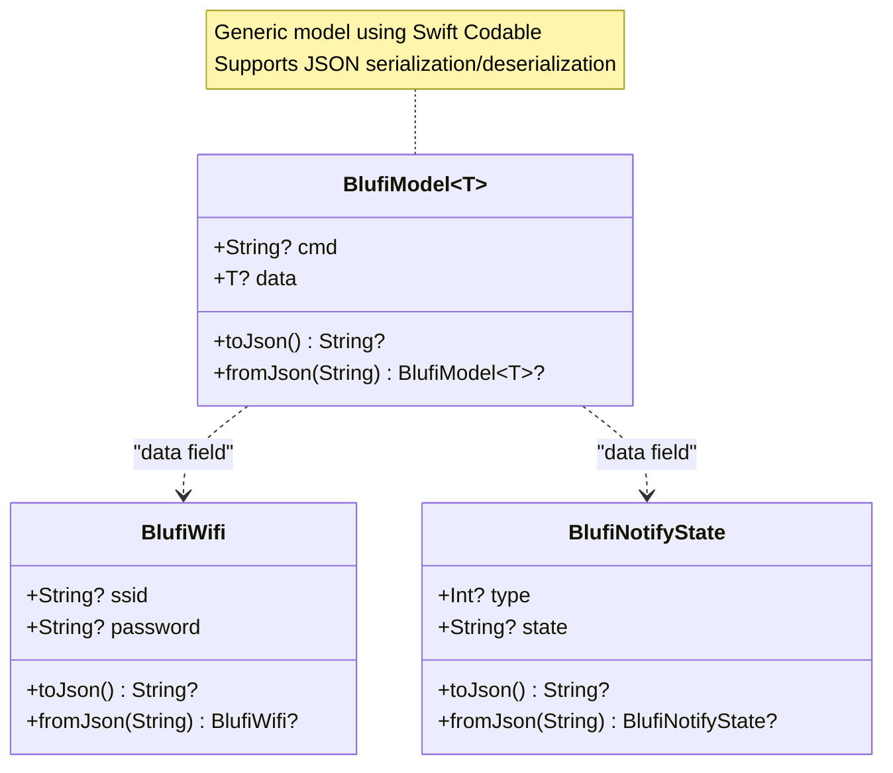
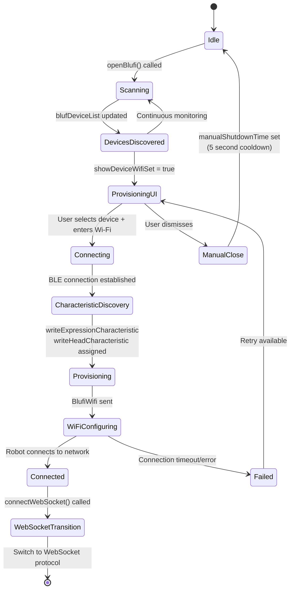
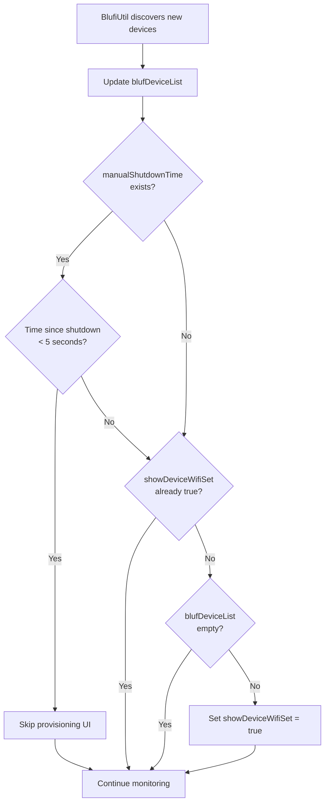

StackChan Bluetooth LE (Blufi Protocol)

# Bluetooth LE (Blufi Protocol)

<details>
<summary>Relevant source files</summary>

The following files were used as context for generating this wiki page:

- [app/StackChan/AppState.swift](app/StackChan/AppState.swift)
- [app/StackChan/Model/BlufiModel.swift](app/StackChan/Model/BlufiModel.swift)

</details>


This document describes the Bluetooth Low Energy (BLE) communication protocol used in StackChan for initial device discovery, pairing, and Wi-Fi network configuration. The system implements a customized version of the Blufi protocol, which is Espressif's standard provisioning protocol for configuring Wi-Fi credentials over BLE. After initial configuration via BLE, the system transitions to WebSocket-based communication over Wi-Fi for real-time control and data streaming.

For information about real-time communication after BLE provisioning, see [WebSocket Protocol](#7.2). For HTTP-based device management, see [HTTP REST API](#7.3).

## Overview and Role in System Architecture

The Blufi protocol serves as the entry point for connecting a StackChan robot to the iOS application. It fulfills three primary functions:

1. **Device Discovery**: Scanning for nearby StackChan robots broadcasting BLE advertisements
2. **Wi-Fi Provisioning**: Securely transmitting Wi-Fi network credentials (SSID and password) to the robot
3. **Direct Control**: Providing BLE-based control of robot expressions and head movements as a fallback or during initial pairing

Once Wi-Fi configuration is complete and the robot connects to the network, the system automatically transitions to WebSocket-based communication for higher bandwidth operations like video streaming and audio transmission.

**Sources**: [app/StackChan/AppState.swift:55-91]()

## Blufi Protocol Implementation

### System Flow



**Sources**: [app/StackChan/AppState.swift:65-91](), [app/StackChan/AppState.swift:226-243]()

### Device Discovery and Scanning

The iOS application uses the `BlufiUtil` singleton to manage BLE scanning and device discovery. When Bluetooth functionality is enabled, the app continuously scans for nearby StackChan devices.

**Discovery Process**:

| Step | Component | Action | Result |
|------|-----------|--------|--------|
| 1 | `AppState` | Calls `openBlufi()` | Initializes BLE monitoring |
| 2 | `BlufiUtil` | Registers `blufDevicesMonitoring` callback | Sets up device list updates |
| 3 | `BlufiUtil` | Calls `startScan()` | Begins BLE peripheral scanning |
| 4 | CoreBluetooth | Discovers peripherals | Identifies StackChan advertisements |
| 5 | `BlufiUtil` | Invokes callback with `[BlufiDeviceInfo]` | Updates `blufDeviceList` |
| 6 | `AppState` | Checks `showDeviceWifiSet` flag | Shows provisioning UI if not already shown |

The discovery mechanism includes automatic popup suppression if a device was manually shut down within the last 5 seconds, preventing unwanted repeated provisioning prompts.

**Sources**: [app/StackChan/AppState.swift:226-243]()

### BLE Characteristic UUIDs

The system defines custom BLE characteristics for direct robot control over Bluetooth. These characteristics provide an alternative control path that works even without Wi-Fi connectivity.



The characteristic detection logic runs during the connection phase:

- **Expression Characteristic** (`E2E5E5E2-1234-5678-1234-56789ABCDEF0`): Used for sending facial expression commands to the robot
- **Head Movement Characteristic** (`E2E5E5E1-1234-5678-1234-56789ABCDEF0`): Used for controlling servo positions to move the robot's head

Both characteristics support write operations without requiring responses, enabling low-latency command transmission.

**Sources**: [app/StackChan/AppState.swift:77-90]()

## Data Models

### BlufiModel Generic Container

The `BlufiModel<T>` structure provides a generic wrapper for all Blufi protocol messages. It follows a command-data pattern where `cmd` identifies the operation type and `data` contains the operation payload.



**Field Descriptions**:

- `cmd`: String identifier specifying the command type (e.g., "configure_wifi", "get_status")
- `data`: Generic payload conforming to `Codable` protocol, varies based on command type

**Sources**: [app/StackChan/Model/BlufiModel.swift:9-26]()

### BlufiWifi Structure

The `BlufiWifi` structure encapsulates Wi-Fi network credentials for transmission to the robot during provisioning.

| Field | Type | Purpose | Validation |
|-------|------|---------|------------|
| `ssid` | `String?` | Wi-Fi network name | Optional, typically required for provisioning |
| `password` | `String?` | Wi-Fi network password | Optional, empty for open networks |

The structure provides JSON serialization methods (`toJson()` and `fromJson()`) enabling easy transmission over BLE characteristics as UTF-8 encoded strings.

**Sources**: [app/StackChan/Model/BlufiModel.swift:28-44]()

### BlufiNotifyState Structure

The `BlufiNotifyState` structure represents status notifications sent from the robot back to the iOS app during provisioning and operation.

| Field | Type | Purpose | Example Values |
|-------|------|---------|----------------|
| `type` | `Int?` | Notification category identifier | `0` (info), `1` (success), `2` (error) |
| `state` | `String?` | Human-readable state description | "connecting", "connected", "failed" |

This structure enables the robot firmware to communicate Wi-Fi connection progress, errors, and operational state changes back to the mobile application.

**Sources**: [app/StackChan/Model/BlufiModel.swift:46-62]()

## Connection State Management

### AppState Integration

The `AppState` singleton manages Blufi-related state throughout the application lifecycle. Key published properties track discovery and provisioning state:



**Key State Variables**:

| Property | Type | Purpose | Location |
|----------|------|---------|----------|
| `blufDeviceList` | `[BlufiDeviceInfo]` | List of discovered BLE devices | [app/StackChan/AppState.swift:55]() |
| `showDeviceWifiSet` | `Bool` | Controls provisioning UI visibility | [app/StackChan/AppState.swift:58]() |
| `manualShutdownTime` | `Date?` | Timestamp of last manual dismissal | [app/StackChan/AppState.swift:61]() |
| `deviceMac` | `String` | MAC address of paired device | [app/StackChan/AppState.swift:36]() |

**Sources**: [app/StackChan/AppState.swift:55-61](), [app/StackChan/AppState.swift:226-243]()

### Provisioning Flow with Manual Shutdown Protection

The system implements a 5-second cooldown period after manual provisioning dismissal to prevent unwanted repeated popups:



This logic prevents user frustration when they explicitly dismiss the provisioning dialog, ensuring it doesn't immediately reappear due to ongoing BLE scanning.

**Sources**: [app/StackChan/AppState.swift:226-243]()

## Transition to WebSocket Communication

After successful Wi-Fi provisioning via Blufi, the system transitions to WebSocket-based communication for higher bandwidth and more feature-rich interactions:

```mermaid
graph LR
    subgraph "Blufi Phase"
        Discovery["Device Discovery<br/>(BLE Scanning)"]
        Pairing["Device Pairing<br/>(BLE Connection)"]
        Provision["Wi-Fi Provisioning<br/>(Send credentials)"]
    end
    
    subgraph "Transition"
        Connect["Robot Connects<br/>to Wi-Fi Network"]
        GetInfo["iOS: getDeviceInfo()<br/>(HTTP GET /deviceInfo)"]
    end
    
    subgraph "WebSocket Phase"
        WSConnect["connectWebSocket()<br/>(ws://server/ws)"]
        RealTime["Real-time Control<br/>(Video, Audio, Motion)"]
    end
    
    Discovery --> Pairing
    Pairing --> Provision
    Provision --> Connect
    Connect --> GetInfo
    GetInfo --> WSConnect
    WSConnect --> RealTime
    
    style Discovery fill:#f9f9f9
    style Pairing fill:#f9f9f9
    style Provision fill:#f9f9f9
    style Connect fill:#e9e9e9
    style GetInfo fill:#e9e9e9
    style WSConnect fill:#d9d9d9
    style RealTime fill:#d9d9d9
```



The `connectWebSocket()` method in `AppState` constructs the WebSocket URL using the device's MAC address and initiates the connection:

```
ws://[server_address]/ws?mac=[deviceMac]&deviceType=App&deviceId=[deviceId]
```

After this transition, BLE characteristics remain available for fallback control if WebSocket connectivity is lost, but WebSocket becomes the primary communication channel.

**Sources**: [app/StackChan/AppState.swift:93-96]()

## Implementation Notes

### BlufiUtil Singleton Pattern

The `BlufiUtil` class follows the singleton pattern (`BlufiUtil.shared`) and serves as the central coordinator for all Bluetooth operations. Key responsibilities include:

- **Central Manager Management**: Maintains CoreBluetooth `CBCentralManager` instance
- **State Monitoring**: Tracks Bluetooth power state via `blueSwitch` property
- **Callback Registration**: Provides `centralManagerDidUpdateState` callback for power state changes
- **Characteristic Callbacks**: Invokes `characteristicCallback` when new characteristics are discovered
- **Device Monitoring**: Invokes `blufDevicesMonitoring` callback when device list updates

**Sources**: [app/StackChan/AppState.swift:65-91]()

### JSON Message Encoding

All Blufi protocol messages use JSON encoding with pretty-printed formatting. Each model provides convenience methods:

- `toJson()`: Serializes the structure to a JSON string using `JSONEncoder`
- `fromJson(_:)`: Deserializes a JSON string back to the structure using `JSONDecoder`

This approach ensures human-readable message inspection during debugging and maintains compatibility with the robot's firmware JSON parser.

**Sources**: [app/StackChan/Model/BlufiModel.swift:14-25](), [app/StackChan/Model/BlufiModel.swift:32-43](), [app/StackChan/Model/BlufiModel.swift:50-61]()

### Error Handling and Resilience

The Blufi implementation includes several resilience mechanisms:

1. **State-Aware Scanning**: Checks `blueSwitch` state before scanning and waits for `poweredOn` state if Bluetooth is currently off
2. **Cooldown Periods**: 5-second manual shutdown cooldown prevents repeated popup annoyance
3. **Characteristic Validation**: Only assigns characteristic references after verifying UUID and write properties
4. **Optional Fields**: All data model fields are optional, allowing graceful handling of partial or malformed messages

**Sources**: [app/StackChan/AppState.swift:65-91](), [app/StackChan/AppState.swift:231-236]()