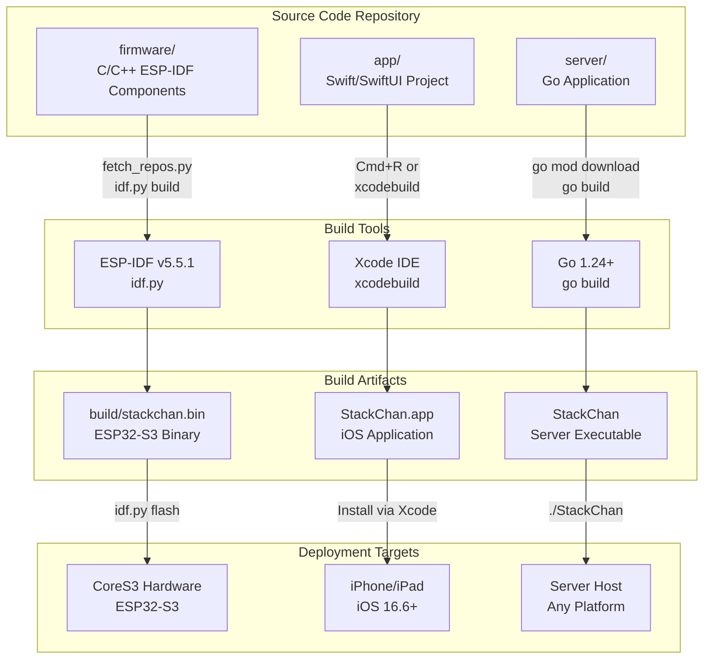
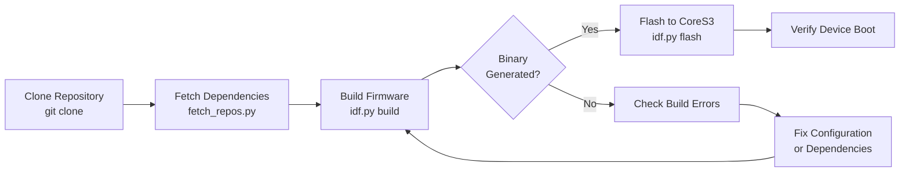
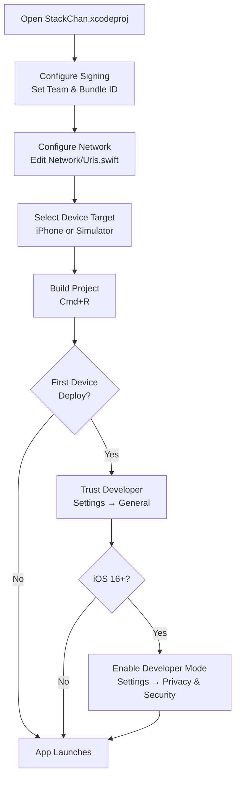
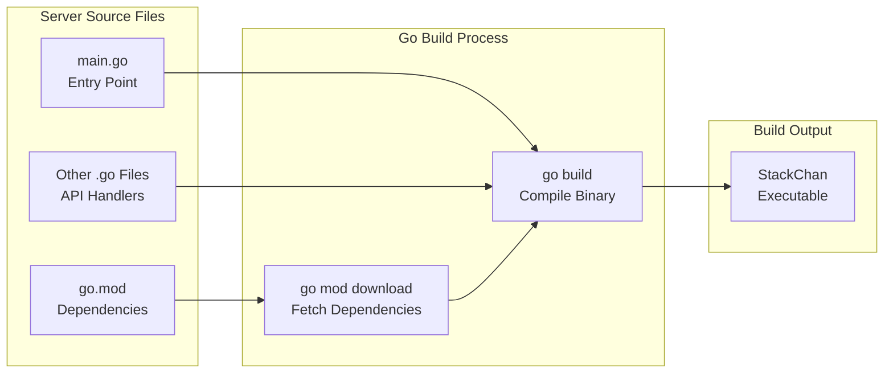
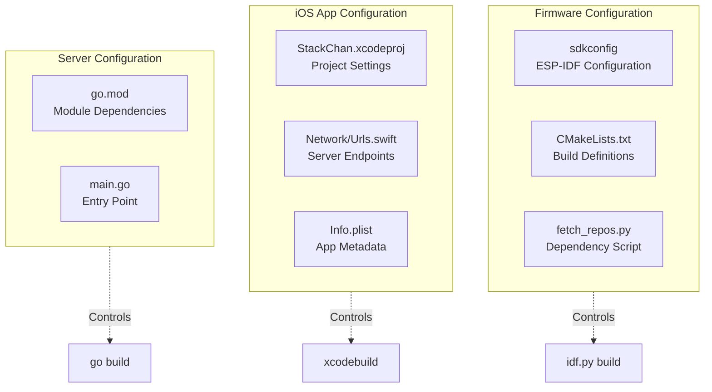

StackChan Building All Components

# Building All Components

<details>
<summary>Relevant source files</summary>

The following files were used as context for generating this wiki page:

- [app/README.md](app/README.md)
- [firmware/README.md](firmware/README.md)
- [server/README.md](server/README.md)

</details>


This page provides step-by-step instructions for building all three major components of the StackChan system from source code: the firmware, iOS application, and backend server. Each component has distinct build requirements, toolchains, and deployment targets.

For detailed environment setup instructions, see [Development Environment Setup](#8.1). For configuring network settings after building, see [Network Configuration](#8.3). For component-specific details, see [Building and Flashing](#4.3) (firmware), [Getting Started with the iOS App](#5.1), and [Server Setup and Deployment](#6.1).

## Build Process Overview

The StackChan system consists of three independently buildable components that communicate at runtime. Each component uses a different programming language and toolchain:



Sources: [firmware/README.md:1-26](), [app/README.md:1-63](), [server/README.md:1-45]()

## Prerequisites Summary

Before building any component, ensure you have the required development tools installed:

| Component | Required Tools | Version | Purpose |
|-----------|---------------|---------|---------|
| **Firmware** | ESP-IDF | v5.5.1 | ESP32-S3 toolchain and RTOS |
| | Python 3 | 3.8+ | Dependency management and build scripts |
| **iOS App** | Xcode | 14.0+ | iOS development and signing |
| | macOS | 12.0+ | Required for Xcode |
| | Apple ID | Any | Code signing for device deployment |
| **Server** | Go SDK | 1.24+ | Go compiler and runtime |

Sources: [firmware/README.md:11-13](), [app/README.md:10-40](), [server/README.md:20-29]()

## Building the Firmware

The firmware targets the ESP32-S3 microcontroller and uses the ESP-IDF framework. The build process involves fetching dependencies, compiling C/C++ code, and generating a flashable binary.

### Fetch Firmware Dependencies

The firmware relies on external ESP-IDF components that must be fetched before building:

```bash
cd StackChan/firmware
python3 ./fetch_repos.py
```

The `fetch_repos.py` script clones required ESP-IDF component repositories into the firmware directory.

Sources: [firmware/README.md:5-9]()

### Build Firmware Binary

With dependencies in place, compile the firmware using the ESP-IDF build system:

```bash
idf.py build
```

This command:
- Configures the build for the ESP32-S3 target
- Compiles all C/C++ source files in the firmware directory
- Links against ESP-IDF libraries
- Generates `build/stackchan.bin` and related artifacts

The build process uses CMake internally and respects the project's `CMakeLists.txt` configuration files.

Sources: [firmware/README.md:15-19]()

### Flash Firmware to Hardware

Deploy the compiled firmware to the CoreS3 hardware via USB-C:

```bash
idf.py flash
```

This command:
- Detects the USB-connected CoreS3 device
- Erases necessary flash regions
- Programs the firmware binary to the ESP32-S3
- Optionally resets the device to run the new firmware

Ensure the CoreS3 is connected via USB-C and no other process is using the serial port.

Sources: [firmware/README.md:21-25]()

### Firmware Build Workflow



Sources: [firmware/README.md:1-26]()

## Building the iOS Application

The iOS app is developed in Swift using SwiftUI and requires Xcode for building. The build process includes code signing configuration and network endpoint configuration.

### Clone and Open Project

Navigate to the app directory and open the Xcode project:

```bash
cd StackChan/app
open StackChan.xcodeproj
```

Alternatively, launch Xcode and use File → Open to select the `.xcodeproj` file.

Sources: [app/README.md:1-12]()

### Configure Code Signing

Code signing is required to deploy the app to an iPhone. Configure signing in Xcode:

1. Select the project in the Xcode navigator
2. Select the app target
3. Open the **Signing & Capabilities** tab
4. Sign in with your Apple ID via Xcode → Settings → Accounts
5. Set **Team** to your Apple ID
6. Change **Bundle Identifier** to a unique value (e.g., `com.yourname.stackchan`)
7. Verify no signing errors appear

A free Apple ID is sufficient for personal device testing.

Sources: [app/README.md:28-41]()

### Configure Server Endpoint

Before building, configure the server IP address that the app will connect to:

1. Open `Network/Urls.swift` in Xcode
2. Locate the `url` static property definition
3. Replace the IP address with your server's IP:

```swift
static let url = "192.168.51.24:12800/"  // Replace with your server IP
```

This configuration determines where the app sends HTTP requests and WebSocket connections.

Sources: [app/README.md:42-53]()

### Build and Run Application

Build and deploy the app to a connected iPhone or simulator:

- Press `Cmd + R` in Xcode to build and run
- Or use Product → Run from the menu

The first build may take several minutes as Xcode compiles dependencies.

**Device Trust Configuration:**
When running on a physical iPhone for the first time, you must trust the developer profile:
1. On the iPhone, go to Settings → General → VPN & Device Management
2. Select your developer profile
3. Tap Trust

**Developer Mode (iOS 16+):**
iOS 16 and later require Developer Mode to be enabled:
1. Connect iPhone to Mac and open Xcode
2. On iPhone, go to Settings → Privacy & Security → Developer Mode
3. Enable Developer Mode and restart the device
4. Confirm the prompt after restart

Sources: [app/README.md:54-62](), [app/README.md:21-27]()

### iOS Build Process



Sources: [app/README.md:1-63]()

## Building the Server

The server is written in Go and provides HTTP REST APIs and WebSocket relay functionality. The build produces a standalone executable that runs on any platform.

### Install Go Dependencies

Fetch all required Go modules:

```bash
cd StackChan/server
go mod download
```

The `go mod download` command reads `go.mod` and downloads all declared dependencies to the local Go module cache.

Sources: [server/README.md:35-37]()

### Build Server Executable

Compile the server into a platform-specific executable:

```bash
go build -o StackChan main.go
```

This produces:
- `StackChan` on Linux/macOS
- `StackChan.exe` on Windows

The executable is statically linked and can be deployed to any system with the same OS and architecture.

Sources: [server/README.md:39-40]()

### Run Server

Execute the server binary:

```bash
./StackChan          # Linux/macOS
StackChan.exe        # Windows
```

The server starts listening for HTTP and WebSocket connections on the configured port (default: 12800).

Sources: [server/README.md:42-44]()

### Server Build Components



Sources: [server/README.md:31-44]()

## Complete Build Sequence

Building all three components from a fresh repository clone:

```bash
# Clone repository
git clone https://github.com/m5stack/StackChan
cd StackChan

# Build firmware
cd firmware
python3 ./fetch_repos.py
idf.py build
idf.py flash
cd ..

# Build server
cd server
go mod download
go build -o StackChan main.go
./StackChan &  # Run in background
cd ..

# Build iOS app (requires Xcode GUI)
cd app
# 1. Open StackChan.xcodeproj in Xcode
# 2. Configure signing in Signing & Capabilities tab
# 3. Edit Network/Urls.swift with server IP
# 4. Select target device
# 5. Press Cmd+R to build and run
```

### Build Verification Checklist

After building each component, verify successful deployment:

| Component | Verification Method | Expected Result |
|-----------|-------------------|-----------------|
| **Firmware** | Connect to device serial output | Boot messages appear, no crashes |
| | Check RGB LEDs | LEDs light up with patterns |
| | Bluetooth scan from phone | Device appears as "StackChan" |
| **iOS App** | Launch app on device | App opens without crashes |
| | Navigate to device list | UI renders correctly |
| | Check network configuration | Server URL matches expected value |
| **Server** | Run `curl http://localhost:12800/deviceInfo?mac=test` | Returns JSON response |
| | Check console output | Server logs connection attempts |
| | Verify port listening | `netstat` shows port 12800 in LISTEN state |

Sources: [firmware/README.md:1-26](), [app/README.md:1-63](), [server/README.md:1-45]()

## Build Configuration Files

Each component uses specific configuration files that control the build process:



Sources: [firmware/README.md:1-26](), [app/README.md:1-63](), [server/README.md:1-45]()

## Troubleshooting Common Build Issues

### Firmware Build Failures

**Missing ESP-IDF:**
- Ensure ESP-IDF v5.5.1 is installed and activated
- Run `idf.py --version` to verify

**Dependency Fetch Errors:**
- Verify internet connectivity
- Check that `fetch_repos.py` completed without errors
- Manually verify component directories exist

**Flash Failures:**
- Check USB-C cable connection
- Verify no other programs are using the serial port
- Try running `idf.py -p /dev/ttyUSB0 flash` with explicit port

### iOS Build Failures

**Code Signing Errors:**
- Verify Apple ID is added in Xcode → Settings → Accounts
- Ensure Bundle Identifier is unique
- Check that device is registered in developer portal

**Network Configuration Issues:**
- Confirm `Network/Urls.swift` IP address is correct
- Verify server is running and accessible from iOS device network
- Check firewall settings on server host

**Device Trust Not Appearing:**
- Ensure Developer Mode is enabled (iOS 16+)
- Reconnect iPhone to Mac
- Rebuild and redeploy app

### Server Build Failures

**Go Version Mismatch:**
- Run `go version` to verify Go 1.24+
- Update Go SDK if necessary

**Module Download Errors:**
- Verify internet connectivity
- Try `go clean -modcache` and retry download
- Check for proxy or network restrictions

**Runtime Port Conflicts:**
- Ensure port 12800 is not already in use
- Use `lsof -i :12800` (Linux/macOS) or `netstat -ano | findstr 12800` (Windows)
- Kill conflicting processes or configure different port

Sources: [firmware/README.md:1-26](), [app/README.md:1-63](), [server/README.md:1-45]()