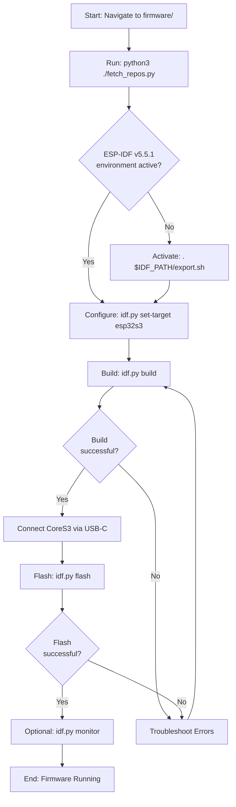
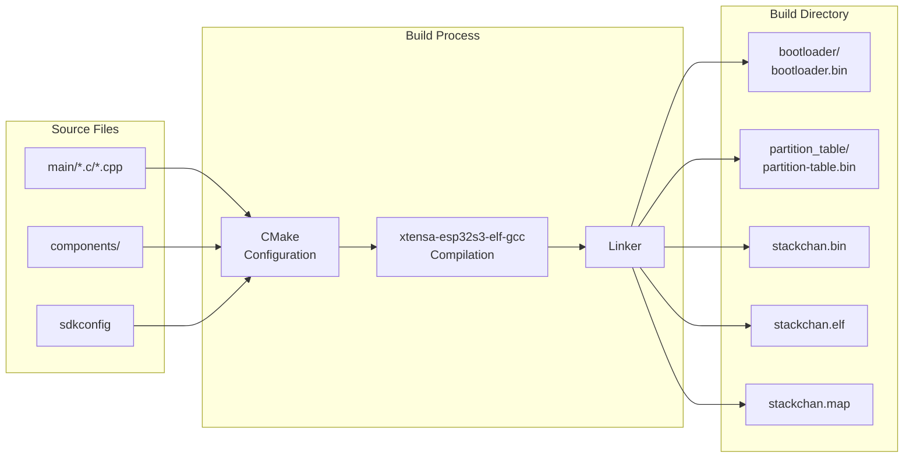
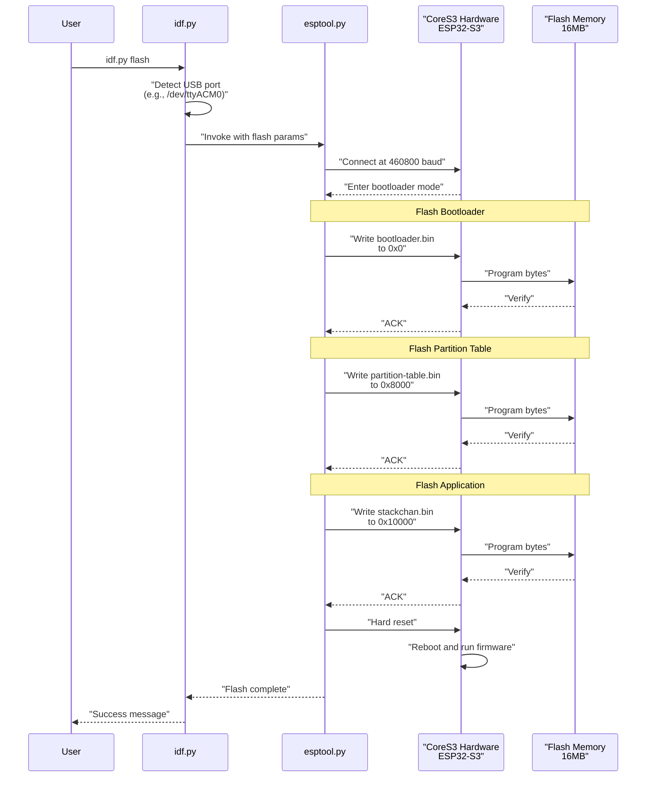
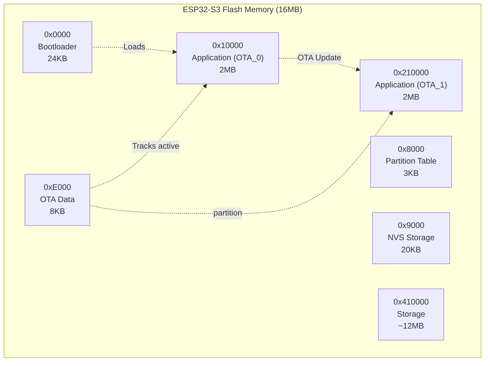
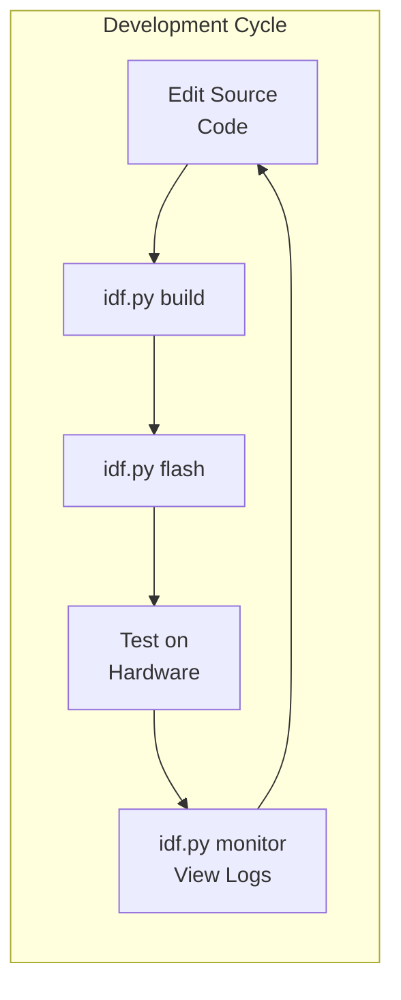

StackChan Building and Flashing

# Building and Flashing

<details>
<summary>Relevant source files</summary>

The following files were used as context for generating this wiki page:

- [firmware/README.md](firmware/README.md)

</details>


## Purpose and Scope

This page documents the process of building the StackChan firmware from source code and flashing it to the CoreS3 ESP32-S3 hardware. It covers dependency fetching, compilation using ESP-IDF toolchain, and programming the device via USB-C connection.

For information about setting up the ESP-IDF development environment and installing required tools, see [Development Setup](#4.2). For details about the factory firmware features, see [Factory Firmware Features](#4.1). For alternative programming methods, see [Programming with Arduino and UiFlow2](#4.4).

---

## Build and Flash Workflow Overview

The firmware build and flash process follows a standard ESP-IDF workflow with an additional dependency fetching step. The process transforms source code into a binary image that can be programmed onto the ESP32-S3 flash memory.

### Build and Flash Process Flow



Sources: [firmware/README.md:1-26]()

---

## Step 1: Fetching Dependencies

Before building, external dependencies must be fetched using the provided Python script. This script downloads required repositories and components that are not included directly in the main repository.

### Dependency Fetch Command

```bash
cd firmware
python3 ./fetch_repos.py
```

The `fetch_repos.py` script handles downloading and preparing external dependencies needed for compilation. This step must be completed before the first build or when dependencies change.

Sources: [firmware/README.md:5-9]()

---

## Step 2: Building the Firmware

The firmware is built using the ESP-IDF toolchain through the `idf.py` build system wrapper. The build process compiles all source files, links libraries, and generates flashable binary images.

### Build Command

```bash
idf.py build
```

### Build Process Details

The `idf.py build` command performs the following operations:

1. **Configuration Phase**: Reads `sdkconfig` file and validates build configuration
2. **CMake Generation**: Generates build files from CMakeLists.txt definitions
3. **Compilation**: Compiles C/C++ source files for ESP32-S3 target
4. **Linking**: Links object files with ESP-IDF libraries and components
5. **Binary Generation**: Creates flashable binary images in `build/` directory

### Build Output Artifacts



### Key Build Output Files

| File | Location | Purpose |
|------|----------|---------|
| `bootloader.bin` | `build/bootloader/` | ESP32-S3 bootloader binary |
| `partition-table.bin` | `build/partition_table/` | Flash partition layout |
| `stackchan.bin` | `build/` | Main application firmware binary |
| `stackchan.elf` | `build/` | ELF executable with debug symbols |
| `stackchan.map` | `build/` | Memory map for debugging |

Sources: [firmware/README.md:16-19]()

---

## Step 3: Flashing to Hardware

Once the firmware is built, it must be flashed to the CoreS3 hardware via USB-C connection. The ESP-IDF toolchain includes `esptool.py` which handles communication with the ESP32-S3 bootloader.

### Basic Flash Command

```bash
idf.py flash
```

This command automatically detects the connected device port and flashes all necessary binaries (bootloader, partition table, and application) to the appropriate flash memory addresses.

### Flash Process Internals



Sources: [firmware/README.md:22-25]()

---

## Flash Options and Advanced Usage

The `idf.py flash` command supports various options to customize the flashing process.

### Common Flash Options

| Option | Description | Example |
|--------|-------------|---------|
| `-p PORT` | Specify serial port | `idf.py -p /dev/ttyUSB0 flash` |
| `-b BAUD` | Set baud rate | `idf.py -b 921600 flash` |
| `flash monitor` | Flash and start serial monitor | `idf.py flash monitor` |
| `app-flash` | Flash only application binary | `idf.py app-flash` |
| `erase-flash` | Erase entire flash before flashing | `idf.py erase-flash` |

### Flash Command Variants

```bash
# Flash with custom port
idf.py -p /dev/ttyACM0 flash

# Flash at higher baud rate (faster)
idf.py -b 921600 flash

# Flash and immediately start monitoring serial output
idf.py flash monitor

# Flash only the application (faster, skips bootloader)
idf.py app-flash

# Erase all flash memory then flash
idf.py erase-flash flash
```

### Flash Memory Layout



Sources: [firmware/README.md:22-25]()

---

## Serial Monitor

After flashing, the serial monitor can be used to view firmware log output and interact with the device console.

### Starting the Monitor

```bash
# Start monitor after flashing
idf.py flash monitor

# Or start monitor separately
idf.py monitor
```

### Monitor Features

- **Real-time Logs**: Displays ESP_LOG output from firmware
- **Backtrace Decoding**: Automatically decodes crash backtraces using ELF symbols
- **Filter Support**: Can filter log output by tag or level
- **Exit**: Press `Ctrl+]` to exit monitor

### Monitor Output Example

```
I (123) boot: ESP-IDF v5.5.1 2nd stage bootloader
I (134) boot: compile time Dec 25 2024 10:30:15
I (145) boot: Multicore bootloader
I (156) boot: chip revision: v0.1
I (167) boot.esp32s3: Boot Mode: (1, 0)
I (178) boot: Enabling RNG early entropy source...
I (189) boot: Partition Table:
I (200) boot: ## Label            Usage          Type ST Offset   Length
I (211) boot:  0 nvs              WiFi data        01 02 00009000 00005000
I (222) boot:  1 otadata          OTA data         01 00 0000e000 00002000
I (233) boot:  2 app0             OTA app          00 10 00010000 00200000
I (244) boot:  3 app1             OTA app          00 11 00210000 00200000
I (255) boot:  4 storage          Unknown data     01 82 00410000 00bf0000
```

Sources: [firmware/README.md:1-26]()

---

## Toolchain and Target Configuration

### ESP-IDF Version Requirement

The firmware requires **ESP-IDF v5.5.1** specifically. Version compatibility is critical for successful compilation.

```bash
# Check ESP-IDF version
idf.py --version

# Expected output:
# ESP-IDF v5.5.1
```

### Target Configuration

The firmware is built for the **ESP32-S3** target. This should be configured automatically, but can be explicitly set:

```bash
idf.py set-target esp32s3
```

This command:
- Sets the target chip to ESP32-S3
- Configures toolchain to use `xtensa-esp32s3-elf-gcc`
- Updates `sdkconfig` with ESP32-S3 specific defaults
- Clears previous build artifacts from different targets

Sources: [firmware/README.md:13]()

---

## Combined Build and Flash Workflow

For efficient development, build and flash operations can be combined and automated.

### One-Command Build and Flash

```bash
# Build, flash, and monitor in one command
idf.py build flash monitor
```

### Complete Development Cycle



### Makefile Example

For convenience, a simple Makefile can automate common tasks:

```makefile
.PHONY: deps build flash monitor clean all

deps:
	python3 ./fetch_repos.py

build:
	idf.py build

flash:
	idf.py -p /dev/ttyACM0 flash

monitor:
	idf.py -p /dev/ttyACM0 monitor

clean:
	idf.py fullclean

all: deps build flash monitor
```

Sources: [firmware/README.md:1-26]()

---

## Troubleshooting Common Issues

### Port Detection Issues

**Problem**: `idf.py` cannot detect the USB port automatically.

**Solution**:
```bash
# List available ports
ls /dev/tty*

# Explicitly specify port
idf.py -p /dev/ttyACM0 flash

# On macOS
idf.py -p /dev/cu.usbmodem* flash

# On Windows
idf.py -p COM3 flash
```

### Permission Denied on Linux

**Problem**: Cannot access `/dev/ttyACM0` or `/dev/ttyUSB0`.

**Solution**:
```bash
# Add user to dialout group
sudo usermod -a -G dialout $USER

# Then logout and login again, or:
newgrp dialout

# Or use sudo for one-time flash
sudo idf.py flash
```

### Build Failures

**Problem**: Compilation errors or missing dependencies.

**Solutions**:

1. **Clean and rebuild**:
```bash
idf.py fullclean
python3 ./fetch_repos.py
idf.py build
```

2. **Verify ESP-IDF version**:
```bash
idf.py --version
# Should show: ESP-IDF v5.5.1
```

3. **Check environment variables**:
```bash
echo $IDF_PATH
# Should point to ESP-IDF v5.5.1 installation
```

### Flash Failures

**Problem**: Device not responding or flash verification fails.

**Solutions**:

1. **Try lower baud rate**:
```bash
idf.py -b 115200 flash
```

2. **Manually enter bootloader mode**:
   - Hold BOOT button on CoreS3
   - Press and release RESET button
   - Release BOOT button
   - Then run: `idf.py flash`

3. **Erase flash completely**:
```bash
idf.py erase-flash
idf.py flash
```

### USB Connection Issues

**Problem**: CoreS3 not recognized by computer.

**Solutions**:
- Try different USB-C cable (ensure data-capable, not charge-only)
- Try different USB port
- Check Device Manager (Windows) or `dmesg` (Linux) for USB enumeration
- Install/update USB-to-serial drivers if needed

Sources: [firmware/README.md:1-26]()

---

## Build Configuration and sdkconfig

The firmware build behavior is controlled by the `sdkconfig` file, which contains all ESP-IDF configuration options. This file is generated from `sdkconfig.defaults` and can be customized.

### Configuration Menu

```bash
# Open graphical configuration menu
idf.py menuconfig
```

The `menuconfig` interface allows configuring:
- Component options
- Serial flasher settings
- Partition table configuration
- Compiler optimization levels
- Debug logging levels
- Wi-Fi settings
- Bluetooth settings

### Common Configuration Options

| Setting | Location | Purpose |
|---------|----------|---------|
| Flash size | `Serial flasher config` | Set to 16MB for CoreS3 |
| Flash speed | `Serial flasher config` | 80MHz for optimal performance |
| PSRAM | `Component config → ESP32S3` | Enable for 8MB PSRAM support |
| Log level | `Component config → Log output` | Set default verbosity |
| Partition table | `Partition Table` | Choose standard or custom layout |

Sources: [firmware/README.md:1-26]()

---

## Summary

The StackChan firmware build and flash process involves three main steps:

1. **Fetch Dependencies**: Run `python3 ./fetch_repos.py` to download required external repositories
2. **Build**: Execute `idf.py build` to compile firmware using ESP-IDF v5.5.1 toolchain
3. **Flash**: Use `idf.py flash` to program the CoreS3 ESP32-S3 hardware via USB-C

The process generates bootloader, partition table, and application binaries which are programmed to specific flash memory addresses. The `idf.py` wrapper provides convenient commands for common development tasks including monitoring serial output, erasing flash, and configuring build options.

For initial environment setup, see [Development Setup](#4.2). For information about customizing the firmware or using alternative development methods, see [Programming with Arduino and UiFlow2](#4.4).

Sources: [firmware/README.md:1-26]()