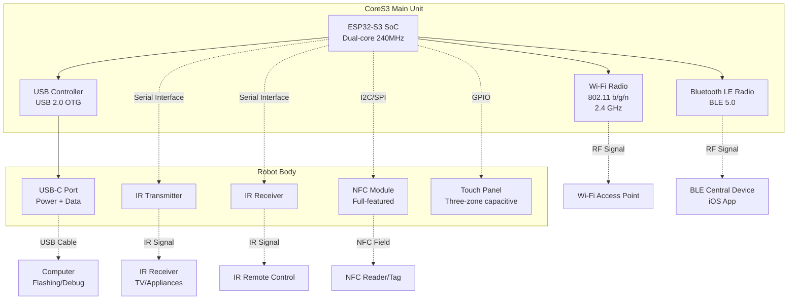
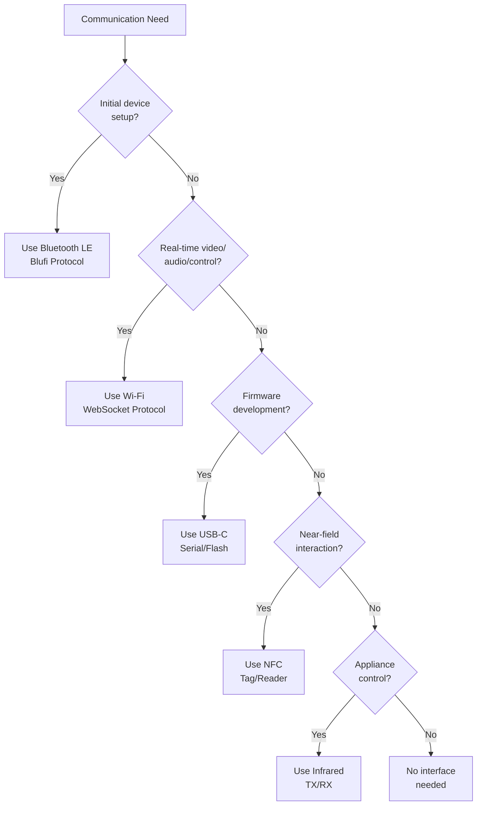

StackChan Communication Interfaces

# Communication Interfaces

Relevant source files

The following files were used as context for generating this wiki page:

- [README.md](README.md)

## Purpose and Scope

This page documents the hardware communication interfaces available on the StackChan robot, including their physical capabilities and hardware specifications. For information about the communication protocols and software implementations used over these interfaces, see [Communication Protocols](#7). For information about the CoreS3 controller that provides these interfaces, see [CoreS3 Controller](#3.1).

## Overview

The StackChan robot provides five distinct communication interfaces for connectivity, data transfer, and interaction:

| Interface | Primary Use | Hardware Location | Communication Range |
|-----------|-------------|-------------------|---------------------|
| Wi-Fi | Network connectivity, real-time control | ESP32-S3 SoC | 50-100m typical |
| Bluetooth LE | Device discovery, initial configuration | ESP32-S3 SoC | 10-30m typical |
| USB-C | Power delivery, firmware flashing, serial communication | Robot body | Wired connection |
| NFC | Near-field data exchange | Robot body | <10cm |
| Infrared | IR remote control emulation and reception | Robot body | 5-10m line-of-sight |

Sources: [README.md:11-13]()

## Hardware Communication Architecture

Sources: [README.md:11-13]()

## Wi-Fi Interface

The ESP32-S3 SoC provides integrated Wi-Fi connectivity with the following specifications:

### Hardware Specifications
- **Standard**: IEEE 802.11 b/g/n
- **Frequency**: 2.4 GHz band only
- **Modes**: Station (STA), Access Point (AP), Station+AP concurrent
- **Maximum data rate**: 150 Mbps (PHY rate)
- **Security**: WPA/WPA2/WPA3-PSE
- **Antenna**: Integrated PCB antenna

### Primary Functions
1. **Network connectivity** for internet access and cloud services
2. **WebSocket communication** for real-time control and video streaming
3. **HTTP client** for REST API interactions with backend server
4. **OTA firmware updates** over the network

The Wi-Fi interface is configured during initial setup via the Bluetooth LE interface using the Blufi protocol. Once configured, the robot maintains persistent network connectivity for all networked operations.

Sources: [README.md:11]()

## Bluetooth LE Interface

The ESP32-S3 SoC includes a Bluetooth Low Energy (BLE) 5.0 radio with the following characteristics:

### Hardware Specifications
- **Standard**: Bluetooth 5.0
- **Modes**: Central, Peripheral, Broadcaster, Observer
- **Maximum connections**: Multiple concurrent connections supported
- **Transmit power**: Configurable up to +20 dBm
- **Antenna**: Shared with Wi-Fi (integrated PCB antenna)

### Primary Functions
1. **Device discovery** by iOS app during initial setup
2. **Wi-Fi credential provisioning** using Blufi protocol
3. **Direct device control** without network dependency
4. **Proximity-based device detection** for nearby StackChan discovery

The BLE interface operates independently of Wi-Fi and can function even when Wi-Fi is not configured. It is the primary method for initial device pairing and configuration. For details on the Blufi protocol implementation, see [Bluetooth LE (Blufi Protocol)](#7.1).

Sources: [README.md:11]()

## USB-C Interface

The robot body includes a USB-C port that provides both power delivery and data communication:

### Hardware Specifications
- **Connector**: USB Type-C (reversible)
- **Protocol**: USB 2.0
- **Functions**: 
  - Power input (5V, up to 2A typical)
  - Serial communication (UART over USB)
  - Firmware flashing
  - Debug console access

### Primary Functions
1. **Power delivery** to charge internal 700 mAh battery and power the system
2. **Firmware flashing** using ESP-IDF tools (`idf.py flash`)
3. **Serial debugging** for firmware development and troubleshooting
4. **Data transfer** for configuration files and logs

The USB-C interface connects to the ESP32-S3's USB OTG controller, which provides CDC-ACM (Communications Device Class - Abstract Control Model) support for serial communication. When connected to a computer, the device enumerates as a serial port.

For instructions on using the USB-C interface for firmware development, see [Building and Flashing](#4.3).

Sources: [README.md:13]()

## NFC Interface

The robot body includes a full-featured NFC module for near-field communication:

### Hardware Specifications
- **Type**: Full-featured NFC module
- **Standards**: Likely NFC Forum Type 1-4 compatible
- **Operating frequency**: 13.56 MHz
- **Communication distance**: <10 cm typical
- **Interface to ESP32-S3**: I2C or SPI bus

### Primary Functions
1. **NFC tag reading** for configuration or data transfer
2. **NFC tag emulation** for identification or pairing
3. **Peer-to-peer data exchange** with other NFC devices
4. **Potential use cases**: Contact-free configuration, identity sharing, game interactions

The NFC module is located in the robot body and connects to the CoreS3 main unit through a standard serial interface. The factory firmware may include NFC functionality, though specific features are not detailed in the current documentation.

Sources: [README.md:13]()

## Infrared Transmitter and Receiver

The robot body includes both IR transmission and reception capabilities:

### Hardware Specifications

**IR Transmitter**
- **Type**: Infrared LED
- **Typical wavelength**: 940 nm
- **Range**: 5-10 meters line-of-sight
- **Function**: Transmit modulated IR signals

**IR Receiver**
- **Type**: IR photodiode/phototransistor with demodulator
- **Typical wavelength**: 940 nm  
- **Range**: 5-10 meters line-of-sight
- **Function**: Receive and demodulate IR signals

### Primary Functions

**Transmitter (IR TX)**
1. **Remote control emulation** for TVs, air conditioners, and other appliances
2. **IR-based data transmission** to other IR-capable devices
3. **Custom IR protocols** for robot-to-robot communication

**Receiver (IR RX)**
1. **Learning remote control codes** from existing remotes
2. **Receiving commands** from IR remote controls
3. **Detecting IR signals** from other devices

The IR transmitter and receiver operate independently and can be used simultaneously. They connect to the ESP32-S3 through GPIO pins, with the transmitter typically using PWM for carrier frequency generation and the receiver using interrupt-driven signal capture.

Sources: [README.md:13]()

## Interface Connectivity Matrix

The following table summarizes the connectivity requirements and typical use cases for each interface:

| Interface | Required for Initial Setup | Required for Operation | Typical Bandwidth | Latency |
|-----------|---------------------------|----------------------|------------------|---------|
| Wi-Fi | No | Yes (for network features) | 1-10 Mbps actual | 10-50 ms |
| Bluetooth LE | Yes | No (after Wi-Fi config) | 1-2 Mbps theoretical | 20-100 ms |
| USB-C | No | No (except for charging) | 12 Mbps (USB 2.0) | <1 ms |
| NFC | No | No (feature-dependent) | 424 kbps max | <100 ms |
| Infrared | No | No (feature-dependent) | 9.6-115.2 kbps typical | <10 ms |

## Communication Interface Selection Guide

Sources: [README.md:11-13]()

## Power Considerations for Communication Interfaces

Different communication interfaces have varying power consumption profiles:

| Interface | Typical Power Consumption | Impact on Battery Life |
|-----------|--------------------------|----------------------|
| Wi-Fi (Active) | 150-300 mA | High - primary power consumer during network operations |
| Wi-Fi (Idle/Connected) | 15-30 mA | Moderate - significant background drain |
| Bluetooth LE (Connected) | 10-20 mA | Low - efficient for periodic communication |
| Bluetooth LE (Advertising) | 5-10 mA | Low - suitable for always-on discovery |
| USB-C (Connected) | N/A | Zero - provides power to system |
| NFC (Active) | 30-50 mA | Moderate - but only active during use |
| Infrared TX (Transmitting) | 50-100 mA | Moderate - but only during burst transmission |
| Infrared RX (Listening) | 1-5 mA | Very Low - minimal power for detection |

For power management details, see [Power and Safety](#3.5).

Sources: [README.md:13]()