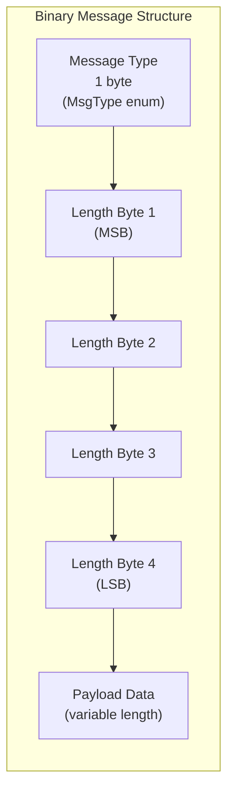
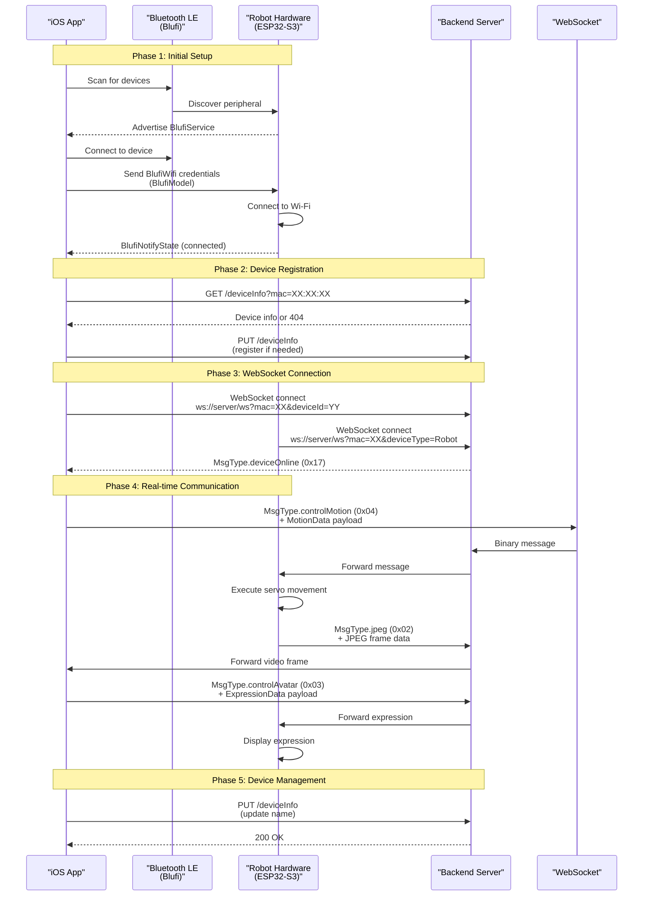
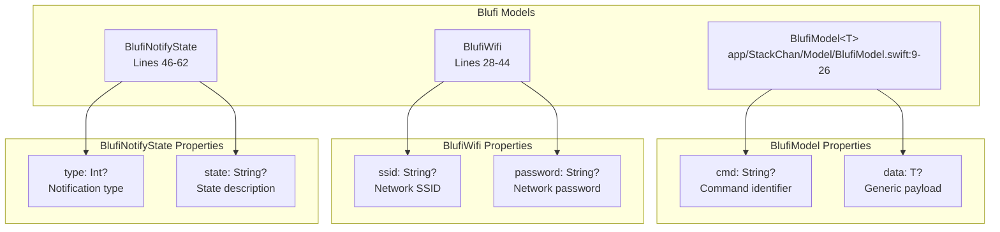
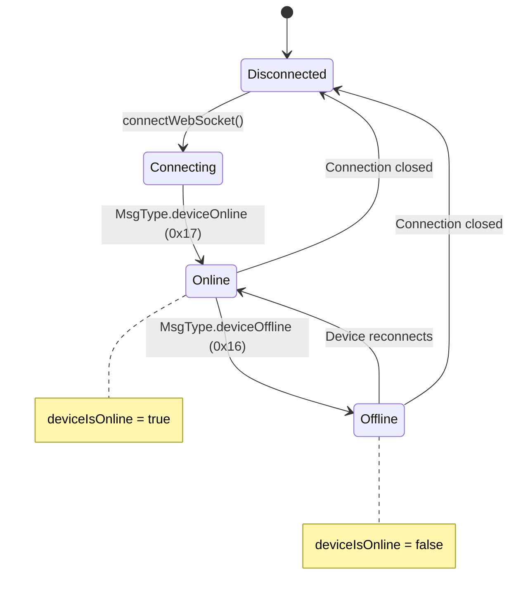

StackChan Communication Protocols

# Communication Protocols

<details>
<summary>Relevant source files</summary>

The following files were used as context for generating this wiki page:

- [app/StackChan/AppState.swift](app/StackChan/AppState.swift)
- [app/StackChan/Model/BlufiModel.swift](app/StackChan/Model/BlufiModel.swift)
- [app/StackChan/Model/MessageModel.swift](app/StackChan/Model/MessageModel.swift)

</details>


## Purpose and Scope

This document provides an overview of all communication protocols used in the StackChan system. StackChan employs three distinct protocols to enable different types of interactions between the robot hardware, mobile app, and backend server:

1. **Bluetooth LE (Blufi Protocol)** - For initial device discovery and Wi-Fi configuration
2. **WebSocket Protocol** - For real-time bidirectional communication including video, audio, and control commands
3. **HTTP REST API** - For device management and social features

For detailed information about specific protocols, see:
- Bluetooth LE implementation details: [Blufi Protocol](#7.1)
- WebSocket message formats and types: [WebSocket Protocol](#7.2)
- HTTP endpoint specifications: [HTTP REST API](#7.3)
- Complete message type catalog: [Message Types Reference](#7.4)

## Protocol Overview

The StackChan system uses a multi-protocol architecture where each protocol serves a specific purpose in the communication lifecycle:

```mermaid
graph TB
    subgraph "Initial Setup Phase"
        BLE["Bluetooth LE<br/>(Blufi Protocol)"]
    end
    
    subgraph "Real-time Operation Phase"
        WS["WebSocket Protocol"]
    end
    
    subgraph "Management Phase"
        HTTP["HTTP REST API"]
    end
    
    subgraph "Use Cases"
        Discovery["Device Discovery"]
        WiFiConfig["Wi-Fi Configuration"]
        Pairing["Device Pairing"]
        
        Video["Video Streaming"]
        Audio["Audio Streaming"]
        Motion["Motion Control"]
        Expression["Expression Control"]
        CallControl["Call Management"]
        
        DeviceInfo["Device Information"]
        NameUpdate["Name Updates"]
        Posts["Social Posts"]
        Comments["Comments"]
        Dance["Dance Data"]
    end
    
    BLE --> Discovery
    BLE --> WiFiConfig
    BLE --> Pairing
    
    WS --> Video
    WS --> Audio
    WS --> Motion
    WS --> Expression
    WS --> CallControl
    
    HTTP --> DeviceInfo
    HTTP --> NameUpdate
    HTTP --> Posts
    HTTP --> Comments
    HTTP --> Dance
```



**Sources:** [app/StackChan/AppState.swift:93-96](), [app/StackChan/AppState.swift:198-223](), [app/StackChan/Model/BlufiModel.swift:9-62]()

## Protocol Selection Matrix

The following table summarizes when each protocol is used:

| Protocol | Connection Type | Primary Use Cases | Latency | Data Volume |
|----------|----------------|-------------------|---------|-------------|
| Bluetooth LE (Blufi) | Direct device-to-app | Device discovery, initial setup, Wi-Fi provisioning | Low | Very Low |
| WebSocket | Via server relay | Video/audio streaming, real-time control, status updates | Very Low | High |
| HTTP REST | Via server | Device registration, name changes, social features | Medium | Low-Medium |

**Sources:** System architecture diagrams, [app/StackChan/AppState.swift:93-96]()

## Binary Message Protocol Structure

Both Bluetooth LE and WebSocket protocols share a common binary message format for efficient data transmission:



The message structure consists of:
- **Byte 0**: Message type (`MsgType` enum value, see [app/StackChan/Model/MessageModel.swift:9-39]())
- **Bytes 1-4**: Payload length (32-bit big-endian unsigned integer)
- **Bytes 5+**: Payload data (length specified in bytes 1-4)

**Implementation references:**
- Message encoding: [app/StackChan/AppState.swift:98-114]() - `sendWebSocketMessage(_:_:)`
- Message parsing: [app/StackChan/AppState.swift:116-139]() - `parseMessage(message:)`

**Sources:** [app/StackChan/AppState.swift:98-139]()

## Message Type Enumeration

The `MsgType` enum defines all supported message types across protocols:

```mermaid
graph TB
    MsgType["MsgType Enum<br/>app/StackChan/Model/MessageModel.swift"]
    
    subgraph "Media Streaming"
        opus["0x01: opus<br/>Audio stream"]
        jpeg["0x02: jpeg<br/>Video frame"]
    end
    
    subgraph "Control Commands"
        avatar["0x03: controlAvatar<br/>Expression control"]
        motion["0x04: controlMotion<br/>Servo movement"]
        dance["0x14: dance<br/>Dance sequence"]
    end
    
    subgraph "Camera Management"
        onCam["0x05: onCamera<br/>Enable camera"]
        offCam["0x06: offCamera<br/>Disable camera"]
    end
    
    subgraph "Call Management"
        reqCall["0x09: requestCall<br/>Initiate call"]
        refCall["0x0A: refuseCall<br/>Decline call"]
        agrCall["0x0B: agreeCall<br/>Accept call"]
        hangCall["0x0C: hangupCall<br/>End call"]
    end
    
    subgraph "Device Management"
        updName["0x0D: updateDeviceName<br/>Set device name"]
        getName["0x0E: getDeviceName<br/>Query device name"]
        getPost["0x15: getAvatarPosture<br/>Query position"]
    end
    
    subgraph "Connection Status"
        ping["0x10: ping<br/>Keepalive request"]
        pong["0x11: pong<br/>Keepalive response"]
        online["0x17: deviceOnline<br/>Device connected"]
        offline["0x16: deviceOffline<br/>Device disconnected"]
    end
    
    subgraph "Screen State"
        onScr["0x12: onPhoneScreen<br/>Screen active"]
        offScr["0x13: offPhoneScreen<br/>Screen inactive"]
    end
    
    MsgType --> opus
    MsgType --> jpeg
    MsgType --> avatar
    MsgType --> motion
    MsgType --> dance
    MsgType --> onCam
    MsgType --> offCam
    MsgType --> reqCall
    MsgType --> refCall
    MsgType --> agrCall
    MsgType --> hangCall
    MsgType --> updName
    MsgType --> getName
    MsgType --> getPost
    MsgType --> ping
    MsgType --> pong
    MsgType --> online
    MsgType --> offline
    MsgType --> onScr
    MsgType --> offScr
```



**Sources:** [app/StackChan/Model/MessageModel.swift:9-39]()

## Communication Flow

The typical communication flow in a StackChan system follows this sequence:



**Sources:** [app/StackChan/AppState.swift:65-96](), [app/StackChan/AppState.swift:246-267]()

## Protocol State Management in AppState

The `AppState` singleton class manages all protocol connections and message handling:

```mermaid
graph TB
    AppState["AppState Singleton<br/>app/StackChan/AppState.swift"]
    
    subgraph "Bluetooth Management"
        connectBluDevice["connectBulDevice(macAddress:)<br/>Line 65-91"]
        openBlufi["openBlufi()<br/>Line 226-243"]
        blufDeviceList["blufDeviceList: [BlufiDeviceInfo]<br/>Line 55"]
    end
    
    subgraph "WebSocket Management"
        connectWebSocket["connectWebSocket()<br/>Line 93-96"]
        sendWebSocketMessage["sendWebSocketMessage(_:_:)<br/>Line 98-114"]
        parseMessage["parseMessage(message:)<br/>Line 116-139"]
        webSocketMessageMonitoring["webSocketMessageMonitoring()<br/>Line 246-267"]
    end
    
    subgraph "HTTP Management"
        updateDeviceInfo["updateDeviceInfo()<br/>Line 141-161"]
        getDeviceInfo["getDeviceInfo()<br/>Line 198-223"]
    end
    
    subgraph "State Properties"
        deviceMac["deviceMac: String<br/>Line 36"]
        deviceInfo["deviceInfo: Device<br/>Line 50"]
        deviceIsOnline["deviceIsOnline: Bool<br/>Line 63"]
        showDeviceWifiSet["showDeviceWifiSet: Bool<br/>Line 58"]
    end
    
    AppState --> connectBluDevice
    AppState --> openBlufi
    AppState --> blufDeviceList
    AppState --> connectWebSocket
    AppState --> sendWebSocketMessage
    AppState --> parseMessage
    AppState --> webSocketMessageMonitoring
    AppState --> updateDeviceInfo
    AppState --> getDeviceInfo
    AppState --> deviceMac
    AppState --> deviceInfo
    AppState --> deviceIsOnline
    AppState --> showDeviceWifiSet
```



**Sources:** [app/StackChan/AppState.swift:19-268]()

## Blufi Data Models

The Bluetooth LE (Blufi) protocol uses specialized data models for structured communication:



All models implement `Codable` for JSON serialization and provide `toJson()` and `fromJson()` methods for easy encoding/decoding.

**Sources:** [app/StackChan/Model/BlufiModel.swift:9-62]()

## WebSocket URL Construction

The WebSocket connection URL includes query parameters for device identification:

```
ws://[server-address]/ws?mac=[MAC_ADDRESS]&deviceType=[TYPE]&deviceId=[DEVICE_ID]
```

Parameters:
- `mac`: Device MAC address (hex format with colons)
- `deviceType`: Either "App" (iOS client) or "Robot" (hardware)
- `deviceId`: Unique device identifier (from `AppState.deviceId` on iOS)

**Example from code:**
```swift
let webSocketUrl = Urls.getWebSocketUrl() + "?mac=" + deviceMac + "&deviceType=App&deviceId=" + AppState.deviceId
```

**Sources:** [app/StackChan/AppState.swift:94]()

## Message Encoding and Decoding

### Encoding Process

When sending a message via WebSocket, the `sendWebSocketMessage(_:_:)` method constructs the binary packet:

1. Append message type byte (`MsgType.rawValue`)
2. Calculate payload length as 32-bit unsigned integer
3. Append length as 4 bytes (big-endian): `(dataLen >> 24) & 0xFF`, `(dataLen >> 16) & 0xFF`, etc.
4. Append payload data
5. Send via `WebSocketUtil.shared.send(data:)`

**Sources:** [app/StackChan/AppState.swift:98-114]()

### Decoding Process

The `parseMessage(message:)` method extracts the message type and payload:

1. Read byte 0 to get message type
2. Convert to `MsgType` enum (return nil if invalid)
3. Read bytes 1-4 and reconstruct 32-bit length using left-shift operations
4. Extract payload from byte 5 to byte (5 + length - 1)
5. Return tuple of `(MsgType?, Data?)`

**Sources:** [app/StackChan/AppState.swift:116-139]()

## Device Status Monitoring

The WebSocket connection monitors device online/offline status through dedicated message types:



The `webSocketMessageMonitoring()` method observes incoming messages and updates `deviceIsOnline` state accordingly:

**Sources:** [app/StackChan/AppState.swift:246-267]()

## Related Pages

For detailed information about each protocol:
- **Bluetooth LE implementation and Blufi commands**: [Blufi Protocol](#7.1)
- **WebSocket message formats, binary protocol, and real-time communication**: [WebSocket Protocol](#7.2)  
- **HTTP REST API endpoints for device and social features**: [HTTP REST API](#7.3)
- **Complete catalog of all message types with payload specifications**: [Message Types Reference](#7.4)

For related system components:
- **Network configuration across components**: [Network Configuration](#8.3)
- **iOS app state management**: [Application State Management](#5.3)
- **iOS data models**: [Data Models](#5.4)