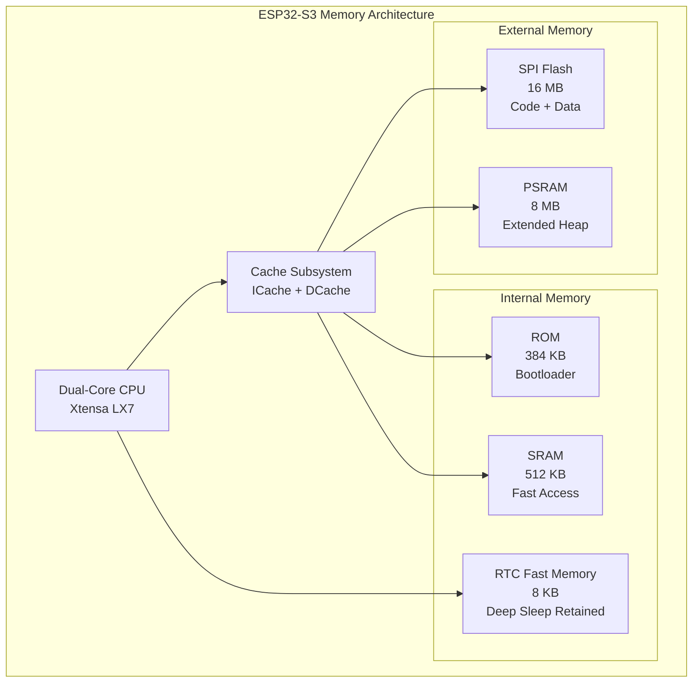
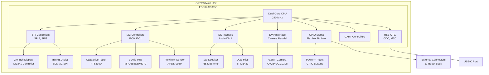

StackChan CoreS3 Controller

# CoreS3 Controller

Relevant source files

The following files were used as context for generating this wiki page:

- [README.md](README.md)

## Purpose and Scope

This document details the **CoreS3 controller**, which serves as the main processing unit of the StackChan robot. It covers the ESP32-S3 System-on-Chip (SoC) specifications, memory architecture, processing capabilities, and the integrated peripherals that comprise the M5Stack CoreS3 development kit. 

For information about individual sensors (camera, IMU, proximity sensor, microphones), see [Sensors and Input Devices](#3.2). For actuators (servos, LEDs, speaker), see [Actuators and Output Devices](#3.3). For communication protocols (Wi-Fi, Bluetooth, USB-C), see [Communication Interfaces](#3.4). For power management details, see [Power and Safety](#3.5).

---

## Overview

The **CoreS3** is M5Stack's flagship IoT development kit that functions as StackChan's brain. It is a fully integrated development platform built around the **ESP32-S3** SoC, combining a powerful dual-core processor with extensive onboard peripherals in a compact form factor. The CoreS3 handles all computational tasks including:

- Real-time expression rendering and motion control
- Audio processing and speech synthesis
- Camera image capture and streaming
- Network communication (Wi-Fi and Bluetooth LE)
- Sensor data acquisition and processing
- Touch interface and user interaction management

The unit integrates both the main controller hardware and a comprehensive set of I/O devices on a single board, connected via internal buses to the ESP32-S3.

**Sources:** [README.md:11-11]()

---

## ESP32-S3 SoC Architecture

### Processor Core

The ESP32-S3 is a low-power System-on-Chip featuring:

| Specification | Value |
|--------------|-------|
| **CPU Architecture** | Xtensa® dual-core 32-bit LX7 |
| **Clock Frequency** | 240 MHz |
| **Instruction Set** | 32-bit RISC |
| **FPU Support** | Single-precision floating point unit |

The dual-core architecture allows the firmware to dedicate one core to time-critical tasks (servo control, audio I/O) while the other handles network communication and higher-level application logic. This separation is managed by the ESP-IDF RTOS scheduler.

### Key Features

- **Hardware accelerators** for cryptographic operations (AES, SHA, RSA)
- **RTC (Real-Time Clock)** with ultra-low-power co-processor for standby mode
- **Watchdog timers** for system reliability
- **DMA controllers** for high-speed peripheral data transfer without CPU intervention

**Sources:** [README.md:11-11]()

---

## Memory Architecture

### Flash Memory

The CoreS3 includes **16MB of onboard Flash memory** (SPI Flash) for:

- **Firmware storage**: The compiled ESP-IDF application binary
- **File system**: SPIFFS or LittleFS for configuration files, audio samples, and expression data
- **OTA updates**: Dual partition scheme for reliable over-the-air firmware updates
- **NVS (Non-Volatile Storage)**: Key-value store for persistent configuration

The Flash is mapped into the ESP32-S3's address space and accessed via the Cache, which significantly improves code execution speed compared to direct SPI access.

### PSRAM (Pseudo-Static RAM)

The CoreS3 includes **8MB of PSRAM** (QSPI PSRAM) for:

- **Frame buffers**: Camera image capture buffers and display rendering
- **Audio buffers**: Codec operation and audio sample storage
- **Dynamic allocations**: Large data structures that exceed internal SRAM capacity
- **WebSocket buffers**: Network communication queues

PSRAM is accessed via the Cache and provides expanded memory for data-intensive operations. While slower than internal SRAM, it offers significantly more capacity for applications requiring large working memory.

### Memory Map Overview

**Memory allocation strategy in firmware:**
- Critical interrupt handlers and time-sensitive code: Internal SRAM
- Application code and constants: Flash (cached)
- Large buffers (camera, audio): PSRAM
- Deep sleep variables: RTC Fast Memory

**Sources:** [README.md:11-11]()

---

## Integrated Peripherals and Interfaces

The CoreS3 integrates numerous peripherals directly on the main unit. These are connected to the ESP32-S3 via standard peripheral buses:

### Display and Touch Interface

- **2.0-inch capacitive touch display** with high-strength glass cover
- Resolution and color depth specifications
- Connected via **SPI** for display data and **I2C** for touch controller
- Used for rendering StackChan's facial expressions

### Camera Module

- **0.3 MP camera** (VGA resolution)
- Connected via **DVP (Digital Video Parallel)** interface
- Used for video streaming and video call features
- Managed by ESP32-S3's camera peripheral with DMA

### Motion and Position Sensors

- **9-axis IMU** (Inertial Measurement Unit)
  - 3-axis accelerometer
  - 3-axis gyroscope  
  - 3-axis magnetometer
- Connected via **I2C** bus
- Used for detecting device orientation, movement, and gestures

### Proximity Sensor

- Detects object presence and distance
- Connected via **I2C**
- Used for interactive behaviors (responding when approached)

### Audio System

- **1W speaker** for audio output
- **Dual microphones** for audio input
- Connected via **I2S** (Inter-IC Sound) interface
- Supports Opus codec for compressed audio streaming

### Storage Interface

- **microSD card slot** for expanded storage
- Connected via **SPI** or **SDMMC** peripheral
- Used for logging, media files, and user data

### Control Buttons

- **Power button** and **Reset button**
- GPIO-connected with hardware debouncing
- Power button can trigger deep sleep mode

**Sources:** [README.md:11-11]()

---

## CoreS3 Hardware Block Diagram

This diagram shows how the ESP32-S3 SoC connects to the integrated peripherals within the CoreS3 unit:

**Peripheral addressing in firmware:**

The ESP-IDF framework provides abstraction layers for each peripheral type. Typical initialization sequence involves:

1. **GPIO configuration** via `gpio_config()` for pin multiplexing
2. **Bus initialization** (SPI, I2C, I2S) with driver structures
3. **Device driver initialization** with device-specific parameters
4. **Interrupt and DMA configuration** for asynchronous operation

**Sources:** [README.md:11-13]()

---

## Robot Body Connection

While the CoreS3 unit contains the main controller and primary sensors, additional hardware is located in the **robot body** that connects to the CoreS3:

| Component | Interface | Purpose |
|-----------|-----------|---------|
| **USB-C connector** | USB | Power input and data communication |
| **700 mAh battery** | Power rails | Portable power supply |
| **2 feedback servos** | PWM via GPIO | Pan and tilt motion control |
| **12 RGB LEDs** | SPI/I2S (WS2812B protocol) | Visual feedback and effects |
| **IR transmitter/receiver** | GPIO | Infrared communication |
| **3-zone touch panel** | I2C or GPIO | User input interface |
| **NFC module** | I2C or SPI | Near-field communication |

These components are accessed by the ESP32-S3 via GPIOs routed through the connector between the CoreS3 unit and the robot body. The firmware treats them as extension peripherals.

**Sources:** [README.md:13-13]()

---

## Firmware Development Environment

### ESP-IDF Framework

The CoreS3 firmware is developed using **ESP-IDF (Espressif IoT Development Framework) version 5.5.1**, which provides:

- **FreeRTOS** as the real-time operating system
- **Hardware abstraction layer** (HAL) for all ESP32-S3 peripherals
- **Component-based architecture** for modular firmware design
- **Build system** based on CMake
- **Toolchain** including Xtensa GCC compiler

Key ESP-IDF components used in StackChan firmware:
- `esp_wifi` and `esp_netif` for network connectivity
- `nvs_flash` for non-volatile configuration storage
- `esp_http_client` and `esp_websocket_client` for server communication
- `driver` components for GPIO, I2C, SPI, I2S peripheral control

### Alternative Programming Options

The CoreS3 also supports:

- **Arduino framework** for simplified development with Arduino IDE compatibility
- **UiFlow2** for visual block-based programming

These alternative frameworks provide higher-level abstractions over the same ESP32-S3 hardware.

For detailed setup instructions, see [Development Setup](#4.2) and [Building and Flashing](#4.3).

**Sources:** [README.md:15-15]()

---

## Performance Characteristics

### Processing Capabilities

The 240 MHz dual-core architecture provides sufficient compute power for StackChan's real-time requirements:

- **Video encoding**: JPEG compression of camera frames at 10-15 fps
- **Audio processing**: Opus codec encoding/decoding at 24kbps with <50ms latency
- **Motion control**: Servo PWM generation at 50Hz with precise timing
- **Expression rendering**: Display refresh at 30+ fps for smooth animations
- **Network I/O**: Concurrent WebSocket, HTTP, and Bluetooth LE operation

### Thermal Management

The ESP32-S3 is designed for thermal efficiency:
- **Dynamic frequency scaling** reduces clock speed during idle periods
- **Sleep modes** (light sleep, deep sleep) minimize power consumption
- **Temperature monitoring** via internal sensor allows thermal throttling if needed

The CoreS3's metal housing provides passive heat dissipation for continuous operation.

---

## Hardware Access in Firmware

### Peripheral Initialization Pattern

ESP-IDF firmware typically follows this pattern for hardware initialization:

1. **Early initialization** in `app_main()` or bootloader stage
   - Flash and PSRAM memory mapping
   - Basic GPIO setup
   - System clock configuration

2. **Driver initialization** in application startup
   - I2C bus initialization for sensors
   - SPI bus setup for display and SD card
   - Camera interface configuration
   - Audio I2S setup

3. **Task creation** for peripheral management
   - Dedicated RTOS tasks for sensor polling
   - Display refresh task
   - Network communication tasks

4. **Interrupt handlers** for asynchronous events
   - Touch input detection
   - Button press handling
   - DMA completion callbacks

### Memory-Mapped I/O

The ESP32-S3 uses memory-mapped I/O for peripheral access. Each peripheral has a base address in the memory map, and control registers are accessed via pointer operations. The ESP-IDF HAL abstracts this with function calls like:

- `i2c_master_write_to_device()`
- `spi_device_transmit()`
- `gpio_set_level()`

**Sources:** Referenced standard ESP-IDF architecture

---

## Hardware Safety Considerations

### Servo Protection

The CoreS3 firmware must implement safeguards when controlling the robot's servos:

- **Position limits** to prevent mechanical binding
- **Current monitoring** to detect stall conditions
- **Soft start/stop** profiles to reduce mechanical stress
- **Emergency stop** capability via button or command

> **Warning:** Do not forcibly rotate any movable parts connected to the motors by hand when you are unsure whether the motors are powered and under control, as this may cause hardware damage.

### Watchdog Timers

The ESP32-S3 includes multiple watchdog mechanisms:
- **Task watchdog** monitors FreeRTOS tasks for deadlock
- **Interrupt watchdog** ensures ISRs complete promptly
- **RTC watchdog** can reset the system if main CPU hangs

These are enabled by default in ESP-IDF and provide automatic recovery from software failures.

**Sources:** [README.md:17-17]()

---

## Summary

The CoreS3 controller combines the ESP32-S3's dual-core processing power (240 MHz), generous memory resources (16MB Flash, 8MB PSRAM), and comprehensive peripheral integration into a compact development platform. It provides all the computational and I/O capabilities required for StackChan's interactive behaviors, real-time communication, and multimedia processing. The firmware leverages ESP-IDF 5.5.1 to access these hardware resources efficiently while maintaining real-time responsiveness.

**Sources:** [README.md:11-17]()