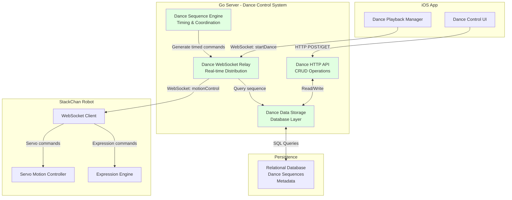
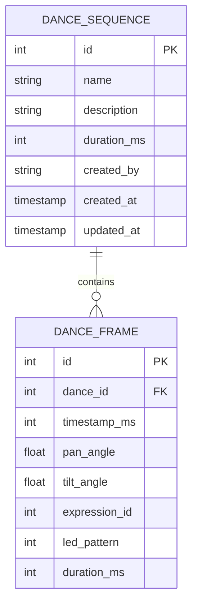
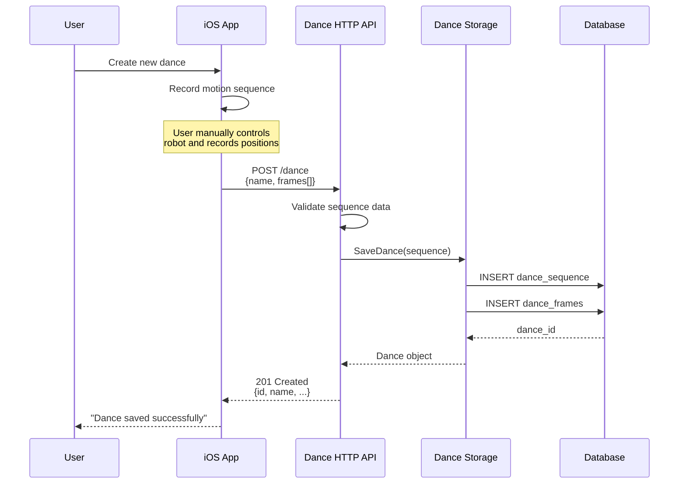
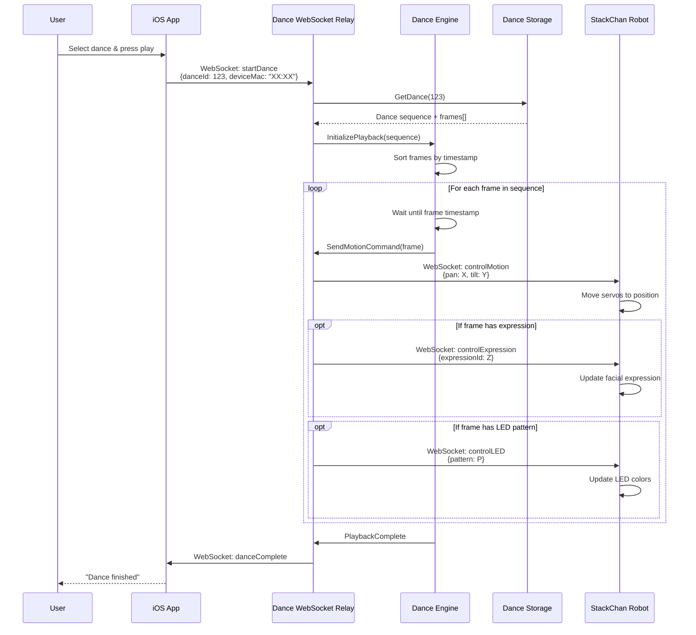
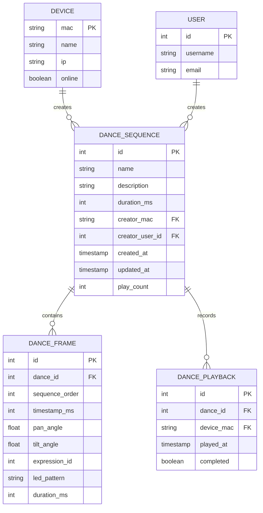
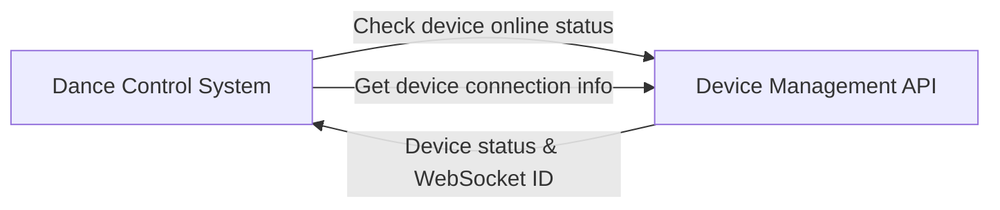
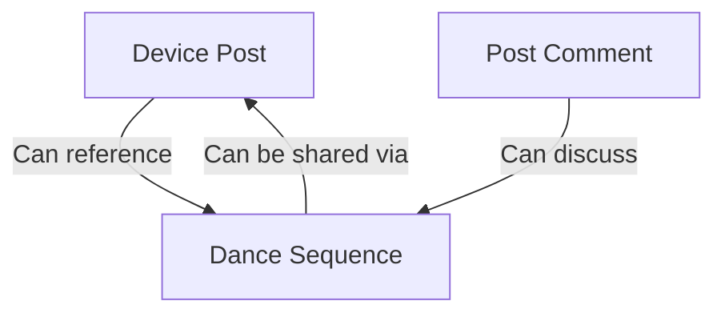
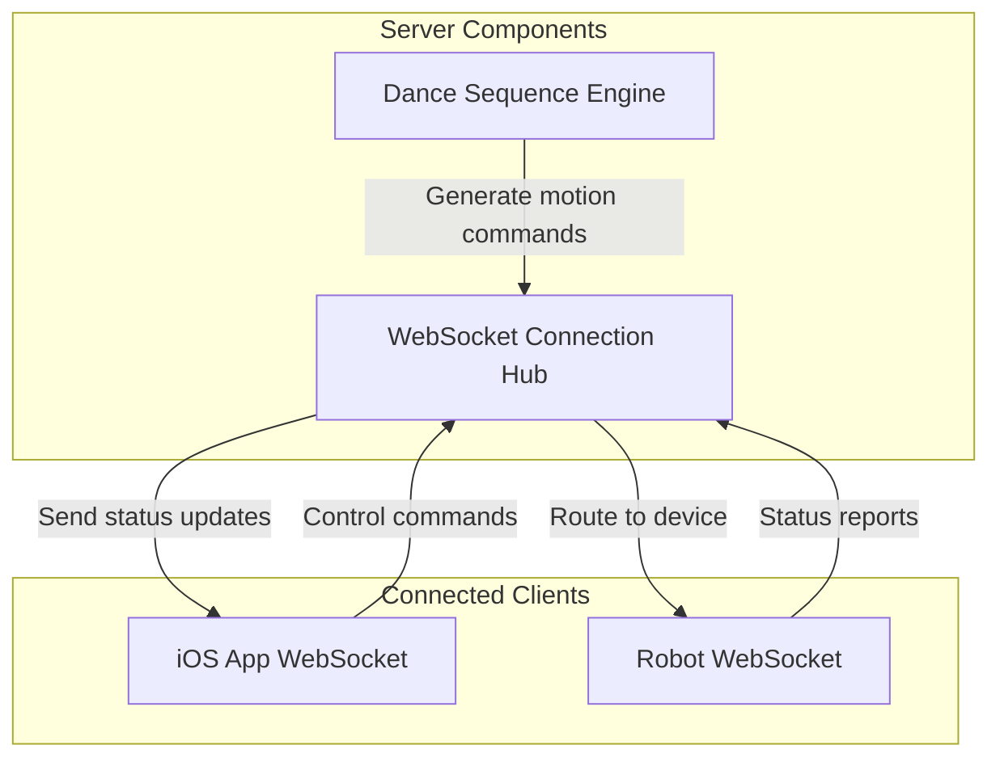

StackChan Dance Control System

# Dance Control System

<details>
<summary>Relevant source files</summary>

The following files were used as context for generating this wiki page:

- [server/README.md](server/README.md)

</details>


## Purpose and Scope

This document describes the Dance Control System provided by the StackChan backend server. This system enables storage, management, and playback of choreographed dance sequences that can be executed by StackChan robots. The dance sequences consist of timed servo movements that create expressive robotic motion patterns.

For information about the servo motion control implementation on the robot firmware, see [Firmware Development](#4). For details about how the iOS app triggers dance playback, see [iOS Application](#5). For the WebSocket protocol used to transmit dance commands in real-time, see [WebSocket Protocol](#7.2).

**Sources:** [server/README.md:1-45]()

---

## System Overview

The Dance Control System serves as a centralized repository and distribution mechanism for robot dance choreography. It operates as part of the Go backend server, providing both storage capabilities and real-time playback coordination between mobile clients and StackChan robots.

The system handles:
- **Dance Data Storage**: Persistent storage of dance sequence definitions
- **Dance Management**: CRUD operations for dance sequences  
- **Playback Coordination**: Real-time distribution of dance commands to connected robots
- **Synchronization**: Coordinating dance playback across multiple components

**Sources:** [server/README.md:13]()

---

## Architecture Components



**Dance Control System Architecture**

The Dance Control System consists of four primary components within the Go server:

| Component | Purpose | Interface |
|-----------|---------|-----------|
| **Dance HTTP API** | Provides REST endpoints for managing dance sequences | HTTP REST |
| **Dance Data Storage** | Handles persistence of dance data in the relational database | Database layer |
| **Dance WebSocket Relay** | Distributes real-time dance commands to connected robots | WebSocket |
| **Dance Sequence Engine** | Processes dance sequences and generates timed servo commands | Internal service |

**Sources:** [server/README.md:10-14]()

---

## Dance Sequence Data Model

A dance sequence consists of a series of timed motion commands that control the robot's servos and expressions. The data structure typically includes:



**Dance Sequence Entity Relationship Model**

### Dance Sequence Attributes

- **id**: Unique identifier for the dance sequence
- **name**: Human-readable name for the dance
- **description**: Optional description of the choreography
- **duration_ms**: Total duration of the dance sequence in milliseconds
- **created_by**: Identifier of the user or device that created the sequence
- **created_at/updated_at**: Timestamps for tracking

### Dance Frame Attributes

Each frame represents a single pose or movement instruction:

- **timestamp_ms**: Time offset from start of dance when this frame executes
- **pan_angle**: Horizontal servo position (-90° to +90°)
- **tilt_angle**: Vertical servo position (-90° to +90°)
- **expression_id**: Reference to facial expression to display
- **led_pattern**: RGB LED configuration for visual effects
- **duration_ms**: How long this pose should be held

**Sources:** [server/README.md:14]()

---

## Data Flow and Interaction Patterns

### Dance Creation Flow



**Dance Creation Sequence Diagram**

**Sources:** [server/README.md:10-14]()

---

### Dance Playback Flow



**Dance Playback Sequence Diagram**

The dance playback process involves retrieving the stored sequence, parsing it into timed commands, and streaming those commands to the robot via WebSocket. The Dance Sequence Engine maintains timing precision by scheduling each frame execution based on its timestamp offset.

**Sources:** [server/README.md:10-14]()

---

## HTTP API Endpoints

The Dance Control System provides RESTful HTTP endpoints for dance management:

| Method | Endpoint | Purpose | Request Body | Response |
|--------|----------|---------|--------------|----------|
| **POST** | `/dance` | Create new dance sequence | `{name, description?, frames[]}` | `201 Created` with dance object |
| **GET** | `/dance/:id` | Retrieve specific dance | None | `200 OK` with dance object |
| **GET** | `/dances` | List all dances | Query params: `?limit=N&offset=M` | `200 OK` with dance array |
| **PUT** | `/dance/:id` | Update dance sequence | `{name?, description?, frames[]?}` | `200 OK` with updated dance |
| **DELETE** | `/dance/:id` | Delete dance sequence | None | `204 No Content` |
| **GET** | `/dance/:id/frames` | Get all frames for a dance | None | `200 OK` with frame array |

### Example Request/Response

**Create Dance Request:**
```
POST /dance
Content-Type: application/json

{
  "name": "Happy Greeting",
  "description": "Friendly wave and head nod",
  "frames": [
    {
      "timestamp_ms": 0,
      "pan_angle": 0,
      "tilt_angle": 0,
      "expression_id": 1,
      "duration_ms": 500
    },
    {
      "timestamp_ms": 500,
      "pan_angle": 30,
      "tilt_angle": -10,
      "expression_id": 1,
      "duration_ms": 300
    },
    {
      "timestamp_ms": 800,
      "pan_angle": -30,
      "tilt_angle": -10,
      "expression_id": 1,
      "duration_ms": 300
    }
  ]
}
```

**Response:**
```
201 Created
Content-Type: application/json

{
  "id": 123,
  "name": "Happy Greeting",
  "description": "Friendly wave and head nod",
  "duration_ms": 1100,
  "created_by": "user_456",
  "created_at": "2024-01-15T10:30:00Z",
  "frame_count": 3
}
```

**Sources:** [server/README.md:11-12]()

---

## WebSocket Dance Commands

The Dance Control System uses WebSocket messages to coordinate real-time dance playback. These messages follow the same binary protocol structure used for other WebSocket communications in the StackChan system.

### Message Types

| Message Type | Value | Purpose | Payload |
|--------------|-------|---------|---------|
| **startDance** | TBD | Initiate dance playback | `{danceId: number, deviceMac: string}` |
| **stopDance** | TBD | Stop current dance | `{deviceMac: string}` |
| **danceStatus** | TBD | Report playback progress | `{danceId: number, frameIndex: number, completed: boolean}` |
| **danceComplete** | TBD | Signal dance has finished | `{danceId: number, deviceMac: string}` |

The actual motion commands during dance playback use the existing `controlMotion` and `controlExpression` message types documented in [Message Types Reference](#7.4).

**Sources:** [server/README.md:10]()

---

## Database Schema

The Dance Control System stores its data in the relational database alongside other StackChan server data:



**Dance Control System Database Schema**

### Key Tables

**`dance_sequence`**: Primary table storing dance metadata
- Includes reference to creator (either device or user)
- Tracks creation/update timestamps and play count statistics

**`dance_frame`**: Stores individual movement frames for each dance
- `sequence_order`: Ensures frames are retrieved in correct order
- Contains all servo position and timing data

**`dance_playback`**: Audit log of dance executions
- Tracks which robots played which dances and when
- Records whether playback completed successfully

**Sources:** [server/README.md:14]()

---

## Integration with Other Systems

### Device Management Integration

The Dance Control System integrates with the Device Management API (see [Device Management API](#6.2)) to:

- Verify that target devices are online before initiating playback
- Associate dance sequences with their creator devices
- Track which devices have played specific dances



**Device Management Integration**

**Sources:** [server/README.md:10-14]()

---

### Social Features Integration

Dances can be shared through the social platform (see [Social Features API](#6.3)):

- Users can attach dance IDs to posts
- Comments can reference and discuss specific dances
- Dance sequences can be discovered through the social feed



**Social Features Integration**

**Sources:** [server/README.md:11-13]()

---

### WebSocket Relay Integration

The Dance Control System utilizes the server's WebSocket relay infrastructure to transmit commands:



**WebSocket Relay Integration**

The Dance Engine generates timed motion commands and feeds them to the WebSocket Hub, which maintains active connections to both mobile apps and robots. The Hub routes dance commands to the appropriate robot based on device MAC address.

**Sources:** [server/README.md:10]()

---

## Performance Considerations

### Timing Precision

Dance playback requires precise timing to create smooth, natural-looking motion. The Dance Sequence Engine implements several strategies to maintain timing accuracy:

1. **Pre-buffering**: Loads the entire sequence into memory before starting playback
2. **Timestamp-based scheduling**: Uses absolute timestamps rather than relative delays
3. **Drift compensation**: Adjusts timing if network latency is detected

### Network Optimization

To minimize latency during playback:

- Commands are sent over WebSocket (low-latency persistent connection)
- Motion commands use binary encoding to reduce message size
- The server can stream commands ahead of execution time for client-side buffering

### Scalability

The system is designed to handle concurrent dance playback:

- Each robot can execute one dance at a time
- Multiple robots can execute different dances simultaneously
- The server maintains separate playback state for each active session

**Sources:** [server/README.md:10-14]()

---

## Error Handling

The Dance Control System implements error handling at multiple levels:

| Error Condition | Detection | Response |
|-----------------|-----------|----------|
| **Device Offline** | Pre-playback check | Return error to iOS app, don't start playback |
| **Invalid Dance ID** | Database lookup | Return 404 Not Found |
| **Malformed Sequence** | Validation on create/update | Return 400 Bad Request with details |
| **WebSocket Disconnection** | Connection monitoring | Stop playback, log incomplete session |
| **Timing Overflow** | Sequence validation | Reject sequences exceeding maximum duration |
| **Servo Angle Limits** | Frame validation | Clamp angles to safe range (-90° to +90°) |

### Validation Rules

When creating or updating dance sequences:

- All frame timestamps must be non-negative and sorted
- Servo angles must be within safe operating range
- Total sequence duration must not exceed system limits
- At least one frame must be present

**Sources:** [server/README.md:13-14]()

---

## Future Enhancements

Based on the system architecture, potential future enhancements could include:

- **Dance Templates**: Pre-built dance sequences for common scenarios
- **Dance Recording**: Real-time capture of manual movements to create sequences
- **Collaborative Dances**: Synchronized multi-robot choreography
- **Music Synchronization**: Timing dances to audio tracks
- **Expression Libraries**: Packaged combinations of motion and facial expressions
- **Community Sharing**: Public dance repository with ratings and downloads

**Sources:** [server/README.md:10-14]()