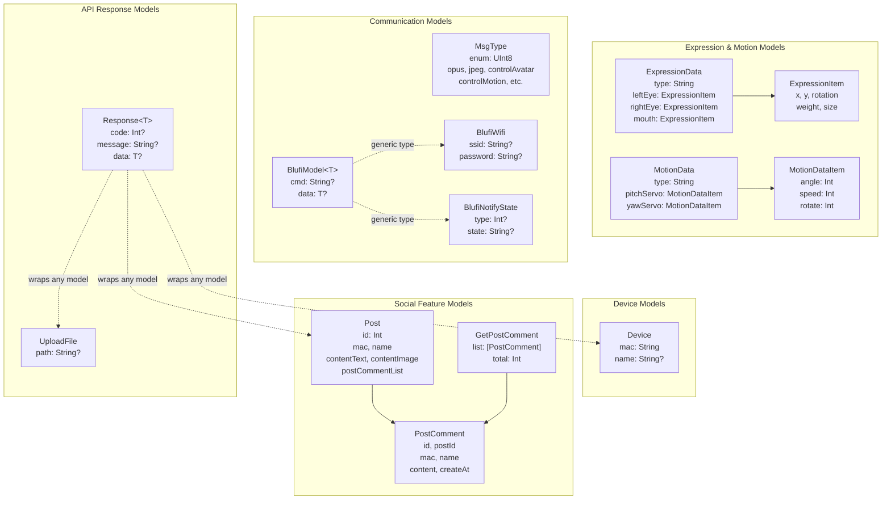
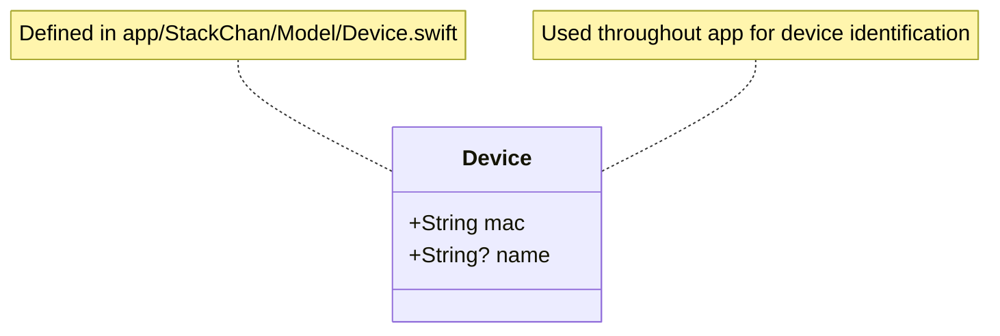
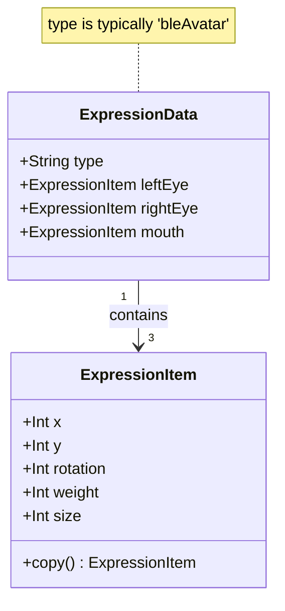
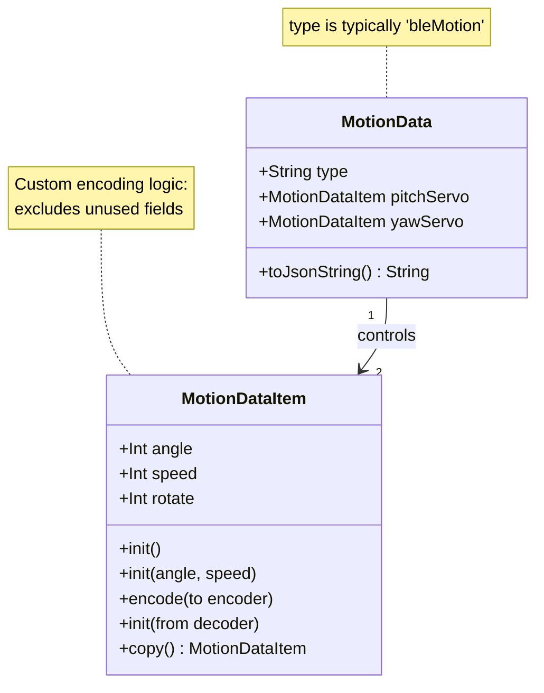
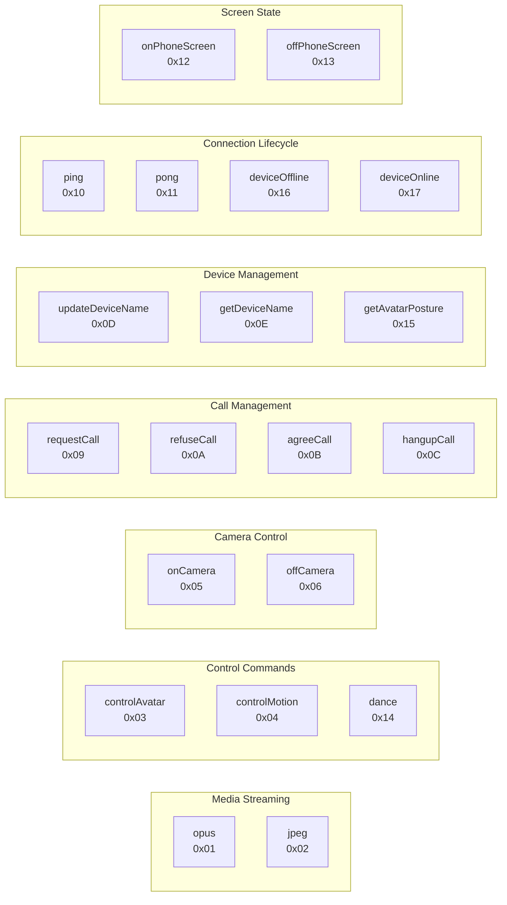
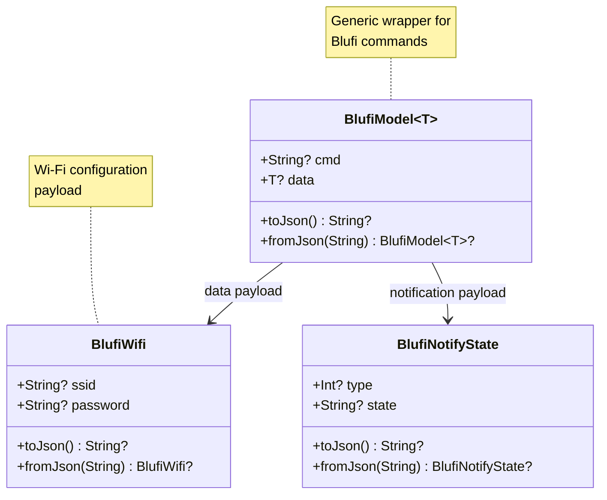
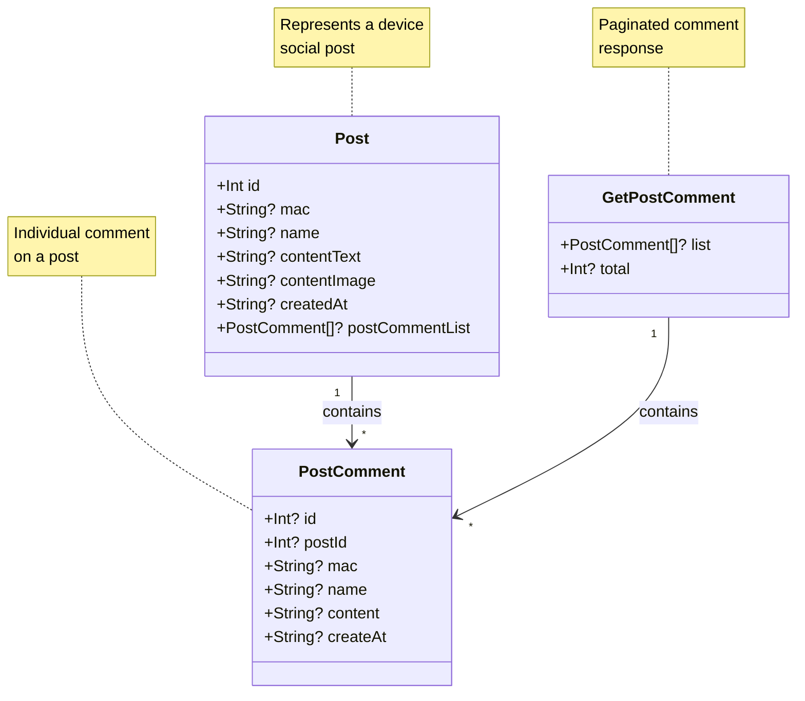
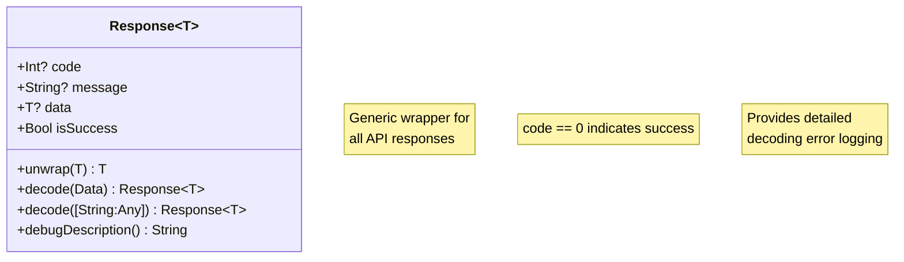
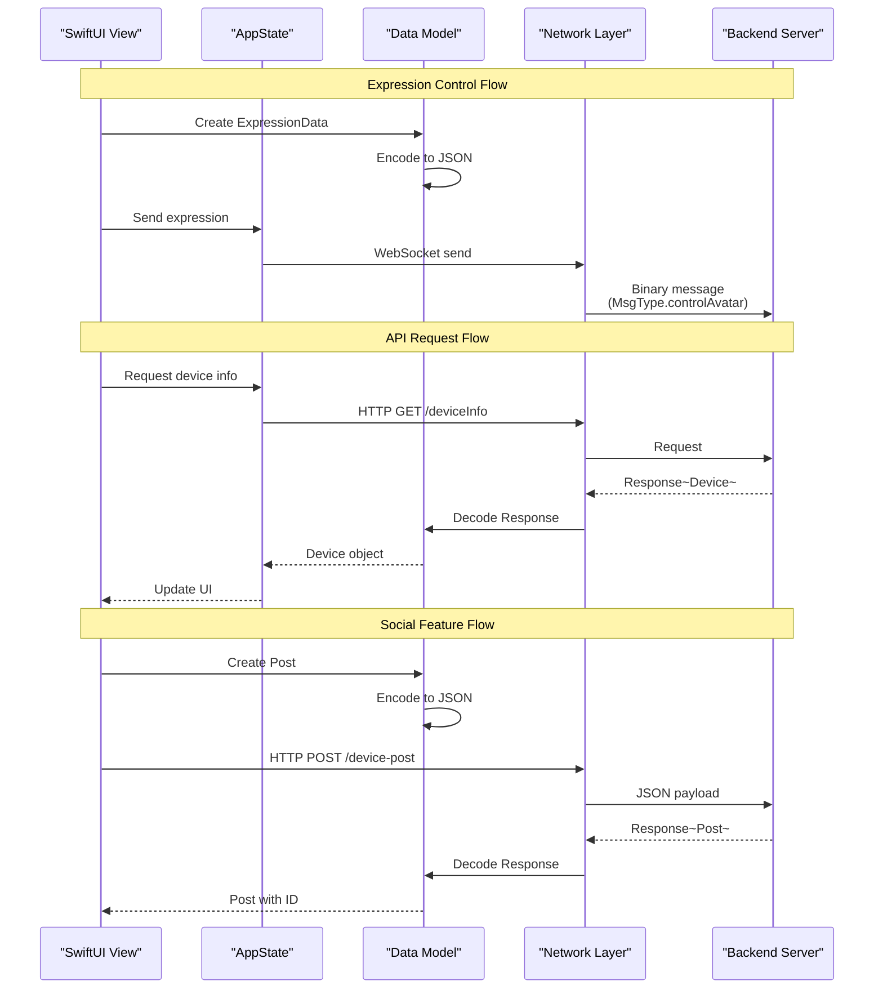

StackChan Data Models

# Data Models

<details>
<summary>Relevant source files</summary>

The following files were used as context for generating this wiki page:

- [app/StackChan/Model/BlufiModel.swift](app/StackChan/Model/BlufiModel.swift)
- [app/StackChan/Model/Device.swift](app/StackChan/Model/Device.swift)
- [app/StackChan/Model/ExpressionData.swift](app/StackChan/Model/ExpressionData.swift)
- [app/StackChan/Model/MessageModel.swift](app/StackChan/Model/MessageModel.swift)
- [app/StackChan/Model/Post.swift](app/StackChan/Model/Post.swift)
- [app/StackChan/Model/Response.swift](app/StackChan/Model/Response.swift)
- [app/StackChan/Model/UploadFile.swift](app/StackChan/Model/UploadFile.swift)

</details>


This page documents the Swift data structures and models used throughout the StackChan iOS application. These models define the data contracts for device representation, communication protocols, expression control, motion control, social features, and API interactions.

For information about how these models are used in application state management, see [Application State Management](#5.3). For details about the communication protocols these models support, see [Communication Protocols](#7).

## Overview

The iOS app uses several categories of Codable data models to represent and serialize data:

| Category | Purpose | Primary Files |
|----------|---------|---------------|
| Device Models | Represent StackChan devices and their identifiers | `Device.swift` |
| Expression & Motion Models | Control facial expressions and servo movements | `ExpressionData.swift` |
| Communication Models | WebSocket message types and Bluetooth protocol data | `MessageModel.swift`, `BlufiModel.swift` |
| Social Feature Models | Posts, comments, and social feed data | `Post.swift` |
| API Response Models | Generic wrappers for server responses | `Response.swift`, `UploadFile.swift` |

All models conform to Swift's `Codable` protocol, enabling automatic JSON encoding and decoding for network communication and data persistence.

**Sources:** [app/StackChan/Model/Device.swift:1-13](), [app/StackChan/Model/ExpressionData.swift:1-101](), [app/StackChan/Model/MessageModel.swift:1-39](), [app/StackChan/Model/BlufiModel.swift:1-63](), [app/StackChan/Model/Post.swift:1-33](), [app/StackChan/Model/Response.swift:1-80]()

## Model Architecture Overview



**Sources:** [app/StackChan/Model/Device.swift:9-12](), [app/StackChan/Model/ExpressionData.swift:9-101](), [app/StackChan/Model/MessageModel.swift:9-39](), [app/StackChan/Model/BlufiModel.swift:9-62](), [app/StackChan/Model/Post.swift:9-32](), [app/StackChan/Model/Response.swift:9-62]()

## Device Models

### Device

The `Device` struct represents a StackChan robot in the iOS app. It serves as the primary identifier for connected and discovered devices.



| Property | Type | Description |
|----------|------|-------------|
| `mac` | `String` | Unique device identifier (MAC address or UUID) |
| `name` | `String?` | Optional user-assigned device name |

The `mac` property is initialized with a UUID string by default, serving as a unique identifier even before the actual MAC address is obtained. The `name` property allows users to assign friendly names to their devices.

**Sources:** [app/StackChan/Model/Device.swift:9-12]()

## Expression and Motion Models

These models control the visual appearance and physical movement of StackChan robots. They are serialized to JSON and sent via WebSocket or Bluetooth to the robot firmware.

### ExpressionData Structure



**ExpressionData** defines the complete facial expression state with three components: left eye, right eye, and mouth. Each component is an `ExpressionItem` with positioning and styling parameters.

| Property | Type | Default | Description |
|----------|------|---------|-------------|
| `type` | `String` | `"bleAvatar"` | Expression message type identifier |
| `leftEye` | `ExpressionItem` | - | Left eye configuration |
| `rightEye` | `ExpressionItem` | - | Right eye configuration |
| `mouth` | `ExpressionItem` | - | Mouth configuration |

**ExpressionItem** defines individual facial feature parameters:

| Property | Type | Default | Description |
|----------|------|---------|-------------|
| `x` | `Int` | `0` | Horizontal position offset |
| `y` | `Int` | `0` | Vertical position offset |
| `rotation` | `Int` | `0` | Rotation angle in degrees |
| `weight` | `Int` | `0` | Line weight/thickness |
| `size` | `Int` | `0` | Size scale factor |

The `copy()` method creates a deep copy of an `ExpressionItem` for state manipulation without side effects.

**Sources:** [app/StackChan/Model/ExpressionData.swift:9-32]()

### MotionData Structure



**MotionData** controls the two servo motors that move StackChan's head:

| Property | Type | Default | Description |
|----------|------|---------|-------------|
| `type` | `String` | `"bleMotion"` | Motion message type identifier |
| `pitchServo` | `MotionDataItem` | - | Vertical tilt control (up/down) |
| `yawServo` | `MotionDataItem` | - | Horizontal rotation control (left/right) |

The `toJsonString()` method serializes the motion data to JSON format for transmission.

**MotionDataItem** defines servo movement parameters:

| Property | Type | Default | Description |
|----------|------|---------|-------------|
| `angle` | `Int` | `0` | Absolute angle position (degrees) |
| `speed` | `Int` | `500` | Movement speed (milliseconds) |
| `rotate` | `Int` | `0` | Relative rotation amount |

The model implements custom encoding logic [app/StackChan/Model/ExpressionData.swift:72-85]() to optimize the JSON payload. When `angle` is set, it encodes `angle` and `speed`. When `rotate` is set, it encodes `rotate` and `speed`. This prevents sending unnecessary zero values.

**Sources:** [app/StackChan/Model/ExpressionData.swift:34-100]()

## Communication Models

### Message Types

The `MsgType` enum defines all message types exchanged via WebSocket between the iOS app, server, and robot devices.



Each message type is represented as a `UInt8` raw value for efficient binary protocol transmission. The complete enumeration [app/StackChan/Model/MessageModel.swift:9-39]() includes:

| Category | Message Types | Purpose |
|----------|---------------|---------|
| **Media** | `opus` (0x01), `jpeg` (0x02) | Audio and video streaming data |
| **Control** | `controlAvatar` (0x03), `controlMotion` (0x04), `dance` (0x14) | Robot expression and movement commands |
| **Camera** | `onCamera` (0x05), `offCamera` (0x06) | Camera activation control |
| **Text** | `textMessage` (0x07) | Chat messages |
| **Calls** | `requestCall` (0x09), `refuseCall` (0x0A), `agreeCall` (0x0B), `hangupCall` (0x0C) | Video call session management |
| **Device Info** | `updateDeviceName` (0x0D), `getDeviceName` (0x0E), `getAvatarPosture` (0x15) | Device information queries and updates |
| **Keepalive** | `ping` (0x10), `pong` (0x11) | Connection health monitoring |
| **Screen** | `onPhoneScreen` (0x12), `offPhoneScreen` (0x13) | Phone screen state notifications |
| **Status** | `deviceOffline` (0x16), `deviceOnline` (0x17) | Device connection status |

These message types are used in the binary WebSocket protocol documented in [WebSocket Protocol](#7.2).

**Sources:** [app/StackChan/Model/MessageModel.swift:9-39]()

### Blufi Protocol Models

The Blufi models support Bluetooth LE communication for initial device configuration, particularly Wi-Fi credential provisioning.



**BlufiModel&lt;T&gt;** is a generic wrapper for Blufi protocol messages:

| Property | Type | Description |
|----------|------|-------------|
| `cmd` | `String?` | Command identifier for the Blufi operation |
| `data` | `T?` | Generic payload data (type varies by command) |

Both `toJson()` and `fromJson()` methods support JSON serialization for transmission over Bluetooth characteristics.

**BlufiWifi** carries Wi-Fi network credentials:

| Property | Type | Description |
|----------|------|-------------|
| `ssid` | `String?` | Wi-Fi network name |
| `password` | `String?` | Wi-Fi network password |

**BlufiNotifyState** represents state notifications from the robot:

| Property | Type | Description |
|----------|------|-------------|
| `type` | `Int?` | Notification type code |
| `state` | `String?` | State description or status message |

These models are used during the device pairing and Wi-Fi configuration process described in [Bluetooth LE (Blufi Protocol)](#7.1).

**Sources:** [app/StackChan/Model/BlufiModel.swift:9-62]()

## Social Feature Models

These models support the social networking features of the StackChan app, including posts, comments, and feeds.

### Post and Comment Structure



**Post** represents a social media post created by a StackChan device:

| Property | Type | Description |
|----------|------|-------------|
| `id` | `Int` | Unique post identifier |
| `mac` | `String?` | MAC address of the device that created the post |
| `name` | `String?` | Display name of the device |
| `contentText` | `String?` | Text content of the post |
| `contentImage` | `String?` | URL or path to post image |
| `createdAt` | `String?` | ISO timestamp of post creation |
| `postCommentList` | `[PostComment]?` | Array of comments on this post |

**PostComment** represents a comment on a post:

| Property | Type | Description |
|----------|------|-------------|
| `id` | `Int?` | Unique comment identifier |
| `postId` | `Int?` | ID of the parent post |
| `mac` | `String?` | MAC address of the commenting device |
| `name` | `String?` | Display name of the commenting device |
| `content` | `String?` | Comment text content |
| `createAt` | `String?` | ISO timestamp of comment creation |

**GetPostComment** wraps paginated comment query results:

| Property | Type | Description |
|----------|------|-------------|
| `list` | `[PostComment]?` | Array of comment objects |
| `total` | `Int?` | Total count of comments (for pagination) |

These models are used with the HTTP REST endpoints documented in [Social Features API](#6.3).

**Sources:** [app/StackChan/Model/Post.swift:9-32]()

## API Response Models

### Generic Response Wrapper

The `Response<T>` generic struct wraps all HTTP API responses from the backend server, providing consistent error handling and data extraction.



| Property | Type | Description |
|----------|------|-------------|
| `code` | `Int?` | Response status code (0 = success) |
| `message` | `String?` | Human-readable status or error message |
| `data` | `T?` | Generic payload data (type varies by endpoint) |

**Computed Properties and Methods:**

- `isSuccess` - Returns `true` when `code == 0`, simplifying success checking
- `unwrap(or:)` - Safely extracts `data` or returns a default value
- `decode(from:)` - Static methods for JSON decoding with detailed error logging [app/StackChan/Model/Response.swift:22-57]()

The decode implementation uses `JSONDecoder` with `convertFromSnakeCase` strategy and provides comprehensive error logging including:
- Data corruption context
- Missing key information
- Type mismatch details
- Full JSON pretty-printing for debugging

This wrapper enables consistent error handling throughout the app when making HTTP requests to endpoints like `/deviceInfo`, `/device-post`, and `/comment`.

**Sources:** [app/StackChan/Model/Response.swift:9-79]()

### UploadFile

The `UploadFile` struct represents the server's response after a successful file upload operation.

| Property | Type | Description |
|----------|------|-------------|
| `path` | `String?` | Server-side path or URL of the uploaded file |

This model is typically wrapped in `Response<UploadFile>` when returned from file upload endpoints.

**Sources:** [app/StackChan/Model/UploadFile.swift:7-9]()

## Model Usage Patterns

### Data Flow in Communication



### Codable Protocol Usage

All models implement Swift's `Codable` protocol (combination of `Encodable` and `Decodable`), enabling:

1. **JSON Serialization** - Models can be encoded to JSON strings using `JSONEncoder`
2. **JSON Deserialization** - Models can be decoded from JSON data using `JSONDecoder`
3. **Type Safety** - Compile-time verification of data structure consistency
4. **Automatic Mapping** - Property names automatically map to JSON keys

Example encoding pattern seen in `MotionData`:
```swift
let encoder = JSONEncoder()
if let jsonData = try? encoder.encode(self),
   let jsonString = String(data: jsonData, encoding: .utf8) {
    return jsonString
}
```

Example decoding pattern seen in `Response<T>`:
```swift
let decoder = JSONDecoder()
decoder.keyDecodingStrategy = .convertFromSnakeCase
return try decoder.decode(Response<T>.self, from: jsonData)
```

The `convertFromSnakeCase` strategy automatically converts server-side snake_case field names (e.g., `created_at`) to Swift camelCase property names (e.g., `createdAt`).

**Sources:** [app/StackChan/Model/ExpressionData.swift:39-46](), [app/StackChan/Model/Response.swift:22-26]()

### Custom Encoding Logic

Some models implement custom encoding behavior to optimize data transmission. For example, `MotionDataItem` [app/StackChan/Model/ExpressionData.swift:72-85]() selectively encodes properties:

- When `angle` is non-zero: encodes `angle` and `speed`
- When `rotate` is non-zero: encodes `rotate` and `speed`
- Otherwise: encodes `angle` and `speed` with default values

This optimization reduces JSON payload size when transmitting motion commands over WebSocket connections.

**Sources:** [app/StackChan/Model/ExpressionData.swift:66-92]()