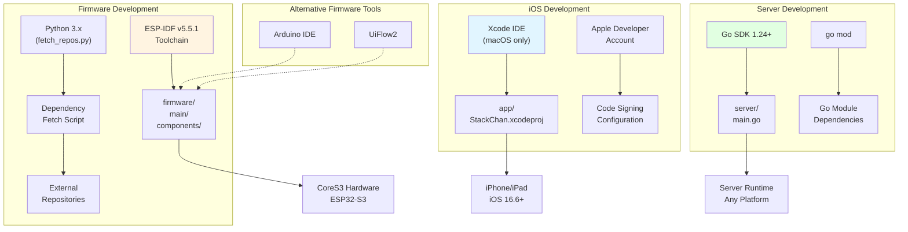
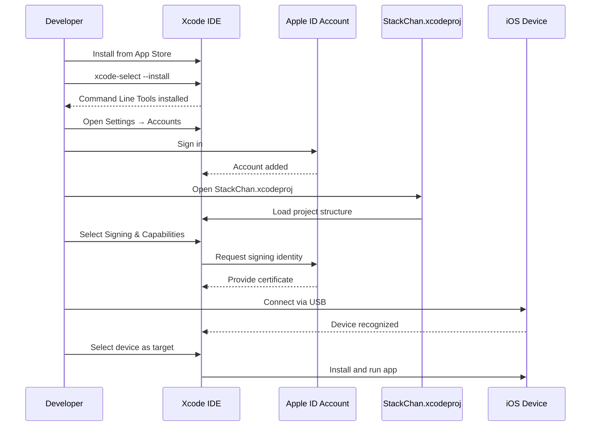
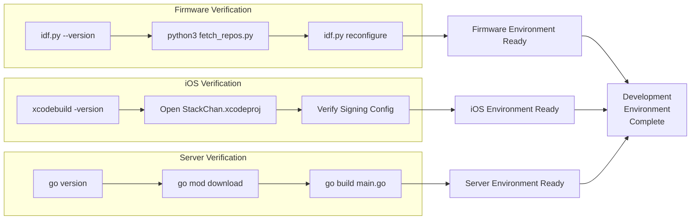
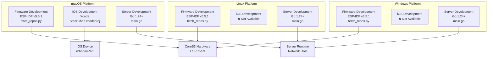

StackChan Development Environment Setup

# Development Environment Setup

<details>
<summary>Relevant source files</summary>

The following files were used as context for generating this wiki page:

- [app/README.md](app/README.md)
- [firmware/README.md](firmware/README.md)
- [server/README.md](server/README.md)

</details>


## Purpose and Scope

This page provides comprehensive instructions for setting up a complete development environment for StackChan. It covers the installation and configuration of all required tools and dependencies for developing the firmware, iOS application, and backend server. 

For instructions on building the components after setup is complete, see [Building All Components](#8.2). For network configuration between components, see [Network Configuration](#8.3).

---

## Overview of Development Environments

StackChan consists of three distinct components, each requiring its own development environment and toolchain:

| Component | Primary Language | Required Toolchain | Platform Support |
|-----------|-----------------|-------------------|------------------|
| Firmware | C/C++ | ESP-IDF v5.5.1 | Linux, macOS, Windows |
| iOS App | Swift/SwiftUI | Xcode | macOS only |
| Server | Go | Go SDK 1.24+ | Linux, macOS, Windows |

The following diagram illustrates the relationship between development tools and the components they build:

**Diagram: Development Toolchain Architecture**



Sources: [firmware/README.md:1-26](), [app/README.md:1-63](), [server/README.md:1-45]()

---

## Firmware Development Environment

The firmware runs on ESP32-S3 hardware and is built using the ESP-IDF framework.

### Prerequisites

- **Python 3.x**: Required for ESP-IDF build tools and the dependency fetch script
- **Git**: Required for cloning the repository and fetching external dependencies
- **USB Driver**: For flashing firmware to CoreS3 via USB-C (varies by platform)

### Installing ESP-IDF v5.5.1

The StackChan firmware requires ESP-IDF version 5.5.1 specifically.

#### Linux and macOS

```bash
# Install ESP-IDF prerequisites
sudo apt-get install git wget flex bison gperf python3 python3-pip python3-venv cmake ninja-build ccache libffi-dev libssl-dev dfu-util libusb-1.0-0  # Debian/Ubuntu
# or
brew install cmake ninja dfu-util  # macOS

# Clone ESP-IDF
mkdir -p ~/esp
cd ~/esp
git clone -b v5.5.1 --recursive https://github.com/espressif/esp-idf.git

# Install and setup
cd ~/esp/esp-idf
./install.sh esp32s3

# Add to shell profile (~/.bashrc, ~/.zshrc, etc.)
alias get_idf='. $HOME/esp/esp-idf/export.sh'
```

#### Windows

```powershell
# Download and run ESP-IDF Windows installer
# https://dl.espressif.com/dl/esp-idf/

# The installer provides ESP-IDF v5.5.1 option
# Install with ESP32-S3 support
```

### Fetching Firmware Dependencies

The firmware project uses external dependencies managed by a Python script:

```bash
cd StackChan/firmware
python3 ./fetch_repos.py
```

The `fetch_repos.py` script clones required external repositories into the project structure.

### Verifying Firmware Environment

```bash
# Activate ESP-IDF environment
get_idf  # or run export.sh

# Verify IDF version
idf.py --version
# Expected: ESP-IDF v5.5.1

# Navigate to firmware directory
cd StackChan/firmware

# Test build configuration
idf.py reconfigure
```

Sources: [firmware/README.md:6-14]()

---

## iOS Application Development Environment

The iOS application is built using Xcode and requires macOS.

### Prerequisites

- **macOS**: Xcode only runs on macOS (version compatible with Xcode 14.0+)
- **Apple Developer Account**: Free account sufficient for device testing
- **iOS Device** (optional but recommended): iPhone or iPad running iOS 16.6 or later

### Installing Xcode

1. Install Xcode from the Mac App Store or download from [developer.apple.com](https://developer.apple.com/xcode/)
2. Install Command Line Tools:

```bash
xcode-select --install
```

3. Open Xcode and complete first-run setup
4. Accept license agreement

### Configuring Apple Developer Account

Add your Apple ID to Xcode for code signing:

1. Open Xcode → Settings (or Preferences)
2. Navigate to **Accounts** tab
3. Click **+** button to add Apple Account
4. Sign in with your Apple ID credentials
5. Verify your account appears in the list

**Diagram: iOS Development Setup Flow**



Sources: [app/README.md:28-40]()

### Setting Up iOS Project

```bash
# Clone repository
git clone https://github.com/m5stack/StackChan
cd StackChan/app

# Open project in Xcode
open StackChan.xcodeproj
```

The project file `StackChan.xcodeproj` contains all build settings and configurations.

### Configuring Code Signing

Code signing is required to install the app on physical devices:

1. In Xcode, select the project in the left sidebar
2. Select the **StackChan** target
3. Open **Signing & Capabilities** tab
4. Set **Team** to your Apple ID account
5. Change **Bundle Identifier** to a unique value (e.g., `com.yourname.stackchan`)
6. Ensure **Automatically manage signing** is enabled
7. Verify no red error messages appear

### Enabling Developer Mode (iOS 16+)

For iOS 16 and later, Developer Mode must be enabled on the device:

1. Connect iPhone to Mac via USB cable
2. Unlock iPhone and tap **Trust This Computer**
3. In Xcode, select iPhone as run destination
4. On iPhone, go to **Settings → Privacy & Security → Developer Mode**
5. Enable Developer Mode and restart device
6. Confirm enabling Developer Mode after restart

Sources: [app/README.md:9-27](), [app/README.md:28-40]()

---

## Server Development Environment

The backend server is written in Go and can be developed on any platform.

### Installing Go SDK

The server requires Go version 1.24 or later.

#### Linux

```bash
# Download Go
wget https://go.dev/dl/go1.24.0.linux-amd64.tar.gz

# Extract and install
sudo rm -rf /usr/local/go
sudo tar -C /usr/local -xzf go1.24.0.linux-amd64.tar.gz

# Add to PATH in ~/.bashrc or ~/.zshrc
export PATH=$PATH:/usr/local/go/bin
export GOPATH=$HOME/go
export PATH=$PATH:$GOPATH/bin

# Reload shell configuration
source ~/.bashrc
```

#### macOS

```bash
# Using Homebrew
brew install go@1.24

# Or download from https://go.dev/dl/
```

#### Windows

```powershell
# Download installer from https://go.dev/dl/
# Run the .msi installer
# Add to PATH (usually done automatically)
```

### Verifying Go Installation

```bash
go version
# Expected output: go version go1.24.x ...
```

### Setting Up Server Project

```bash
cd StackChan/server

# Download Go module dependencies
go mod download

# Verify dependencies
go mod verify
```

The `go.mod` file at [server/go.mod]() defines all required dependencies. The `go mod download` command fetches these packages from their respective repositories.

### Testing Server Build

```bash
cd StackChan/server

# Build the server binary
go build -o StackChan main.go

# Verify binary was created
ls -lh StackChan      # Linux/macOS
dir StackChan.exe     # Windows
```

Sources: [server/README.md:20-45]()

---

## Alternative Firmware Development Options

In addition to ESP-IDF, StackChan firmware can be developed using alternative tools. For details, see [Programming with Arduino and UiFlow2](#4.4).

### Arduino IDE

The Arduino IDE provides a simplified development environment with a graphical interface.

**Setup:**
1. Install Arduino IDE 2.0 or later
2. Add ESP32 board support via Board Manager
3. Install required libraries through Library Manager
4. Select "M5Stack CoreS3" as the board

### UiFlow2

UiFlow2 is a visual programming environment for block-based firmware development.

**Setup:**
1. Access UiFlow2 at https://uiflow2.m5stack.com/
2. Connect CoreS3 hardware via USB
3. Use web-based interface for visual programming
4. Flash firmware directly from browser

---

## Development Environment Verification

After setting up all components, verify each environment is working correctly.

**Diagram: Environment Verification Workflow**



Sources: [firmware/README.md:1-26](), [app/README.md:1-63](), [server/README.md:1-45]()

### Verification Commands

Run these commands to verify each environment:

```bash
# Firmware Environment
cd StackChan/firmware
source ~/esp/esp-idf/export.sh  # Activate ESP-IDF
idf.py --version
python3 ./fetch_repos.py
idf.py reconfigure

# iOS Environment  
xcodebuild -version
cd StackChan/app
open StackChan.xcodeproj

# Server Environment
go version
cd StackChan/server
go mod download
go mod verify
go build -o StackChan main.go
```

---

## Common Tools

Several tools are used across multiple components:

| Tool | Purpose | Used By |
|------|---------|---------|
| **Git** | Version control | All components |
| **Python 3** | Build scripts, ESP-IDF tools | Firmware |
| **USB Driver** | Device communication | Firmware (flashing), iOS (debugging) |
| **Text Editor/IDE** | Code editing | All components (optional alternatives to primary IDEs) |

### Git Configuration

```bash
# Configure Git identity
git config --global user.name "Your Name"
git config --global user.email "your.email@example.com"

# Clone the repository
git clone https://github.com/m5stack/StackChan
cd StackChan

# Check repository structure
ls -la
# Expected: app/, firmware/, server/, README.md, etc.
```

---

## Platform-Specific Considerations

### macOS

- **Complete Development**: macOS can build all three components
- **Xcode**: Only available on macOS, required for iOS development
- **Homebrew**: Recommended for installing tools (`brew install cmake go python3`)
- **USB-C Driver**: Usually built-in, no additional driver needed for CoreS3

### Linux

- **Firmware and Server**: Full support for firmware and server development
- **iOS Development**: Not possible (Xcode unavailable on Linux)
- **USB Permissions**: May need to add user to `dialout` group for device access
- **Dependencies**: Install via package manager (`apt`, `yum`, `pacman`, etc.)

```bash
# Add user to dialout group for USB access
sudo usermod -a -G dialout $USER
# Log out and back in for changes to take effect
```

### Windows

- **All Components**: Can develop firmware and server; iOS requires macOS
- **ESP-IDF**: Use official Windows installer for simplified setup
- **Go Installation**: Use MSI installer from go.dev
- **USB Driver**: May need to install CP210x driver for CoreS3 USB connection
- **Path Configuration**: Ensure tools are added to system PATH

**Diagram: Platform Capability Matrix**



Sources: [firmware/README.md:12-13](), [app/README.md:9-12](), [server/README.md:20-23]()

---

## Directory Structure After Setup

After completing the environment setup and cloning the repository, your directory structure should contain:

```
StackChan/
├── firmware/          # ESP-IDF firmware project
│   ├── main/         # Main application code
│   ├── components/   # Custom components
│   ├── fetch_repos.py # Dependency fetch script
│   └── CMakeLists.txt
├── app/              # iOS application
│   ├── StackChan.xcodeproj  # Xcode project file
│   ├── Models/       # Swift data models
│   ├── Views/        # SwiftUI views
│   └── Network/      # Networking code
└── server/           # Go backend server
    ├── main.go       # Server entry point
    ├── go.mod        # Go module definition
    └── go.sum        # Dependency checksums
```

---

## Next Steps

With the development environment configured, you can proceed to:

1. **Build Components**: Follow [Building All Components](#8.2) to compile each component from source
2. **Configure Networking**: Set up communication between components using [Network Configuration](#8.3)
3. **Firmware Development**: Review [Development Setup](#4.2) for firmware-specific configuration
4. **iOS Development**: See [Getting Started with the iOS App](#5.1) for app-specific workflows

Sources: [firmware/README.md:1-26](), [app/README.md:1-63](), [server/README.md:1-45]()