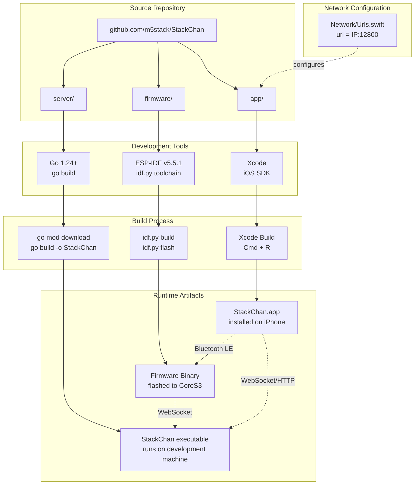
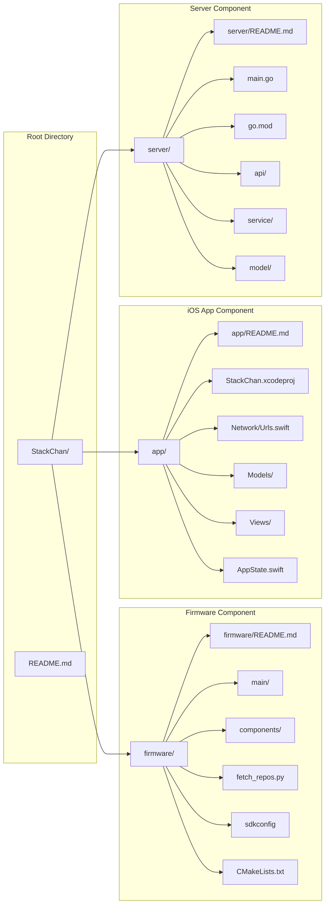
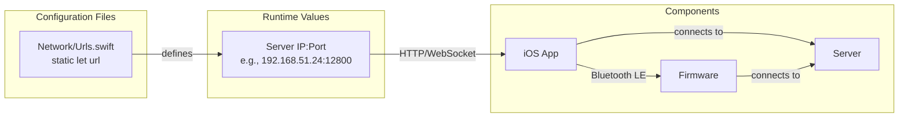
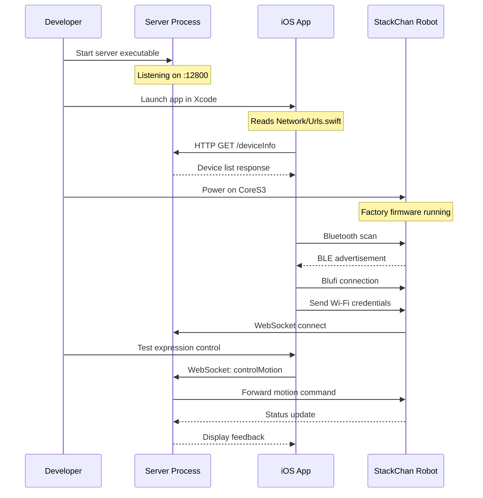

StackChan Development Guide

# Development Guide

<details>
<summary>Relevant source files</summary>

The following files were used as context for generating this wiki page:

- [README.md](README.md)
- [app/README.md](app/README.md)
- [firmware/README.md](firmware/README.md)
- [server/README.md](server/README.md)

</details>


## Purpose and Scope

This guide provides comprehensive instructions for developers who want to contribute to or customize the StackChan system. It covers the complete development workflow across all three major components: embedded firmware, iOS application, and backend server.

For specific setup instructions for individual components, see:
- Firmware development environment and ESP-IDF toolchain: [Development Setup](#4.2)
- iOS app project configuration and Xcode setup: [Getting Started with the iOS App](#5.1)
- Server deployment and runtime configuration: [Server Setup and Deployment](#6.1)

For communication protocol details needed during development, see [Communication Protocols](#7).

**Sources:** [README.md:1-22](), [app/README.md:1-63](), [firmware/README.md:1-26](), [server/README.md:1-45]()

## Development Workflow Overview

The StackChan development process involves three parallel development streams that ultimately integrate into a cohesive system. Each component can be developed and tested independently, but full system testing requires all components to be running and properly configured.

### Development Workflow Diagram



**Sources:** [README.md:1-22](), [firmware/README.md:1-26](), [app/README.md:1-63](), [server/README.md:1-45]()

## Repository Structure and Code Organization

The StackChan repository is organized into three primary directories, each containing a complete, buildable component with its own build system and dependencies.

### Repository Structure Diagram



**Sources:** [README.md:1-22](), [firmware/README.md:1-26](), [app/README.md:1-63](), [server/README.md:1-45]()

### Component Directory Structure

| Component | Directory | Description | Build System | Primary Language |
|-----------|-----------|-------------|--------------|------------------|
| Firmware | `firmware/` | ESP32-S3 embedded firmware | ESP-IDF CMake | C/C++ |
| iOS App | `app/` | Mobile application | Xcode | Swift/SwiftUI |
| Server | `server/` | Backend server | Go modules | Go |

**Sources:** [README.md:1-22]()

## Prerequisites and Required Tools

### Tool Requirements by Component

| Tool | Version | Component | Purpose |
|------|---------|-----------|---------|
| ESP-IDF | v5.5.1 | Firmware | ESP32-S3 toolchain and build system |
| Python | 3.x | Firmware | Dependency fetching (`fetch_repos.py`) |
| Xcode | Latest | iOS App | iOS development and device deployment |
| macOS | Latest | iOS App | Required for Xcode and iOS development |
| Go | 1.24+ | Server | Server compilation and runtime |
| Git | Any | All | Version control and repository cloning |

**Sources:** [firmware/README.md:13-13](), [server/README.md:22-23](), [app/README.md:1-63]()

### Hardware Requirements

For complete development and testing:

- **Development Machine**: macOS (for iOS development), Linux/Windows/macOS (for server and firmware)
- **StackChan Robot**: CoreS3 hardware with ESP32-S3 SoC
- **iOS Device**: iPhone or iPad running iOS 16.6+ (optional but recommended for testing)
- **USB-C Cable**: For firmware flashing to CoreS3

**Sources:** [README.md:11-13](), [app/README.md:16-26]()

## Quick Start Guide

### Step 1: Clone the Repository

```bash
git clone https://github.com/m5stack/StackChan
cd StackChan
```

**Sources:** [app/README.md:4-7](), [server/README.md:33-34]()

### Step 2: Build Each Component

The build process for each component is independent. The following diagram shows the parallel build workflow:

```mermaid
graph TB
    subgraph "Firmware Build"
        fw_clone["cd firmware/"]
        fw_deps["python3 ./fetch_repos.py"]
        fw_build["idf.py build"]
        fw_flash["idf.py flash"]
    end
    
    subgraph "iOS App Build"
        app_open["Open app/StackChan.xcodeproj"]
        app_sign["Configure Signing & Capabilities"]
        app_config["Edit Network/Urls.swift<br/>Set server IP"]
        app_run["Cmd + R to build and run"]
    end
    
    subgraph "Server Build"
        server_cd["cd server/"]
        server_deps["go mod download"]
        server_build["go build -o StackChan main.go"]
        server_run["./StackChan"]
    end
    
    fw_clone --> fw_deps
    fw_deps --> fw_build
    fw_build --> fw_flash
    
    app_open --> app_sign
    app_sign --> app_config
    app_config --> app_run
    
    server_cd --> server_deps
    server_deps --> server_build
    server_build --> server_run
```



**Sources:** [firmware/README.md:1-26](), [app/README.md:1-63](), [server/README.md:1-45]()

#### Firmware Build Steps

```bash
cd firmware
python3 ./fetch_repos.py
idf.py build
idf.py flash
```

The `fetch_repos.py` script downloads required ESP-IDF component dependencies before the build process begins.

**Sources:** [firmware/README.md:5-25]()

#### Server Build Steps

```bash
cd server
go mod download
go build -o StackChan main.go
./StackChan        # Linux/macOS
StackChan.exe      # Windows
```

**Sources:** [server/README.md:32-45]()

#### iOS App Build Steps

1. Open `app/StackChan.xcodeproj` in Xcode
2. Configure signing in **Signing & Capabilities** tab
3. Set your Apple ID as the **Team**
4. Change **Bundle Identifier** to a unique value (e.g., `com.yourname.stackchan`)
5. Modify `Network/Urls.swift` to set server IP address
6. Press `Cmd + R` to build and run

**Sources:** [app/README.md:9-63]()

## Network Configuration Requirements

All three components must be configured to communicate on the same network. The primary configuration point is the server IP address, which must be set in the iOS app before deployment.

### Network Configuration Points



**Sources:** [app/README.md:42-52]()

### Configuring Server IP in iOS App

The server IP address is configured in [app/Network/Urls.swift:49]():

```swift
static let url = "192.168.51.24:12800/"
```

Replace `192.168.51.24` with the IP address of the machine running the server. The port number `12800` is the default server listening port.

**Sources:** [app/README.md:42-52]()

## Component-Specific Development Workflows

### Firmware Development Workflow

The firmware uses ESP-IDF v5.5.1 as its build system. The standard ESP-IDF commands are used for building and flashing:

| Command | Purpose |
|---------|---------|
| `idf.py build` | Compiles the firmware |
| `idf.py flash` | Flashes firmware to CoreS3 via USB-C |
| `idf.py monitor` | Opens serial monitor for debugging |
| `idf.py menuconfig` | Opens configuration menu |
| `idf.py flash monitor` | Flashes and immediately opens monitor |

**Sources:** [firmware/README.md:15-25]()

### iOS App Development Workflow

The iOS app is built using Xcode with standard iOS development practices:

1. **Open Project**: Double-click `StackChan.xcodeproj` or use Xcode → File → Open
2. **Select Target**: Choose iPhone simulator or connected physical device
3. **Configure Signing**: Set Apple ID as team in Signing & Capabilities
4. **Modify Bundle ID**: Must be unique for installation on physical device
5. **Build and Run**: Press `Cmd + R`

For first-time deployment to a physical iPhone, Developer Mode must be enabled and the developer profile must be trusted on the device.

**Sources:** [app/README.md:9-63]()

### Server Development Workflow

The server is a standard Go application built with Go modules:

```bash
# Download dependencies
go mod download

# Build executable
go build -o StackChan main.go

# Run server
./StackChan
```

The server listens on port `12800` by default and provides HTTP REST APIs and WebSocket endpoints for device communication.

**Sources:** [server/README.md:32-45]()

## Testing the Complete System

### System Integration Test Flow



**Sources:** [README.md:1-22](), [app/README.md:1-63]()

### Verification Checklist

- [ ] Server is running and accessible at configured IP:Port
- [ ] iOS app successfully connects to server (check HTTP requests)
- [ ] Robot appears in Bluetooth scan results
- [ ] Robot successfully connects to Wi-Fi network
- [ ] WebSocket connection established between robot and server
- [ ] Expression and motion commands work from iOS app
- [ ] Video stream appears in iOS app
- [ ] Social features (posts, comments) function correctly

**Sources:** [README.md:15-19]()

## Development Tools and Utilities

### ESP-IDF Python Scripts

The firmware directory includes Python utility scripts:

- **fetch_repos.py**: Downloads ESP-IDF component dependencies before building

This script must be run before the first build to fetch required components.

**Sources:** [firmware/README.md:5-9]()

### Xcode Configuration

Key Xcode settings for development:

- **Target Device**: Select physical iPhone or simulator
- **Signing & Capabilities**: Configure Apple ID and team
- **Bundle Identifier**: Must be unique (e.g., `com.yourname.stackchan`)
- **Developer Mode**: Must be enabled on iOS 16+ devices

**Sources:** [app/README.md:28-40]()

### Go Module Management

The server uses Go modules for dependency management:

```bash
# View dependencies
go list -m all

# Update dependencies
go get -u

# Tidy and verify
go mod tidy
go mod verify
```

**Sources:** [server/README.md:36-37]()

## Common Development Scenarios

### Scenario 1: Modifying Firmware Behavior

1. Edit source files in `firmware/main/` or `firmware/components/`
2. Run `idf.py build` to compile
3. Run `idf.py flash` to deploy to CoreS3
4. Use `idf.py monitor` to view serial output for debugging

**Sources:** [firmware/README.md:15-25]()

### Scenario 2: Adding iOS App Features

1. Modify Swift files in `app/` directory
2. Update models in `Models/` if data structures change
3. Modify views in `Views/` for UI changes
4. Update `AppState.swift` for global state management
5. Build and run in Xcode with `Cmd + R`

**Sources:** [app/README.md:1-63]()

### Scenario 3: Extending Server API

1. Edit `server/main.go` for new routes
2. Add handlers in `server/api/`
3. Update models in `server/model/`
4. Add business logic in `server/service/`
5. Rebuild with `go build -o StackChan main.go`
6. Restart server process

**Sources:** [server/README.md:1-45]()

### Scenario 4: Changing Network Configuration

1. Identify the server machine's IP address
2. Update [app/Network/Urls.swift:49]() with new IP
3. Rebuild and redeploy iOS app
4. Ensure firmware and server are on same network

**Sources:** [app/README.md:42-52]()

## Developer Setup Summary

The complete developer setup requires:

1. **ESP-IDF v5.5.1** installed and configured
2. **Xcode** installed on macOS with Apple ID configured
3. **Go 1.24+** installed and in PATH
4. **Git** for repository cloning
5. **StackChan repository** cloned locally
6. **Server IP address** configured in iOS app
7. **Physical CoreS3 hardware** for firmware testing (optional)
8. **iOS device** with Developer Mode enabled (optional)

Once these prerequisites are met, each component can be built and tested independently following the workflows described in this guide.

**Sources:** [README.md:1-22](), [firmware/README.md:1-26](), [app/README.md:1-63](), [server/README.md:1-45]()