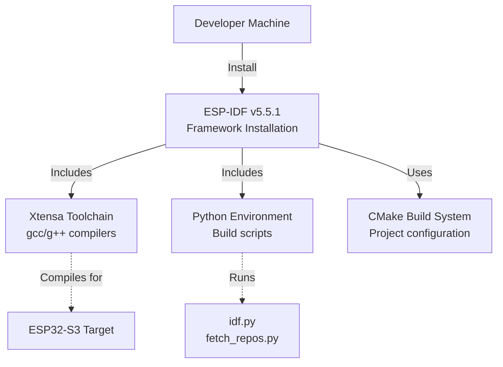
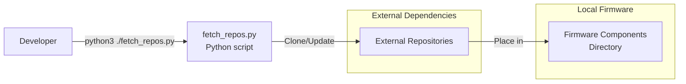
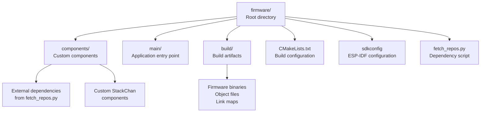
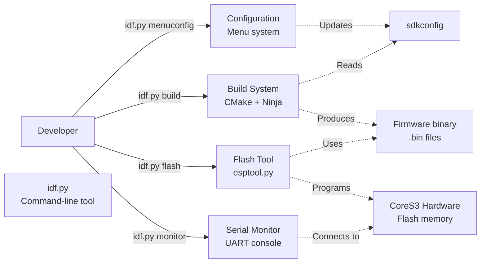

StackChan Development Setup

# Development Setup

<details>
<summary>Relevant source files</summary>

The following files were used as context for generating this wiki page:

- [firmware/README.md](firmware/README.md)

</details>


## Purpose and Scope

This document provides instructions for setting up the ESP-IDF development environment required to build and modify the StackChan firmware. It covers toolchain installation, dependency management, and environment verification. 

For information about the pre-installed firmware capabilities, see [Factory Firmware Features](#4.1). For instructions on building and flashing the firmware after setup is complete, see [Building and Flashing](#4.3). For alternative programming approaches using Arduino or visual tools, see [Programming with Arduino and UiFlow2](#4.4).

## Prerequisites

Before setting up the firmware development environment, ensure the following requirements are met:

| Requirement | Specification | Purpose |
|------------|--------------|---------|
| Operating System | Linux, macOS, or Windows | ESP-IDF supports all major platforms |
| Python | Python 3.8 or later | Required for ESP-IDF build system and dependency scripts |
| Git | Git 2.20 or later | Required for repository cloning and dependency fetching |
| USB Driver | USB-to-UART driver | Required for serial communication with CoreS3 hardware |
| Disk Space | Minimum 5 GB free | ESP-IDF toolchain and dependencies require storage |

The CoreS3 hardware uses a USB-C connection for both power and programming. Ensure a USB-C cable is available for connecting the device to the development machine.

Sources: [firmware/README.md:1-26]()

## ESP-IDF Installation

### Required Toolchain Version

The StackChan firmware requires ESP-IDF version 5.5.1. This specific version ensures compatibility with the ESP32-S3 SoC and all firmware features.



**Diagram: ESP-IDF Development Environment Components**

### Installation Steps

The official ESP-IDF installation process varies by operating system. Follow the installation guide for your platform:

**Linux and macOS:**

```bash
# Clone ESP-IDF repository
git clone -b v5.5.1 --recursive https://github.com/espressif/esp-idf.git
cd esp-idf

# Run installation script
./install.sh esp32s3

# Set up environment variables (add to shell profile for persistence)
. ./export.sh
```

**Windows:**

Download and run the ESP-IDF Windows installer from the official Espressif documentation. The installer automates the setup process and includes all required dependencies.

### Environment Variable Configuration

After installation, the ESP-IDF environment must be activated in each terminal session. The `export.sh` (Linux/macOS) or `export.bat` (Windows) script sets the following critical environment variables:

| Variable | Purpose |
|----------|---------|
| `IDF_PATH` | Points to ESP-IDF installation directory |
| `PATH` | Includes ESP-IDF tools and compiler binaries |
| `IDF_PYTHON_ENV_PATH` | Points to Python virtual environment |

To avoid manually activating the environment in each session, add the export script to the shell initialization file (`.bashrc`, `.zshrc`, etc.).

Sources: [firmware/README.md:11-13]()

## Dependency Management

### Dependency Fetching Script

The StackChan firmware relies on external repositories and components that must be fetched before building. The `fetch_repos.py` script automates this process.



**Diagram: Dependency Fetching Workflow**

### Running the Dependency Fetch

Before building the firmware for the first time, execute the dependency fetch script from the firmware directory:

```bash
cd firmware
python3 ./fetch_repos.py
```

This script performs the following operations:

1. Identifies required external repositories
2. Clones or updates each repository to the correct version
3. Places dependencies in the appropriate component directories
4. Validates that all required dependencies are present

The script is idempotent and can be run multiple times safely. Re-running it will update dependencies to their specified versions without duplicating work.

Sources: [firmware/README.md:5-9]()

## Development Environment Structure

### Directory Organization

After completing the setup and dependency fetch, the firmware directory contains the following structure:



**Diagram: Firmware Directory Structure**

### Key Files and Their Roles

| File/Directory | Purpose |
|----------------|---------|
| `CMakeLists.txt` | Top-level CMake build configuration defining project structure |
| `sdkconfig` | ESP-IDF configuration file generated by `idf.py menuconfig` |
| `sdkconfig.defaults` | Default configuration values for the project |
| `fetch_repos.py` | Script to fetch and manage external dependencies |
| `components/` | Directory containing both custom and external component libraries |
| `main/` | Contains the application entry point and core firmware logic |
| `build/` | Generated directory containing compilation artifacts and binaries |

Sources: [firmware/README.md:1-26]()

## Build System Integration

### idf.py Command-Line Tool

The `idf.py` tool is the primary interface for building, configuring, and flashing the firmware. It wraps CMake and Ninja to provide a streamlined workflow.



**Diagram: idf.py Tool Operations**

### Common idf.py Commands

| Command | Purpose |
|---------|---------|
| `idf.py menuconfig` | Open interactive configuration menu to modify project settings |
| `idf.py build` | Compile the firmware and generate binary files |
| `idf.py flash` | Program the firmware to CoreS3 hardware via USB-C |
| `idf.py monitor` | Open serial console to view firmware output and logs |
| `idf.py clean` | Remove all build artifacts to force a clean rebuild |
| `idf.py fullclean` | Remove all build artifacts and configuration cache |

All `idf.py` commands must be run from the firmware directory with the ESP-IDF environment activated.

Sources: [firmware/README.md:15-25]()

## Environment Verification

### Validating the Setup

After completing the installation and dependency fetch, verify the development environment is correctly configured:

**Step 1: Check ESP-IDF Environment**

```bash
# Verify IDF_PATH is set
echo $IDF_PATH

# Check ESP-IDF version
idf.py --version
```

Expected output should indicate ESP-IDF v5.5.1 or compatible version.

**Step 2: Verify Python Dependencies**

```bash
# Check Python version
python3 --version

# Verify fetch_repos.py script is present
ls -l fetch_repos.py
```

**Step 3: Test Compilation**

```bash
# Attempt to configure the project
idf.py set-target esp32s3

# Perform a test build (may take several minutes)
idf.py build
```

If the build completes without errors, the development environment is correctly configured.

### Troubleshooting Common Issues

| Issue | Possible Cause | Solution |
|-------|----------------|----------|
| `idf.py: command not found` | ESP-IDF environment not activated | Run `export.sh` or `export.bat` from ESP-IDF directory |
| `Python version too old` | Python 3.7 or earlier installed | Install Python 3.8 or later |
| `fetch_repos.py fails` | Network connectivity issues or git configuration | Check internet connection and git credentials |
| `Build fails with missing components` | Dependencies not fetched | Run `python3 ./fetch_repos.py` again |
| `USB device not found during flash` | Driver issues or incorrect permissions | Install USB-to-UART drivers and check device permissions |

Sources: [firmware/README.md:1-26]()

## Next Steps

After successfully setting up the development environment:

1. **Configure Build Settings**: Use `idf.py menuconfig` to customize firmware configuration options such as Wi-Fi credentials, server addresses, and component-specific settings

2. **Build the Firmware**: Follow the instructions in [Building and Flashing](#4.3) to compile and program the firmware to the CoreS3 hardware

3. **Explore Alternative Tools**: Review [Programming with Arduino and UiFlow2](#4.4) for alternative development approaches if ESP-IDF is not suitable for your use case

4. **Review Factory Features**: See [Factory Firmware Features](#4.1) to understand the default capabilities included in the firmware

The development environment is now ready for firmware development, modification, and deployment to StackChan robots.

Sources: [firmware/README.md:1-26]()