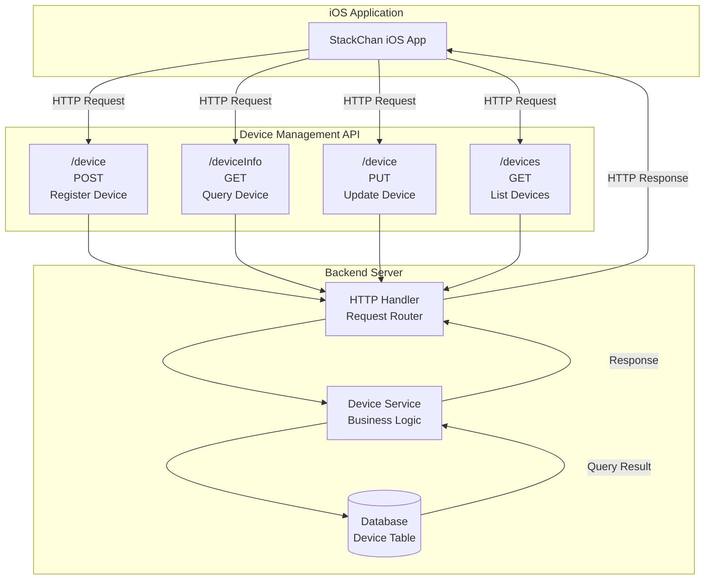
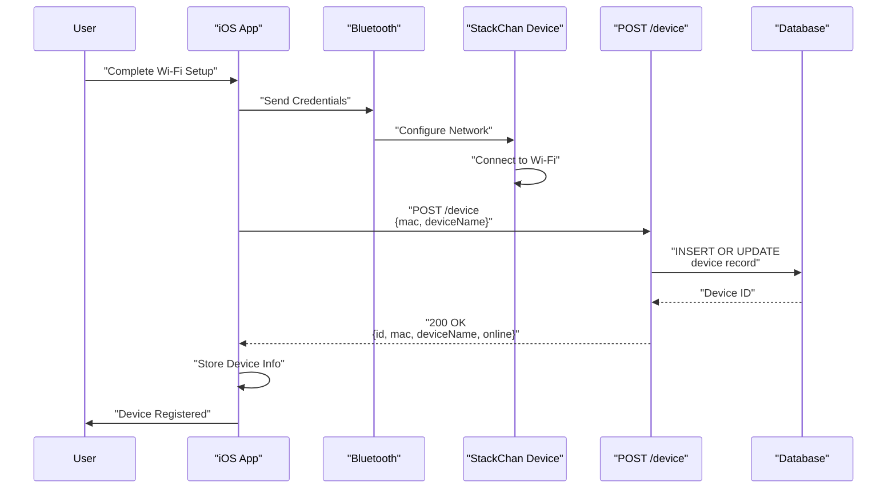
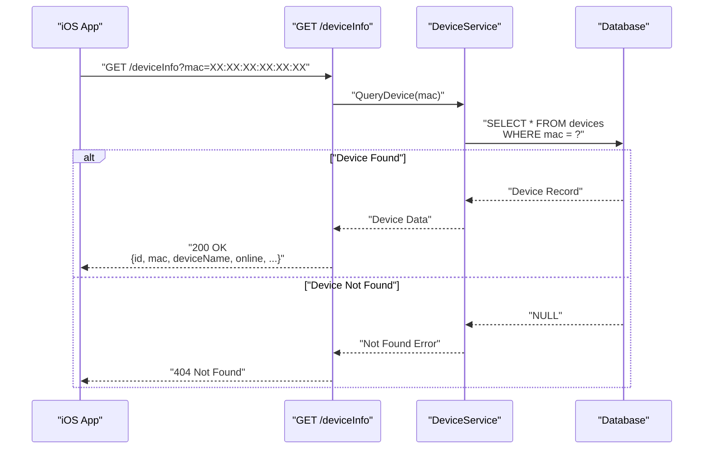
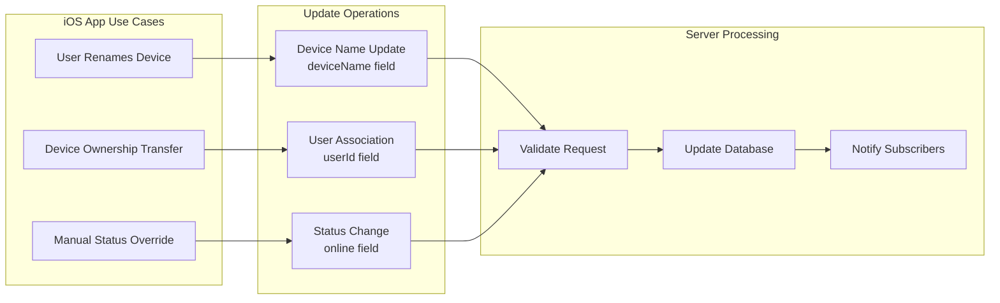
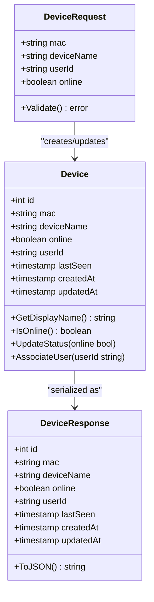
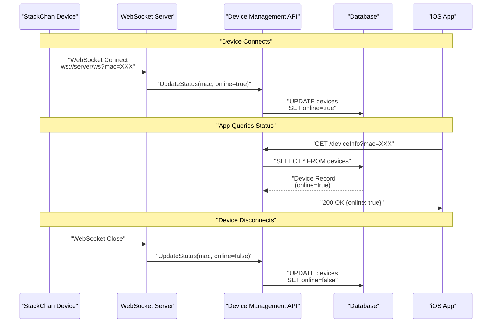
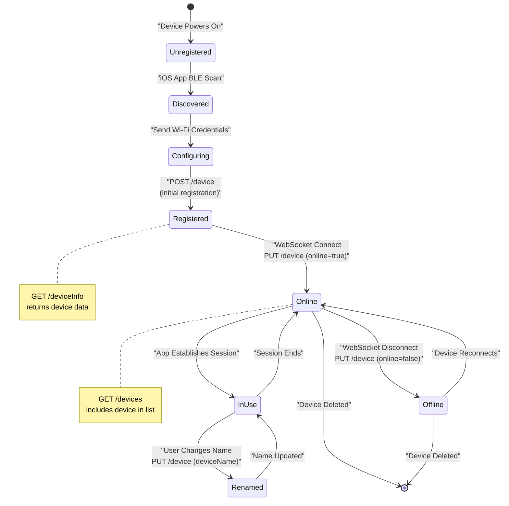

StackChan Device Management API

# Device Management API

<details>
<summary>Relevant source files</summary>

The following files were used as context for generating this wiki page:

- [server/README.md](server/README.md)

</details>


## Purpose and Scope

The Device Management API provides HTTP REST endpoints for registering, querying, and updating StackChan device information in the backend server. This API enables the iOS application to discover devices, sync device metadata, manage device names, and track online/offline status. 

For information about the WebSocket-based real-time communication protocol, see [WebSocket Protocol](#7.2). For social features like posts and comments, see [Social Features API](#6.3). For general HTTP REST API documentation covering all endpoints, see [HTTP REST API](#7.3).

**Sources:** [Diagram 1: System Overview], [Diagram 2: Communication Architecture]

## Overview

The Device Management API is implemented as a set of RESTful HTTP endpoints in the Go server. It serves as the central registry for all StackChan devices in the system, maintaining device metadata such as MAC addresses, device names, online status, and associated user information. The iOS application uses these endpoints during the device setup flow and for ongoing device management operations.

The API handles three primary use cases:
1. **Device Registration**: Registering new devices or updating existing device records when devices come online
2. **Device Information Queries**: Retrieving device metadata for display in the iOS app
3. **Device Updates**: Modifying device properties such as display names and ownership

**Sources:** [Diagram 2: Communication Architecture], [Diagram 5: Feature & Capability Map], [server/README.md:1-45]()

## API Endpoint Architecture



**Sources:** [Diagram 2: Communication Architecture], [Diagram 4: Development & Deployment Architecture]

## Device Registration

### Endpoint: POST /device

The device registration endpoint creates a new device record or updates an existing one. This endpoint is typically called when:
- A device first connects to the network after Wi-Fi configuration
- The iOS app discovers a device via Bluetooth and wants to register it with the backend
- A device reconnects after being offline

#### Request Structure

| Field | Type | Required | Description |
|-------|------|----------|-------------|
| `mac` | string | Yes | MAC address of the device (unique identifier) |
| `deviceName` | string | No | Human-readable name for the device |
| `userId` | string | No | Associated user identifier |
| `online` | boolean | No | Initial online status (defaults to true) |

#### Response Structure

| Field | Type | Description |
|-------|------|-------------|
| `id` | integer | Database-generated device ID |
| `mac` | string | Device MAC address |
| `deviceName` | string | Device name |
| `online` | boolean | Current online status |
| `createdAt` | timestamp | Registration timestamp |

#### Typical Usage Flow



**Sources:** [Diagram 2: Communication Architecture], [server/README.md:1-45]()

## Device Information Query

### Endpoint: GET /deviceInfo

The device information query endpoint retrieves metadata for a specific device. This is one of the most frequently called endpoints, used by the iOS app to:
- Display device details in the UI
- Verify device registration status
- Check device online/offline status before attempting WebSocket connections

#### Request Parameters

| Parameter | Location | Type | Required | Description |
|-----------|----------|------|----------|-------------|
| `mac` | Query | string | Yes | MAC address of the device to query |
| `id` | Query | integer | No | Alternative: Device ID |

#### Response Structure

| Field | Type | Description |
|-------|------|-------------|
| `id` | integer | Device database ID |
| `mac` | string | Device MAC address |
| `deviceName` | string | Current device name |
| `online` | boolean | Current online status |
| `userId` | string | Associated user ID (if any) |
| `lastSeen` | timestamp | Last activity timestamp |
| `createdAt` | timestamp | Initial registration time |
| `updatedAt` | timestamp | Last update time |

#### Query Flow



**Sources:** [Diagram 2: Communication Architecture]

## Device Updates

### Endpoint: PUT /device

The device update endpoint modifies existing device records. This endpoint is used for:
- Changing device display names
- Updating device ownership (userId)
- Manually setting online/offline status
- Updating other device metadata

#### Request Structure

| Field | Type | Required | Description |
|-------|------|----------|-------------|
| `mac` | string | Yes | MAC address of device to update |
| `deviceName` | string | No | New device name |
| `userId` | string | No | New user association |
| `online` | boolean | No | Updated online status |

#### Response Structure

| Field | Type | Description |
|-------|------|-------------|
| `success` | boolean | Update operation result |
| `device` | object | Updated device record |

#### Update Operation Types



**Sources:** [Diagram 5: Feature & Capability Map]

## Device Listing

### Endpoint: GET /devices

The device listing endpoint returns all devices, with optional filtering. This endpoint supports:
- Listing all devices for a specific user
- Filtering by online status
- Pagination for large device collections

#### Request Parameters

| Parameter | Location | Type | Required | Description |
|-----------|----------|------|----------|-------------|
| `userId` | Query | string | No | Filter by user ID |
| `online` | Query | boolean | No | Filter by online status |
| `limit` | Query | integer | No | Maximum number of results |
| `offset` | Query | integer | No | Pagination offset |

#### Response Structure

| Field | Type | Description |
|-------|------|-------------|
| `devices` | array | Array of device objects |
| `total` | integer | Total device count (before pagination) |
| `limit` | integer | Applied result limit |
| `offset` | integer | Applied offset |

**Sources:** [server/README.md:1-45]()

## Device Data Model

The device data model represents the core attributes of a StackChan device stored in the backend database:



### Device Table Schema

| Column | Type | Constraints | Description |
|--------|------|-------------|-------------|
| `id` | INTEGER | PRIMARY KEY, AUTO_INCREMENT | Unique device identifier |
| `mac` | VARCHAR(17) | UNIQUE, NOT NULL | MAC address (format: XX:XX:XX:XX:XX:XX) |
| `deviceName` | VARCHAR(255) | | User-defined device name |
| `online` | BOOLEAN | DEFAULT FALSE | Current connectivity status |
| `userId` | VARCHAR(255) | | Associated user identifier |
| `lastSeen` | TIMESTAMP | | Last activity timestamp |
| `createdAt` | TIMESTAMP | DEFAULT CURRENT_TIMESTAMP | Creation time |
| `updatedAt` | TIMESTAMP | ON UPDATE CURRENT_TIMESTAMP | Last modification time |

**Sources:** [Diagram 5: Feature & Capability Map], [server/README.md:14]()

## Integration with WebSocket System

The Device Management API works in conjunction with the WebSocket system to maintain accurate device status:



The WebSocket server automatically calls the Device Management API to update online status when:
- A device establishes a WebSocket connection (sets `online=true`)
- A device's WebSocket connection closes (sets `online=false`)
- Periodic heartbeat checks fail (marks device offline)

This ensures the device information retrieved via GET /deviceInfo reflects real-time connectivity status.

**Sources:** [Diagram 2: Communication Architecture], [Diagram 3: Hardware-Software Integration Stack]

## Error Handling

The Device Management API uses standard HTTP status codes and returns structured error responses:

| Status Code | Meaning | Typical Causes |
|-------------|---------|----------------|
| 200 OK | Successful operation | Request completed successfully |
| 201 Created | Device registered | New device record created |
| 400 Bad Request | Invalid request data | Missing required fields, invalid MAC format |
| 404 Not Found | Device not found | Queried device doesn't exist |
| 409 Conflict | Duplicate registration | Device with MAC already exists |
| 500 Internal Server Error | Server error | Database connection failure, internal logic error |

### Error Response Format

```json
{
  "error": "string",
  "message": "string",
  "details": {}
}
```

**Sources:** [server/README.md:1-45]()

## Authentication and Security

While the basic Device Management API may not require authentication for initial device registration, production deployments should implement:

1. **MAC Address Validation**: Verify MAC address format and check against known device manufacturers
2. **Rate Limiting**: Prevent abuse of registration and query endpoints
3. **User Authentication**: Associate devices with authenticated user accounts
4. **Authorization**: Ensure users can only modify their own devices
5. **HTTPS**: Encrypt all API communication

The `userId` field in the device model provides a hook for user-based authorization and multi-tenancy support.

**Sources:** [Diagram 1: System Overview], [server/README.md:1-45]()

## Typical Device Lifecycle

The following diagram shows how the Device Management API is used throughout a device's lifecycle:



**Sources:** [Diagram 2: Communication Architecture], [Diagram 5: Feature & Capability Map]

## API Usage Examples

### Example 1: Initial Device Setup

When a user sets up a new StackChan device, the iOS app follows this sequence:

1. Discover device via Bluetooth (see [Bluetooth LE](#7.1))
2. Configure Wi-Fi using Blufi protocol
3. Register device with backend:
   ```
   POST /device
   Content-Type: application/json
   
   {
     "mac": "AA:BB:CC:DD:EE:FF",
     "deviceName": "My StackChan",
     "userId": "user123"
   }
   ```
4. Receive device ID for future reference
5. Query device status to confirm registration:
   ```
   GET /deviceInfo?mac=AA:BB:CC:DD:EE:FF
   ```

### Example 2: Device Name Update

When a user renames their device in the iOS app:

1. App calls update endpoint:
   ```
   PUT /device
   Content-Type: application/json
   
   {
     "mac": "AA:BB:CC:DD:EE:FF",
     "deviceName": "StackChan Jr."
   }
   ```
2. Server validates and updates database
3. App refreshes device info:
   ```
   GET /deviceInfo?mac=AA:BB:CC:DD:EE:FF
   ```
4. UI displays updated name

### Example 3: Checking Device Online Status

Before attempting to establish a WebSocket connection:

1. App queries device status:
   ```
   GET /deviceInfo?mac=AA:BB:CC:DD:EE:FF
   ```
2. Check `online` field in response
3. If `online=true`, proceed with WebSocket connection (see [WebSocket Protocol](#7.2))
4. If `online=false`, show "Device Offline" message to user

**Sources:** [Diagram 2: Communication Architecture], [server/README.md:1-45]()