StackChan Factory Firmware Features

# Factory Firmware Features

Relevant source files

The following files were used as context for generating this wiki page:

- [README.md](README.md)

## Purpose and Scope

This document describes the pre-installed factory firmware features that ship with the StackChan robot. The factory firmware provides a complete, ready-to-use experience including facial expressions, AI agent capabilities, video call support, and device discovery. 

For information about setting up the firmware development environment, see [Development Setup](#4.2). For building and flashing custom firmware, see [Building and Flashing](#4.3). For alternative programming approaches, see [Programming with Arduino and UiFlow2](#4.4).

This page focuses on the features and capabilities of the factory firmware, not on how to modify or rebuild it.

Sources: [README.md:15]()

---

## Factory Firmware Overview

The factory firmware is a complete embedded application running on the ESP32-S3 SoC within the CoreS3 controller. It leverages ESP-IDF v5.5.1 as the underlying RTOS framework and provides integrated access to all hardware capabilities including servos, camera, display, LEDs, speaker, and sensors.

The firmware is designed to work seamlessly with the StackChan World iOS application and backend server infrastructure, enabling both standalone operation and connected experiences. When powered on, the robot immediately begins functioning with its pre-programmed behaviors and can be discovered and controlled via the iOS app.

**Key Design Principles:**
- **Hardware Abstraction**: Firmware provides high-level interfaces to control expressions, motions, and AI features without direct hardware manipulation
- **Communication Ready**: Built-in support for Blufi (Bluetooth configuration), WebSocket (real-time control), and HTTP (device management)
- **Extensible Architecture**: While providing complete functionality out-of-box, the firmware architecture allows for custom programming via Arduino or UiFlow2

Sources: [README.md:11-15]()

---

## Core Feature Set

### Facial Expressions

The factory firmware includes an expression engine that renders animated facial expressions on the 2.0-inch capacitive touch display. Expressions are synchronized with servo movements to create lifelike emotional responses.

**Expression System Components:**

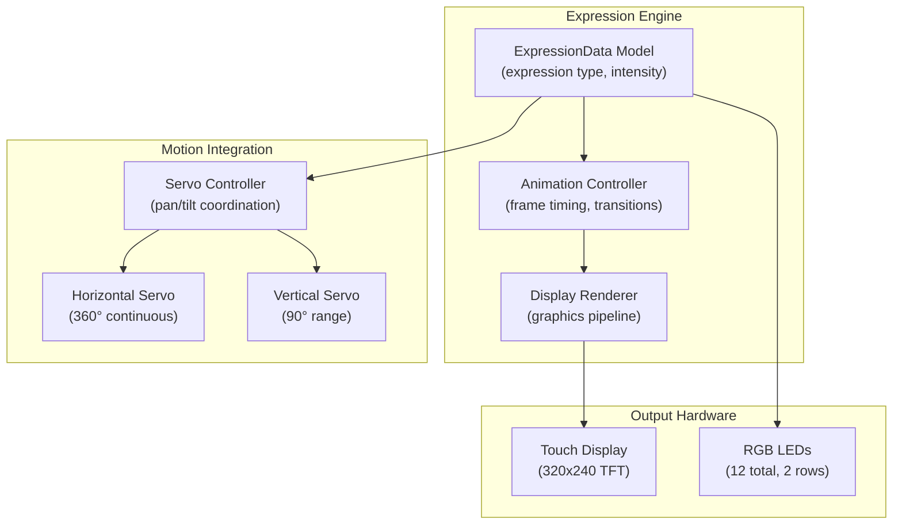

**Available Expression Types:**
The firmware supports multiple pre-programmed expressions that can be triggered via the iOS app or autonomously by the AI agent. Each expression combines display graphics, LED patterns, and servo positions.

| Expression | Display | Servo Motion | LED Pattern | Use Case |
|-----------|---------|--------------|-------------|----------|
| Happy | Smiling face with bright eyes | Slight tilt up, gentle pan | Warm yellow/white | Positive interaction, greeting |
| Sad | Downturned mouth, drooping eyes | Tilt down, slow movement | Dim blue | Disappointment, empathy |
| Surprised | Wide eyes, open mouth | Quick tilt, rapid pan | Bright white flash | Reaction to stimulus |
| Neutral | Calm eyes, straight mouth | Centered position | Soft ambient | Idle state, listening |
| Thinking | Sideways glance, contemplative | Tilt to side, pause | Pulsing colors | Processing, considering |
| Sleeping | Closed eyes | Tilt down, minimal movement | Very dim or off | Low power, inactive |

Sources: [README.md:11-15]()

---

### XiaoZhi AI Agent

The XiaoZhi AI agent is an intelligent assistant embedded in the factory firmware that provides conversational interaction capabilities. It processes voice input through the dual microphones and responds through the speaker and visual expressions.

**AI Agent Architecture:**

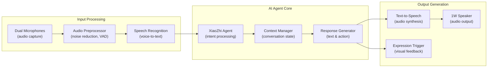

**AI Agent Capabilities:**
- **Voice Interaction**: Continuous listening mode with wake word detection
- **Natural Language Understanding**: Processes conversational Chinese and responds contextually
- **Personality**: Exhibits consistent personality traits through responses and expressions
- **Multi-Modal Response**: Combines audio responses with coordinated expressions and motions
- **Memory**: Maintains conversation context within a session
- **Skills**: Can perform tasks like setting reminders, answering questions, and controlling device functions

**Integration with System:**
The AI agent operates as a firmware-level service that can be invoked locally or enhanced through cloud connectivity when the device is connected to Wi-Fi. It coordinates with the expression engine and motion controller to provide cohesive responses.

Sources: [README.md:15]()

---

### Video Call Support

The factory firmware implements a complete video calling system that integrates with the StackChan World iOS app. This feature enables real-time audio and video communication between the robot and mobile users.

**Video Call System Flow:**

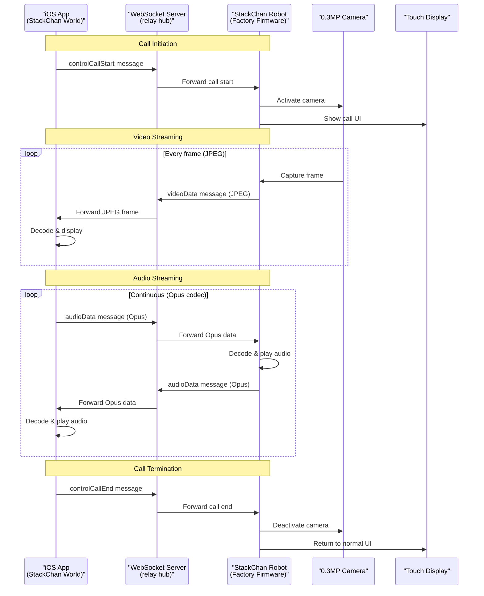

**Video Call Components:**

| Component | Technology | Purpose |
|-----------|-----------|---------|
| Camera Input | 0.3MP sensor | Captures video frames of robot's perspective |
| Video Encoding | JPEG compression | Real-time encoding of camera frames |
| Audio Input | Dual microphones | Captures user's voice near robot |
| Audio Output | 1W speaker | Plays incoming audio from iOS app |
| Audio Codec | Opus | Low-latency, high-quality audio compression |
| Transport | WebSocket binary messages | Bidirectional streaming over network |
| Display | Touch screen | Shows call status and remote user avatar |

**Call Control Messages:**
The firmware handles the following WebSocket message types for call management:
- `controlCallStart`: Initiates video call, activates camera and microphones
- `controlCallEnd`: Terminates call, deactivates media capture
- `videoData`: Streams JPEG-encoded video frames to iOS app
- `audioData`: Bidirectional Opus-encoded audio streaming

**Performance Characteristics:**
- Video frame rate: Adaptive based on network conditions (typically 5-15 fps)
- Video resolution: Scaled from 0.3MP camera to optimize bandwidth
- Audio latency: Low-latency Opus codec with typical 50-100ms delay
- Network requirements: Stable Wi-Fi connection with >1 Mbps bandwidth

Sources: [README.md:15]()

---

### Device Discovery

The factory firmware implements device discovery capabilities that allow StackChan robots to find each other and be discovered by the iOS app. This feature uses multiple communication protocols depending on the discovery context.

**Discovery Architecture:**

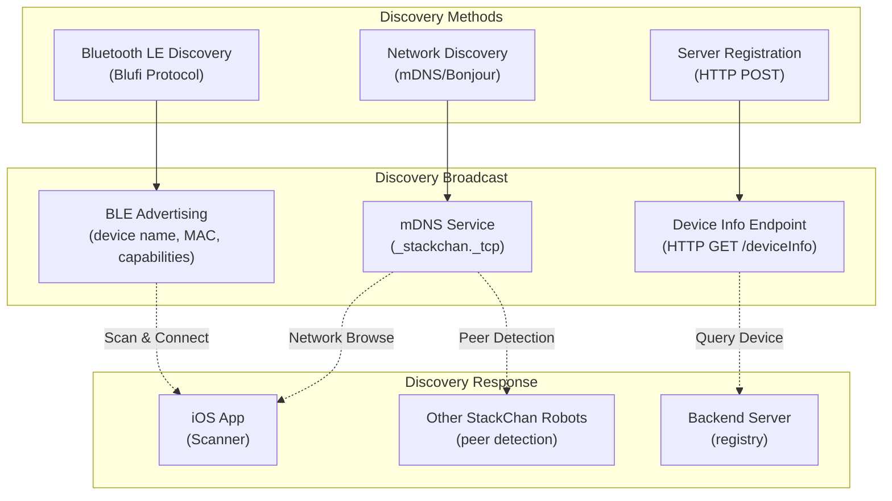

**Discovery Protocols:**

| Protocol | Range | Use Case | Information Shared |
|----------|-------|----------|-------------------|
| Bluetooth LE (Blufi) | ~10 meters | Initial pairing, Wi-Fi setup | Device MAC, name, pairing status |
| mDNS/Bonjour | Local network | LAN-based discovery | IP address, port, service type |
| HTTP Registration | Internet | Global device registry | Device ID, online status, public name |
| Proximity Sensor | <50 cm | Physical presence detection | Distance, object detection |

**Discovery States:**

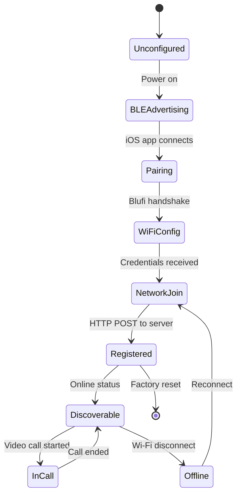

**Discovery Information:**
When discovered, the firmware provides the following information:
- **Device MAC Address**: Unique hardware identifier (BLE and Wi-Fi)
- **Device Name**: User-configurable friendly name
- **Firmware Version**: Factory firmware version string
- **Capabilities**: Supported features (expressions, AI, video call)
- **Online Status**: Connection state (BLE-only, Wi-Fi connected, server registered)
- **Battery Level**: Current battery percentage
- **Proximity Status**: Objects detected within proximity range

**Nearby Device Detection:**
The firmware can detect other StackChan robots on the same local network using mDNS service discovery. This enables features like:
- Group expressions and synchronized movements
- Multi-robot interactions
- Mesh network formation for extended range

Sources: [README.md:15]()

---

### Motion Control System

The factory firmware includes a comprehensive motion control system that manages the two feedback servos for creating expressive movements. The system coordinates pan (horizontal) and tilt (vertical) movements with expressions and AI responses.

**Motion Control Architecture:**

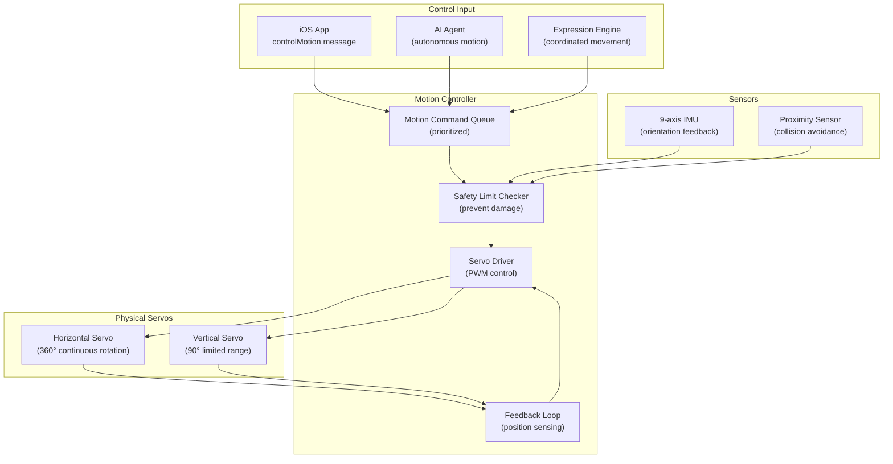

**Motion Types and Parameters:**

| Motion Type | Description | Parameters | Duration |
|------------|-------------|------------|----------|
| Look At | Points robot toward specific direction | Pan angle (-180° to 180°), tilt angle (0° to 90°) | 500-1000ms |
| Nod | Vertical head movement (yes gesture) | Amplitude (small/medium/large), repetitions | 800-1500ms |
| Shake | Horizontal head movement (no gesture) | Amplitude (small/medium/large), repetitions | 800-1500ms |
| Scan | Sweeping look around area | Pan range, tilt position, speed | 2000-5000ms |
| Idle | Subtle natural movements | Random small adjustments | Continuous |
| Dance | Choreographed movement sequence | Sequence ID, tempo | Variable |
| Return Home | Return to neutral position | Speed (slow/normal/fast) | 500-1000ms |

**Safety Features:**

The motion control system implements several safety mechanisms to prevent hardware damage:

1. **Soft Limits**: Software-enforced angle limits prevent servos from attempting invalid positions
2. **Speed Limiting**: Maximum rotation speed caps prevent jerky movements
3. **Current Monitoring**: Servo feedback detects excessive resistance (manual forcing)
4. **Proximity Detection**: Pauses movement if obstacle detected within 5cm
5. **IMU Integration**: Detects if robot is tilted or falling and stops movement
6. **Power Management**: Reduces servo power during idle to prevent overheating

**Warning from README:**
> Do not forcibly rotate any movable parts connected to the motors by hand when you are unsure whether the motors are powered and under control, as this may cause hardware damage.

**Dance Sequences:**

The firmware includes pre-programmed dance sequences that combine motions with expressions and LED patterns. Dance data can be:
- Stored in firmware memory as byte arrays
- Downloaded from the backend server via HTTP
- Triggered via iOS app or AI agent
- Synchronized across multiple robots on the same network

Sources: [README.md:17]()

---

## Feature Integration and Communication

The factory firmware features are designed to work together cohesively, sharing hardware resources and coordinating through a central event-driven architecture.

**Feature Communication and Resource Sharing:**

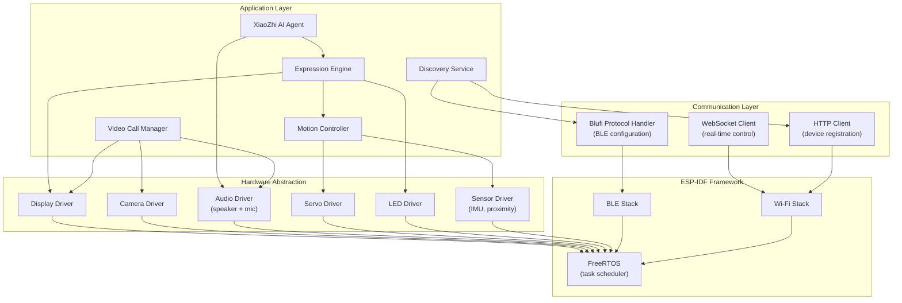

**Resource Arbitration:**

Since multiple features share hardware resources, the firmware implements a priority-based arbitration system:

| Resource | Highest Priority | Medium Priority | Lowest Priority |
|----------|-----------------|----------------|----------------|
| Display | Video call UI | Expression animation | Idle screen |
| Audio Output | Video call audio | AI agent speech | Notification sounds |
| Audio Input | Video call microphone | AI agent listening | Ambient monitoring |
| Camera | Video call streaming | (unused) | (unused) |
| Servos | Safety override | Motion commands | Idle movements |
| LEDs | Safety indicators | Expression sync | Ambient lighting |

**Message Flow Example - iOS App Triggers Expression:**

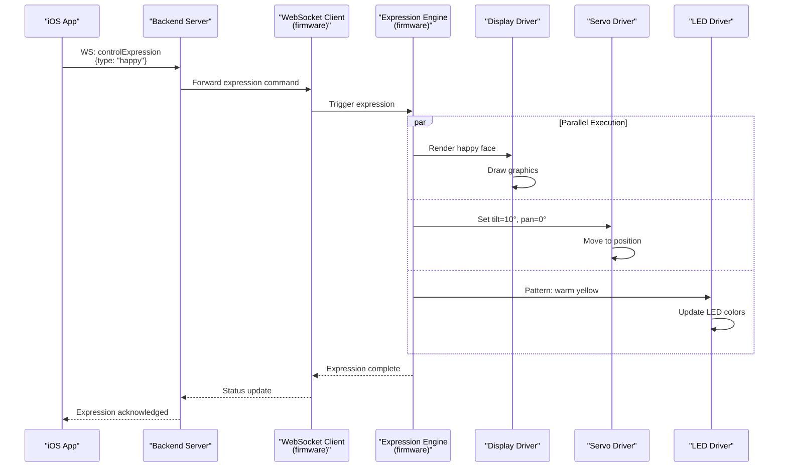

Sources: [README.md:11-15]()

---

## Feature Capabilities Summary

The following table provides a comprehensive reference of all factory firmware features, their hardware dependencies, and communication requirements:

| Feature | Hardware Required | Communication Protocols | iOS App Integration | Server Dependency | Autonomous Operation |
|---------|------------------|------------------------|-------------------|------------------|---------------------|
| Facial Expressions | Display, LEDs, Servos | WebSocket (control), Bluetooth (config) | Yes - full control | No - local only | Yes - AI triggered |
| XiaoZhi AI Agent | Microphones, Speaker, Display | WebSocket (optional), HTTP (optional) | Yes - enhanced features | Optional - cloud AI | Yes - local processing |
| Video Calls | Camera, Display, Speaker, Microphones | WebSocket (required) | Yes - required | Yes - relay server | No - requires connection |
| Device Discovery | BLE radio, Wi-Fi radio | Bluetooth, mDNS, HTTP | Yes - pairing required | Optional - registration | Yes - local broadcast |
| Motion Control | Servos, IMU, Proximity sensor | WebSocket (remote), Bluetooth (config) | Yes - remote control | No - direct control | Yes - AI & expressions |
| Dance Sequences | Servos, Display, LEDs, Speaker | WebSocket, HTTP (download) | Yes - trigger & sync | Optional - dance data | Yes - stored sequences |
| LED Patterns | RGB LEDs (12 units) | WebSocket, Bluetooth | Yes - custom patterns | No - local control | Yes - expression sync |
| Proximity Detection | Proximity sensor | WebSocket (status), HTTP (events) | Yes - notifications | Optional - logging | Yes - local processing |
| Touch Panel | Touch panel (3 zones) | WebSocket (events), HTTP (config) | Yes - event forwarding | Optional - logging | Yes - local handling |
| Battery Monitoring | Battery sensor | HTTP (status), WebSocket (alerts) | Yes - display level | Optional - tracking | Yes - low battery alerts |

**Feature Dependencies Diagram:**

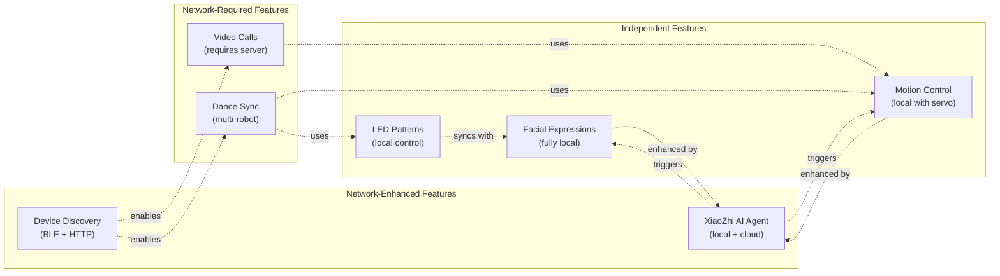

Sources: [README.md:11-17]()

---

## Firmware Boot Sequence and Initialization

When the StackChan robot is powered on, the factory firmware executes a specific initialization sequence to prepare all features and establish connectivity:

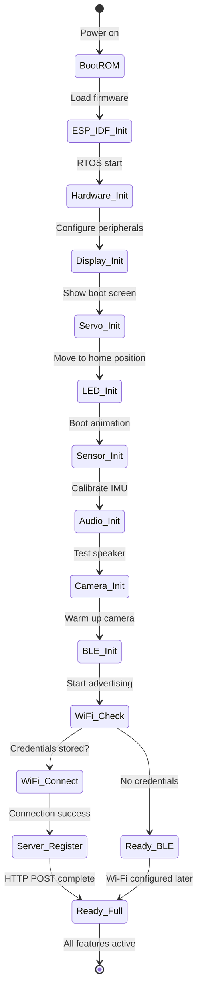

**Initialization Order and Timing:**

| Phase | Component | Duration | Purpose |
|-------|-----------|----------|---------|
| 1 | ESP-IDF Core | ~500ms | Load RTOS, initialize memory |
| 2 | Display Driver | ~200ms | Initialize TFT, show logo |
| 3 | Servo Driver | ~300ms | Initialize PWM, move to home position |
| 4 | LED Driver | ~100ms | Initialize LED controller, boot animation |
| 5 | Sensor Driver | ~400ms | Initialize IMU, calibrate, test proximity |
| 6 | Audio Driver | ~300ms | Initialize I2S, test speaker & microphones |
| 7 | Camera Driver | ~500ms | Initialize camera sensor, warm up |
| 8 | BLE Stack | ~200ms | Initialize Bluetooth, start advertising |
| 9 | Wi-Fi Stack | ~1000ms | Connect to stored network (if configured) |
| 10 | XiaoZhi Agent | ~200ms | Load AI model, initialize context |
| 11 | Server Registration | ~500ms | HTTP POST to register device (if online) |

**Total Boot Time:** Approximately 3-5 seconds from power-on to fully operational state.

Sources: [README.md:11-15]()

---

## Configuration and Customization

While the factory firmware comes pre-configured with default settings, certain parameters can be customized via the iOS app without requiring firmware reflashing:

**Customizable Parameters:**

| Parameter | Configuration Method | Persistence | Restart Required |
|-----------|---------------------|-------------|-----------------|
| Device Name | iOS app → HTTP POST | Server-side | No |
| Wi-Fi Credentials | iOS app → Blufi | NVS flash | Yes (reconnect) |
| Expression Sensitivity | iOS app → WebSocket | RAM only | No |
| Volume Level | Touch panel or iOS app | NVS flash | No |
| LED Brightness | iOS app → WebSocket | NVS flash | No |
| AI Agent Language | iOS app → HTTP POST | Server-side | No |
| Dance Sequences | iOS app → HTTP download | Flash memory | No |
| Motion Speed | iOS app → WebSocket | RAM only | No |
| Idle Behavior | iOS app → HTTP POST | Server-side | No |
| Server URL | Factory set | Firmware constant | Yes (reflash required) |

**Non-Volatile Storage (NVS):**
The firmware uses ESP-IDF's NVS (Non-Volatile Storage) system to persist certain configurations across power cycles. This includes:
- Wi-Fi credentials (SSID and password)
- Audio volume level
- LED brightness preference
- Calibration data for servos
- Device unique ID

**Factory Reset:**
The factory firmware supports a factory reset operation triggered by:
1. Holding the reset button for 10 seconds while powered on
2. Via iOS app "Factory Reset" option in device settings

Factory reset clears:
- Wi-Fi credentials
- NVS stored preferences
- Server registration

Factory reset preserves:
- Firmware version (not reflashed)
- Hardware calibration data
- MAC address

Sources: [README.md:11-17]()

---

## Performance and Resource Utilization

The factory firmware is optimized for the ESP32-S3 hardware, efficiently managing the dual-core processor and memory resources:

**Memory Usage:**

| Resource | Capacity | Factory Firmware Usage | Available for Apps |
|----------|----------|----------------------|-------------------|
| Flash | 16 MB | ~8-10 MB | ~6-8 MB |
| PSRAM | 8 MB | ~4-5 MB (runtime) | ~3-4 MB |
| SRAM | 512 KB | ~300 KB (stack/heap) | ~200 KB |

**CPU Core Assignment:**

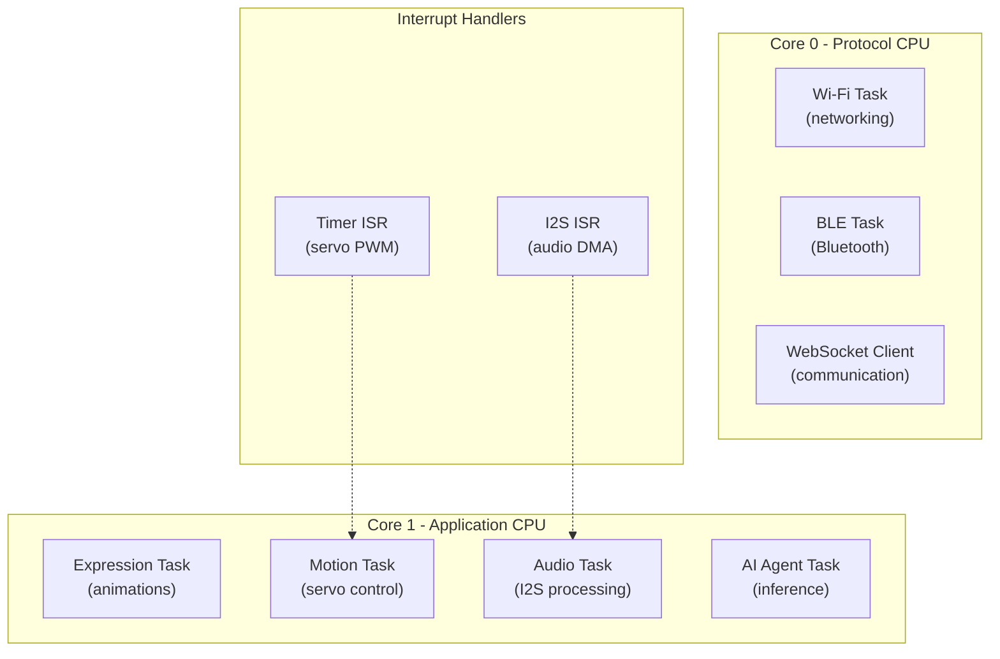

**Task Priorities:**
The firmware uses FreeRTOS task priorities to ensure responsive behavior:
- **Priority 24** (Highest): Servo PWM timer interrupts
- **Priority 22**: Audio I2S DMA interrupts
- **Priority 20**: Wi-Fi/BLE networking tasks
- **Priority 18**: Motion control task
- **Priority 16**: Video call streaming
- **Priority 14**: Expression engine
- **Priority 12**: XiaoZhi AI agent
- **Priority 10**: WebSocket communication
- **Priority 8**: HTTP client operations
- **Priority 6**: LED animations
- **Priority 4**: Sensor polling
- **Priority 2** (Lowest): Idle task and logging

**Power Consumption:**

| Operating Mode | Typical Current | Battery Life (700mAh) |
|----------------|----------------|---------------------|
| Active (all features) | ~400-600 mA | 1-2 hours |
| Video call | ~500-700 mA | 1-1.5 hours |
| AI agent active | ~350-450 mA | 1.5-2 hours |
| Idle (connected) | ~150-200 mA | 3-4 hours |
| Idle (BLE only) | ~80-100 mA | 6-8 hours |
| Deep sleep | ~5-10 mA | 70-140 hours |

Sources: [README.md:11-15]()

---

## Version Information and Updates

The factory firmware version can be queried via the iOS app or HTTP API. The firmware follows semantic versioning (MAJOR.MINOR.PATCH).

**Firmware Update Methods:**

1. **USB-C Flashing**: Direct firmware update using ESP-IDF tools via USB connection
2. **OTA (Over-The-Air)**: Future capability for wireless firmware updates (not yet implemented in factory firmware)

**Version Compatibility:**
- **iOS App Compatibility**: Factory firmware is compatible with StackChan World iOS app v1.0+
- **Server Compatibility**: Requires backend server API v1.0+
- **Hardware Compatibility**: Designed specifically for CoreS3 with ESP32-S3

For instructions on building and flashing custom firmware versions, see [Building and Flashing](#4.3). For alternative development approaches, see [Programming with Arduino and UiFlow2](#4.4).

Sources: [README.md:6-15]()