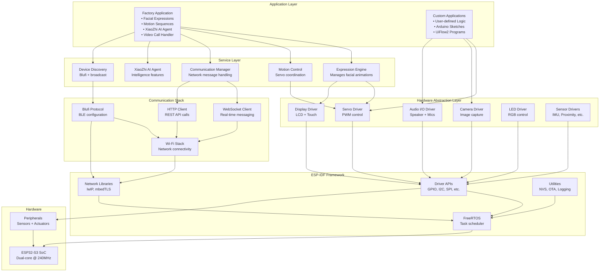
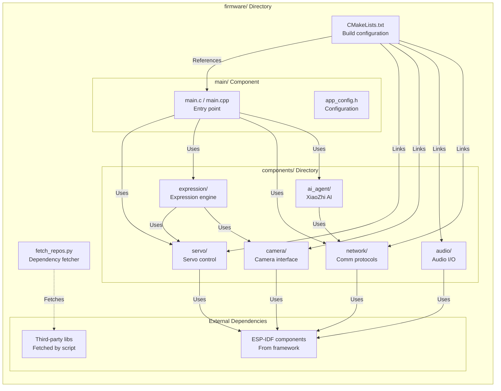
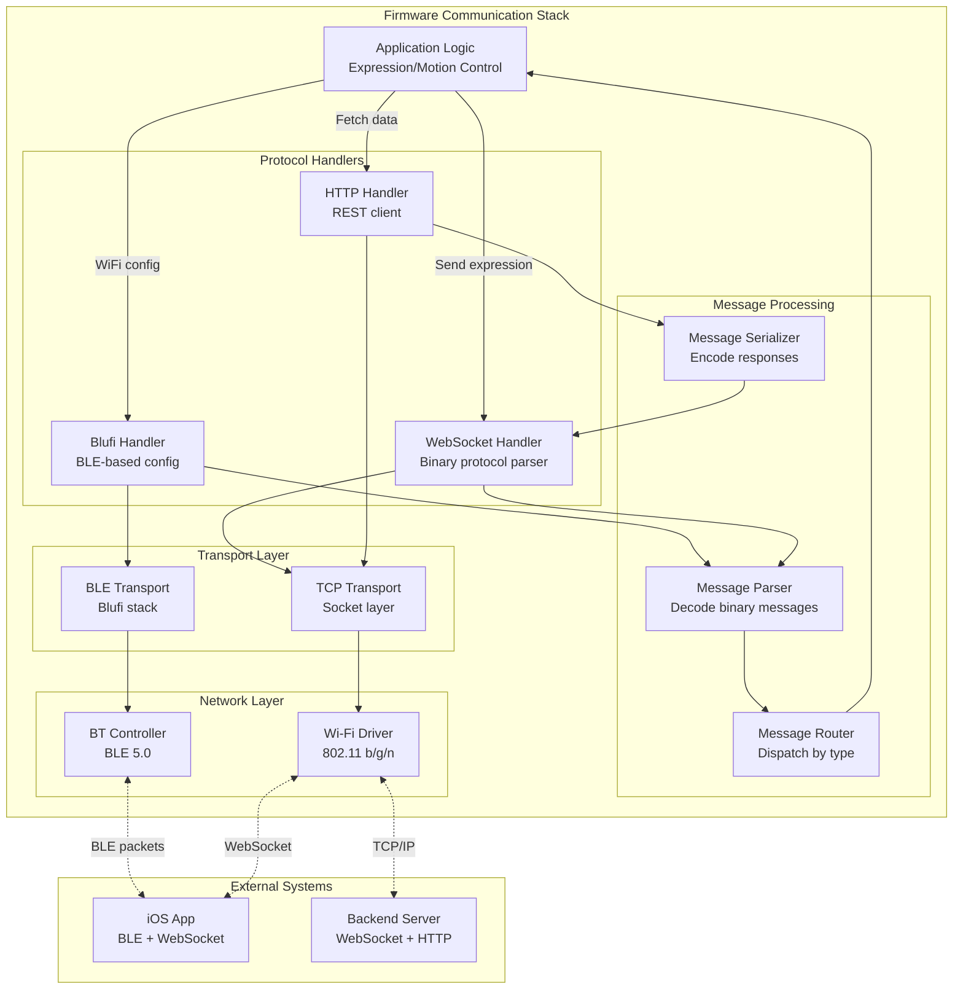

StackChan Firmware Development

# Firmware Development

<details>
<summary>Relevant source files</summary>

The following files were used as context for generating this wiki page:

- [README.md](README.md)
- [firmware/README.md](firmware/README.md)

</details>


## Purpose and Scope

This document provides an overview of the embedded firmware that runs on the StackChan robot's ESP32-S3 microcontroller. It covers the firmware architecture, technology stack, component organization, and available development approaches. 

For detailed information about:
- Pre-installed features and capabilities, see [Factory Firmware Features](#4.1)
- Setting up the ESP-IDF development environment, see [Development Setup](#4.2)
- Build and flash procedures, see [Building and Flashing](#4.3)
- Alternative programming methods, see [Programming with Arduino and UiFlow2](#4.4)
- Hardware specifications and components, see [Hardware & Robot](#3)

Sources: [README.md:1-26](), [firmware/README.md:1-26]()

## Firmware Overview

The StackChan firmware is embedded software that runs directly on the CoreS3's ESP32-S3 SoC, providing real-time control of all robot hardware and enabling communication with external systems. The firmware is built using the ESP-IDF framework version 5.5.1, which provides an RTOS (Real-Time Operating System) foundation for multitasking and resource management.

The firmware serves as the bridge between the physical hardware components (sensors, actuators, communication interfaces) and higher-level application features (facial expressions, AI agent, network communication). It operates continuously while the robot is powered, managing hardware initialization, processing sensor inputs, controlling actuators, handling network communications, and executing application logic.

Sources: [README.md:11-15](), [firmware/README.md:11-14]()

## Technology Stack

The firmware is built on the following core technologies:

| Component | Version/Details | Purpose |
|-----------|----------------|---------|
| **ESP-IDF** | v5.5.1 | Primary development framework providing RTOS, drivers, and middleware |
| **FreeRTOS** | Included in ESP-IDF | Real-time operating system for task scheduling and synchronization |
| **Programming Language** | C/C++ | Native language for ESP32-S3 development |
| **Processor** | ESP32-S3 dual-core @ 240 MHz | Executes firmware with dedicated cores for protocol stack and application |
| **Memory** | 16MB Flash, 8MB PSRAM | Code storage and runtime memory for buffers and data structures |
| **Communication Stacks** | Wi-Fi, BLE (Blufi), HTTP, WebSocket | Network protocol implementations |

The ESP-IDF framework provides a comprehensive set of libraries and components that abstract hardware interfaces and provide middleware services. This allows firmware developers to focus on application logic rather than low-level hardware details.

Sources: [README.md:11-12](), [firmware/README.md:13]()

## Firmware Architecture Layers



The firmware architecture follows a layered design pattern, with clear separation of concerns:

- **Hardware Layer**: Physical ESP32-S3 SoC and connected peripherals
- **ESP-IDF Framework**: Provides RTOS, driver APIs, network libraries, and utilities
- **Hardware Abstraction Layer**: Device drivers that expose hardware functionality through software interfaces
- **Communication Stack**: Network protocol implementations for Wi-Fi, BLE, WebSocket, and HTTP
- **Service Layer**: Core firmware services that implement robot features
- **Application Layer**: Factory application with pre-built features, or custom user applications

Sources: [README.md:11-15]()

## Component Architecture and Code Organization



The firmware codebase is organized following ESP-IDF conventions:

- **`firmware/`**: Root directory for all firmware code
- **`main/`**: Contains the main application component with entry point functions (`app_main()`)
- **`components/`**: Custom components implementing robot-specific functionality
- **`CMakeLists.txt`**: Top-level build configuration defining component dependencies
- **`fetch_repos.py`**: Python script to retrieve external dependencies before building

Each component is a self-contained module with its own source files, headers, and CMakeLists.txt, following ESP-IDF's component-based architecture. This modular design allows components to be developed, tested, and reused independently.

Sources: [firmware/README.md:1-26]()

## Hardware Interface Mapping

The firmware interacts with CoreS3 hardware components through the Hardware Abstraction Layer. The following table maps physical hardware to firmware driver interfaces:

| Hardware Component | Interface Type | Firmware Driver Responsibility |
|-------------------|---------------|-------------------------------|
| **2x Feedback Servos** | PWM | Generate PWM signals for position control; horizontal (360°) and vertical (90°) axes |
| **0.3MP Camera** | DVP/I2C | Initialize camera sensor, configure resolution/format, capture frames, manage buffers |
| **2.0" Touch Display** | SPI/I2C | Draw graphics, render facial expressions, process touch events |
| **12 RGB LEDs** | GPIO/SPI | Control individual LED colors, implement lighting effects |
| **1W Speaker** | I2S | Output audio samples, handle audio format conversion |
| **Dual Microphones** | I2S | Capture audio input, implement echo cancellation |
| **9-axis IMU** | I2C/SPI | Read accelerometer, gyroscope, magnetometer data; motion detection |
| **Proximity Sensor** | I2C | Detect nearby objects, trigger distance-based behaviors |
| **Touch Panel** | I2C/GPIO | Process three-zone touch inputs, debounce signals |
| **IR TX/RX** | GPIO/RMT | Transmit and receive infrared signals for remote control |
| **NFC Module** | I2C/SPI | Read NFC tags, implement pairing features |
| **Wi-Fi** | Internal | Manage AP/STA modes, handle connections, low-level packet handling |
| **Bluetooth LE** | Internal | Implement Blufi protocol, device advertising, pairing |

Each driver component encapsulates hardware-specific details and provides a clean API for higher-level firmware services to use. This abstraction allows the same application code to potentially work across different hardware revisions with minimal changes.

Sources: [README.md:11-13]()

## Communication Protocol Integration

The firmware implements multiple communication protocols to interact with external systems:



**Blufi Protocol** ([Bluetooth LE](#7.1)): Used during initial device setup, the firmware implements the Blufi protocol to receive Wi-Fi credentials from the iOS app over BLE. Once configured, the device connects to the specified Wi-Fi network.

**WebSocket Client** ([WebSocket Protocol](#7.2)): After establishing Wi-Fi connectivity, the firmware opens a WebSocket connection to the backend server. This persistent connection is used for bidirectional real-time communication, including:
- Receiving control commands (motion, expression, dance sequences)
- Sending status updates and telemetry
- Streaming camera frames (JPEG encoded)
- Streaming audio data (Opus encoded)

**HTTP Client** ([HTTP REST API](#7.3)): The firmware uses HTTP for non-real-time operations such as:
- Registering the device with the backend server
- Fetching device information and configuration
- Reporting online/offline status
- Uploading logs or diagnostic data

Sources: [README.md:15]()

## Factory Firmware Features

The factory-installed firmware provides a complete set of features ready to use out of the box:

- **Facial Expressions**: Pre-programmed animations displaying emotions through the LCD screen and servo movements
- **Motion Sequences**: Choreographed movements using the two servo motors for horizontal and vertical motion
- **XiaoZhi AI Agent**: Integrated AI capabilities for intelligent interactions
- **Video Call Support**: Real-time video streaming from the camera to the iOS app
- **Remote Avatar Control**: Allows the iOS app to control the robot's expressions and movements remotely
- **Device Discovery**: Broadcasts device presence over BLE, enabling nearby iOS apps to discover and connect

These features are implemented in the factory application layer and utilize all the underlying firmware services and hardware drivers. Users can interact with these features through the iOS app without any programming required.

For detailed documentation of each feature, see [Factory Firmware Features](#4.1).

Sources: [README.md:15]()

## Development Approaches

StackChan firmware can be developed using multiple approaches, each suitable for different developer skill levels and use cases:

### ESP-IDF (Primary Method)

ESP-IDF is the official Espressif IoT Development Framework, providing full access to all ESP32-S3 features. This is the primary development method for the factory firmware.

**Advantages**:
- Complete hardware access and control
- Professional-grade RTOS features
- Comprehensive networking stack
- Optimal performance and memory usage
- Full debugging capabilities

**Use Cases**: Production firmware, advanced features, performance-critical applications, integration with existing ESP-IDF projects

For setup instructions, see [Development Setup](#4.2). For build and flash procedures, see [Building and Flashing](#4.3).

### Arduino IDE (Alternative Method)

Arduino provides a simplified programming environment with an easy-to-use API, making it accessible to hobbyists and beginners.

**Advantages**:
- Simple, beginner-friendly API
- Large library ecosystem
- Quick prototyping
- Familiar development environment

**Use Cases**: Learning projects, simple automations, quick experiments, leveraging existing Arduino libraries

### UiFlow2 (Visual Programming)

UiFlow2 is a visual programming environment that allows creating firmware through drag-and-drop blocks, eliminating the need to write code.

**Advantages**:
- No coding required
- Visual logic flow
- Rapid prototyping
- Educational applications

**Use Cases**: Educational projects, non-programmer users, rapid concept validation, demonstrations

For details on Arduino and UiFlow2 development, see [Programming with Arduino and UiFlow2](#4.4).

Sources: [README.md:15](), [firmware/README.md:1-26]()

## Build System and Dependencies

The firmware uses CMake as its build system, integrated with ESP-IDF's `idf.py` build tool. The build process involves:

1. **Dependency Fetching**: The `fetch_repos.py` script retrieves external dependencies and third-party libraries required by the firmware
2. **Configuration**: Component dependencies and build options are defined in `CMakeLists.txt` files throughout the source tree
3. **Compilation**: The build system compiles all components and links them into a single firmware binary
4. **Binary Generation**: Multiple output files are generated, including bootloader, partition table, and application binary

```bash
# Typical build workflow
python3 ./fetch_repos.py    # Fetch external dependencies
idf.py build                # Compile and link firmware
idf.py flash                # Upload to device via USB
```

The build output includes:
- **bootloader.bin**: Second-stage bootloader
- **partition-table.bin**: Flash memory layout definition
- **stackchan.bin**: Main application firmware
- **ota_data_initial.bin**: OTA status partition

Sources: [firmware/README.md:5-25]()

## Memory Architecture

The ESP32-S3 provides multiple memory regions that the firmware utilizes:

| Memory Type | Size | Usage |
|------------|------|-------|
| **Internal SRAM** | ~400KB | Stack, heap, RTOS structures, DMA buffers |
| **External PSRAM** | 8MB | Large buffers (camera frames, audio buffers), heap extension |
| **Flash Memory** | 16MB | Firmware code, read-only data, file system, OTA partitions |
| **RTC Memory** | ~16KB | Deep sleep retention, persistent state |

The firmware is designed to make efficient use of available memory:
- Critical real-time code runs from internal SRAM for maximum performance
- Large data buffers utilize external PSRAM to preserve internal memory
- Frequently accessed data is cached in internal SRAM
- Non-volatile configuration is stored in NVS (Non-Volatile Storage) flash partitions

## Multi-Core Task Distribution

The ESP32-S3's dual-core architecture allows parallel execution of firmware tasks:

**Core 0 (Protocol CPU)**:
- Wi-Fi and Bluetooth protocol stack
- Network packet processing
- Interrupt handlers for network interfaces
- Background housekeeping tasks

**Core 1 (Application CPU)**:
- Application logic (expressions, motion control, AI agent)
- User interface rendering
- Sensor data processing
- Audio/video encoding
- Custom application code

Tasks can be pinned to specific cores or allowed to float across cores based on system load. The FreeRTOS scheduler manages task priorities and ensures real-time responsiveness.

Sources: [README.md:11]()

## Safety and Operational Considerations

The firmware implements several safety features to protect the hardware:

- **Servo Protection**: Software limits prevent servos from exceeding their mechanical range (360° horizontal, 90° vertical)
- **Brownout Detection**: Monitors power supply voltage and performs safe shutdown if voltage drops critically
- **Watchdog Timers**: Automatic system reset if firmware becomes unresponsive
- **Thermal Monitoring**: Tracks ESP32-S3 die temperature and throttles processing if overheating occurs
- **Over-Current Detection**: Monitors servo current draw and disables motors if excessive

**Important**: Do not manually rotate servo-connected parts when the robot is powered on, as this can cause hardware damage. The firmware assumes it has exclusive control over motor positions.

Sources: [README.md:17]()

## Next Steps

To begin firmware development:
- Set up your development environment: [Development Setup](#4.2)
- Learn about the build process: [Building and Flashing](#4.3)
- Explore alternative programming methods: [Programming with Arduino and UiFlow2](#4.4)
- Understand factory features: [Factory Firmware Features](#4.1)
- Review communication protocols: [Communication Protocols](#7)