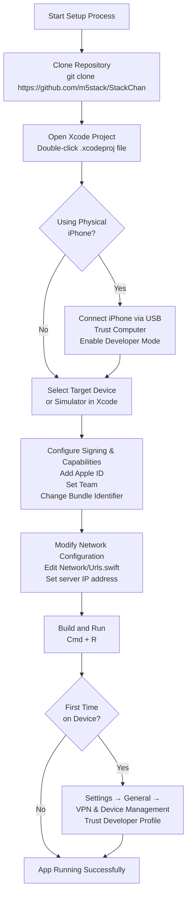
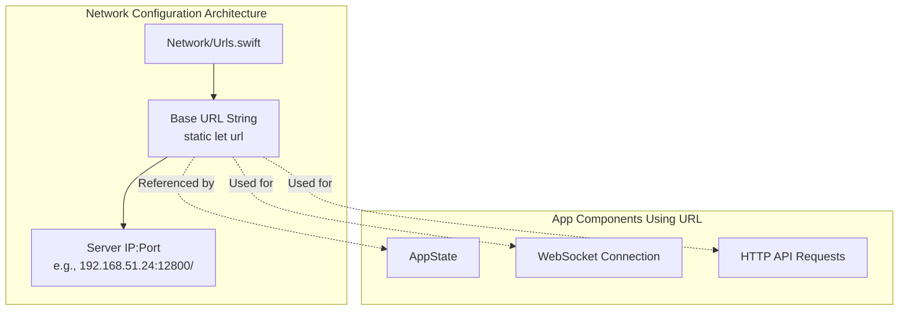

StackChan Getting Started with the iOS App

# Getting Started with the iOS App

<details>
<summary>Relevant source files</summary>

The following files were used as context for generating this wiki page:

- [app/README.md](app/README.md)

</details>


## Purpose and Scope

This page provides step-by-step instructions for setting up the StackChan World iOS application development environment, including cloning the repository, configuring Xcode project settings, managing signing and capabilities, and running the app on a physical device or simulator. This guide covers the initial setup required before developing or customizing the iOS app.

For information about the app's overall architecture and features, see [iOS Application](#5). For details on the project structure and organization, see [Project Structure](#5.2). For information on the app's state management system, see [Application State Management](#5.3).

---

## Prerequisites

Before beginning, ensure you have the following:

| Requirement | Version/Details |
|------------|-----------------|
| macOS | macOS 12.0 or later |
| Xcode | Xcode 14.0 or later |
| iOS Device (optional) | iOS 16.6 or later |
| Apple ID | Free or paid developer account |
| Git | For repository cloning |
| Network Access | To clone repository and connect to backend server |

Sources: [app/README.md:1-63]()

---

## Setup Workflow Overview



Sources: [app/README.md:1-63]()

---

## Step 1: Clone the Repository

Clone the StackChan repository from GitHub and navigate to the iOS app directory:

```bash
git clone https://github.com/m5stack/StackChan
cd StackChan/app
```

The iOS application source code is located in the `app/` directory of the repository. This directory contains the Xcode project file and all Swift source files.

Sources: [app/README.md:3-7]()

---

## Step 2: Open the Project in Xcode

Open the iOS project in Xcode using one of the following methods:

**Method 1: Double-click the project file**
- Navigate to the `app/` directory in Finder
- Double-click the `.xcodeproj` file

**Method 2: Open from Xcode**
- Launch Xcode
- Select **File → Open**
- Navigate to and select the `.xcodeproj` file in the `app/` directory

Once opened, the Xcode workspace displays the project structure with all source files, resources, and build configurations.

Sources: [app/README.md:9-13]()

---

## Step 3: Configure Target Device

### Option A: Using a Physical iPhone (Recommended)

Physical device testing is recommended for full feature access, including Bluetooth LE communication with StackChan robots.

**Connect the iPhone:**
1. Connect iPhone to Mac using a USB cable
2. Unlock the iPhone
3. Tap **Trust This Computer** when prompted
4. In Xcode toolbar, select the connected iPhone from the device dropdown

**Enable Developer Mode (iOS 16+):**

Developer Mode must be enabled for iOS 16 and later. This option appears only after Xcode has connected to the device at least once.

1. On iPhone: **Settings → Privacy & Security → Developer Mode**
2. Toggle **Developer Mode** on
3. Restart the iPhone
4. After restart, confirm enabling Developer Mode

### Option B: Using iOS Simulator

For basic UI testing without hardware interaction:
- In Xcode toolbar, select an iOS Simulator from the device dropdown
- Note: Bluetooth LE features will not function in the simulator

Sources: [app/README.md:14-27]()

---

## Step 4: Configure Signing & Capabilities

Code signing is required to install the app on physical devices. Free Apple IDs are sufficient for personal device testing.

### Signing Configuration Steps

1. **Select the project** in Xcode's left sidebar (project navigator)
2. **Select the app target** in the main editor
3. **Open the Signing & Capabilities tab**
4. **Add Apple ID to Xcode** (if not already added):
   - **Xcode → Settings → Accounts**
   - Click **+** to add Apple ID
   - Sign in with your Apple ID
5. **Set Team** to your Apple ID or development team
6. **Change Bundle Identifier** to a unique value (required to avoid conflicts):
   - Example: `com.yourname.stackchan`
   - Must be unique across all apps
7. **Verify** no red error messages appear

```mermaid
flowchart LR
    subgraph XcodeProject["Xcode Project Configuration"]
        Project["Project Root"]
        Target["App Target"]
        SignTab["Signing & Capabilities Tab"]
    end
    
    subgraph SignConfig["Signing Configuration"]
        AppleID["Apple ID Account<br/>(Xcode → Settings → Accounts)"]
        Team["Team Selection<br/>(Personal or Org Team)"]
        BundleID["Bundle Identifier<br/>(e.g., com.yourname.stackchan)"]
    end
    
    subgraph Result["Signing Result"]
        Cert["Automatic Code Signing"]
        Profile["Provisioning Profile"]
        Valid["✓ Ready to Build"]
    end
    
    Project --> Target
    Target --> SignTab
    SignTab --> AppleID
    AppleID --> Team
    Team --> BundleID
    BundleID --> Cert
    Cert --> Profile
    Profile --> Valid
```



Sources: [app/README.md:28-41]()

---

## Step 5: Configure Network Settings

The iOS app must be configured with the correct backend server IP address before running. The server IP is defined in the `Urls` configuration file.

### Network Configuration File Structure



### Configuration Steps

1. **Locate the configuration file**: `Network/Urls.swift`
2. **Find the base URL definition**:
   ```swift
   // Base URL configured according to the server's IP
   static let url = "192.168.51.24:12800/"
   ```
3. **Replace the IP address** with your backend server's IP address
   - The IP should match the computer running the Go backend server
   - Keep the port number (`:12800`) unless changed in server configuration
   - Keep the trailing slash (`/`)
4. **Save the file**

**Example configuration:**
```swift
static let url = "192.168.1.100:12800/"  // Replace with actual server IP
```

The `Urls.swift` file contains the base URL used throughout the app for:
- WebSocket connections to the server
- HTTP REST API requests for device management
- Social feature endpoints (posts, comments)

For more details on network configuration across all components, see [Network Configuration](#8.3).

Sources: [app/README.md:42-53]()

---

## Step 6: Build and Run the App

### Build Process

1. **Select your target device or simulator** in the Xcode toolbar
2. **Press Cmd + R** or click the **Run** button (▶) in Xcode
3. Wait for the build process to complete
   - First build may take several minutes
   - Xcode compiles Swift source files and links dependencies

### First Run on Physical Device

If running on an iPhone for the first time, you must trust the developer profile:

1. **On iPhone**: Attempt to open the app (it will fail with an "Untrusted Developer" error)
2. **Navigate to**: **Settings → General → VPN & Device Management**
3. **Find your developer profile** (displays your Apple ID email)
4. **Tap the profile** and select **Trust**
5. **Confirm** by tapping **Trust** again
6. **Return to home screen** and launch the app again

The app will now launch successfully and attempt to connect to the backend server at the configured IP address.

Sources: [app/README.md:54-63]()

---

## Configuration Files Reference

The following table maps configuration files to their purposes in the setup process:

| File Path | Purpose | Configuration Required |
|-----------|---------|------------------------|
| `*.xcodeproj` | Xcode project file | Open in Xcode |
| `Signing & Capabilities` (Xcode) | Code signing configuration | Add Apple ID, set Team, change Bundle ID |
| `Network/Urls.swift` | Server connection settings | Modify IP address to match backend server |
| `Info.plist` | App permissions and capabilities | Pre-configured (see [App Capabilities and Permissions](#5.6)) |

Sources: [app/README.md:1-63]()

---

## Post-Setup Verification

After successful build and run, verify the following:

### App Launch Checklist

- [ ] App launches without crashing
- [ ] No Xcode build errors or warnings (minor warnings acceptable)
- [ ] App displays main interface
- [ ] No immediate network connection errors (if server is running)

### Connection Testing

Once the app is running:
- The app will attempt to connect to the backend server via HTTP and WebSocket
- If the server is not running or unreachable, connection errors will appear
- Bluetooth scanning for StackChan devices will be available (requires location permissions)

For next steps in using the app, refer to:
- [Application State Management](#5.3) - Understanding how the app manages connections
- [Communication Protocols](#7) - Understanding how the app communicates with robots and server
- [Development Guide](#8) - Customizing and extending the app

Sources: [app/README.md:1-63]()

---

## Common Setup Issues

### Signing Errors

**Issue**: "Failed to create provisioning profile" or "No signing certificate found"
- **Solution**: Ensure Apple ID is added in Xcode → Settings → Accounts
- **Solution**: Change Bundle Identifier to a unique value
- **Solution**: Select correct Team in Signing & Capabilities

### Network Configuration Errors

**Issue**: App cannot connect to server
- **Solution**: Verify server IP address in `Network/Urls.swift` is correct
- **Solution**: Ensure backend server is running and accessible
- **Solution**: Check firewall settings allow connections on port 12800

### Device Trust Issues

**Issue**: "Untrusted Developer" error when launching app
- **Solution**: Follow device trust steps in Settings → General → VPN & Device Management

### Developer Mode Not Available (iOS 16+)

**Issue**: Developer Mode option not visible in Settings
- **Solution**: Connect device to Xcode at least once while unlocked
- **Solution**: Ensure device is running iOS 16 or later

Sources: [app/README.md:1-63]()