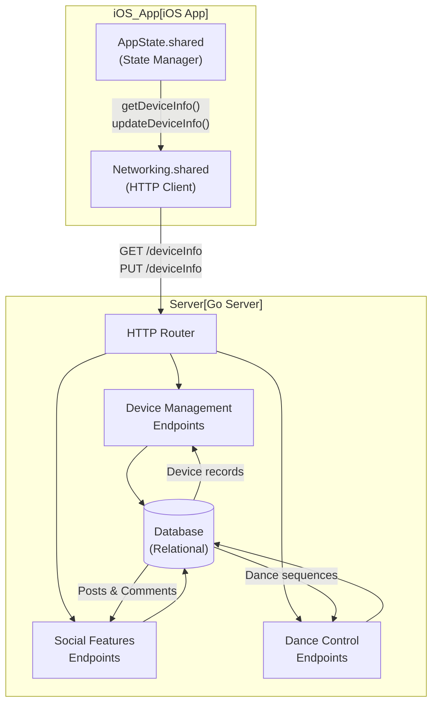
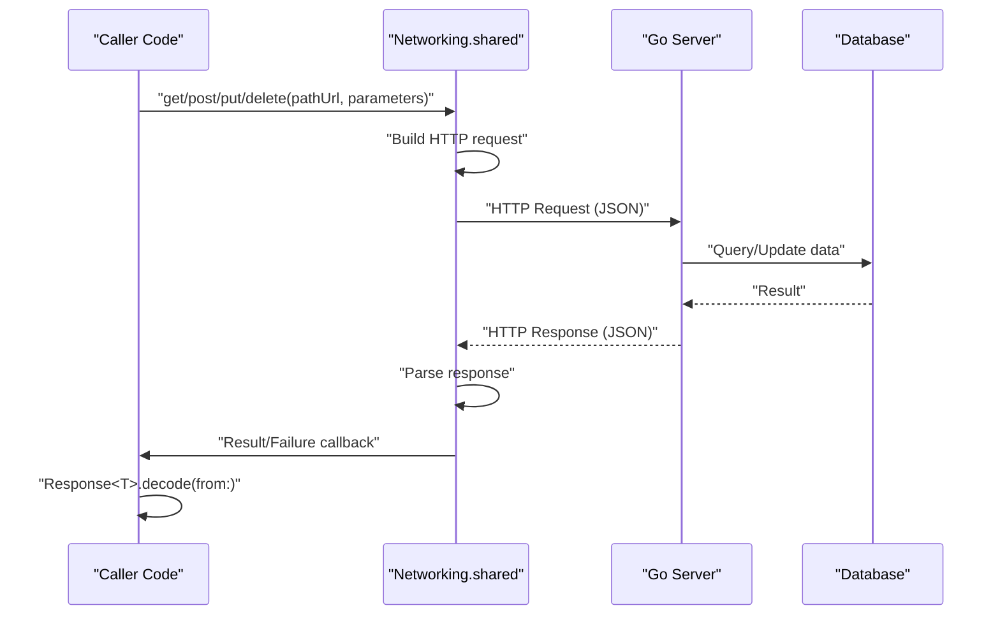
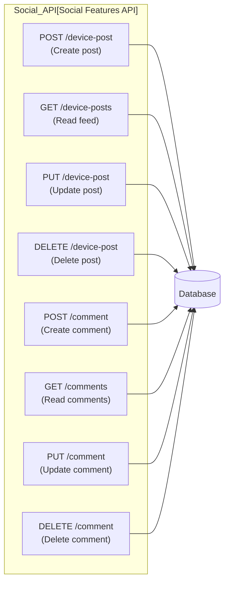
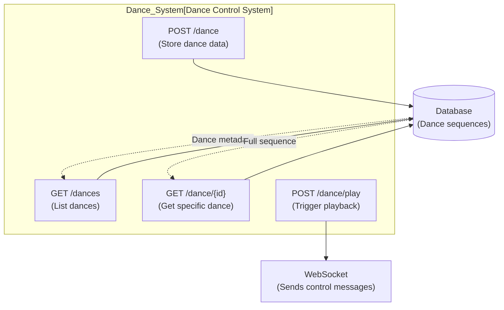
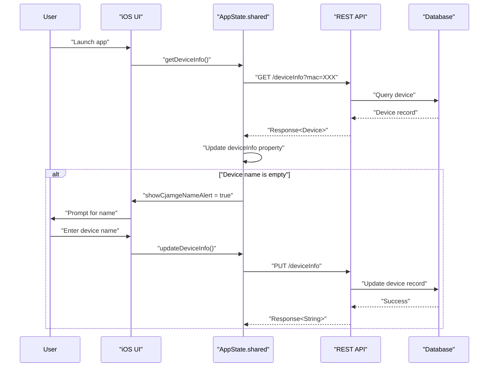

StackChan HTTP REST API

# HTTP REST API

<details>
<summary>Relevant source files</summary>

The following files were used as context for generating this wiki page:

- [app/StackChan/AppState.swift](app/StackChan/AppState.swift)
- [server/README.md](server/README.md)

</details>


## Purpose and Scope

This document describes the HTTP REST API provided by the StackChan backend server for device management, social features, and dance control. The REST API handles non-real-time operations such as device registration, information updates, post management, and comment systems.

For real-time communication including motion control, video streaming, and audio transmission, see [WebSocket Protocol](#7.2). For message type definitions used in both protocols, see [Message Types Reference](#7.4).

**Sources:** [server/README.md:1-45](), [app/StackChan/AppState.swift:1-269]()

---

## API Overview

The StackChan HTTP REST API follows standard REST conventions with JSON payloads for request and response bodies. The server is implemented in Go and provides endpoints organized into three main functional areas:

| API Category | Purpose | Primary Clients |
|--------------|---------|-----------------|
| Device Management | Device registration, information updates, status queries | iOS App, Robot Firmware |
| Social Features | Post creation/management, comment CRUD, feed retrieval | iOS App |
| Dance Control | Dance data storage, playback management | iOS App, Robot Firmware |

The API uses conventional HTTP methods (GET, POST, PUT, DELETE) and returns structured JSON responses with consistent success/error handling patterns.

**Sources:** [server/README.md:8-15]()

---

## System Communication Architecture



**Diagram: HTTP REST API Request Flow**

This diagram shows how the iOS app's `AppState` class uses the `Networking` utility to make HTTP requests to the Go server's REST endpoints, which interact with the database for persistent storage.

**Sources:** [app/StackChan/AppState.swift:141-223](), [server/README.md:8-15]()

---

## Base URL Configuration

The REST API base URL is configured through the `Urls` utility class in the iOS app. The URL structure follows this pattern:

```
http://{server-ip}:{port}/{endpoint}
```

The iOS app retrieves the base URL using `Urls` helper methods, which can be configured for different deployment environments (development, production). Network configuration details are covered in [Network Configuration](#8.3).

**Sources:** [app/StackChan/AppState.swift:94-96](), [app/StackChan/AppState.swift:146](), [app/StackChan/AppState.swift:202]()

---

## Request and Response Format

### Common Request Pattern

All HTTP requests follow a consistent pattern using the `Networking.shared` utility:



**Diagram: HTTP Request/Response Flow**

**Sources:** [app/StackChan/AppState.swift:146-160](), [app/StackChan/AppState.swift:202-222]()

### Response Structure

All API responses use a generic `Response<T>` wrapper structure that can be decoded from JSON:

```swift
Response<T> {
    isSuccess: Bool      // Indicates if operation succeeded
    data: T?             // Typed payload data (optional)
    message: String?     // Error or status message (optional)
}
```

The iOS app uses `Response<T>.decode(from:)` to parse responses, where `T` is the expected data type (e.g., `Device`, `String`, array types).

**Sources:** [app/StackChan/AppState.swift:150-156](), [app/StackChan/AppState.swift:206-217]()

---

## Authentication and Device Identity

The StackChan REST API uses MAC addresses and device identifiers for authentication and routing:

| Identifier | Purpose | Source | Format |
|------------|---------|--------|--------|
| `mac` | Identifies the physical StackChan robot | Device hardware | MAC address string |
| `deviceId` | Identifies the iOS app instance | iOS device vendor UUID | UUID string |
| `deviceType` | Distinguishes client type | Client configuration | "App" or "Device" |

The iOS app stores the associated device MAC address in `AppStorage`:

```swift
@AppStorage("deviceMac") var deviceMac: String = ""
```

And generates a unique device ID from the iOS device:

```swift
static let deviceId = UIDevice.current.identifierForVendor?.uuidString ?? UUID().uuidString
```

These identifiers are included as parameters in API requests to associate actions with specific devices and users.

**Sources:** [app/StackChan/AppState.swift:23](), [app/StackChan/AppState.swift:36](), [app/StackChan/AppState.swift:94]()

---

## Device Management Endpoints

### GET /deviceInfo

Retrieves information about a specific StackChan device.

**Request Parameters:**

| Parameter | Type | Required | Description |
|-----------|------|----------|-------------|
| `mac` | String | Yes | MAC address of the device |

**Response Type:** `Response<Device>`

**Implementation in iOS App:**

```swift
func getDeviceInfo() {
    let map = [
        ValueConstant.mac: deviceMac
    ]
    Networking.shared.get(pathUrl: Urls.deviceInfo, parameters: map) { result in
        // Handle response...
    }
}
```

The response includes the `Device` model containing device name, online status, and other metadata. If the device name is empty, the app prompts the user to set a name.

**Sources:** [app/StackChan/AppState.swift:198-223]()

### PUT /deviceInfo

Updates device information such as name or configuration.

**Request Parameters:**

| Parameter | Type | Required | Description |
|-----------|------|----------|-------------|
| `mac` | String | Yes | MAC address of the device |
| `name` | String | Yes | New device name |

**Response Type:** `Response<String>`

**Implementation in iOS App:**

```swift
func updateDeviceInfo() {
    let map = [
        ValueConstant.mac: deviceMac,
        ValueConstant.name: deviceInfo.name,
    ]
    Networking.shared.put(pathUrl: Urls.deviceInfo, parameters: map) { result in
        // Handle response...
    }
}
```

This endpoint is used when the user changes the device name or other editable properties. The server updates the database record and returns a success indicator.

**Sources:** [app/StackChan/AppState.swift:141-161]()

### Device Registration

When a new StackChan device is first discovered and paired via Bluetooth, device registration occurs through the REST API. The server creates a database record associating the device's MAC address with metadata such as name, registration timestamp, and online status.

**Sources:** [server/README.md:10](), [app/StackChan/AppState.swift:36]()

---

## Social Features Endpoints

The StackChan server provides a social platform allowing users to create posts about their devices, similar to a social feed. Posts can include text and images, and users can comment on posts.



**Diagram: Social Features API Endpoints**

**Sources:** [server/README.md:11-13]()

### POST /device-post

Creates a new device post with optional text and image content.

**Request Parameters:**

| Parameter | Type | Required | Description |
|-----------|------|----------|-------------|
| `deviceId` | String | Yes | Device or user identifier |
| `mac` | String | Yes | Associated device MAC address |
| `content` | String | No | Post text content |
| `image` | Binary/Base64 | No | Post image data |

**Response Type:** `Response<Post>`

Posts are stored in the database with timestamps and associated with the posting device/user.

### GET /device-posts

Retrieves a feed of device posts, typically paginated or filtered by device.

**Request Parameters:**

| Parameter | Type | Required | Description |
|-----------|------|----------|-------------|
| `mac` | String | No | Filter by device MAC address |
| `limit` | Integer | No | Number of posts to return |
| `offset` | Integer | No | Pagination offset |

**Response Type:** `Response<[Post]>` (array of posts)

### PUT /device-post

Updates an existing post's content.

**Request Parameters:**

| Parameter | Type | Required | Description |
|-----------|------|----------|-------------|
| `postId` | String | Yes | Post identifier |
| `content` | String | No | Updated text content |
| `image` | Binary/Base64 | No | Updated image data |

### DELETE /device-post

Deletes a post and its associated comments.

**Request Parameters:**

| Parameter | Type | Required | Description |
|-----------|------|----------|-------------|
| `postId` | String | Yes | Post identifier |

**Sources:** [server/README.md:11-12]()

### Comment CRUD Operations

Comments follow similar CRUD patterns:

- **POST /comment** - Create a comment on a post
- **GET /comments** - Retrieve comments for a post (parameter: `postId`)
- **PUT /comment** - Update a comment
- **DELETE /comment** - Delete a comment

Each comment is associated with a parent post and includes the commenter's device identifier, timestamp, and text content.

**Sources:** [server/README.md:12]()

---

## Dance Control Endpoints

The dance control system allows storing and managing choreographed motion sequences that can be played back on StackChan robots.



**Diagram: Dance Control API Architecture**

### POST /dance

Uploads and stores a new dance sequence.

**Request Parameters:**

| Parameter | Type | Required | Description |
|-----------|------|----------|-------------|
| `name` | String | Yes | Dance name |
| `data` | JSON | Yes | Serialized motion sequence |
| `duration` | Integer | No | Duration in milliseconds |

Dance data includes timestamped servo positions and expressions that define the choreographed movements.

### GET /dances

Retrieves a list of available dances.

**Response Type:** `Response<[Dance]>` (array of dance metadata)

### GET /dance/{id}

Retrieves the full sequence data for a specific dance.

**Response Type:** `Response<Dance>` (complete dance data)

### POST /dance/play

Triggers playback of a dance sequence on a connected device. This endpoint coordinates with the WebSocket system to send real-time control messages to the robot.

**Request Parameters:**

| Parameter | Type | Required | Description |
|-----------|------|----------|-------------|
| `danceId` | String | Yes | Dance identifier |
| `mac` | String | Yes | Target device MAC address |

The server retrieves the dance sequence from the database and sends motion control messages through the WebSocket connection to the specified device.

**Sources:** [server/README.md:13-14]()

---

## Error Handling

All API endpoints return structured error responses when operations fail:

```swift
Response<T> {
    isSuccess: false
    data: nil
    message: "Error description"
}
```

The iOS app checks the `isSuccess` field and handles failures appropriately:

```swift
if response.isSuccess {
    // Process data
} else {
    // Handle error using response.message
}
```

Common error scenarios include:

| Error Condition | HTTP Status | Response Pattern |
|-----------------|-------------|------------------|
| Device not found | 404 | `isSuccess: false, message: "Device not found"` |
| Invalid parameters | 400 | `isSuccess: false, message: "Missing required parameter"` |
| Database error | 500 | `isSuccess: false, message: "Internal server error"` |
| Unauthorized access | 403 | `isSuccess: false, message: "Access denied"` |

**Sources:** [app/StackChan/AppState.swift:150-159](), [app/StackChan/AppState.swift:206-221]()

---

## API Usage Patterns in iOS App

### Device Information Lifecycle



**Diagram: Device Information Management Flow**

The iOS app retrieves device information on launch and prompts for configuration if needed. The `AppState` class maintains the current `deviceInfo` state and synchronizes it with the server.

**Sources:** [app/StackChan/AppState.swift:198-223](), [app/StackChan/AppState.swift:141-161]()

### State Management Integration

The `AppState` singleton manages device information as a published property:

```swift
@Published var deviceInfo: Device = Device()
```

UI components observe this property using SwiftUI's observation system. When API calls complete, the state is updated with animation:

```swift
withAnimation {
    self.deviceInfo = deviceInfo
    self.newName = self.deviceInfo.name ?? ""
}
```

This pattern ensures UI updates are smooth and synchronized with server state.

**Sources:** [app/StackChan/AppState.swift:50](), [app/StackChan/AppState.swift:208-211]()

---

## Parameter Constants

The iOS app uses constant definitions for API parameter keys to avoid string literals:

| Constant | Value | Usage |
|----------|-------|-------|
| `ValueConstant.mac` | "mac" | Device MAC address parameter |
| `ValueConstant.name` | "name" | Device name parameter |

These constants are referenced throughout the codebase for type-safe parameter construction:

```swift
let map = [
    ValueConstant.mac: deviceMac,
    ValueConstant.name: deviceInfo.name,
]
```

**Sources:** [app/StackChan/AppState.swift:143-145](), [app/StackChan/AppState.swift:199-201]()

---

## Integration with WebSocket System

While the REST API handles persistent data operations, the WebSocket system (documented in [WebSocket Protocol](#7.2)) handles real-time communication. These systems are complementary:

| Operation Type | Protocol | Example |
|----------------|----------|---------|
| Device name update | HTTP REST | `PUT /deviceInfo` |
| Device online status | WebSocket | `deviceOnline` / `deviceOffline` messages |
| Post creation | HTTP REST | `POST /device-post` |
| Motion control | WebSocket | `controlMotion` message |
| Dance metadata storage | HTTP REST | `POST /dance` |
| Dance playback commands | WebSocket | Control messages from dance sequence |

The server coordinates between these protocols. For example, when a dance is triggered via `POST /dance/play`, the server retrieves the sequence from the database (populated via REST) and sends motion commands through WebSocket.

**Sources:** [app/StackChan/AppState.swift:93-96](), [app/StackChan/AppState.swift:246-267](), [server/README.md:10-14]()

---

## Summary

The StackChan HTTP REST API provides:

1. **Device Management** - Registration, information updates, and status queries via `GET/PUT /deviceInfo`
2. **Social Features** - Post and comment CRUD operations for the community feed
3. **Dance Control** - Storage and retrieval of choreographed motion sequences
4. **Consistent Patterns** - Uniform request/response structure using `Response<T>` wrapper
5. **State Synchronization** - Integration with iOS app's `AppState` for reactive UI updates

The API complements the WebSocket protocol by handling persistent data operations while WebSocket manages real-time communication. Together, they provide the complete communication infrastructure for the StackChan ecosystem.

**Sources:** [server/README.md:1-45](), [app/StackChan/AppState.swift:1-269]()