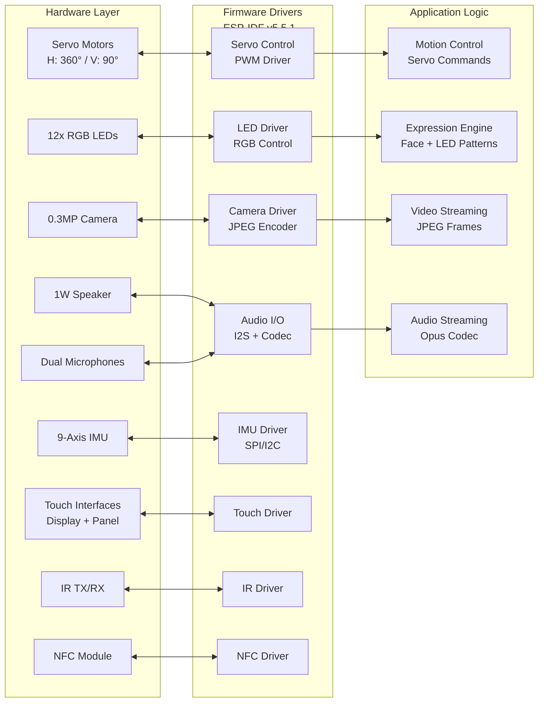
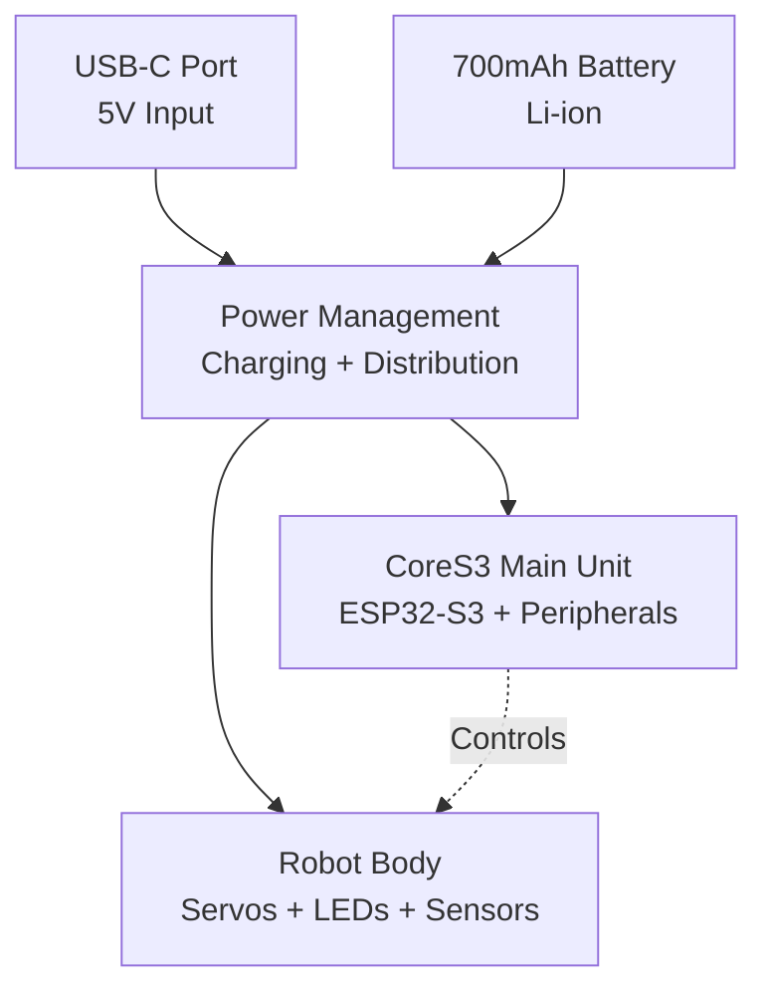

StackChan Hardware & Robot

# Hardware & Robot

Relevant source files

The following files were used as context for generating this wiki page:

- [README.md](README.md)

## Purpose and Scope

This document describes the physical StackChan robot hardware and the CoreS3 controller platform. It provides an overview of the robot's physical construction, major hardware components, and their integration. Detailed specifications and technical information for individual subsystems are covered in the following child pages:

- For ESP32-S3 processor specifications and memory architecture, see [CoreS3 Controller](#3.1)
- For camera, IMU, proximity sensor, and input device details, see [Sensors and Input Devices](#3.2)
- For servo motors, LEDs, speaker, and display specifications, see [Actuators and Output Devices](#3.3)
- For Wi-Fi, Bluetooth LE, USB-C, NFC, and infrared interfaces, see [Communication Interfaces](#3.4)
- For battery management and motor safety guidelines, see [Power and Safety](#3.5)

For firmware development that controls this hardware, see [Firmware Development](#4).

Sources: [README.md:1-22]()

## Physical Robot Overview

StackChan is a desktop robot consisting of two integrated hardware modules:

| Module | Description | Key Components |
|--------|-------------|----------------|
| **Main Unit** | CoreS3 IoT development kit | ESP32-S3 SoC, 2.0" touch display, camera, IMU, sensors, audio I/O |
| **Robot Body** | Physical robot structure | Servos, battery, RGB LEDs, IR TX/RX, touch panel, NFC |

The main unit mounts on top of the robot body, with the two connected via internal interfaces that provide power distribution and communication between the CoreS3 controller and the robot body's actuators and sensors.

### Main Unit (CoreS3)

The CoreS3 serves as the robot's brain, integrating:

- **Processing**: ESP32-S3 dual-core 240 MHz processor with 16MB Flash and 8MB PSRAM
- **Display**: 2.0-inch capacitive touch display with high-strength glass cover
- **Vision**: 0.3 MP camera for video capture and streaming
- **Sensing**: Proximity sensor, 9-axis IMU (accelerometer + gyroscope + magnetometer)
- **Audio**: 1W speaker and dual microphones for voice I/O
- **Storage**: MicroSD card slot for data storage
- **Controls**: Power and reset buttons

### Robot Body

The robot body provides:

- **Power**: USB-C interface and 700 mAh battery
- **Motion**: Two feedback servos
  - Horizontal axis: 360° continuous rotation
  - Vertical axis: 90° movement range
- **Visual Output**: 12 RGB LEDs arranged in two rows
- **Communication**: Infrared transmitter and receiver
- **User Input**: Three-zone capacitive touch panel
- **NFC**: Full-featured NFC module

Sources: [README.md:11-13]()

## Hardware Architecture

### Component Block Diagram

```mermaid
graph TB
    subgraph CoreS3["CoreS3 Main Unit"]
        ESP32S3["ESP32-S3 SoC<br/>240MHz Dual-Core<br/>16MB Flash / 8MB PSRAM"]
        Display["2.0-inch Touch Display<br/>Capacitive Touch<br/>High-strength Glass"]
        Camera["0.3MP Camera<br/>Video Capture"]
        IMU["9-Axis IMU<br/>Accel + Gyro + Mag"]
        Proximity["Proximity Sensor"]
        Audio["Audio Subsystem<br/>1W Speaker<br/>Dual Microphones"]
        MicroSD["MicroSD Card Slot"]
        Buttons["Power/Reset Buttons"]
    end
    
    subgraph RobotBody["Robot Body"]
        USBC["USB-C Interface<br/>Power + Data"]
        Battery["700mAh Battery"]
        ServoH["Horizontal Servo<br/>360° Continuous"]
        ServoV["Vertical Servo<br/>90° Range"]
        LEDs["12x RGB LEDs<br/>Two Rows"]
        IR["Infrared TX/RX"]
        TouchPanel["3-Zone Touch Panel"]
        NFC["NFC Module"]
    end
    
    ESP32S3 --> Display
    ESP32S3 --> Camera
    ESP32S3 --> IMU
    ESP32S3 --> Proximity
    ESP32S3 --> Audio
    ESP32S3 --> MicroSD
    ESP32S3 --> Buttons
    
    ESP32S3 -.->|"Internal Connection"| USBC
    ESP32S3 -.->|"Power Control"| Battery
    ESP32S3 -.->|"PWM Control"| ServoH
    ESP32S3 -.->|"PWM Control"| ServoV
    ESP32S3 -.->|"LED Driver"| LEDs
    ESP32S3 -.->|"UART/GPIO"| IR
    ESP32S3 -.->|"I2C/GPIO"| TouchPanel
    ESP32S3 -.->|"I2C/SPI"| NFC
```

Sources: [README.md:11-13]()

### Hardware-Firmware Integration

The following diagram shows how firmware components interact with the physical hardware:

This architecture shows the three-layer design:
1. **Hardware Layer**: Physical components and interfaces
2. **Firmware Drivers**: ESP-IDF drivers that abstract hardware access
3. **Application Logic**: High-level features that control hardware behavior

Sources: [README.md:11-15]()

## Hardware Component Categories

### Processing and Control

The ESP32-S3 SoC provides:
- Dual-core Xtensa LX7 processors running at 240 MHz
- 16 MB onboard Flash memory for firmware storage
- 8 MB PSRAM for application runtime memory
- Wi-Fi 802.11 b/g/n connectivity
- Bluetooth 5.0 (LE) support

This processing power enables the robot to run the factory firmware with features including facial expressions, motion control, the XiaoZhi AI agent, and real-time video/audio streaming over WebSocket connections.

### Motion System

The robot's motion is controlled by two feedback servos:

| Axis | Servo Type | Range | Purpose |
|------|-----------|-------|---------|
| Horizontal | Continuous rotation | 360° | Pan/rotate the robot's head |
| Vertical | Position control | 90° | Tilt the robot's head up/down |

These servos enable expressive head movements synchronized with facial expressions. The firmware's motion control system generates servo position commands based on expression states and user inputs.

**Safety Note**: Do not manually rotate servo-connected parts when unsure of power/control status, as this may cause hardware damage.

### Visual Output

The robot provides visual feedback through:
- **Display**: 2.0-inch capacitive touch screen showing animated facial expressions
- **RGB LEDs**: 12 individually addressable LEDs in two rows for ambient lighting and status indication

The expression engine coordinates display animations and LED patterns to create cohesive emotional states.

### Audio System

Audio capabilities include:
- **Output**: 1W speaker for voice synthesis, sound effects, and audio playback
- **Input**: Dual microphones for voice capture and command recognition

The audio subsystem supports Opus codec compression for efficient streaming over network connections.

### Sensing and Input

Multiple input methods enable interaction:
- **Vision**: 0.3 MP camera for video calls and environmental sensing
- **Motion**: 9-axis IMU tracks orientation and movement
- **Proximity**: Detects nearby objects and users
- **Touch**: Capacitive display and three-zone touch panel
- **Buttons**: Physical power and reset controls

Sources: [README.md:11-15]()

## Power and Physical Integration

### Power Distribution

The USB-C interface serves dual purposes:
- **Power**: Charges the 700 mAh battery and powers the system
- **Data**: Provides programming interface for flashing firmware via `idf.py flash`

The battery enables untethered operation for portable robot deployment.

### Physical Assembly

The main unit (CoreS3) mounts on top of the robot body structure. Internal connectors provide:
- Power distribution from battery/USB to both units
- Signal lines between ESP32-S3 GPIOs and robot body peripherals (servos, LEDs, touch panel, NFC, IR)
- Data communication paths for sensor and actuator control

Sources: [README.md:13-14](), [README.md:17]()

## Hardware Safety Considerations

**Critical Safety Warning**: Do not forcibly rotate any movable parts connected to the motors by hand when you are unsure whether the motors are powered and under control. Manual rotation against powered servos can cause:
- Mechanical damage to servo gears
- Electrical damage to motor drivers
- Stripped gears or broken linkages

Always ensure the robot is powered off or servos are disabled before manually adjusting positions.

For detailed power management, battery handling, and servo safety guidelines, see [Power and Safety](#3.5).

Sources: [README.md:17]()

## Programming Interfaces

The robot supports multiple programming approaches:

| Interface | Description | Use Case |
|-----------|-------------|----------|
| **ESP-IDF** | Native C/C++ development using ESP-IDF v5.5.1 | Full-featured firmware development with direct hardware access |
| **Arduino** | Arduino IDE with ESP32 support | Simplified programming for custom behaviors |
| **UiFlow2** | Visual block-based programming | Rapid prototyping without coding |

The factory firmware comes pre-installed with features including facial expressions, XiaoZhi AI agent, and iOS app integration. Custom firmware can be developed to implement specialized behaviors and control patterns.

For firmware development details, see [Firmware Development](#4).

Sources: [README.md:15]()

## Summary

The StackChan robot integrates a powerful CoreS3 controller with a purpose-built robot body to create an expressive, interactive desktop companion. The ESP32-S3 SoC provides sufficient processing power for real-time control, video streaming, and AI agent functionality, while the diverse sensor and actuator suite enables rich physical interactions. The modular design supports both factory firmware and custom development through multiple programming interfaces.

For detailed specifications of individual hardware subsystems, refer to the child pages listed at the beginning of this document.

Sources: [README.md:1-22]()