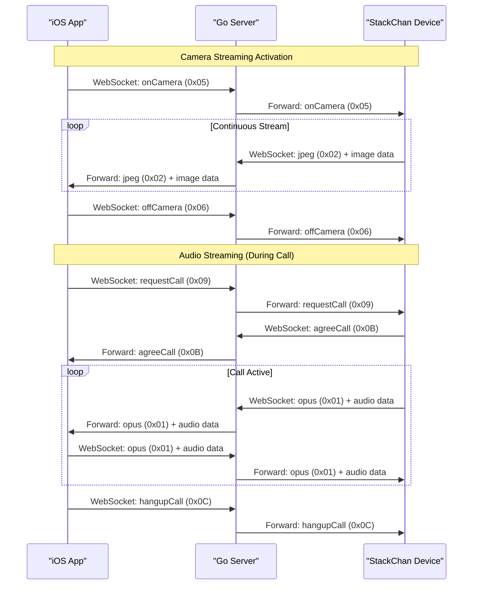
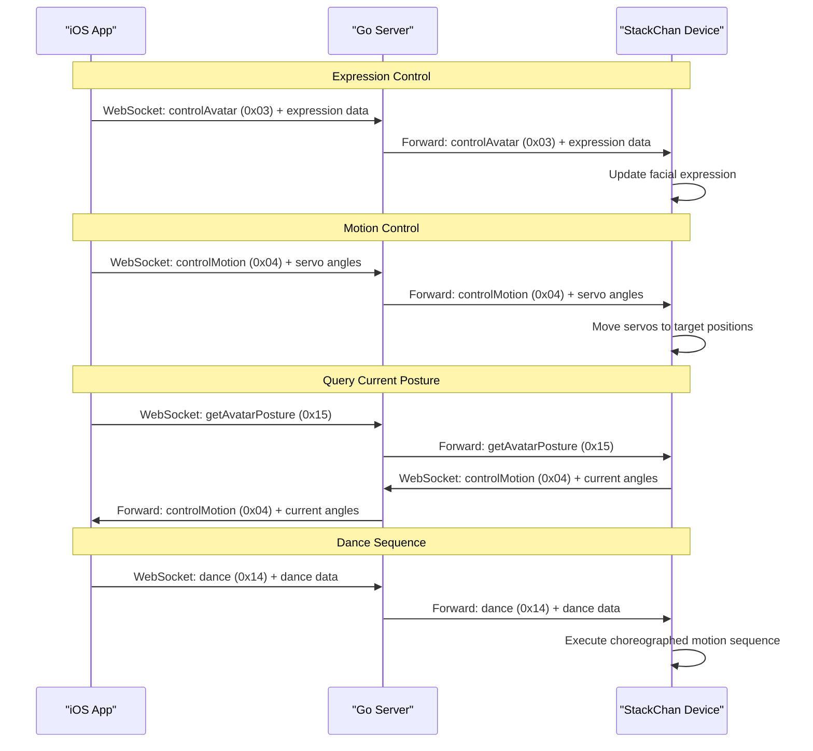
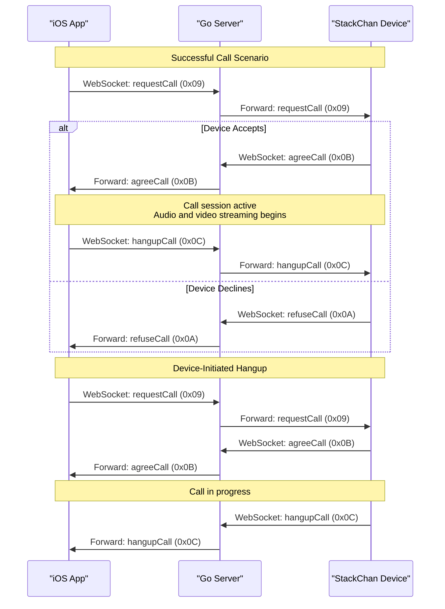
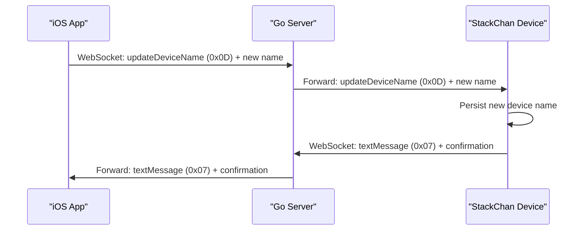
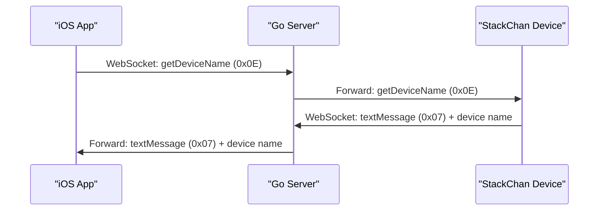
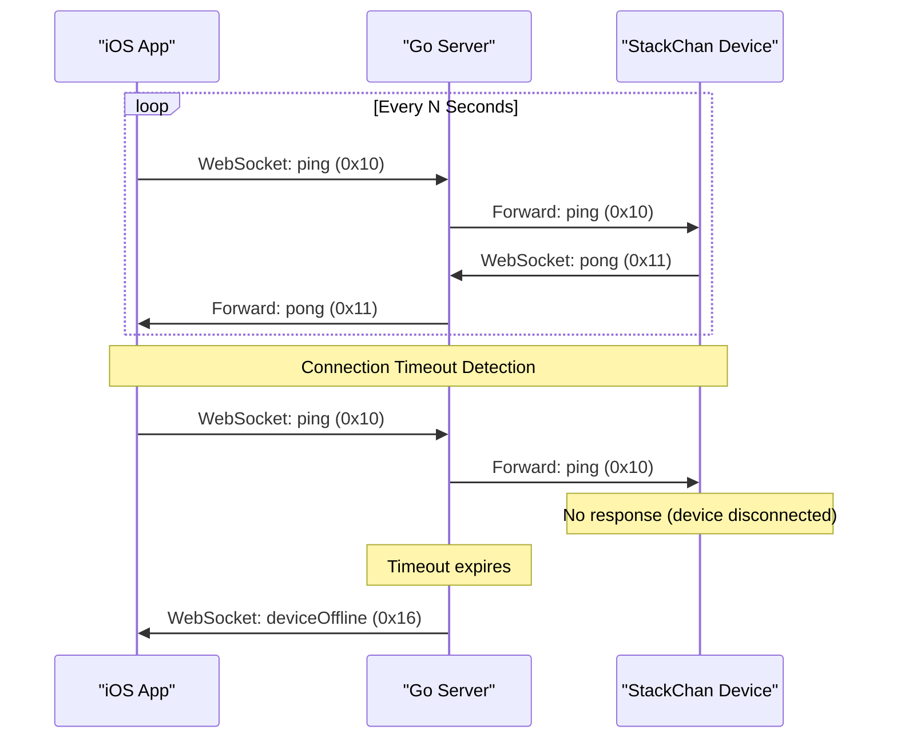
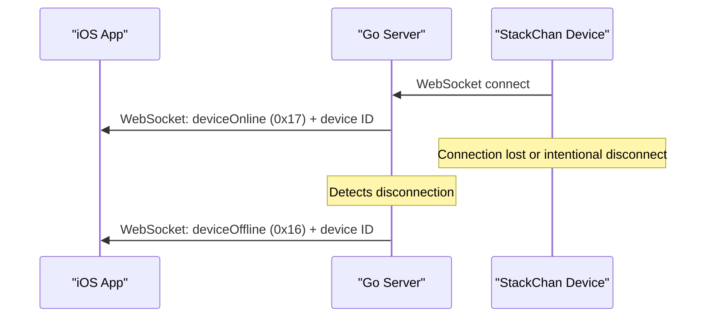
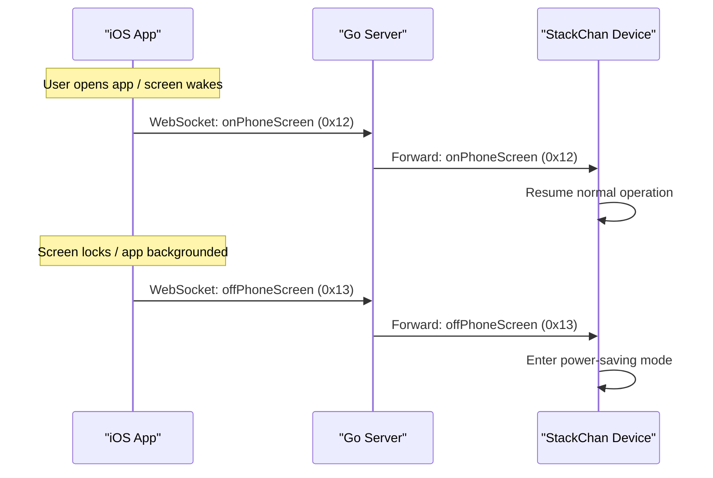

StackChan Message Types Reference

# Message Types Reference

<details>
<summary>Relevant source files</summary>

The following files were used as context for generating this wiki page:

- [app/StackChan/Model/MessageModel.swift](app/StackChan/Model/MessageModel.swift)

</details>


## Purpose and Scope

This page provides a complete reference of all message types used in WebSocket communication within the StackChan system. Message types define the purpose and format of data exchanged between the iOS app, backend server, and robot firmware. Each message type is identified by a unique byte value and carries specific payload data.

For information about the WebSocket protocol structure and binary message format, see [WebSocket Protocol](#7.2). For HTTP-based device management operations, see [HTTP REST API](#7.3).

## Message Type System Overview

The StackChan system uses a type-tagged message protocol where each WebSocket message begins with a 1-byte type identifier followed by optional payload data. The message types are defined in the `MsgType` enum, which specifies 23 distinct message types covering media streaming, device control, call management, and status updates.

The type system supports bidirectional communication:
- **Client-to-Device**: Control commands, call requests, configuration updates
- **Device-to-Client**: Media streams, status updates, device information
- **Bidirectional**: Heartbeat messages, online/offline notifications

Sources: [app/StackChan/Model/MessageModel.swift:1-40]()

## Message Type Categories

```mermaid
graph TB
    subgraph "MsgType Enum"
        MediaTypes["Media Streaming<br/>0x01-0x02"]
        ControlTypes["Device Control<br/>0x03-0x04"]
        CameraTypes["Camera Control<br/>0x05-0x06"]
        CommunicationTypes["Communication<br/>0x07, 0x09-0x0C"]
        DeviceTypes["Device Management<br/>0x0D-0x0E"]
        HeartbeatTypes["Heartbeat<br/>0x10-0x11"]
        ScreenTypes["Screen Control<br/>0x12-0x13"]
        MotionTypes["Motion Sequences<br/>0x14-0x15"]
        StatusTypes["Connection Status<br/>0x16-0x17"]
    end
    
    MediaTypes --> opus["opus (0x01)"]
    MediaTypes --> jpeg["jpeg (0x02)"]
    
    ControlTypes --> controlAvatar["controlAvatar (0x03)"]
    ControlTypes --> controlMotion["controlMotion (0x04)"]
    
    CameraTypes --> onCamera["onCamera (0x05)"]
    CameraTypes --> offCamera["offCamera (0x06)"]
    
    CommunicationTypes --> textMessage["textMessage (0x07)"]
    CommunicationTypes --> requestCall["requestCall (0x09)"]
    CommunicationTypes --> refuseCall["refuseCall (0x0A)"]
    CommunicationTypes --> agreeCall["agreeCall (0x0B)"]
    CommunicationTypes --> hangupCall["hangupCall (0x0C)"]
    
    DeviceTypes --> updateDeviceName["updateDeviceName (0x0D)"]
    DeviceTypes --> getDeviceName["getDeviceName (0x0E)"]
    
    HeartbeatTypes --> ping["ping (0x10)"]
    HeartbeatTypes --> pong["pong (0x11)"]
    
    ScreenTypes --> onPhoneScreen["onPhoneScreen (0x12)"]
    ScreenTypes --> offPhoneScreen["offPhoneScreen (0x13)"]
    
    MotionTypes --> dance["dance (0x14)"]
    MotionTypes --> getAvatarPosture["getAvatarPosture (0x15)"]
    
    StatusTypes --> deviceOffline["deviceOffline (0x16)"]
    StatusTypes --> deviceOnline["deviceOnline (0x17)"]
```



Sources: [app/StackChan/Model/MessageModel.swift:9-39]()

## Complete Message Type Reference

| Message Type | Hex Value | Direction | Purpose | Payload |
|--------------|-----------|-----------|---------|---------|
| `opus` | 0x01 | Device → Client | Audio stream in Opus codec format | Opus-encoded audio data |
| `jpeg` | 0x02 | Device → Client | Camera image frame in JPEG format | JPEG-encoded image data |
| `controlAvatar` | 0x03 | Client → Device | Control robot facial expression | Expression data structure |
| `controlMotion` | 0x04 | Client → Device | Control servo motor positions | Motion command data |
| `onCamera` | 0x05 | Client → Device | Enable camera streaming | None |
| `offCamera` | 0x06 | Client → Device | Disable camera streaming | None |
| `textMessage` | 0x07 | Bidirectional | Send text message | UTF-8 text string |
| `requestCall` | 0x09 | Client → Device | Initiate video/audio call | Call parameters |
| `refuseCall` | 0x0A | Device → Client | Decline incoming call | None |
| `agreeCall` | 0x0B | Device → Client | Accept incoming call | None |
| `hangupCall` | 0x0C | Bidirectional | Terminate active call | None |
| `updateDeviceName` | 0x0D | Client → Device | Set device name | UTF-8 device name string |
| `getDeviceName` | 0x0E | Client → Device | Query current device name | None (response via textMessage) |
| `ping` | 0x10 | Client → Device | Connection heartbeat request | None or timestamp |
| `pong` | 0x11 | Device → Client | Heartbeat response | None or timestamp echo |
| `onPhoneScreen` | 0x12 | Client → Device | Notify phone screen is active | None |
| `offPhoneScreen` | 0x13 | Client → Device | Notify phone screen is inactive | None |
| `dance` | 0x14 | Client → Device | Execute dance sequence | Dance data or dance ID |
| `getAvatarPosture` | 0x15 | Client → Device | Query current servo positions | None (response via controlMotion) |
| `deviceOffline` | 0x16 | Server → Client | Notify device disconnection | Device identifier |
| `deviceOnline` | 0x17 | Server → Client | Notify device connection | Device identifier |

Sources: [app/StackChan/Model/MessageModel.swift:9-39]()

## Message Type Definitions in Code

The `MsgType` enum is implemented as a `UInt8` enumeration that is `Codable` for JSON serialization. Each case corresponds to a specific message type identifier.

```swift
enum MsgType: UInt8, Codable {
    case opus = 0x01
    case jpeg = 0x02
    case controlAvatar = 0x03
    case controlMotion = 0x04
    case onCamera = 0x05
    case offCamera = 0x06
    case textMessage = 0x07
    case requestCall = 0x09
    case refuseCall = 0x0A
    case agreeCall = 0x0B
    case hangupCall = 0x0C
    case updateDeviceName = 0x0D
    case getDeviceName = 0x0E
    case ping = 0x10
    case pong = 0x11
    case onPhoneScreen = 0x12
    case offPhoneScreen = 0x13
    case dance = 0x14
    case getAvatarPosture = 0x15
    case deviceOffline = 0x16
    case deviceOnline = 0x17
}
```

Sources: [app/StackChan/Model/MessageModel.swift:9-39]()

## Media Streaming Message Flow



Sources: [app/StackChan/Model/MessageModel.swift:10-11](), [app/StackChan/Model/MessageModel.swift:15-16](), [app/StackChan/Model/MessageModel.swift:19-22]()

## Control Command Message Flow



Sources: [app/StackChan/Model/MessageModel.swift:12-14](), [app/StackChan/Model/MessageModel.swift:33-35]()

## Call Management Message Flow



Sources: [app/StackChan/Model/MessageModel.swift:19-22]()

## Device Management Messages

The device management message types handle configuration and information queries.

### Update Device Name Flow



### Query Device Name Flow



Sources: [app/StackChan/Model/MessageModel.swift:24-25](), [app/StackChan/Model/MessageModel.swift:18]()

## Heartbeat and Connection Management

### Heartbeat Protocol

The `ping` (0x10) and `pong` (0x11) message types implement a heartbeat mechanism to detect connection failures and maintain WebSocket sessions.



### Connection Status Notifications

The `deviceOffline` (0x16) and `deviceOnline` (0x17) message types are sent by the server to notify clients of device connection state changes.



Sources: [app/StackChan/Model/MessageModel.swift:27-28](), [app/StackChan/Model/MessageModel.swift:36-38]()

## Screen State Notifications

The `onPhoneScreen` (0x12) and `offPhoneScreen` (0x13) message types allow the iOS app to notify the device about the phone screen state. The device can use this information to optimize power consumption or change behavior when the screen is off.



Sources: [app/StackChan/Model/MessageModel.swift:30-31]()

## Message Type Usage by Component

| Message Type | Sent by iOS App | Sent by Device | Sent by Server |
|--------------|-----------------|----------------|----------------|
| `opus` | ✓ | ✓ | (relay only) |
| `jpeg` | | ✓ | (relay only) |
| `controlAvatar` | ✓ | | (relay only) |
| `controlMotion` | ✓ | ✓ (response) | (relay only) |
| `onCamera` | ✓ | | (relay only) |
| `offCamera` | ✓ | | (relay only) |
| `textMessage` | ✓ | ✓ | (relay only) |
| `requestCall` | ✓ | | (relay only) |
| `refuseCall` | | ✓ | (relay only) |
| `agreeCall` | | ✓ | (relay only) |
| `hangupCall` | ✓ | ✓ | (relay only) |
| `updateDeviceName` | ✓ | | (relay only) |
| `getDeviceName` | ✓ | | (relay only) |
| `ping` | ✓ | | (relay only) |
| `pong` | | ✓ | (relay only) |
| `onPhoneScreen` | ✓ | | (relay only) |
| `offPhoneScreen` | ✓ | | (relay only) |
| `dance` | ✓ | | (relay only) |
| `getAvatarPosture` | ✓ | | (relay only) |
| `deviceOffline` | | | ✓ (originated) |
| `deviceOnline` | | | ✓ (originated) |

Sources: [app/StackChan/Model/MessageModel.swift:9-39]()

## Implementation Notes

### Enum Declaration

The `MsgType` enum is declared with the following properties:
- **Base Type**: `UInt8` for single-byte representation in binary protocol
- **Protocol Conformance**: `Codable` for JSON encoding/decoding when needed
- **Raw Values**: Hexadecimal literals (0x01 - 0x17) for clarity

### Reserved Values

Note that message type value 0x08 is not assigned in the current implementation. This gap exists between `textMessage` (0x07) and `requestCall` (0x09).

### Extensibility

New message types can be added by:
1. Defining new cases in the `MsgType` enum with unused byte values
2. Updating all three components (iOS app, firmware, server) to handle the new type
3. Documenting the payload structure and communication pattern

Sources: [app/StackChan/Model/MessageModel.swift:9-39]()