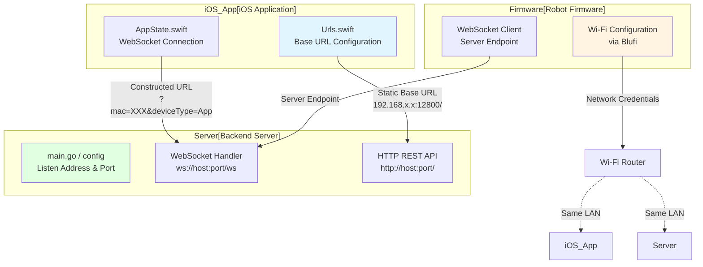
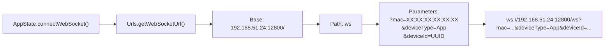
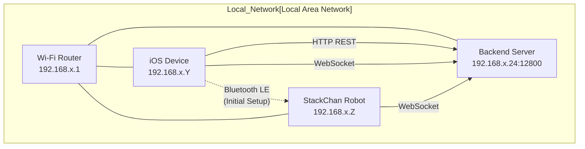
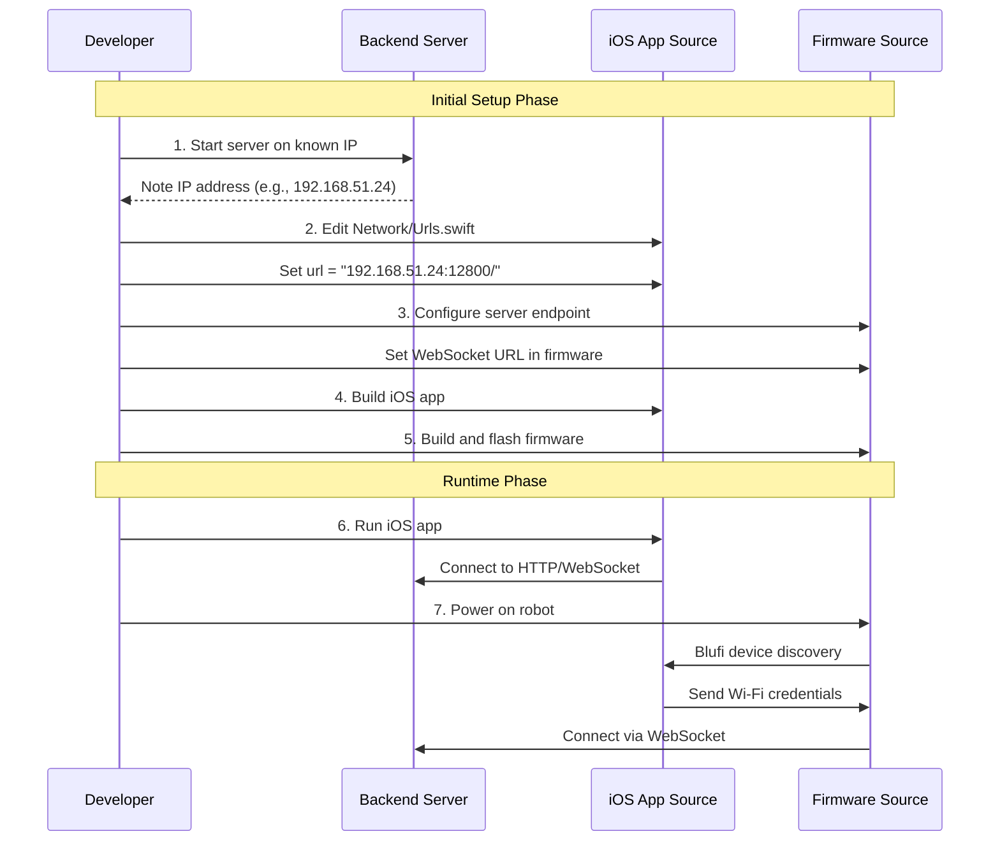
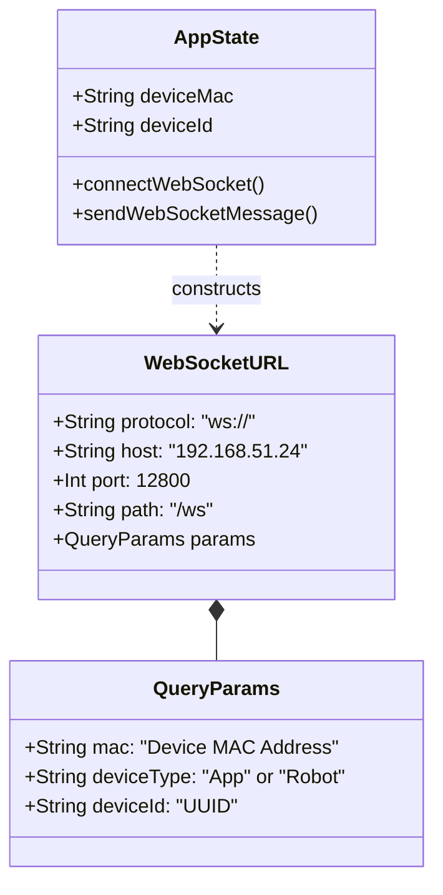

StackChan Network Configuration

# Network Configuration

<details>
<summary>Relevant source files</summary>

The following files were used as context for generating this wiki page:

- [app/README.md](app/README.md)
- [app/StackChan/AppState.swift](app/StackChan/AppState.swift)

</details>


## Purpose and Scope

This document explains how to configure network settings across all StackChan components to enable communication between the robot firmware, iOS application, and backend server. It covers server IP addresses, WebSocket URLs, port numbers, and the configuration files that must be modified in each component.

For information about the communication protocols themselves, see [Communication Protocols](#7). For development environment setup, see [Development Environment Setup](#8.1).

## Network Architecture and Configuration Points

The StackChan system requires network configuration at three key points to establish communication:



**Sources:** [app/README.md:42-52](), [app/StackChan/AppState.swift:94]()

## iOS Application Configuration

### Base URL Configuration

The iOS app stores the server's base URL in a central configuration file. This URL must be updated to point to the machine running the backend server.

**Configuration File:** `app/StackChan/Network/Urls.swift`

**Required Changes:**
1. Locate the static URL constant defining the base server address
2. Replace the IP address with your server's IP address on the local network
3. Ensure the port number matches the server's listening port (default: 12800)

**Example Configuration:**
```swift
// Base URL configured according to the server's IP
static let url = "192.168.51.24:12800/"
```

The URL format is: `<IP_ADDRESS>:<PORT>/` where:
- `IP_ADDRESS`: IPv4 address of the machine running the backend server
- `PORT`: The port number the server listens on (typically 12800)
- Trailing slash `/` is required

**Sources:** [app/README.md:45-50]()

### WebSocket URL Construction

The iOS app constructs WebSocket URLs dynamically by combining the base URL with connection parameters:



**URL Components:**
- **Protocol:** `ws://` (WebSocket)
- **Base URL:** Retrieved from `Urls.getWebSocketUrl()`
- **Query Parameters:**
  - `mac`: Device MAC address stored in `AppState.deviceMac`
  - `deviceType`: Fixed value "App" identifying this as a mobile client
  - `deviceId`: Unique device identifier from `AppState.deviceId`

**Implementation Location:** [app/StackChan/AppState.swift:93-96]()

**Sources:** [app/StackChan/AppState.swift:93-96]()

## Backend Server Configuration

### Listen Address and Port

The backend server must be configured to listen on a network interface accessible to both the iOS app and robot firmware. The default configuration uses port 12800.

**Configuration Locations:**
- Server startup parameters in `main.go`
- Environment variables or configuration files (if used)
- Command-line arguments when launching the server

**Network Requirements:**
- Server must be reachable on the local network
- Firewall rules must allow inbound connections on the configured port
- Both HTTP and WebSocket connections must be supported on the same port

### Endpoint Structure

The server exposes two types of endpoints on the same port:

| Endpoint Type | Path Pattern | Purpose |
|--------------|--------------|---------|
| HTTP REST API | `/deviceInfo`, `/device-post`, `/comment`, etc. | Device management and social features |
| WebSocket | `/ws?mac=...&deviceType=...&deviceId=...` | Real-time bidirectional communication |

**Sources:** Based on system architecture diagrams and [app/StackChan/AppState.swift:94-96]()

## Robot Firmware Configuration

### Wi-Fi Network Configuration

The robot firmware connects to Wi-Fi through the Blufi protocol during initial setup. Network credentials are transmitted from the iOS app via Bluetooth LE.

**Configuration Method:**
1. iOS app discovers robot via Bluetooth LE
2. User enters Wi-Fi SSID and password in the app
3. App transmits credentials to robot via Blufi protocol
4. Robot stores credentials and connects to Wi-Fi network

### Server Endpoint Configuration

The firmware must be configured with the backend server's IP address and port to establish WebSocket connections.

**Configuration Points:**
- Firmware source code constants
- Build-time configuration
- Runtime configuration storage (if supported)

The firmware WebSocket client connects to: `ws://<SERVER_IP>:<PORT>/ws?mac=<MAC>&deviceType=Robot&deviceId=<ID>`

**Sources:** Based on system architecture and communication protocol patterns

## Network Topology Requirements



**Network Requirements:**
- All components must be on the same local network
- Static or reserved DHCP IP addresses recommended for the server
- Router must support multicast/broadcast for device discovery (Blufi)
- Port forwarding not typically required (local network only)

**Sources:** Based on system architecture diagrams

## Configuration Workflow

### Step-by-Step Configuration Process



**Configuration Steps:**

1. **Determine Server IP Address**
   - Start the backend server
   - Identify the machine's IP address on the local network
   - Use `ifconfig` (macOS/Linux) or `ipconfig` (Windows)

2. **Configure iOS Application**
   - Open `app/StackChan/Network/Urls.swift`
   - Update the `url` constant with server IP and port
   - Example: `static let url = "192.168.51.24:12800/"`
   - Save and rebuild the app

3. **Configure Firmware**
   - Update server endpoint configuration in firmware source
   - Build firmware with new configuration
   - Flash firmware to robot hardware

4. **Verify Configuration**
   - Ensure all components can ping the server IP
   - Check that the server is listening on the configured port
   - Test connectivity before deploying

**Sources:** [app/README.md:42-62]()

## Port Numbers and Protocols

| Component | Protocol | Default Port | Configurable | Purpose |
|-----------|----------|--------------|--------------|---------|
| Backend Server HTTP | HTTP | 12800 | Yes | REST API endpoints |
| Backend Server WebSocket | WebSocket | 12800 | Yes | Real-time communication |
| Bluetooth LE | BLE | N/A | No | Initial pairing and configuration |

**Port Configuration:**
- The server uses a single port for both HTTP and WebSocket connections
- Standard port 12800 is used by default but can be changed
- Both iOS app and firmware must use matching port numbers
- No external port forwarding required for local network operation

**Sources:** [app/README.md:49](), [app/StackChan/AppState.swift:94]()

## WebSocket Connection Parameters

The WebSocket connection URL includes query parameters that identify the connecting client:



**Parameter Details:**

- **`mac`**: MAC address of the StackChan device being controlled
  - Stored in `AppState.deviceMac` (iOS)
  - Retrieved from hardware (Firmware)
  - Format: `XX:XX:XX:XX:XX:XX`

- **`deviceType`**: Identifies the type of client
  - iOS app: `"App"`
  - Robot firmware: `"Robot"`
  - Used by server for message routing

- **`deviceId`**: Unique identifier for the connecting client
  - iOS: `UIDevice.current.identifierForVendor.uuidString`
  - Firmware: Hardware-specific identifier
  - Persists across connections

**Sources:** [app/StackChan/AppState.swift:23, 94-96]()

## Configuration File Reference

| Component | File Path | Configuration Type | Key Settings |
|-----------|-----------|-------------------|--------------|
| iOS App | `app/StackChan/Network/Urls.swift` | Source code constant | `url`, WebSocket URL methods |
| iOS App | `app/StackChan/AppState.swift` | State management | WebSocket connection logic |
| Backend Server | `server/main.go` | Server startup | Listen address, port |
| Firmware | Various `.c`/`.cpp` files | Build constants | Server endpoint, Wi-Fi config |

**Sources:** [app/README.md:45](), [app/StackChan/AppState.swift:1]()

## Troubleshooting Network Configuration

### Common Issues and Solutions

**Issue: iOS App Cannot Connect to Server**
- Verify the IP address in `Urls.swift` matches the server's actual IP
- Check that the server is running and listening on the configured port
- Ensure iOS device and server are on the same network
- Check firewall settings on the server machine
- Verify the trailing slash `/` is present in the URL

**Issue: Robot Cannot Connect via WebSocket**
- Confirm robot is connected to Wi-Fi (check via Blufi status)
- Verify firmware has correct server IP address compiled in
- Check that server WebSocket endpoint is accepting connections
- Ensure MAC address is correctly formatted in connection URL

**Issue: WebSocket Connection Drops Frequently**
- Check network stability and signal strength
- Verify router settings allow WebSocket connections
- Ensure server has sufficient resources to maintain connections
- Check for network timeouts or keep-alive settings

**Verification Commands:**

Test server reachability:
```bash
# From iOS device or robot's network
ping 192.168.51.24

# Test HTTP endpoint
curl http://192.168.51.24:12800/deviceInfo?mac=XX:XX:XX:XX:XX:XX

# Test WebSocket (using websocat or similar tool)
websocat ws://192.168.51.24:12800/ws?mac=XX:XX:XX:XX:XX:XX&deviceType=Test&deviceId=test123
```

**Sources:** [app/README.md:42-62]()

## Dynamic vs Static Configuration

The StackChan system uses a hybrid configuration approach:

**Static Configuration (Build-Time):**
- iOS app base URL in `Urls.swift`
- Firmware server endpoints
- Server listen port

**Dynamic Configuration (Runtime):**
- Wi-Fi credentials (via Blufi)
- Device MAC address (from hardware)
- WebSocket connection parameters (constructed at runtime)

**Advantages:**
- Static configuration allows pre-deployment validation
- Dynamic configuration enables flexible device pairing
- Runtime parameter construction supports multiple simultaneous connections

**Sources:** [app/StackChan/AppState.swift:93-96](), [app/README.md:42-52]()