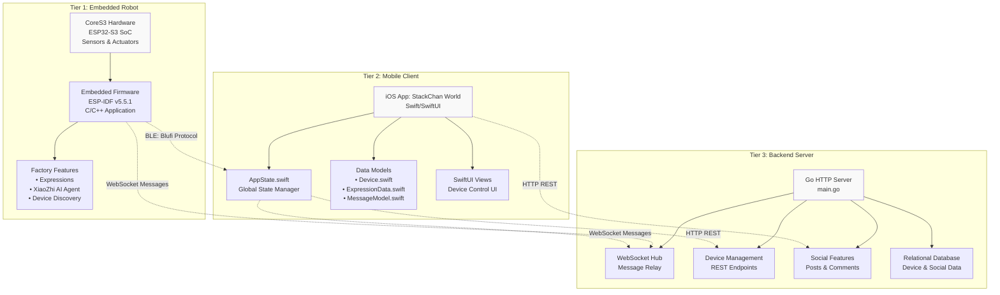
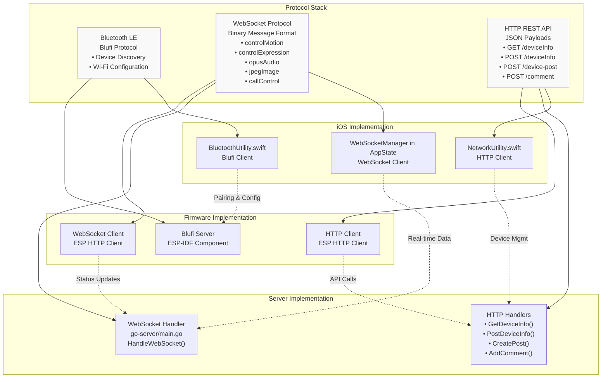
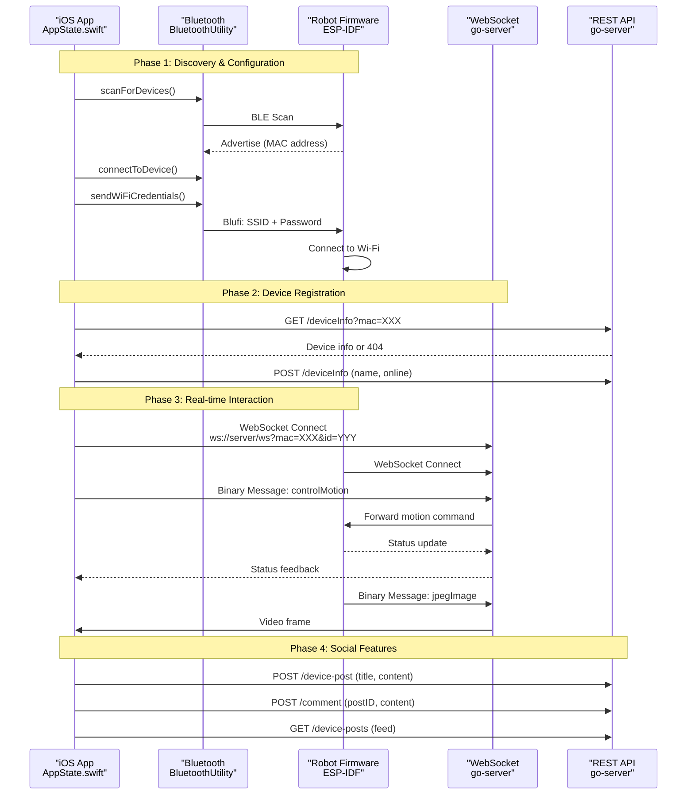
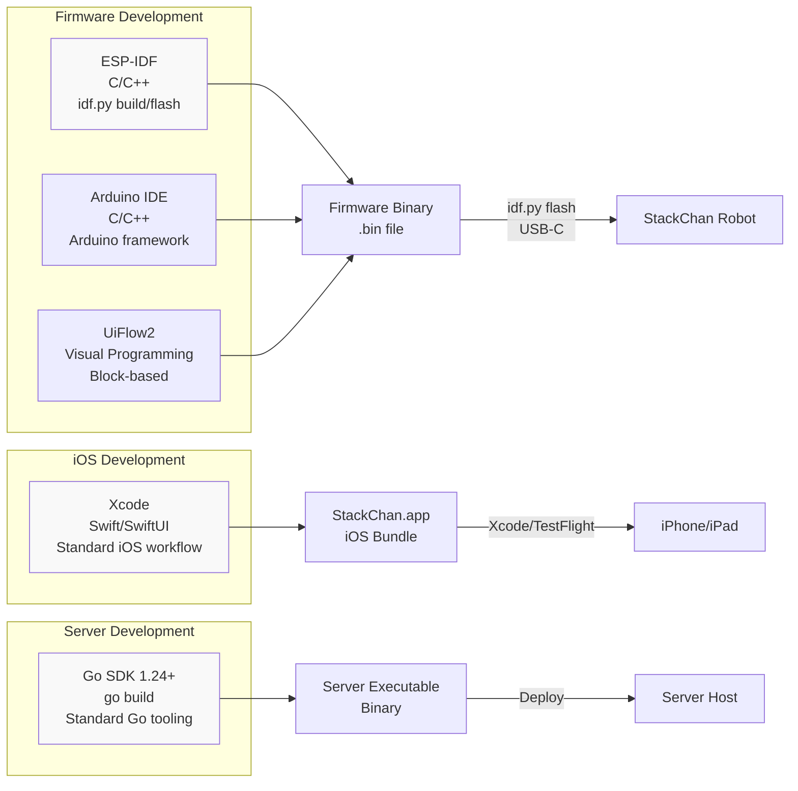

StackChan Overview

# Overview

Relevant source files

The following files were used as context for generating this wiki page:

- [README.md](README.md)

## Purpose and Scope

This document provides a high-level introduction to the StackChan system, an open-source AI desktop robot platform. It describes the system's purpose, major components, communication architecture, and key capabilities. This overview is intended for developers, contributors, and users seeking to understand how StackChan works as a complete system.

For detailed information about specific subsystems, refer to:
- Hardware specifications: [Hardware & Robot](#3)
- Firmware development: [Firmware Development](#4)
- iOS application details: [iOS Application](#5)
- Backend server implementation: [Backend Server](#6)
- Communication protocols: [Communication Protocols](#7)

**Sources:** [README.md:1-22]()

## What is StackChan

StackChan is a distributed AI desktop robot system comprising three interconnected components: an embedded ESP32-S3 robot, an iOS mobile application, and a Go backend server. The system enables real-time interaction with a physical robot through multiple communication channels, supporting features like facial expressions, motion control, video streaming, voice interaction, and social networking.

The robot uses the M5Stack CoreS3 as its main controller, powered by an ESP32-S3 SoC with a 240 MHz dual-core processor, 16MB Flash, and 8MB PSRAM. The hardware supports Wi-Fi and Bluetooth LE for connectivity.

**Sources:** [README.md:11-15]()

## System Components

### Three-Tier Architecture

**Sources:** [README.md:11-15]()

### Hardware Layer

The CoreS3 controller integrates:
- **Display:** 2.0-inch capacitive touch display with glass cover
- **Camera:** 0.3 MP camera for video streaming
- **Sensors:** Proximity sensor, 9-axis IMU (accelerometer, gyroscope, magnetometer)
- **Audio:** 1W speaker and dual microphones
- **Storage:** microSD card slot
- **Controls:** Power and reset buttons

The robot body includes:
- **Power:** USB-C interface, 700 mAh battery
- **Actuators:** Two feedback servos (360° horizontal rotation, 90° vertical movement)
- **Lighting:** 12 RGB LEDs arranged in two rows
- **Communication:** IR transmitter/receiver, NFC module
- **Input:** Three-zone touch panel

**Sources:** [README.md:11-13]()

### Firmware Layer

The factory firmware runs on ESP-IDF v5.5.1 and provides:
- Vivid facial expressions and motion sequences
- XiaoZhi AI agent integration
- iOS app video call support
- Device discovery for nearby StackChan robots
- Remote avatar control

The firmware supports alternative programming via Arduino IDE and UiFlow2 for custom functionality development.

**Sources:** [README.md:14-15]()

### iOS Application Layer

The StackChan World iOS app (available on the App Store) provides:
- Bluetooth LE device discovery and pairing
- Wi-Fi network configuration via Blufi protocol
- Real-time robot control (expressions, motion)
- Video and audio streaming
- Social features (posts, comments, device feed)
- AR-based distance detection

**Sources:** [README.md:19]()

### Backend Server Layer

The Go backend server implements:
- Device registration and information management
- Online/offline status tracking
- WebSocket message relay between robots and apps
- Social platform features (posts, comments, feeds)
- Dance data storage and playback control

**Sources:** High-level architecture diagrams

## Communication Architecture

The system uses three communication protocols operating over different network layers:

**Sources:** High-level architecture diagrams

### Protocol Usage Patterns

| Protocol | Purpose | Direction | Typical Message Types |
|----------|---------|-----------|----------------------|
| Bluetooth LE (Blufi) | Initial setup, Wi-Fi provisioning | iOS ↔ Robot | Device discovery, SSID/password exchange |
| WebSocket | Real-time bidirectional communication | iOS ↔ Server ↔ Robot | Motion control, video frames, audio streams, expressions |
| HTTP REST | Device and social data management | iOS → Server, Robot → Server | Device info updates, post creation, comment submission |

**Sources:** High-level architecture diagrams

## Communication Flow

**Sources:** High-level architecture diagrams

## Key Features and Capabilities

### Factory Firmware Features

The pre-installed firmware provides production-ready functionality:

| Feature | Description | Implementation |
|---------|-------------|----------------|
| Facial Expressions | Multiple pre-programmed expressions | Expression engine in firmware |
| XiaoZhi AI Agent | AI-powered interaction | Integrated AI agent component |
| Video Calling | iOS app video call support | Camera streaming via WebSocket |
| Device Discovery | Find nearby StackChan devices | Bluetooth LE advertising |
| Motion Control | Servo-based head movements | Servo control system with feedback |

**Sources:** [README.md:14-15]()

### iOS App Features

The StackChan World app enables:
- Device discovery and Bluetooth pairing
- Wi-Fi network configuration
- Real-time expression and motion control
- Live camera viewing
- Audio streaming and recording
- Post creation and commenting
- Device feed browsing
- AR distance detection and face switching

**Sources:** High-level architecture diagrams

### Server Features

The backend provides:
- Device registration and management
- Online/offline status tracking
- WebSocket message relay and routing
- Social platform (posts, comments, feeds)
- Dance data storage and playback
- Binary protocol handling for efficient data transfer

**Sources:** High-level architecture diagrams

## Development Approaches

StackChan supports multiple development paths:

**Sources:** [README.md:15](), High-level architecture diagrams

## Safety Considerations

**Important:** Do not forcibly rotate movable parts connected to motors by hand when unsure whether motors are powered and under control. Manual rotation can cause hardware damage to the feedback servos.

**Sources:** [README.md:17]()

## External Resources

- **iOS App:** [StackChan World on App Store](https://apps.apple.com/app/stackchan-world/id6756086326)
- **Website:** [stackchan.world](https://stackchan.world/home)
- **Product Page:** [m5stack.com/stackchan](https://m5stack.com/stackchan)
- **CoreS3 Documentation:** [M5Stack CoreS3 Docs](https://docs.m5stack.com/en/core/CoreS3)

**Sources:** [README.md:19-21]()

## Repository Structure

The StackChan repository contains:
- Firmware source code and build configuration for ESP-IDF
- iOS application source code in Swift/SwiftUI
- Go server implementation
- Documentation and development guides
- Build scripts and tooling configuration

For detailed information on repository organization, see [Version Control and Project Organization](#8.4).

**Sources:** High-level architecture diagrams