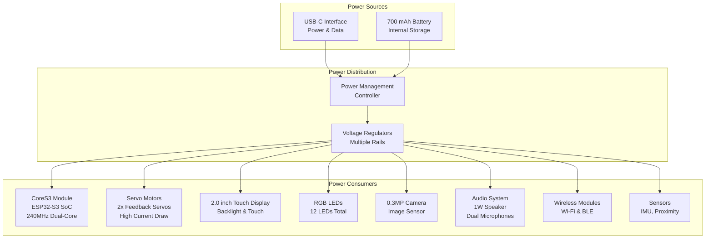
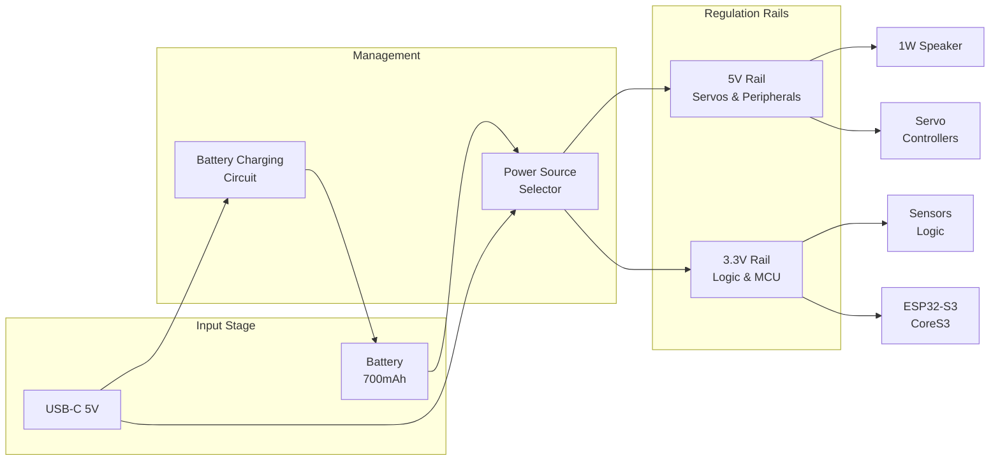
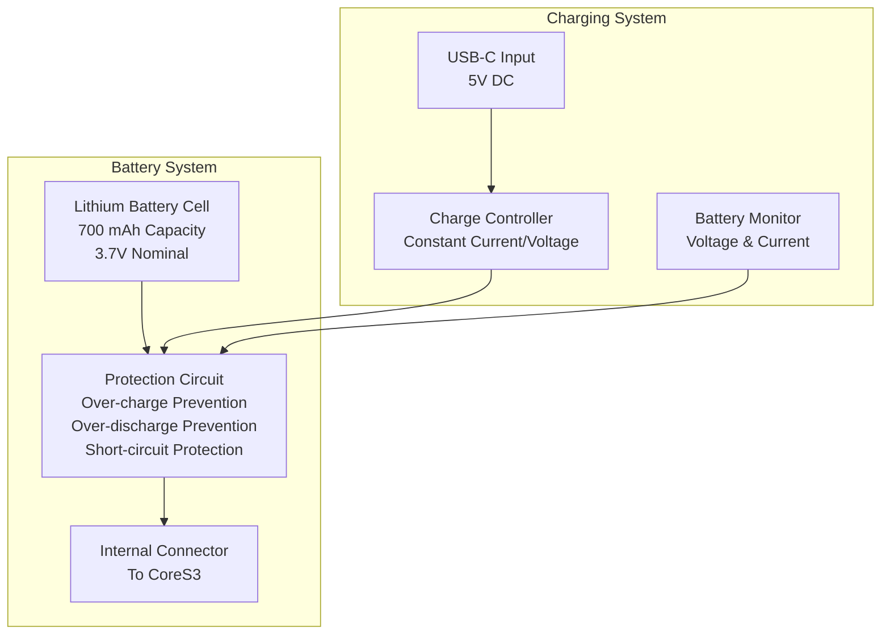
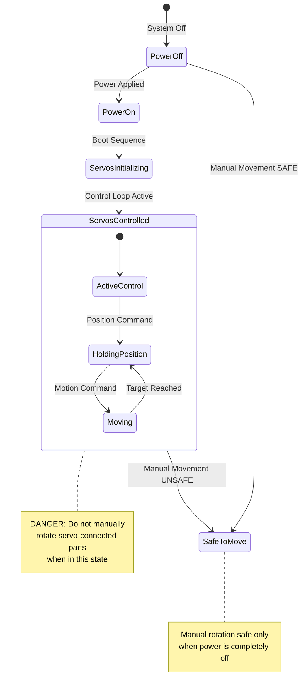
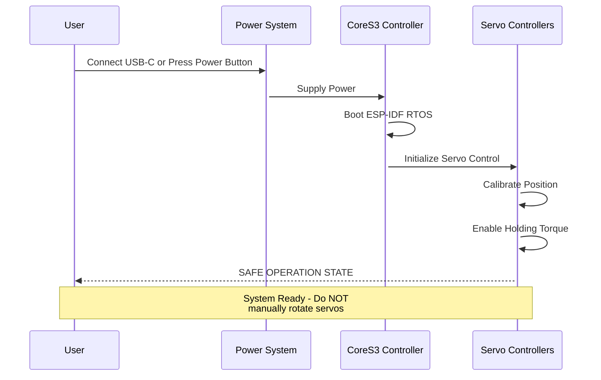
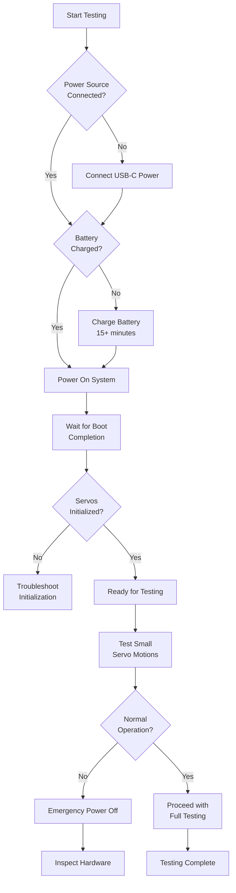

StackChan Power and Safety

# Power and Safety

<details>
<summary>Relevant source files</summary>

The following files were used as context for generating this wiki page:

- [README.md](README.md)

</details>


This document covers the power system architecture of the StackChan robot and critical safety guidelines for operation. It details power sources, battery management, and servo safety protocols to prevent hardware damage.

For information about the CoreS3 controller hardware specifications, see [CoreS3 Controller](#3.1). For details on servo actuators and their control mechanisms, see [Actuators and Output Devices](#3.3).

---

## Power System Overview

The StackChan robot implements a dual-mode power system supporting both USB-C continuous power and internal battery operation. The power architecture integrates with the CoreS3 controller to provide stable voltage regulation for the ESP32-S3 SoC, servos, sensors, and communication modules.



**Sources:** [README.md:11-13]()

### Power Source Characteristics

| Power Source | Specifications | Use Case | Characteristics |
|--------------|---------------|----------|-----------------|
| USB-C | 5V DC input | Continuous operation, development, charging | Unlimited runtime, stable power delivery |
| Internal Battery | 700 mAh capacity | Portable operation | Limited runtime, requires periodic charging |

**Sources:** [README.md:13]()

---

## Power Distribution Architecture

The power management system distributes power across multiple voltage rails to accommodate different component requirements. The ESP32-S3 requires regulated 3.3V, while servos may operate at higher voltages for torque requirements.



**Sources:** [README.md:11-13]()

### Power States

The StackChan system operates in distinct power states that affect servo control, wireless connectivity, and overall system behavior:

| State | Description | Active Components | Power Source |
|-------|-------------|-------------------|--------------|
| **Active Operation** | Full system functionality | All components active | USB-C or Battery |
| **Idle** | Reduced activity, servos disabled | CoreS3, wireless, sensors | USB-C or Battery |
| **Charging** | Battery charging while powered off or in low-power mode | Charging circuit, optional CoreS3 | USB-C required |
| **Powered Off** | System completely off | None | N/A |

**Sources:** [README.md:11-13]()

---

## Battery Management

The 700 mAh internal battery enables portable operation of the StackChan robot. Battery management includes charging control, capacity monitoring, and protection circuitry.

### Battery Specifications



**Sources:** [README.md:13]()

### Charging Protocol

- **Input:** USB-C 5V DC power supply
- **Charging Method:** Constant Current / Constant Voltage (CC/CV)
- **Charging Indicator:** Status available through CoreS3 system (implementation-dependent)
- **Charging Time:** Dependent on input current capability and battery state

### Battery Life Considerations

Battery runtime varies significantly based on operational mode and component usage:

| Operating Mode | Approximate Runtime | Key Factors |
|----------------|---------------------|-------------|
| Active (servos moving frequently) | Shortest runtime | High servo current draw |
| Interactive (periodic servo movement) | Medium runtime | Intermittent high current |
| Idle (servos disabled, wireless active) | Longest runtime | Low baseline current |

**Note:** Continuous servo operation and wireless transmission represent the highest power consumption scenarios.

**Sources:** [README.md:13]()

---

## Critical Safety Guidelines

### Servo Safety Protocol

The StackChan robot includes two feedback servos that can exert significant mechanical force. Improper handling can cause permanent hardware damage.



**Sources:** [README.md:17]()

### Primary Safety Warning

> **CRITICAL: Do not forcibly rotate any movable parts connected to the motors by hand when you are unsure whether the motors are powered and under control, as this may cause hardware damage.**

**Sources:** [README.md:17]()

### Safety Rules

| Rule | Rationale | Consequence of Violation |
|------|-----------|-------------------------|
| **Never manually rotate servo-connected parts when powered** | Servos actively resist external forces when under control | Gear damage, motor damage, controller damage |
| **Verify power state before manual manipulation** | Powered servos create back-EMF and mechanical stress | Electrical damage to servo controller circuits |
| **Allow servo initialization to complete** | Servos calibrate position during boot sequence | Position errors, calibration corruption |
| **Do not obstruct servo movement during operation** | Servos may apply excessive force against obstacles | Mechanical damage to servos and mounting points |

**Sources:** [README.md:17]()

### Servo Power State Detection

To safely interact with StackChan's movable parts:

1. **Visual Indicators:** Observe LED status and display output indicating system state
2. **Audible Indicators:** Listen for servo holding torque (faint hum when powered and holding position)
3. **Physical Test:** Gently test resistance - powered servos will resist movement
4. **Software Verification:** Check device status through iOS app or serial console

---

## Operating Guidelines

### Safe Power-On Procedure



**Sources:** [README.md:11-17]()

### Safe Power-Off Procedure

```mermaid
sequenceDiagram
    participant User
    participant CoreS3 as CoreS3 Controller
    participant Servos as Servo Controllers
    participant Power as Power System
    
    User->>CoreS3: Initiate Shutdown
    activate CoreS3
    CoreS3->>Servos: Disable Servo Control
    activate Servos
    Servos->>Servos: Release Holding Torque
    deactivate Servos
    CoreS3->>CoreS3: Save State
    CoreS3->>Power: Safe to Power Off
    deactivate CoreS3
    Power->>Power: Cut Power
    deactivate Power
    
    Note over User,Power: Manual servo rotation<br/>now SAFE
```

**Sources:** [README.md:17]()

### Daily Operation Best Practices

1. **Starting Work Session**
   - Connect USB-C power or ensure battery is charged
   - Power on StackChan and wait for boot completion
   - Verify servo initialization through display or iOS app
   - Do not touch movable parts during initialization

2. **During Operation**
   - Keep hands clear of moving servo assemblies
   - Ensure adequate clearance for servo motion range
   - Monitor battery level if operating on battery power
   - Avoid blocking servo movement paths

3. **Ending Work Session**
   - Use proper shutdown procedure if available
   - Or simply disconnect power after servos complete current motion
   - Wait 5-10 seconds after power removal before manual manipulation
   - Store in position that doesn't stress servo gears

**Sources:** [README.md:17]()

---

## Hardware Protection Mechanisms

### Overcurrent Protection

The power distribution system includes protection against excessive current draw that could damage components:

- **USB-C Input:** Limited by USB power delivery negotiation
- **Battery Output:** Protected by internal battery protection circuit
- **Servo Controllers:** Current-limited to prevent motor burnout

### Thermal Management

The ESP32-S3 SoC and power management circuits generate heat during operation:

- **Passive Cooling:** Heat dissipation through CoreS3 housing
- **Thermal Throttling:** ESP32-S3 reduces clock speed if temperature exceeds threshold
- **Servo Duty Cycle:** Extended servo operation may require rest periods to prevent overheating

**Sources:** [README.md:11-13]()

---

## Troubleshooting Power Issues

### Common Power Problems

| Symptom | Possible Cause | Resolution |
|---------|---------------|------------|
| System won't power on | Battery depleted, USB-C cable issue | Connect known-good USB-C cable, allow charging time |
| Intermittent operation | Low battery, insufficient USB power supply | Use higher-current USB power adapter (2A+ recommended) |
| Servos not responding | Power insufficient for servo load | Connect USB-C power, check battery charge level |
| System resets during servo motion | Voltage sag from current spike | Use adequate power supply, check battery health |
| Battery not charging | Charging circuit fault, battery protection activated | Verify USB-C connection, check battery protection state |

### Power Consumption Monitoring

Monitor power consumption through system logs or iOS app to identify high-drain scenarios:

- **Baseline (idle):** ESP32-S3 + wireless + sensors
- **Display active:** Add display backlight consumption
- **Servo motion:** Significant current spikes during acceleration
- **All components active:** Maximum power draw scenario

**Sources:** [README.md:11-13]()

---

## Maintenance and Long-Term Care

### Battery Maintenance

- **Storage:** Store with ~50% charge for extended periods
- **Charging Frequency:** Avoid deep discharge cycles when possible
- **Temperature:** Operate and store within 0-40°C range
- **Lifespan:** Battery capacity degrades over charge cycles (typical: 300-500 cycles)

### Servo Maintenance

- **Inspection:** Periodically check for unusual noise or resistance
- **Gear Wear:** Listen for grinding sounds indicating gear damage
- **Mounting:** Ensure servo mounting remains secure
- **Replacement:** Replace servos if position accuracy degrades

### Safety Inspection Checklist

Perform before each extended use session:

- [ ] USB-C connector shows no physical damage
- [ ] Battery charges normally when connected to power
- [ ] Servos move smoothly without binding or grinding
- [ ] No unusual heat generation during operation
- [ ] All mechanical connections remain secure
- [ ] Power button functions correctly
- [ ] System boots and initializes without errors

**Sources:** [README.md:11-17]()

---

## Development and Testing Safety

### Firmware Development Precautions

When developing custom firmware (see [Development Setup](#4.2) and [Building and Flashing](#4.3)):

1. **Test servo control incrementally** - Start with small motion ranges
2. **Implement software limits** - Prevent servos from exceeding safe angles
3. **Add timeout protection** - Disable servos if control loop fails
4. **Validate power state** - Check battery level before intensive operations
5. **Emergency stop capability** - Implement immediate servo disable function

### Hardware Testing Protocol



**Sources:** [README.md:17]()

---

## Related Documentation

- For CoreS3 hardware specifications and capabilities: [CoreS3 Controller](#3.1)
- For servo control implementation details: [Actuators and Output Devices](#3.3)
- For firmware development and servo programming: [Development Setup](#4.2)
- For factory firmware servo features: [Factory Firmware Features](#4.1)