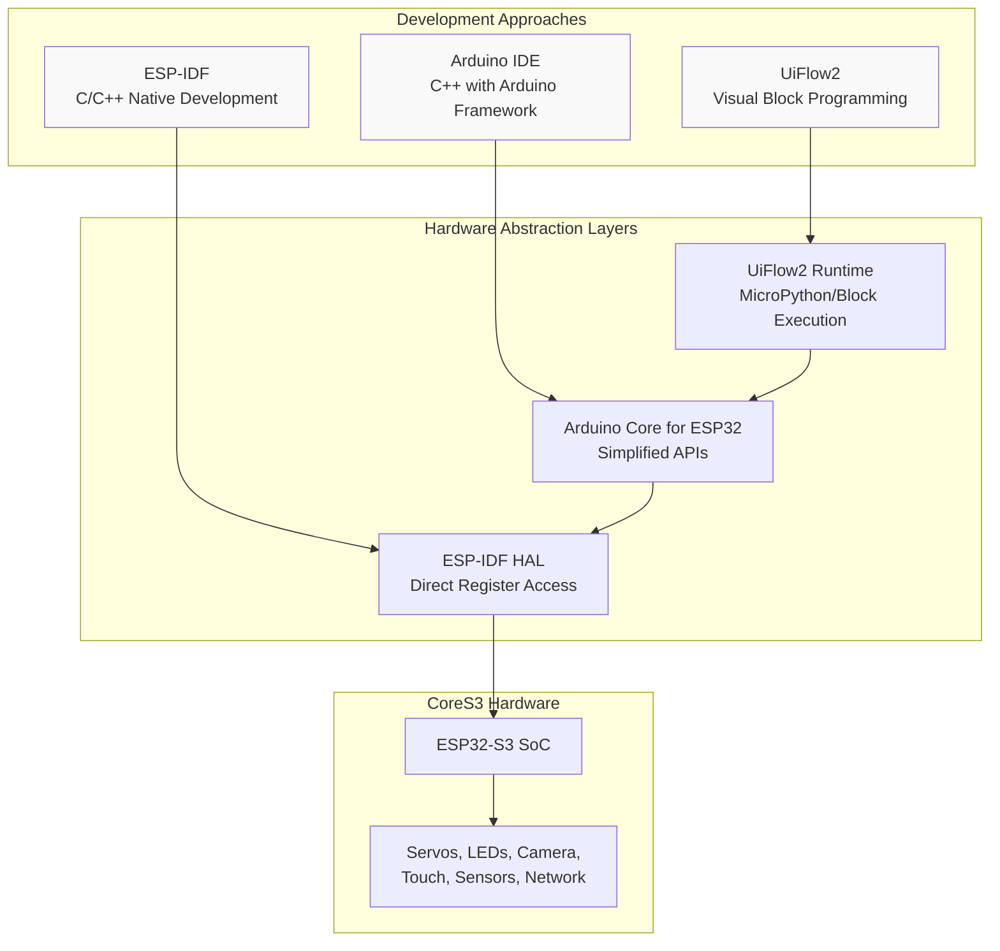
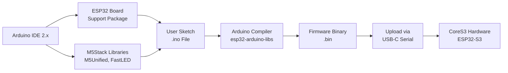
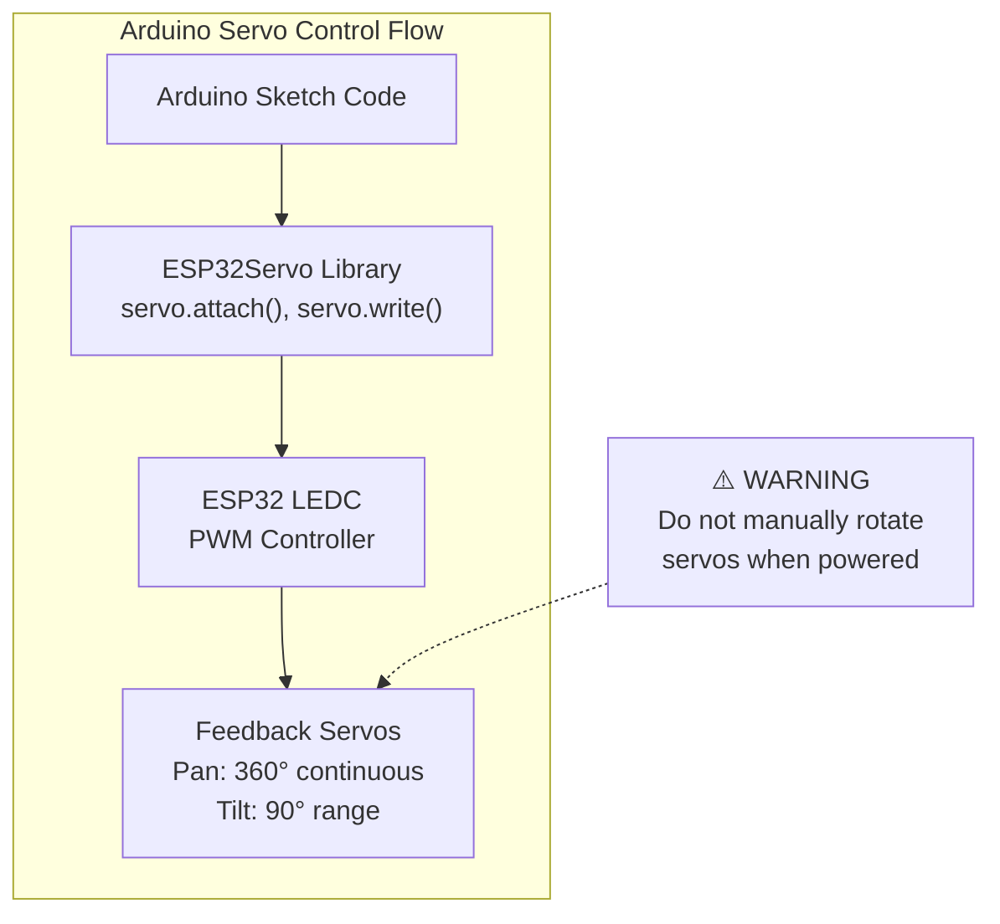
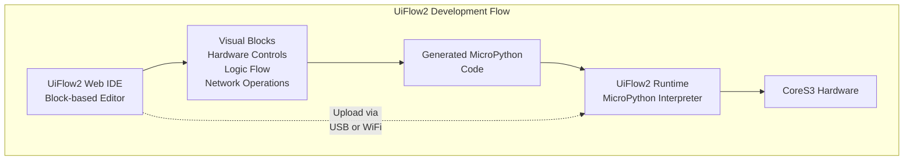
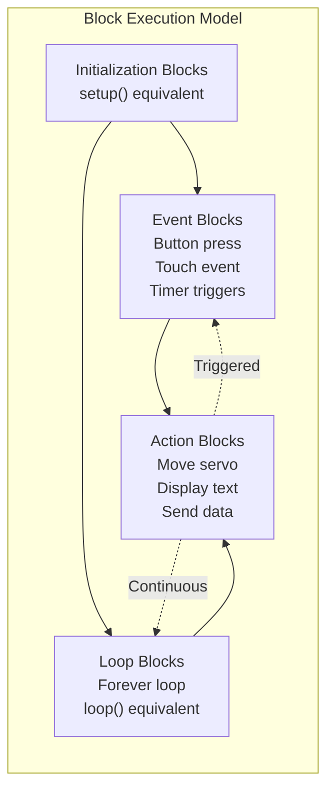
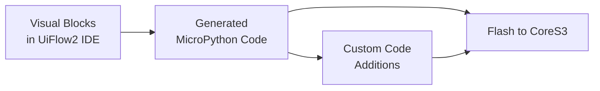
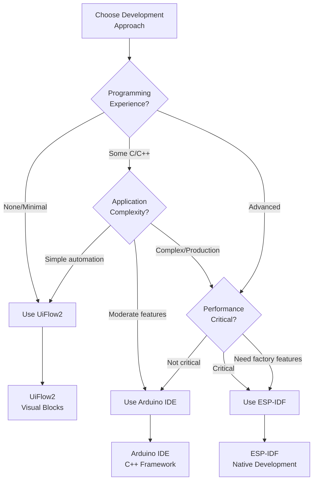
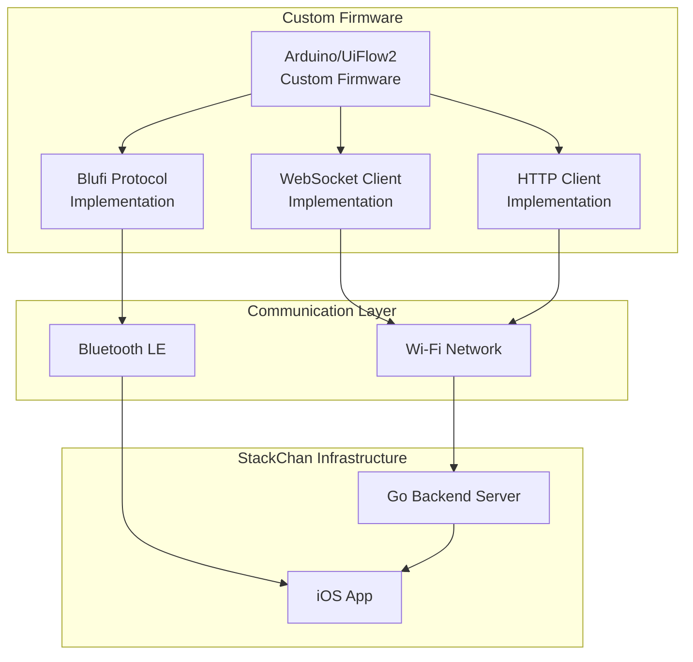
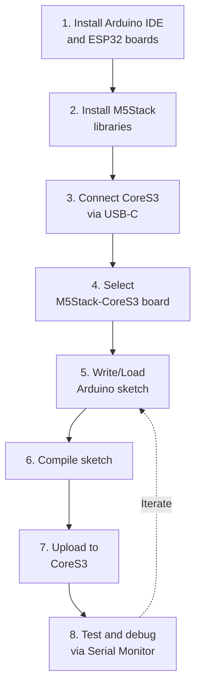
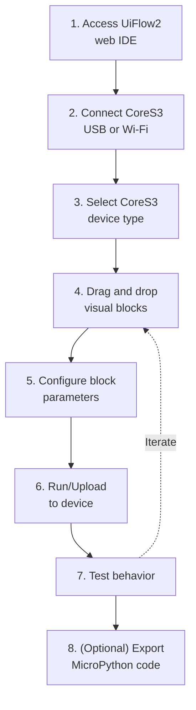

StackChan Programming with Arduino and UiFlow2

# Programming with Arduino and UiFlow2

<details>
<summary>Relevant source files</summary>

The following files were used as context for generating this wiki page:

- [README.md](README.md)

</details>


## Purpose and Scope

This document covers alternative programming approaches for StackChan firmware development using Arduino IDE and UiFlow2 visual programming environments. These provide simplified development workflows compared to the native ESP-IDF approach.

For information about the primary ESP-IDF firmware development workflow, see [Development Setup](#4.2) and [Building and Flashing](#4.3). For details on the factory-installed firmware features, see [Factory Firmware Features](#4.1).

**Sources:** [README.md:15]()

---

## Overview of Alternative Programming Approaches

StackChan supports three distinct firmware development approaches, each with different complexity levels and capabilities:

| Approach | Complexity | Hardware Access | Primary Use Case |
|----------|-----------|-----------------|------------------|
| ESP-IDF | High | Complete low-level access | Production firmware, complex features |
| Arduino IDE | Medium | Abstracted through libraries | Quick prototyping, custom behaviors |
| UiFlow2 | Low | Block-based visual interface | Educational use, simple automation |



**Sources:** [README.md:15]()

---

## Arduino IDE Programming

### Development Environment Setup

Arduino IDE provides a familiar C++ development environment with simplified APIs for ESP32-S3 hardware access. The Arduino Core for ESP32 wraps ESP-IDF functionality behind higher-level abstractions.

**Prerequisites:**
- Arduino IDE 2.0 or later
- ESP32 board support package
- M5Stack CoreS3 library dependencies

**Installation Steps:**

1. Install ESP32 board support in Arduino IDE board manager
2. Select "M5Stack-CoreS3" as the target board
3. Install required M5Stack libraries:
   - `M5Unified` (unified hardware abstraction)
   - `M5Stack-Avatar` (for facial expressions, if needed)
   - `FastLED` (for RGB LED control)



**Sources:** [README.md:11-15]()

### Hardware Component Access

The Arduino environment provides access to CoreS3 hardware through the M5Unified library, which abstracts hardware initialization and peripheral control.

| Component | Access Method | Arduino API |
|-----------|---------------|-------------|
| Display | `M5.Lcd` or `M5.Display` | Standard TFT_eSPI methods |
| Touch Panel | `M5.Touch.getDetail()` | Touch coordinate reading |
| IMU | `M5.Imu.update()` | Accelerometer, gyroscope data |
| Speaker | `M5.Speaker.tone()` | Audio playback |
| Microphone | `M5.Mic.record()` | Audio capture |
| Buttons | `M5.BtnA.wasPressed()` | Button state polling |
| RGB LEDs | `FastLED` library | LED array control |
| Servos | `ESP32Servo` library | PWM servo control |
| Camera | `esp_camera` library | Image capture |
| Wi-Fi | `WiFi.h` | Network connectivity |
| Bluetooth | `BluetoothSerial.h` | BLE communication |

**Example Hardware Initialization Pattern:**

```cpp
// Typical M5Stack CoreS3 Arduino sketch structure
#include <M5Unified.h>

void setup() {
    M5.begin();  // Initialize all hardware
    M5.Display.setTextSize(2);
    // Additional peripheral setup
}

void loop() {
    M5.update();  // Poll hardware state
    // Application logic
}
```

**Sources:** [README.md:11-13]()

### Servo Control Implementation

The CoreS3 robot body includes two feedback servos that must be controlled carefully to avoid hardware damage. Arduino provides simplified servo control through the `ESP32Servo` library.



**Key Considerations:**
- Pan servo supports 360-degree continuous rotation
- Tilt servo has a 90-degree movement range
- Always use controlled servo commands; never manually force rotation when powered
- Implement smooth motion transitions to prevent jerky movements

**Sources:** [README.md:13](), [README.md:17]()

### Network Communication

Arduino environment supports both Wi-Fi and Bluetooth LE for communication with the iOS app and backend server.

**Wi-Fi Connection:**
```cpp
// Typical pattern for connecting to Wi-Fi
#include <WiFi.h>

WiFi.begin(ssid, password);
while (WiFi.status() != WL_CONNECTED) {
    delay(500);
}
```

**WebSocket Client:**
Arduino sketches can implement WebSocket clients to communicate with the backend server using libraries like `ArduinoWebsockets` or `WebSocketsClient`.

**Bluetooth LE:**
For Blufi protocol implementation or custom BLE services, use the `BluetoothSerial` or `BLE` libraries.

**Sources:** [README.md:11]()

### Limitations of Arduino Approach

| Aspect | Limitation |
|--------|-----------|
| Memory Management | Less control over PSRAM allocation compared to ESP-IDF |
| Real-time Performance | Higher overhead from Arduino framework abstractions |
| Advanced Features | Some ESP-IDF features may not be exposed through Arduino APIs |
| Factory Firmware Features | XiaoZhi AI agent and advanced factory features not directly portable |
| Build System | Less flexible than ESP-IDF component system |

**Sources:** [README.md:15]()

---

## UiFlow2 Visual Programming

### Visual Development Environment

UiFlow2 provides a block-based visual programming interface designed for educational use and rapid prototyping without writing code. It runs on a MicroPython runtime on the ESP32-S3.

**Platform Access:**
- Web-based IDE: Accessible through browser
- Desktop application: Available for Windows, macOS, and Linux
- Device connection: USB serial or Wi-Fi OTA



**Sources:** [README.md:15]()

### Available Block Categories

UiFlow2 organizes functionality into block categories that correspond to hardware and software capabilities:

| Category | Functionality | Hardware Components |
|----------|--------------|---------------------|
| Display | Screen drawing, text, images | 2.0" capacitive touch display |
| Input | Touch detection, button events | Touch panel, buttons |
| Motion | IMU readings, orientation | 9-axis IMU |
| Audio | Sound playback, recording | Speaker, dual microphones |
| LED | RGB LED control, patterns | 12 RGB LEDs |
| Servo | Motor control, position | 2 feedback servos |
| Camera | Image capture | 0.3 MP camera |
| Network | Wi-Fi, HTTP, MQTT | ESP32-S3 Wi-Fi |
| Bluetooth | BLE scanning, connections | ESP32-S3 BLE |
| Logic | Loops, conditions, variables | Software |
| Math | Calculations, comparisons | Software |

**Sources:** [README.md:11-13]()

### Block Programming Model

UiFlow2 uses an event-driven programming model where blocks respond to hardware events and execute actions.



**Sources:** [README.md:15]()

### Servo Control in UiFlow2

UiFlow2 provides high-level servo control blocks that abstract the complexity of PWM signal generation.

**Available Servo Blocks:**
- **Servo Angle**: Set servo to specific angle (for tilt servo)
- **Servo Speed**: Set continuous rotation speed (for pan servo)
- **Servo Release**: Disable servo holding torque

**Example Block Structure:**
```
[Setup Block]
  → Initialize Servo on Pin X
  
[Button A Pressed Event]
  → Set Servo Angle to 45°
  → Wait 1 second
  → Set Servo Angle to 0°
```

**Sources:** [README.md:13](), [README.md:17]()

### Network Integration

UiFlow2 supports network communication through visual blocks for Wi-Fi and HTTP operations.

**Wi-Fi Blocks:**
- Connect to Wi-Fi network (SSID, password)
- Get IP address
- Check connection status

**HTTP Blocks:**
- GET request
- POST request with JSON payload
- Response parsing

**WebSocket Support:**
Limited WebSocket support may be available through advanced blocks or custom MicroPython code injection.

**Sources:** [README.md:11]()

### Exporting and Customization

UiFlow2 generates MicroPython code from visual blocks, which can be:
- Downloaded as `.py` files for inspection
- Modified with custom MicroPython code
- Extended with libraries not available in blocks
- Flashed directly to CoreS3

**Workflow:**


**Sources:** [README.md:15]()

### UiFlow2 Limitations

| Aspect | Limitation |
|--------|-----------|
| Performance | MicroPython interpreter overhead reduces execution speed |
| Memory | Higher RAM usage compared to compiled C/C++ |
| Real-time Control | Not suitable for timing-critical operations |
| Advanced Features | Factory firmware AI features not accessible |
| Library Ecosystem | Limited compared to Arduino/ESP-IDF |
| Complexity | Visual blocks may become unwieldy for large programs |

**Sources:** [README.md:15]()

---

## Comparison and Use Cases

### Decision Matrix



**Sources:** [README.md:15]()

### Use Case Examples

| Use Case | Recommended Approach | Rationale |
|----------|---------------------|-----------|
| Educational demonstrations | UiFlow2 | Visual interface, no coding required |
| Custom facial expressions | Arduino IDE | Moderate complexity, good library support |
| Home automation integration | Arduino IDE | Wi-Fi/MQTT libraries readily available |
| Production robot firmware | ESP-IDF | Performance, advanced features, maintainability |
| AI agent integration | ESP-IDF | Requires factory firmware as base |
| Quick motion prototyping | UiFlow2 or Arduino | Rapid iteration, servo libraries |
| Real-time audio processing | ESP-IDF | Low latency requirements |
| Community-shared projects | Arduino IDE | Wide compatibility, easy to share |

**Sources:** [README.md:15]()

### Feature Compatibility Matrix

| Feature | ESP-IDF | Arduino IDE | UiFlow2 |
|---------|---------|-------------|---------|
| XiaoZhi AI Agent | ✓ (Full) | ✗ | ✗ |
| Video Call Support | ✓ (Full) | △ (Custom) | ✗ |
| Device Discovery (Blufi) | ✓ (Full) | △ (Library) | ✗ |
| Facial Expressions | ✓ (Full) | △ (M5Stack-Avatar) | △ (Basic) |
| WebSocket Client | ✓ (Full) | ✓ (Library) | △ (Limited) |
| HTTP REST Client | ✓ (Full) | ✓ (Library) | ✓ (Blocks) |
| Servo Control | ✓ (Full) | ✓ (Library) | ✓ (Blocks) |
| RGB LED Control | ✓ (Full) | ✓ (Library) | ✓ (Blocks) |
| Camera Access | ✓ (Full) | ✓ (Library) | △ (Basic) |
| Low Power Modes | ✓ (Full) | △ (Limited) | ✗ |
| Over-the-Air Updates | ✓ (Full) | ✓ (Library) | △ (Limited) |

Legend: ✓ = Fully supported, △ = Partially supported, ✗ = Not supported

**Sources:** [README.md:14-15]()

---

## Integration with StackChan Ecosystem

### Communication with iOS App

When using Arduino or UiFlow2 firmware, integration with the StackChan World iOS app requires implementing compatible communication protocols.



**Required Protocol Support:**
- **Blufi Protocol**: For device discovery and Wi-Fi configuration
- **WebSocket Messages**: For real-time control and video streaming (see [WebSocket Protocol](#7.2))
- **HTTP REST API**: For device registration and status updates (see [HTTP REST API](#7.3))

**Sources:** [README.md:11](), [README.md:14-15]()

### Message Format Compatibility

Custom firmware must implement the binary message protocol used by the StackChan ecosystem:

| Message Type | Arduino Implementation | UiFlow2 Implementation |
|--------------|----------------------|----------------------|
| Opus Audio | `WebSocketsClient` + audio codec library | Not practical |
| JPEG Images | `esp_camera` + WebSocket send | Basic camera blocks + custom code |
| Control Motion | Parse JSON or binary control messages | Custom parsing blocks |
| Expression Control | Implement expression state machine | Block-based state machine |
| Status Updates | Send JSON status via WebSocket | HTTP POST blocks |

For detailed message format specifications, see [Message Types Reference](#7.4).

**Sources:** [README.md:14-15]()

### Maintaining Compatibility

When developing custom firmware with Arduino or UiFlow2, consider these compatibility factors:

1. **Device Discovery**: Implement Blufi protocol or provide manual Wi-Fi configuration
2. **WebSocket URL**: Configure to match server deployment (see [Network Configuration](#8.3))
3. **Message Format**: Follow the binary protocol structure for control messages
4. **Device Registration**: Call device registration endpoints on server
5. **MAC Address**: Use consistent device identifier across sessions

**Sources:** [README.md:14-15]()

---

## Getting Started Workflow

### Arduino IDE Quick Start



**Sources:** [README.md:15]()

### UiFlow2 Quick Start



**Sources:** [README.md:15]()

---

## Safety Considerations

Both Arduino and UiFlow2 firmware development must observe critical safety guidelines for the servo motors and hardware.

**Critical Warning:**
> Do not forcibly rotate any movable parts connected to the motors by hand when you are unsure whether the motors are powered and under control, as this may cause hardware damage.

**Implementation Guidelines:**

1. **Power Management**:
   - Implement graceful servo shutdown on errors
   - Disable servos when not in use to conserve power
   - Monitor battery voltage and limit servo operation on low battery

2. **Motion Limits**:
   - Enforce software limits on servo ranges
   - Implement smooth acceleration/deceleration curves
   - Add timeout protection for motion commands

3. **Error Handling**:
   - Catch servo control exceptions
   - Implement watchdog timers for motion operations
   - Provide visual/audio feedback for error states

4. **User Safety**:
   - Avoid sudden, fast movements that could startle users
   - Implement emergency stop functionality
   - Test all motion sequences thoroughly before deployment

**Sources:** [README.md:17]()

---

**Page Sources:**
- [README.md:1-22]()