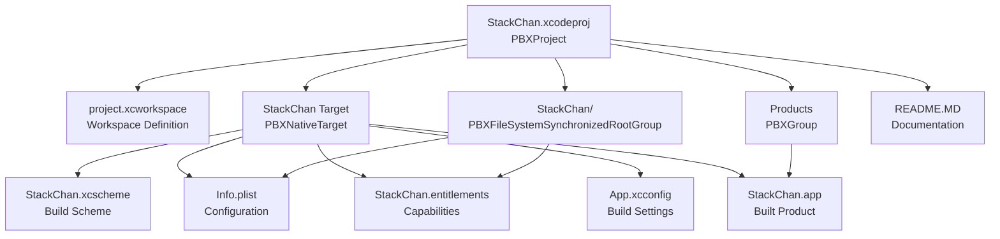
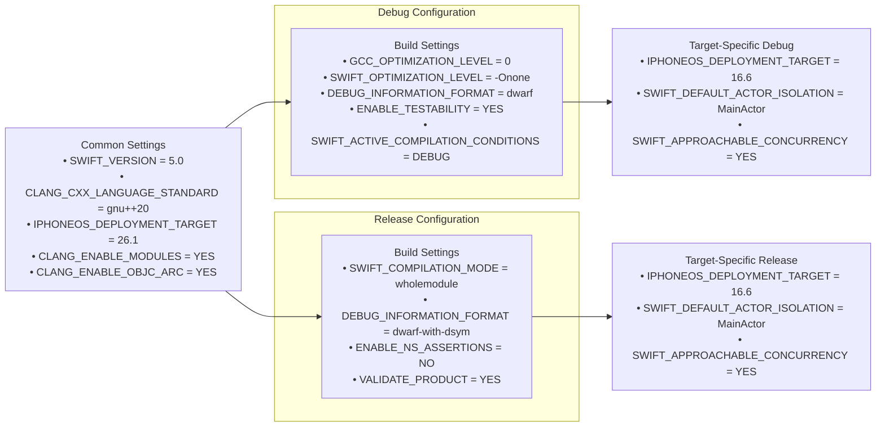
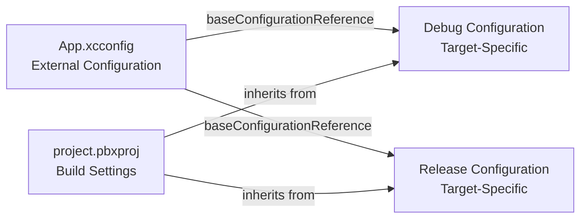
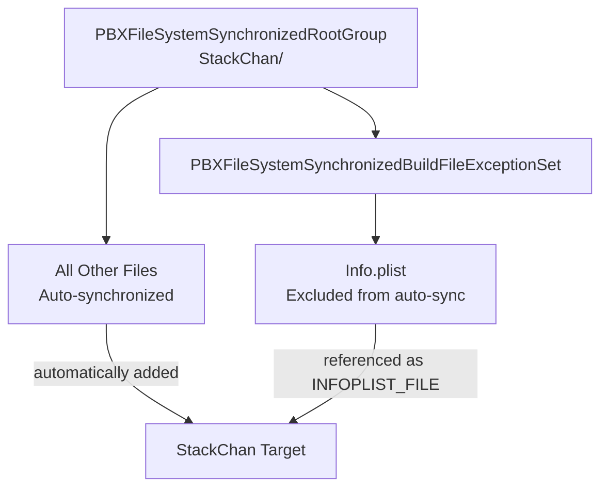
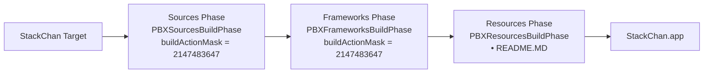
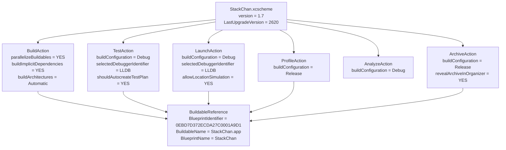
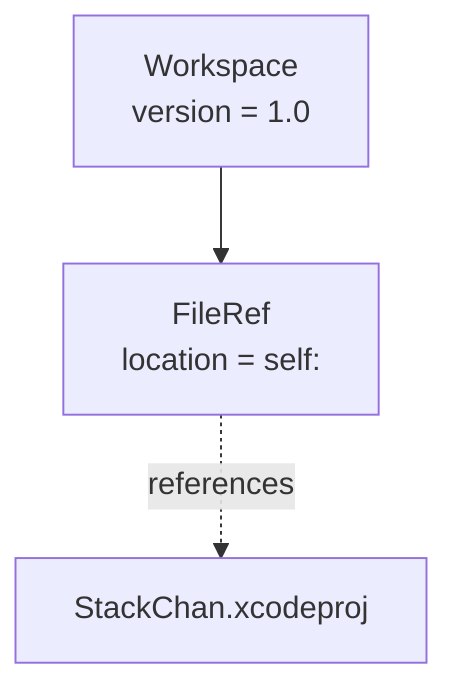

StackChan Project Structure

# Project Structure

Relevant source files

The following files were used as context for generating this wiki page:

- [app/StackChan.xcodeproj/project.pbxproj](app/StackChan.xcodeproj/project.pbxproj)
- [app/StackChan.xcodeproj/project.xcworkspace/contents.xcworkspacedata](app/StackChan.xcodeproj/project.xcworkspace/contents.xcworkspacedata)
- [app/StackChan.xcodeproj/xcshareddata/xcschemes/StackChan.xcscheme](app/StackChan.xcodeproj/xcshareddata/xcschemes/StackChan.xcscheme)

This document describes the Xcode project configuration for the StackChan iOS application, including target settings, build configurations, schemes, and workspace organization. For information about the Swift source code organization, see [Application State Management](#5.3) and [Data Models](#5.4). For setup instructions, see [Getting Started with the iOS App](#5.1).

## Xcode Project Overview

The iOS application is contained within an Xcode project located at [app/StackChan.xcodeproj]() with a single target named `StackChan` that produces the executable `StackChan.app`. The project uses Xcode's modern project format (object version 77) with file system synchronization, which automatically tracks files in the source directory without manual management in the project file.

**Sources:** [app/StackChan.xcodeproj/project.pbxproj:1-404](), [app/StackChan.xcodeproj/project.xcworkspace/contents.xcworkspacedata:1-8]()

## Target Configuration

The `StackChan` target is configured as an iOS application with the following key properties:

| Property | Value |
|----------|-------|
| Product Name | `StackChan` |
| Bundle Identifier | `com.m5stack.StackChan` |
| Product Type | `com.apple.product-type.application` |
| Development Team | `NG678HLKHZ` |
| Marketing Version | `1.0.3` |
| Current Project Version | `3` |
| iOS Deployment Target | `16.6` |
| Supported Platforms | iPhone and iPad (`iphoneos iphonesimulator`) |
| Targeted Device Family | `1,2` (iPhone and iPad) |
| Swift Version | `5.0` |

The target is configured with automatic code signing (`CODE_SIGN_STYLE = Automatic`) and requires several iOS capabilities defined in [app/StackChan/StackChan.entitlements](). The project uses SwiftUI with preview support enabled (`ENABLE_PREVIEWS = YES`).

**Sources:** [app/StackChan.xcodeproj/project.pbxproj:72-94](), [app/StackChan.xcodeproj/project.pbxproj:276-326]()

## Build Configurations

The project defines two standard build configurations: Debug and Release. Both configurations share common compiler and language settings, with key differences in optimization and debug information.

### Key Build Settings

**Compiler Flags:**
- `CLANG_CXX_LANGUAGE_STANDARD = "gnu++20"` - C++20 standard support
- `CLANG_ENABLE_OBJC_ARC = YES` - Automatic Reference Counting enabled
- `CLANG_ENABLE_MODULES = YES` - Module support enabled
- `GCC_C_LANGUAGE_STANDARD = gnu17` - C17 standard support

**Swift Settings:**
- `SWIFT_APPROACHABLE_CONCURRENCY = YES` - Modern Swift concurrency enabled
- `SWIFT_DEFAULT_ACTOR_ISOLATION = MainActor` - Default actor isolation to MainActor
- `SWIFT_UPCOMING_FEATURE_MEMBER_IMPORT_VISIBILITY = YES` - Future Swift feature enabled
- `STRING_CATALOG_GENERATE_SYMBOLS = YES` - String catalog symbol generation

**Platform Support:**
- `SUPPORTED_PLATFORMS = "iphoneos iphonesimulator"` - iOS device and simulator
- `SUPPORTS_MACCATALYST = NO` - Mac Catalyst not supported
- `SUPPORTS_MAC_DESIGNED_FOR_IPHONE_IPAD = YES` - Mac (Designed for iPad) supported
- `SUPPORTS_XR_DESIGNED_FOR_IPHONE_IPAD = YES` - visionOS compatibility enabled

**Sources:** [app/StackChan.xcodeproj/project.pbxproj:153-216](), [app/StackChan.xcodeproj/project.pbxproj:218-275]()

## External Configuration File

The project references an external configuration file [app/StackChan/App.xcconfig]() through the `baseConfigurationReferenceRelativePath` property. This allows build settings to be defined outside the project file for easier version control and sharing across team members.

**Sources:** [app/StackChan.xcodeproj/project.pbxproj:278-279](), [app/StackChan.xcodeproj/project.pbxproj:330-331]()

## File System Synchronized Root Group

The project uses Xcode's `PBXFileSystemSynchronizedRootGroup` feature for automatic file management. This means files added to the [app/StackChan]() directory are automatically included in the project without manual addition to the project file.

The synchronized group has an exception for `Info.plist`, which is explicitly marked to not be automatically included in the target build since it's referenced separately as a configuration file:

**Sources:** [app/StackChan.xcodeproj/project.pbxproj:18-26](), [app/StackChan.xcodeproj/project.pbxproj:28-40]()

## Build Phases

The `StackChan` target defines three standard build phases that execute in sequence during the build process:

| Phase | Type | Purpose |
|-------|------|---------|
| Sources | `PBXSourcesBuildPhase` | Compiles Swift and Objective-C source files |
| Frameworks | `PBXFrameworksBuildPhase` | Links frameworks and libraries |
| Resources | `PBXResourcesBuildPhase` | Copies assets, storyboards, and resource files |

The Resources phase explicitly includes [README.MD]() as a bundled resource in the application package.

**Sources:** [app/StackChan.xcodeproj/project.pbxproj:42-50](), [app/StackChan.xcodeproj/project.pbxproj:76-80](), [app/StackChan.xcodeproj/project.pbxproj:131-140](), [app/StackChan.xcodeproj/project.pbxproj:142-150]()

## Build Scheme

The project includes a shared scheme named `StackChan` defined in [app/StackChan.xcodeproj/xcshareddata/xcschemes/StackChan.xcscheme](). Shared schemes are checked into version control and available to all developers working on the project.

### Scheme Actions

The scheme defines standard Xcode actions with their configurations:

| Action | Configuration | Purpose |
|--------|---------------|---------|
| Build | N/A | Compiles the target with parallel builds enabled |
| Test | Debug | Runs unit and UI tests |
| Run | Debug | Launches the app for development |
| Profile | Release | Runs Instruments profiling tools |
| Analyze | Debug | Performs static code analysis |
| Archive | Release | Creates distribution archives |

The scheme enables all build purposes (testing, running, profiling, archiving, analyzing) for the `StackChan` target, making it a comprehensive build configuration suitable for all development workflows.

**Sources:** [app/StackChan.xcodeproj/xcshareddata/xcschemes/StackChan.xcscheme:1-79]()

## Info.plist Configuration

The project uses a separate `Info.plist` file referenced via the `INFOPLIST_FILE` build setting. Additionally, several Info.plist keys are defined directly in the build settings using `INFOPLIST_KEY_*` settings:

| Key | Purpose | Value |
|-----|---------|-------|
| `NSBluetoothAlwaysUsageDescription` | Bluetooth permission | "Bluetooth permission is required to connect to nearby devices" |
| `NSCameraUsageDescription` | Camera permission | "Camera permission is required to scan the code" |
| `NSLocalNetworkUsageDescription` | Local network access | "Local network access is required to discover devices" |
| `NSLocationAlwaysAndWhenInUseUsageDescription` | Location permission | "Location permission is required to access Wi-Fi information" |
| `NSLocationWhenInUseUsageDescription` | Location permission (in use) | "Location permission is required to access Wi-Fi information" |
| `UIApplicationSceneManifest_Generation` | SwiftUI scene support | `YES` |
| `UIApplicationSupportsIndirectInputEvents` | Indirect input support | `YES` |
| `UILaunchScreen_Generation` | Launch screen | `YES` |
| `UISupportedInterfaceOrientations` | Supported orientations | All orientations (portrait, landscape left/right, portrait upside down) |

**Sources:** [app/StackChan.xcodeproj/project.pbxproj:290-299](), [app/StackChan.xcodeproj/project.pbxproj:342-351]()

## Package Dependencies

The project configuration includes support for Swift Package Manager dependencies through the `packageReferences` and `packageProductDependencies` properties, though no packages are currently configured. This infrastructure allows for easy addition of external dependencies in the future.

**Sources:** [app/StackChan.xcodeproj/project.pbxproj:89-90](), [app/StackChan.xcodeproj/project.pbxproj:119-120]()

## Workspace Organization

The workspace is defined minimally in [app/StackChan.xcodeproj/project.xcworkspace/contents.xcworkspacedata]() with a self-referencing structure. This is the standard configuration for a single-project workspace where the workspace and project are co-located.

**Sources:** [app/StackChan.xcodeproj/project.xcworkspace/contents.xcworkspacedata:1-8]()