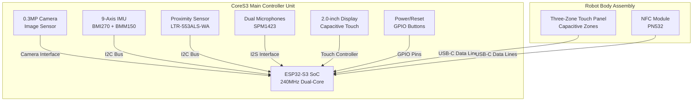
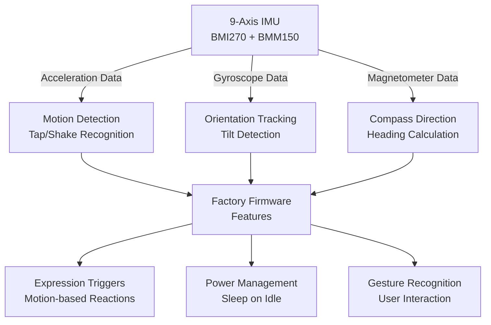
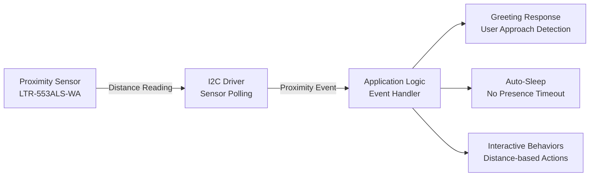
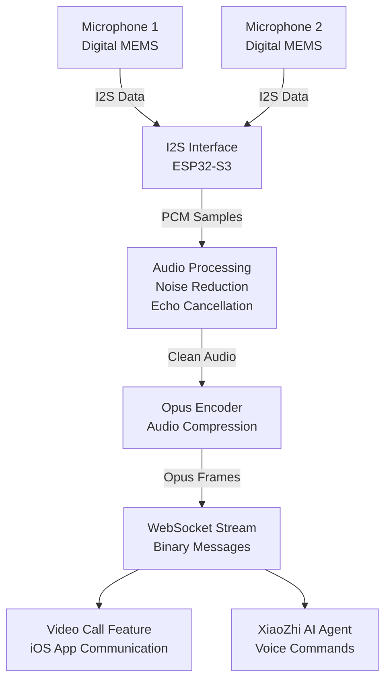
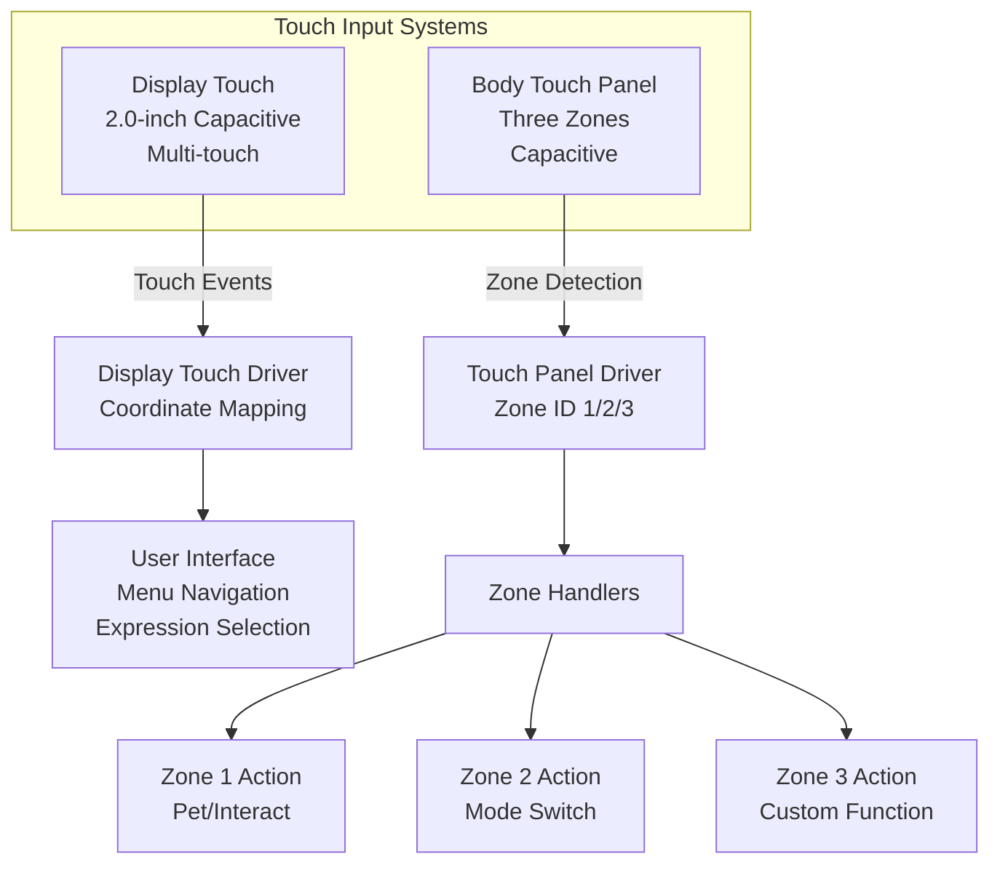
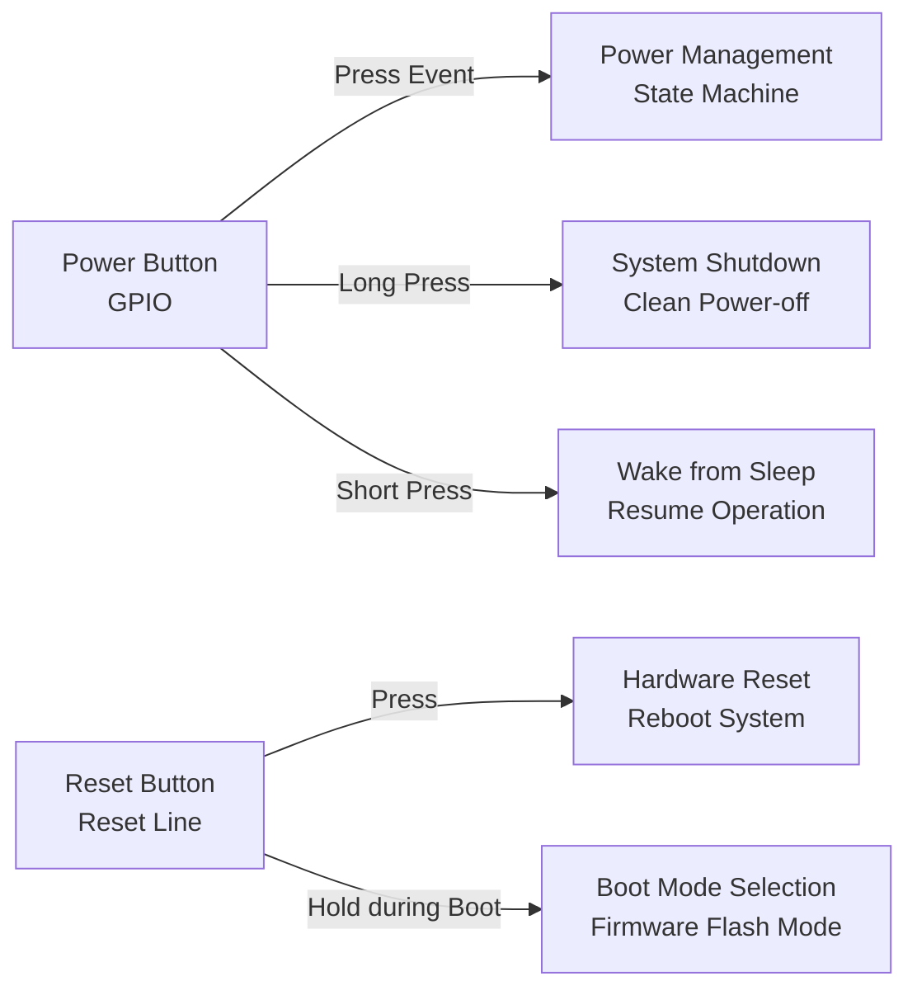
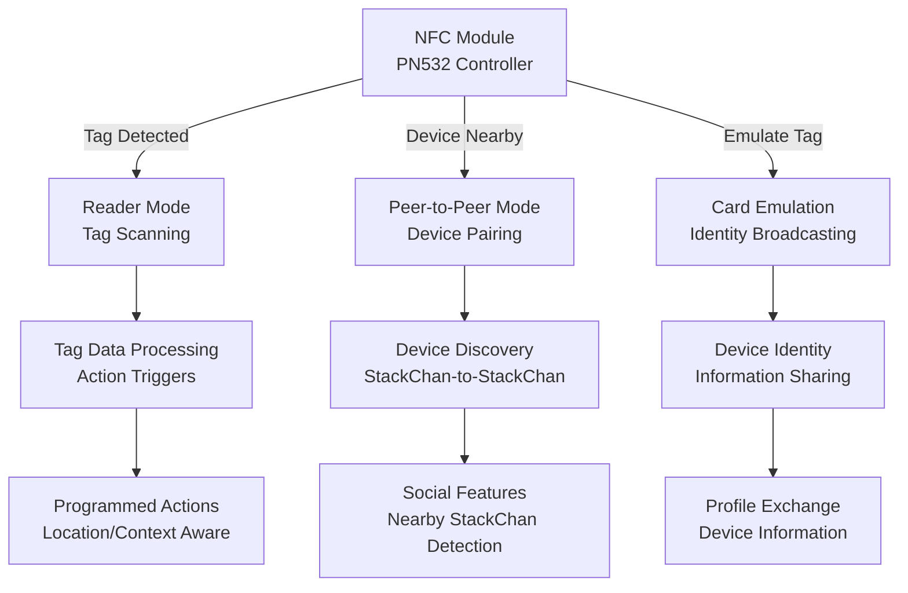
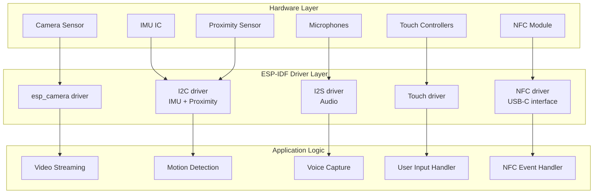

StackChan Sensors and Input Devices

# Sensors and Input Devices

Relevant source files

The following files were used as context for generating this wiki page:

- [README.md](README.md)

## Purpose and Scope

This document provides a comprehensive reference for all sensor and input device components integrated into the StackChan robot. These components enable the robot to perceive its environment, detect user interactions, and capture multimedia data. The sensors are divided between the CoreS3 main controller unit and the robot body.

For information about output devices such as servos, LEDs, and speaker, see [Actuators and Output Devices](#3.3). For communication hardware including Wi-Fi and Bluetooth modules, see [Communication Interfaces](#3.4).

## Sensor Overview

The StackChan robot integrates multiple sensor types distributed across two physical assemblies:

| Sensor Type | Location | Primary Function | Interface |
|------------|----------|------------------|-----------|
| 0.3MP Camera | CoreS3 Main Unit | Image capture, video streaming | Camera interface |
| 9-Axis IMU | CoreS3 Main Unit | Motion detection, orientation | I2C/SPI |
| Proximity Sensor | CoreS3 Main Unit | Object detection | I2C |
| Dual Microphones | CoreS3 Main Unit | Audio capture, voice input | I2S |
| Capacitive Touch Display | CoreS3 Main Unit | Touch input, gesture detection | Capacitive touch controller |
| Power/Reset Buttons | CoreS3 Main Unit | Manual control | GPIO |
| Three-Zone Touch Panel | Robot Body | User interaction zones | Capacitive touch |
| NFC Module | Robot Body | Near-field communication | NFC controller |

### System Integration

**Sources:** [README.md:11-13]()

## Camera System

The CoreS3 main unit integrates a **0.3 megapixel camera** for image capture and video streaming. This camera serves as the robot's primary visual sensor, enabling facial expression display overlay, video call functionality, and remote viewing through the iOS application.

### Camera Specifications

- **Resolution:** 0.3MP (VGA class)
- **Interface:** Direct camera interface to ESP32-S3
- **Purpose:** Real-time video streaming, image capture
- **Use Cases:** 
  - iOS app live video feed
  - Video call avatar transmission
  - Remote monitoring and viewing

### Camera Data Flow

The camera captures frames which are JPEG-encoded using ESP32-S3's hardware acceleration, then transmitted as binary WebSocket messages to the iOS application via the backend server relay. This enables real-time video streaming with minimal latency.

**Sources:** [README.md:11]()

## Inertial Measurement Unit (IMU)

The **9-axis IMU** provides comprehensive motion sensing through three integrated sensor types:

### IMU Components

| Component | Type | Axes | Measurement Range |
|-----------|------|------|-------------------|
| Accelerometer | Linear acceleration | 3-axis (X, Y, Z) | Configurable ±2g to ±16g |
| Gyroscope | Angular velocity | 3-axis (X, Y, Z) | Configurable ±125 to ±2000 dps |
| Magnetometer | Magnetic field | 3-axis (X, Y, Z) | Earth's magnetic field |

### IMU Sensor IC

The CoreS3 typically uses a **BMI270** (6-axis accelerometer + gyroscope) combined with a **BMM150** (3-axis magnetometer) for full 9-axis sensing capability.

### IMU Applications

The IMU enables the robot to detect its physical orientation, respond to motion events (taps, shakes), and implement gesture-based interactions. This is critical for creating natural, responsive robot behaviors.

**Sources:** [README.md:11]()

## Proximity Sensor

The **proximity sensor** (LTR-553ALS-WA or similar) detects nearby objects without physical contact, enabling proximity-aware behaviors.

### Proximity Sensor Characteristics

- **Detection Range:** Typically 5-10cm
- **Interface:** I2C bus
- **Functions:** 
  - Object proximity detection
  - Ambient light sensing (ALS)
  - Presence detection

### Proximity Detection Use Cases

The proximity sensor allows StackChan to detect when users approach or interact with it, triggering appropriate responses such as greeting expressions, wake-from-sleep, or distance-aware behaviors.

**Sources:** [README.md:11]()

## Audio Input System

StackChan features **dual microphones** for stereo audio capture and voice input processing.

### Microphone Specifications

- **Type:** Digital MEMS microphones (SPM1423 or similar)
- **Configuration:** Dual microphone array
- **Interface:** I2S (Inter-IC Sound) bus
- **Sample Rate:** Configurable (typically 8kHz-48kHz)
- **Audio Format:** PCM, Opus encoding for transmission

### Audio Pipeline

The dual microphones capture audio which is processed through the ESP32-S3's I2S interface, encoded to Opus format for efficient transmission, and streamed via WebSocket for video calls and AI voice interaction features.

**Sources:** [README.md:11]()

## Touch Interfaces

StackChan provides two separate touch input systems for user interaction.

### Capacitive Touch Display

The **2.0-inch capacitive touch display** serves dual purposes as both a visual output and touch input device.

- **Type:** Capacitive touch panel with glass cover
- **Touch Points:** Multi-touch capable
- **Resolution:** Touch coordinate mapping to display pixels
- **Strength:** High-strength glass cover for durability

### Three-Zone Touch Panel

The **robot body** includes a dedicated **three-zone touch panel** providing distinct touch-sensitive areas for specific interactions.

The display touch enables menu navigation and expression control, while the three-zone body panel provides dedicated interaction areas for petting, mode switching, and custom programmed responses.

**Sources:** [README.md:11,13]()

## Physical Buttons

The CoreS3 main unit includes physical buttons for fundamental device control:

### Button Configuration

| Button | Function | GPIO Type | Location |
|--------|----------|-----------|----------|
| Power Button | Power on/off, wake from sleep | Dedicated power control | Main unit |
| Reset Button | System reset, boot mode selection | Hardware reset line | Main unit |

### Button Event Handling

Physical buttons provide failsafe control mechanisms independent of software state, ensuring users can always power cycle or reset the device.

**Sources:** [README.md:11]()

## NFC Module

The robot body integrates a **full-featured NFC (Near Field Communication) module** for contactless communication and identification.

### NFC Capabilities

- **IC:** PN532 or similar NFC controller
- **Modes:** 
  - Reader/Writer mode
  - Card emulation mode
  - Peer-to-peer mode
- **Standards:** ISO/IEC 14443 Type A/B, FeliCa, NFC Forum protocols
- **Interface:** Connected via USB-C data lines to ESP32-S3

### NFC Use Cases

The NFC module enables StackChan to interact with NFC tags, communicate with other StackChan devices in proximity, and share device information through contactless communication. This supports the factory firmware's feature for discovering nearby StackChan devices.

**Sources:** [README.md:13,15]()

## Sensor Data Integration

### Firmware Driver Architecture

All sensors connect to the ESP32-S3 through the firmware driver layer, which abstracts hardware-specific details and provides unified interfaces for application code.

The ESP-IDF framework provides hardware drivers that handle low-level communication protocols (I2C, I2S, SPI, camera interface), while application logic consumes processed sensor data through these driver interfaces.

**Sources:** [README.md:11-13]()

## Safety Considerations for Sensor Operation

### Environmental Operating Conditions

- **Temperature Range:** Sensors operate within ESP32-S3 specifications (typically -40°C to +85°C storage, 0°C to +65°C operation)
- **Humidity:** Non-condensing environments recommended for optical sensors (camera, proximity)
- **Physical Protection:** Glass cover protects display touch sensor; handle NFC area carefully to avoid damage

### Sensor Interference

- **IMU Calibration:** Magnetic interference from motors or external magnets can affect magnetometer accuracy
- **Proximity Sensor:** Direct sunlight or bright ambient light may affect proximity detection range
- **Microphones:** Keep away from speaker output to prevent acoustic feedback during audio capture
- **Touch Sensors:** Water or conductive contaminants may cause false touch detection

These sensors provide comprehensive environmental awareness and user interaction capabilities, enabling StackChan to function as an interactive, responsive AI desktop robot. The factory firmware leverages these sensors to implement facial expressions, the XiaoZhi AI agent, video calls, and nearby device discovery features.

**Sources:** [README.md:11-17]()