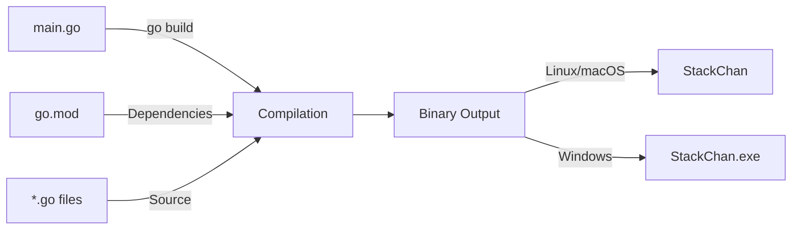
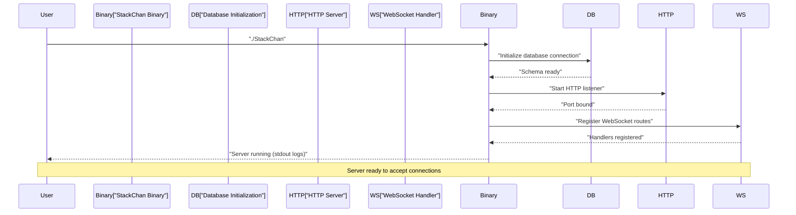
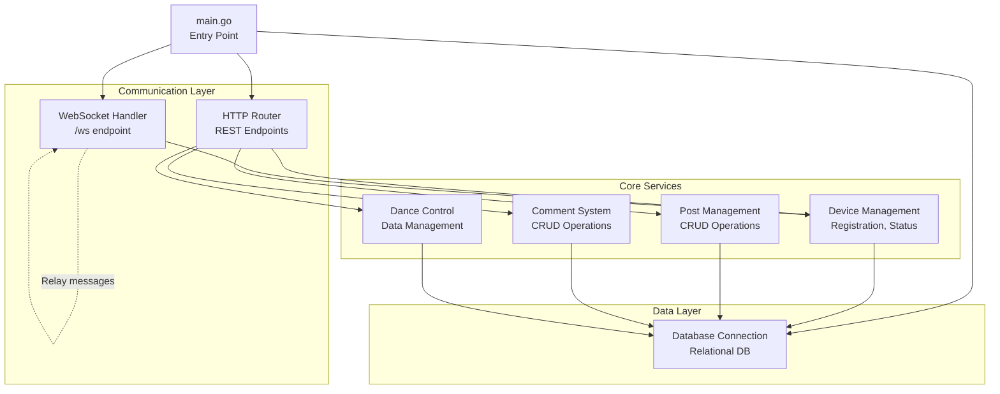
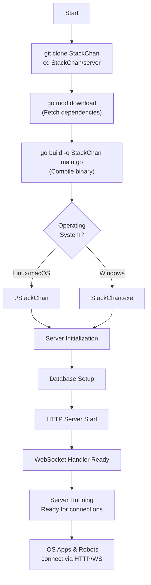

StackChan Server Setup and Deployment

# Server Setup and Deployment

<details>
<summary>Relevant source files</summary>

The following files were used as context for generating this wiki page:

- [server/README.md](server/README.md)

</details>


## Purpose and Scope

This page provides instructions for building and running the StackChan backend server from source. The server is written in Go and serves as the central coordination point for device management, WebSocket relay, and social features in the StackChan ecosystem.

For information about the server's API endpoints, see [Device Management API](#6.2) and [Social Features API](#6.3). For WebSocket communication protocols, see [WebSocket Protocol](#7.2). For overall server architecture context, see [Backend Server](#6).

---

## Prerequisites

### Go Language Runtime

The StackChan server requires **Go 1.24 or later** installed on the build and deployment system.

| Requirement | Version | Purpose |
|------------|---------|---------|
| Go SDK | 1.24+ | Compile and run the server |
| Git | Any recent | Clone repository |
| Network Access | - | Download dependencies |

**Installation Verification:**

```bash
go version
```

Expected output format: `go version go1.24.x ...`

Install Go from the [official download page](https://golang.google.cn/dl/) if not already present.

### System Requirements

The server can run on any platform supported by Go:
- Linux (x86_64, ARM64)
- macOS (x86_64, ARM64)
- Windows (x86_64)

Sources: [server/README.md:20-29]()

---

## Repository Setup

### Cloning the Source Code

```bash
git clone https://github.com/m5stack/StackChan
cd StackChan/server
```

The server source code resides in the `server/` subdirectory of the main StackChan repository. This directory contains:
- `main.go` - Server entry point
- `go.mod` - Go module definition and dependencies
- `go.sum` - Dependency checksums

### Dependency Management

The server uses Go modules for dependency management. Download all required dependencies:

```bash
go mod download
```

This command reads [server/go.mod]() and fetches all declared dependencies into the local Go module cache. The operation is idempotent and safe to run multiple times.

Sources: [server/README.md:31-37]()

---

## Building from Source

### Build Process

**Build Command Diagram**



Sources: [server/README.md:39-40]()

### Standard Build

Compile the server into a standalone executable:

```bash
go build -o StackChan main.go
```

**Build Parameters:**
- `-o StackChan` - Output binary name (automatically appends `.exe` on Windows)
- `main.go` - Entry point file

The build command:
1. Resolves all import statements in [server/main.go]()
2. Compiles all referenced Go source files in the `server/` tree
3. Links dependencies from `go.mod`
4. Produces a statically-linked executable

### Platform-Specific Outputs

| Platform | Output Filename | Typical Size |
|----------|----------------|--------------|
| Linux | `StackChan` | ~10-20 MB |
| macOS | `StackChan` | ~10-20 MB |
| Windows | `StackChan.exe` | ~10-20 MB |

The executable is statically linked and contains all dependencies, requiring no external runtime files.

### Cross-Compilation

To build for a different target platform:

```bash
# Build for Linux on any platform
GOOS=linux GOARCH=amd64 go build -o StackChan-linux main.go

# Build for Windows on any platform
GOOS=windows GOARCH=amd64 go build -o StackChan.exe main.go

# Build for macOS ARM64 on any platform
GOOS=darwin GOARCH=arm64 go build -o StackChan-macos-arm64 main.go
```

Sources: [server/README.md:39-40]()

---

## Running the Server

### Startup Commands

**Linux/macOS:**
```bash
./StackChan
```

**Windows:**
```bash
StackChan.exe
```

The server binary is self-contained and starts immediately without additional configuration files.

**Server Startup Flow**



Sources: [server/README.md:42-44]()

### Default Configuration

When started without explicit configuration, the server uses default values:

| Component | Default Value | Purpose |
|-----------|--------------|---------|
| HTTP Port | Typically 8080 or configured | REST API endpoints |
| WebSocket Endpoint | `/ws` | Real-time communication |
| Database | In-memory or file-based | Persistent storage |
| Log Level | INFO | Console output verbosity |

The actual port and database configuration may be specified through environment variables or configuration files (consult [server/main.go]() for implementation details).

### Verifying Server Operation

Once running, verify the server is operational:

```bash
# Check if HTTP endpoint responds (adjust port as needed)
curl http://localhost:8080/health

# Check if WebSocket endpoint is accessible
wscat -c ws://localhost:8080/ws
```

Sources: [server/README.md:42-44]()

---

## Server Architecture and Entry Point

**Server Component Structure**



The server executable starts from [server/main.go]() which initializes:
1. Database connections
2. HTTP router and REST endpoints
3. WebSocket handler at `/ws`
4. Core service modules for device, post, comment, and dance management

Sources: [server/README.md:1-14](), [server/README.md:8-14]()

---

## Configuration Options

### Database Configuration

The server uses a relational database for persistent storage. Based on the architecture:
- Device information (MAC address, name, online status)
- Posts (text, images, timestamps)
- Comments (associations with posts)
- Dance data

Configuration typically provided via:
- Environment variables
- Configuration file (JSON/YAML)
- Command-line flags

Refer to [server/main.go]() for the specific configuration mechanism implemented.

### Network Configuration

The server must be accessible to both:
1. **iOS applications** - For device management API calls and WebSocket connections
2. **StackChan robots** - For WebSocket connections and status updates

Ensure firewall rules permit:
- Inbound TCP on the HTTP port (default likely 8080)
- Inbound WebSocket upgrades on `/ws` endpoint
- Database access (if using external database server)

For configuring iOS apps and firmware to connect to the server, see [Network Configuration](#8.3).

Sources: [server/README.md:8-14]()

---

## Deployment Considerations

### Production Deployment

For production environments:

1. **Process Management** - Use a process supervisor:
   ```bash
   # systemd (Linux)
   systemctl start stackchan-server
   
   # Docker
   docker run -d -p 8080:8080 stackchan-server
   
   # PM2 (if using Node wrapper)
   pm2 start StackChan --name stackchan-server
   ```

2. **Reverse Proxy** - Place behind nginx/Apache for:
   - TLS termination
   - Load balancing
   - Request logging

3. **Database** - Use production-grade database:
   - PostgreSQL
   - MySQL
   - SQLite with WAL mode for smaller deployments

### Security Best Practices

| Concern | Recommendation |
|---------|---------------|
| TLS/SSL | Enable HTTPS for all endpoints |
| Authentication | Implement API key or OAuth for device registration |
| WebSocket Security | Validate MAC addresses and device IDs |
| Database Access | Use connection pooling, prepared statements |
| Rate Limiting | Prevent abuse of API endpoints |

### Monitoring and Logs

The server outputs operational logs to stdout/stderr. In production:
- Redirect logs to file: `./StackChan >> server.log 2>&1`
- Use log aggregation tools (ELK, Splunk, CloudWatch)
- Monitor WebSocket connection counts
- Track API endpoint response times
- Alert on database connection failures

Sources: [server/README.md:1-14]()

---

## Build and Deployment Workflow

**Complete Build-to-Run Workflow**



This diagram shows the complete flow from repository cloning through to active server operation with connected clients.

Sources: [server/README.md:18-44]()

---

## Troubleshooting

### Common Build Issues

| Issue | Cause | Solution |
|-------|-------|----------|
| `go: command not found` | Go not installed or not in PATH | Install Go 1.24+ and add to PATH |
| `cannot find module` | Dependencies not downloaded | Run `go mod download` |
| `build failed: syntax error` | Incompatible Go version | Upgrade to Go 1.24 or later |

### Common Runtime Issues

| Issue | Cause | Solution |
|-------|-------|----------|
| `port already in use` | Port conflict | Change port configuration or stop conflicting service |
| `cannot connect to database` | Database not running or misconfigured | Check database status and connection string |
| `WebSocket upgrade failed` | Proxy configuration | Ensure proxy supports WebSocket upgrades |

### Verification Steps

After successful build and startup:

1. **Binary exists**: `ls -lh StackChan` (should show executable file)
2. **Process running**: `ps aux | grep StackChan` (should show process)
3. **Port listening**: `netstat -an | grep LISTEN` (should show HTTP port)
4. **HTTP response**: `curl http://localhost:8080/health` (should return status)

Sources: [server/README.md:20-44]()