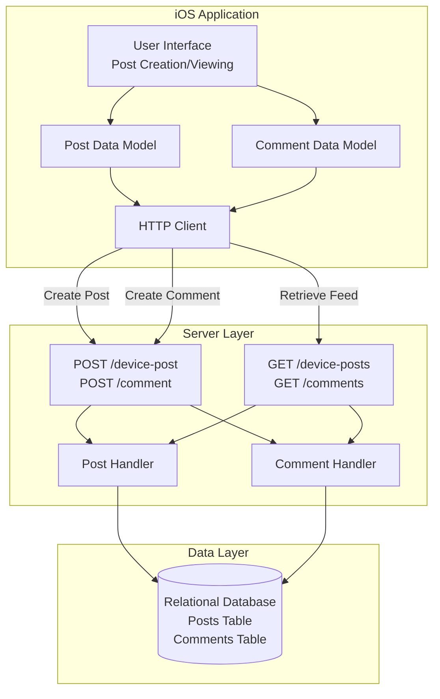
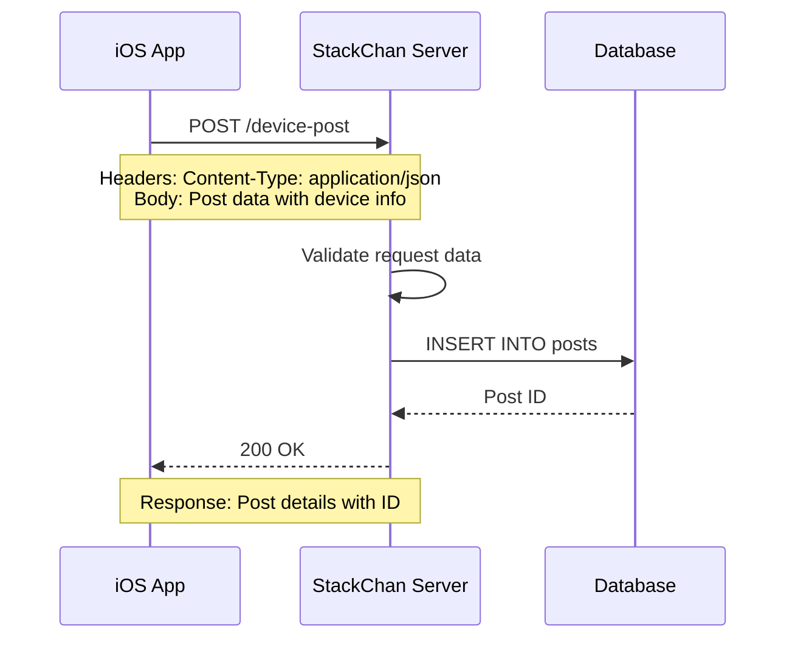
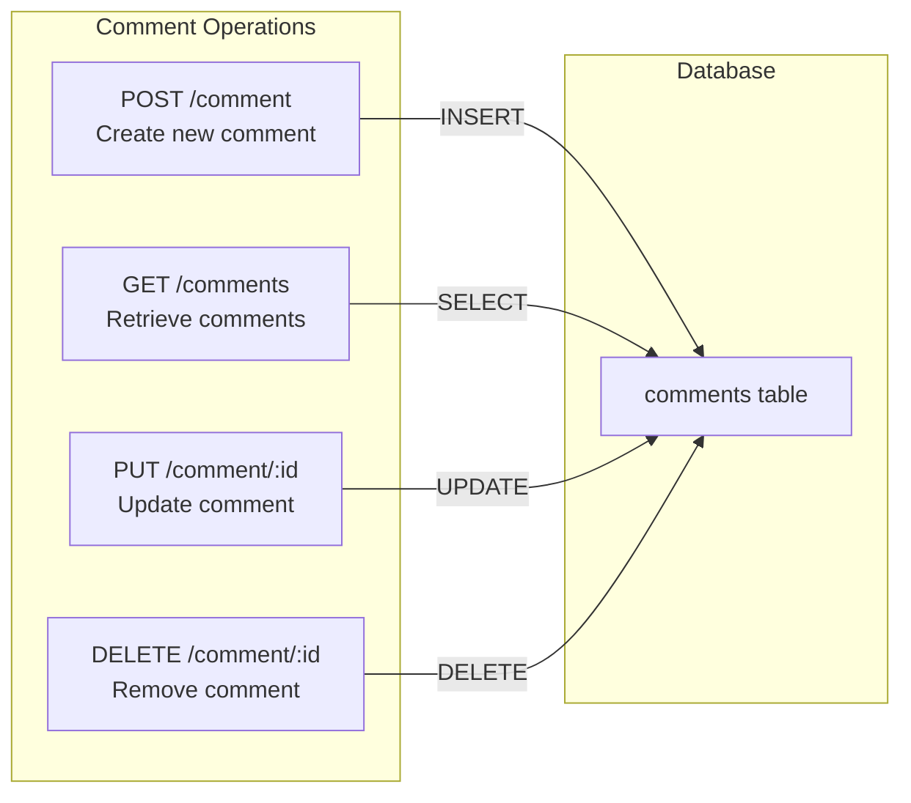
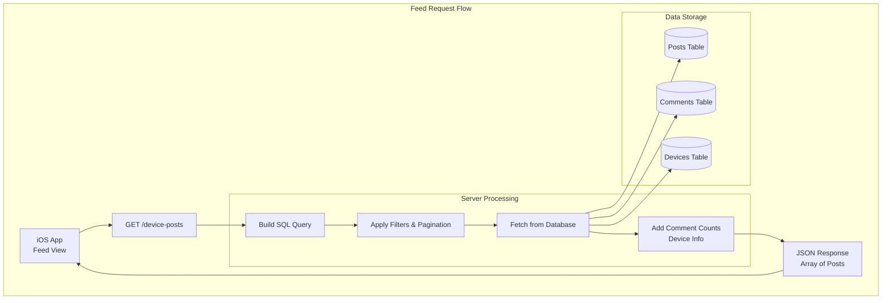
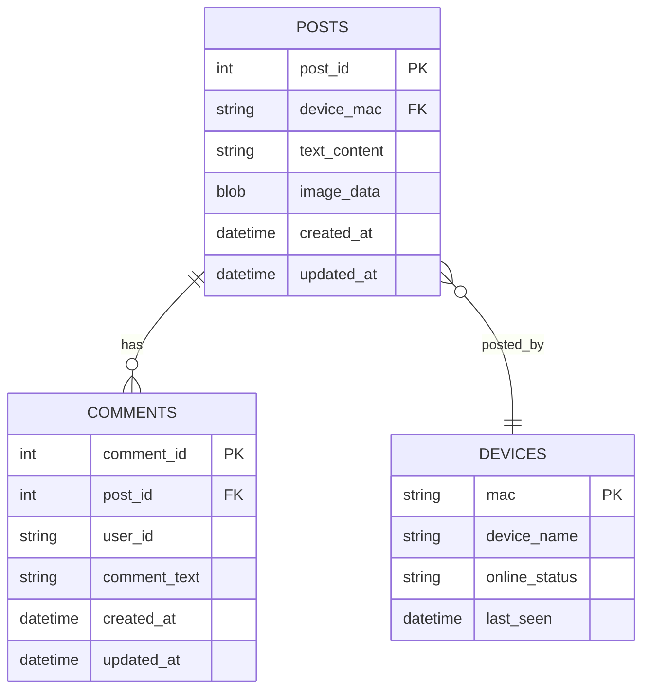
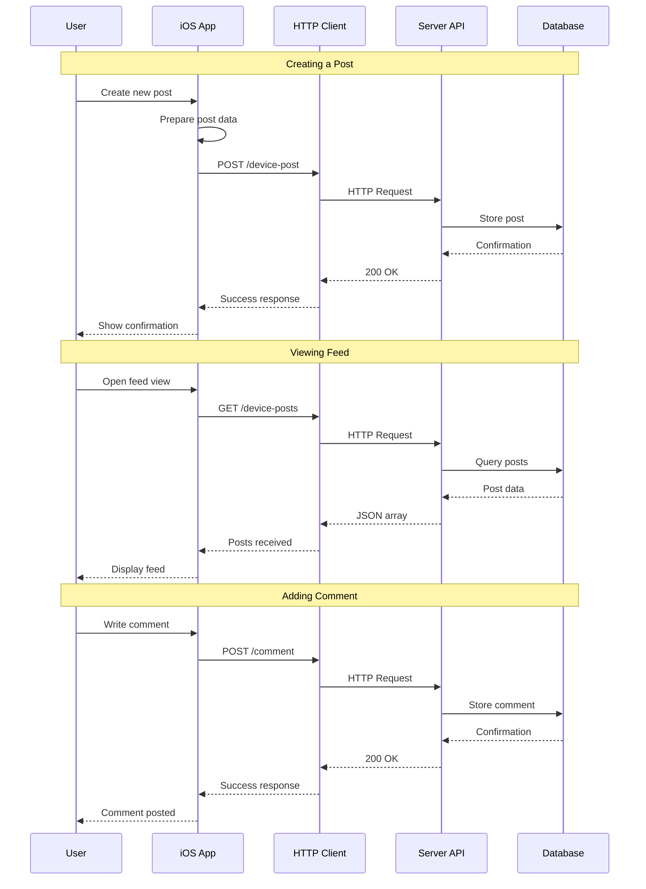

StackChan Social Features API

# Social Features API

<details>
<summary>Relevant source files</summary>

The following files were used as context for generating this wiki page:

- [server/README.md](server/README.md)

</details>


## Purpose and Scope

This document describes the HTTP REST API endpoints provided by the StackChan server for social networking features, including post creation and management, comment operations, and social feed functionality. These APIs enable StackChan robots and their users to share content and interact through posts and comments, creating a social platform for the StackChan community.

For information about device registration and status management, see [Device Management API](#6.2). For details on the HTTP protocol specifications, see [HTTP REST API](#7.3). For WebSocket-based real-time communication, see [WebSocket Protocol](#7.2).

---

## Overview

The Social Features API provides functionality for users to:

- **Create and manage device posts**: Share text and image content from StackChan devices
- **Perform comment operations**: Create, read, update, and delete comments on posts
- **Browse social feeds**: View posts from other StackChan devices in the community
- **Store multimedia content**: Support for text descriptions and image attachments

All social data is stored persistently in the server's relational database, allowing for long-term content preservation and retrieval. The API follows RESTful conventions with standard HTTP methods and JSON-based request/response formats.

**Sources:** [server/README.md:1-45]()

---

## Social Features Architecture

The following diagram illustrates the architecture of the social features system and how it integrates with other components:



**Sources:** [server/README.md:8-15]()

---

## Post Management API

### Post Creation

Posts are created by devices or users through the iOS application. Each post can contain text content and optional image attachments.

**Endpoint:** `POST /device-post`

**Request Flow:**



**Post Data Structure:**

The post model includes the following information:

| Field | Type | Description |
|-------|------|-------------|
| Device MAC | String | Unique identifier of the posting device |
| Device Name | String | Display name of the device |
| Text Content | String | Text description or message |
| Image Data | Binary/URL | Optional image attachment |
| Timestamp | DateTime | Post creation time |
| Post ID | Integer | Unique post identifier (generated) |

### Post Retrieval

Users can retrieve posts from their own devices or browse posts from the community feed.

**Endpoint:** `GET /device-posts`

**Query Parameters:**

| Parameter | Type | Description |
|-----------|------|-------------|
| mac | String | Filter by device MAC address (optional) |
| limit | Integer | Maximum number of posts to return |
| offset | Integer | Pagination offset |

### Post Updates and Deletion

Posts can be updated or deleted by the device owner:

- **Update:** Modify post text or image content
- **Delete:** Remove post from the system

**Sources:** [server/README.md:10-14]()

---

## Comment Management API

### Comment Creation

Comments allow users to interact with posts by adding responses or reactions.

**Endpoint:** `POST /comment`

**Comment Data Structure:**

| Field | Type | Description |
|-------|------|-------------|
| Post ID | Integer | ID of the post being commented on |
| User/Device ID | String | Identifier of the commenter |
| Comment Text | String | Comment content |
| Timestamp | DateTime | Comment creation time |
| Comment ID | Integer | Unique comment identifier (generated) |

### Comment CRUD Operations

The comment system supports full CRUD functionality:



**Comment Retrieval:**

Comments can be queried by:
- **Post ID:** Retrieve all comments for a specific post
- **User/Device ID:** Retrieve all comments by a specific user
- **Time range:** Filter comments by timestamp

**Sources:** [server/README.md:10-14]()

---

## Social Feed System

### Feed Architecture

The social feed aggregates posts from multiple devices, allowing users to discover and interact with content from the StackChan community.



### Feed Features

The feed system provides:

1. **Chronological ordering**: Posts displayed by creation time (newest first)
2. **Pagination**: Efficient loading of large post collections
3. **Device filtering**: View posts from specific devices
4. **Comment counts**: Display number of comments per post
5. **Device information**: Include device name and status with each post

**Sources:** [server/README.md:8-15]()

---

## Data Persistence

### Database Schema

The social features use a relational database for persistent storage:



### Storage Characteristics

| Feature | Implementation |
|---------|---------------|
| Image Storage | Binary data or file system references |
| Text Storage | UTF-8 encoded strings |
| Timestamp Format | ISO 8601 datetime |
| Indexing | Post ID, device MAC, creation time |
| Constraints | Foreign keys for referential integrity |

**Sources:** [server/README.md:14-15]()

---

## Integration with iOS Application

### Client-Side Usage

The iOS application interacts with the Social Features API through HTTP requests:



### Request/Response Format

**Example Post Creation Request:**

```json
{
  "device_mac": "AA:BB:CC:DD:EE:FF",
  "device_name": "My StackChan",
  "text_content": "Hello from StackChan!",
  "image_data": "<base64_encoded_image_or_url>"
}
```

**Example Post Response:**

```json
{
  "post_id": 12345,
  "device_mac": "AA:BB:CC:DD:EE:FF",
  "device_name": "My StackChan",
  "text_content": "Hello from StackChan!",
  "image_url": "https://server/images/12345.jpg",
  "created_at": "2024-01-15T10:30:00Z",
  "comment_count": 3
}
```

**Sources:** [server/README.md:8-15]()

---

## API Response Codes

The Social Features API uses standard HTTP status codes:

| Status Code | Meaning | Usage |
|-------------|---------|-------|
| 200 OK | Success | Successful retrieval or update |
| 201 Created | Resource created | Successful post or comment creation |
| 400 Bad Request | Invalid input | Missing required fields or invalid data |
| 401 Unauthorized | Authentication failed | Invalid device credentials |
| 404 Not Found | Resource not found | Post or comment ID doesn't exist |
| 500 Internal Server Error | Server error | Database or processing error |

---

## Security Considerations

### Data Validation

The server implements validation for:
- **Device authentication**: Verify device MAC address and credentials
- **Content sanitization**: Prevent injection attacks and malicious content
- **Size limits**: Enforce maximum sizes for text and images
- **Rate limiting**: Prevent spam and abuse

### Access Control

- **Post ownership**: Only device owners can update or delete their posts
- **Comment moderation**: Support for comment removal by post owners
- **Privacy settings**: Optional visibility controls for posts

**Sources:** [server/README.md:1-45]()

---

## Summary

The Social Features API provides a complete social networking platform for StackChan devices, enabling:

| Feature | Endpoints | Purpose |
|---------|-----------|---------|
| Post Management | POST /device-post, GET /device-posts | Create and browse posts |
| Comment System | POST /comment, GET /comments | Add and view comments |
| Feed Aggregation | GET /device-posts | Discover community content |
| Data Persistence | Database backend | Long-term storage |

The API integrates seamlessly with the iOS application to provide a cohesive social experience for StackChan users, storing all content in a relational database for reliable persistence and retrieval.

**Sources:** [server/README.md:1-45]()