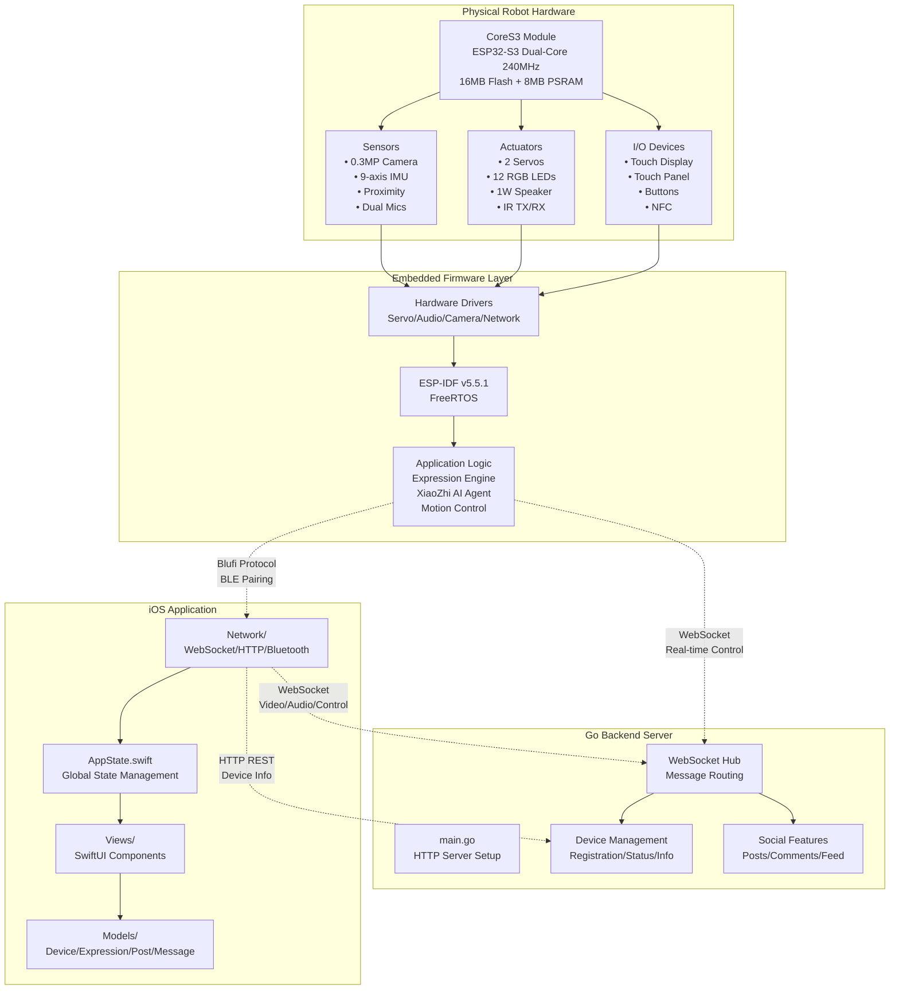
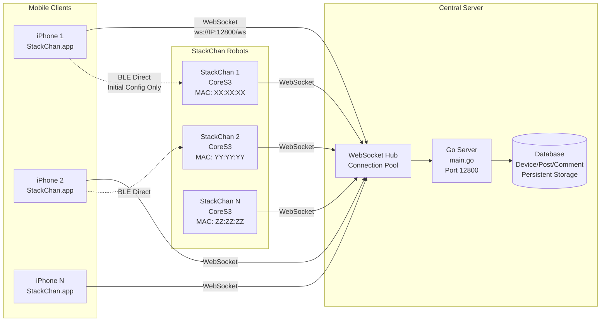
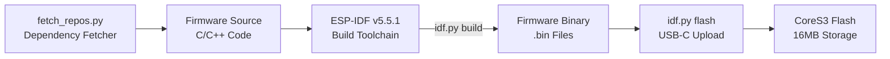
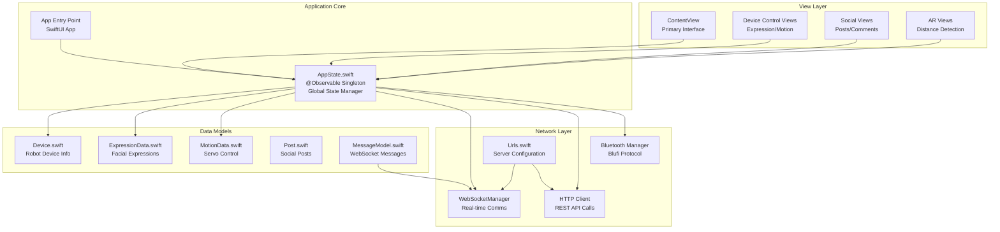
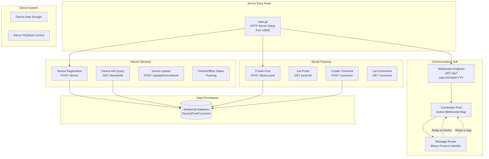
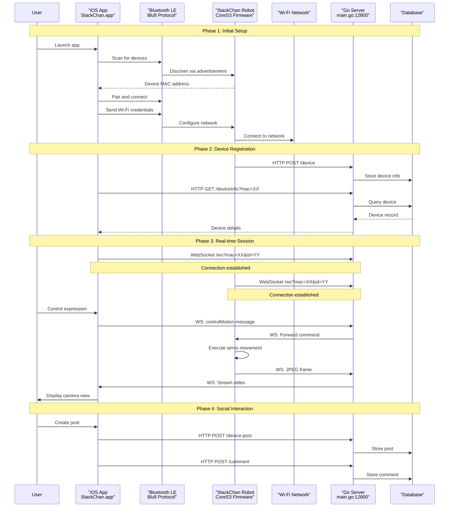
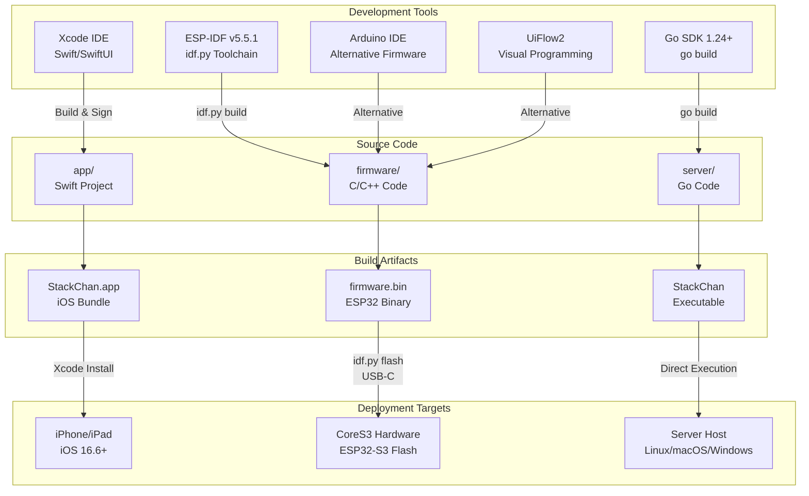

StackChan System Architecture

# System Architecture

<details>
<summary>Relevant source files</summary>

The following files were used as context for generating this wiki page:

- [README.md](README.md)
- [app/README.md](app/README.md)
- [firmware/README.md](firmware/README.md)
- [server/README.md](server/README.md)

</details>


## Purpose and Scope

This document describes the overall architecture of the StackChan system, including the relationships and communication pathways between the four major components: the CoreS3 hardware platform, the ESP-IDF firmware, the iOS mobile application, and the Go backend server. This page provides a structural overview of how these components interact to create the complete StackChan robot experience.

For detailed information about specific components, see:
- Hardware specifications: [Hardware & Robot](#3)
- Firmware development: [Firmware Development](#4)
- iOS application implementation: [iOS Application](#5)
- Backend server APIs: [Backend Server](#6)
- Communication protocol details: [Communication Protocols](#7)

## Component Overview

The StackChan system is a distributed architecture consisting of four primary components operating across three physical deployment targets:

| Component | Technology | Deployment Target | Primary Responsibilities |
|-----------|-----------|-------------------|-------------------------|
| **CoreS3 Hardware** | ESP32-S3 SoC | StackChan Robot | Physical sensors, actuators, processing |
| **Firmware** | ESP-IDF v5.5.1 (C/C++) | ESP32-S3 Flash Memory | Real-time control, expression engine, communication |
| **iOS App** | Swift/SwiftUI | iPhone/iPad (iOS 16.6+) | User interface, device control, social features |
| **Backend Server** | Go 1.24+ | Server Host | WebSocket relay, device management, persistence |



**Sources:** [README.md:1-22](), [firmware/README.md:1-26](), [app/README.md:1-63](), [server/README.md:1-45]()

## System Topology

The StackChan system operates in a hub-and-spoke topology where the Go backend server acts as the central communication hub. All real-time interactions between iOS clients and robot hardware are mediated through WebSocket connections to the server.



**Sources:** [app/README.md:42-52](), [server/README.md:8-14]()

## Hardware Layer Architecture

The hardware layer is built on the M5Stack CoreS3 module, which integrates the ESP32-S3 SoC with comprehensive sensor and actuator arrays.

```mermaid
graph TB
    subgraph ESP32["ESP32-S3 SoC"]
        Core0["Core 0<br/>240 MHz"]
        Core1["Core 1<br/>240 MHz"]
        Flash["16MB Flash<br/>Program Storage"]
        PSRAM["8MB PSRAM<br/>Runtime Memory"]
        WiFi["Wi-Fi Radio<br/>802.11 b/g/n"]
        BLE["BLE Radio<br/>Bluetooth 5.0"]
    end
    
    subgraph Peripherals["Integrated Peripherals"]
        Display["2.0\" Touch Display<br/>Capacitive"]
        Camera["0.3MP Camera<br/>Image Capture"]
        IMU["9-axis IMU<br/>Accel/Gyro/Mag"]
        Audio["Audio Subsystem<br/>1W Speaker<br/>Dual Mics"]
        Prox["Proximity Sensor"]
        SD["microSD Slot"]
    end
    
    subgraph RobotBody["Robot Body Components"]
        Servo1["Servo 1<br/>Horizontal 360°"]
        Servo2["Servo 2<br/>Vertical 90°"]
        LEDs["12 RGB LEDs<br/>2 Rows"]
        IR["IR TX/RX"]
        Touch["3-Zone Touch Panel"]
        NFC["NFC Module"]
        Battery["700mAh Battery"]
        USBC["USB-C Interface<br/>Power + Data"]
    end
    
    Core0 --> WiFi
    Core0 --> BLE
    Core1 --> Camera
    Core1 --> Audio
    
    Flash --> Core0
    PSRAM --> Core0
    
    WiFi -.-> Display
    BLE -.-> Display
    
    Core0 --> Servo1
    Core0 --> Servo2
    Core1 --> LEDs
    Core1 --> IR
    
    USBC --> Battery
    Battery --> Core0
```

**Sources:** [README.md:11-13]()

## Firmware Layer Architecture

The firmware runs on ESP-IDF v5.5.1, a FreeRTOS-based framework that provides hardware abstraction and networking capabilities.

### Firmware Build System



The firmware includes factory-installed features:
- Facial expression rendering and animation
- XiaoZhi AI agent integration
- Video call support via iOS app
- Device discovery for nearby StackChan robots
- Blufi protocol implementation for Wi-Fi configuration
- WebSocket client for server communication

**Sources:** [firmware/README.md:1-26](), [README.md:15-17]()

## iOS Application Layer Architecture

The iOS application is built with Swift and SwiftUI, targeting iOS 16.6 and later. It follows a centralized state management pattern.

### Application Architecture



### Network Configuration

The iOS app requires server IP configuration in `Network/Urls.swift`. The base URL defines the WebSocket and HTTP endpoints:

```swift
static let url = "192.168.51.24:12800/"
```

**Sources:** [app/README.md:42-52]()

## Backend Server Layer Architecture

The Go backend server provides device management, WebSocket message relay, and social features with persistent storage.

### Server Components



**Sources:** [server/README.md:1-45]()

## Communication Architecture

The system employs three distinct communication protocols for different interaction phases and requirements.

### Protocol Overview

| Protocol | Transport | Use Case | Connection Timing | Data Types |
|----------|-----------|----------|-------------------|------------|
| **Blufi** | Bluetooth LE | Initial device pairing, Wi-Fi credentials | Setup phase only | Configuration data |
| **WebSocket** | TCP over Wi-Fi | Real-time bidirectional control | Active session | Binary messages (video, audio, control) |
| **HTTP REST** | TCP over Wi-Fi | Device management, social features | As needed | JSON payloads |

### Communication Flow



**Sources:** [app/README.md:42-52](), [server/README.md:8-14]()

## Data Flow Patterns

### Control Data Flow

Control commands flow from the iOS app through the server to the robot hardware:

```
User Input → iOS AppState → WebSocketManager → Server WebSocket Hub → Robot Firmware → Servo Drivers → Physical Movement
```

### Video Streaming Flow

Video data flows from the robot's camera through the server to the iOS app:

```
Camera Sensor → Firmware Image Capture → JPEG Encoding → WebSocket Binary Message → Server Relay → iOS Decoder → SwiftUI Display
```

### Device State Synchronization

Device information is synchronized through HTTP REST APIs:

```
Robot Status Update → HTTP POST /updateDeviceName → Server Database → HTTP GET /deviceInfo → iOS AppState → UI Update
```

**Sources:** [app/README.md:1-63](), [server/README.md:1-45]()

## Development and Deployment Architecture

The system supports multiple development paths and toolchains for each component.

### Build and Deployment Workflow



### Component Dependencies

The firmware requires dependency fetching before building:

```bash
python3 ./fetch_repos.py
```

The iOS app requires server URL configuration in `Network/Urls.swift` before deployment.

The Go server requires Go 1.24+ and depends on modules managed by `go mod`.

**Sources:** [firmware/README.md:1-26](), [app/README.md:1-63](), [server/README.md:18-45]()

## Network Configuration Requirements

All three network-connected components must be configured to communicate with each other:

| Component | Configuration Location | Parameter | Default Value |
|-----------|----------------------|-----------|---------------|
| iOS App | `Network/Urls.swift` | `Urls.url` | `"192.168.51.24:12800/"` |
| Firmware | Blufi configuration | Wi-Fi SSID/Password | User-provided via BLE |
| Server | Command line | Port binding | `:12800` |

The iOS app and firmware must both point to the same server IP address and port. The firmware receives this configuration during the initial Blufi pairing process.

**Sources:** [app/README.md:42-52]()

## Security and Safety Considerations

### Motor Safety

The system includes safety warnings regarding servo operation:

> Do not forcibly rotate any movable parts connected to the motors by hand when you are unsure whether the motors are powered and under control, as this may cause hardware damage.

### Network Security

The system currently operates on local networks. The Blufi protocol handles initial Wi-Fi credential exchange over Bluetooth LE, which provides pairing-based security. WebSocket and HTTP connections operate over standard TCP without explicit encryption in the documented configuration.

### Code Signing

The iOS app requires proper code signing configuration in Xcode under "Signing & Capabilities" for deployment to physical devices. A free Apple ID is sufficient for personal development and testing.

**Sources:** [README.md:17](), [app/README.md:28-40]()