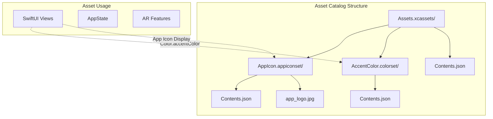
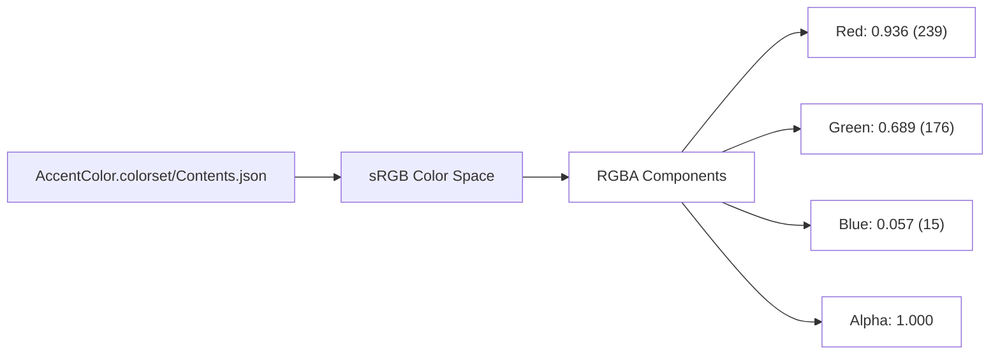
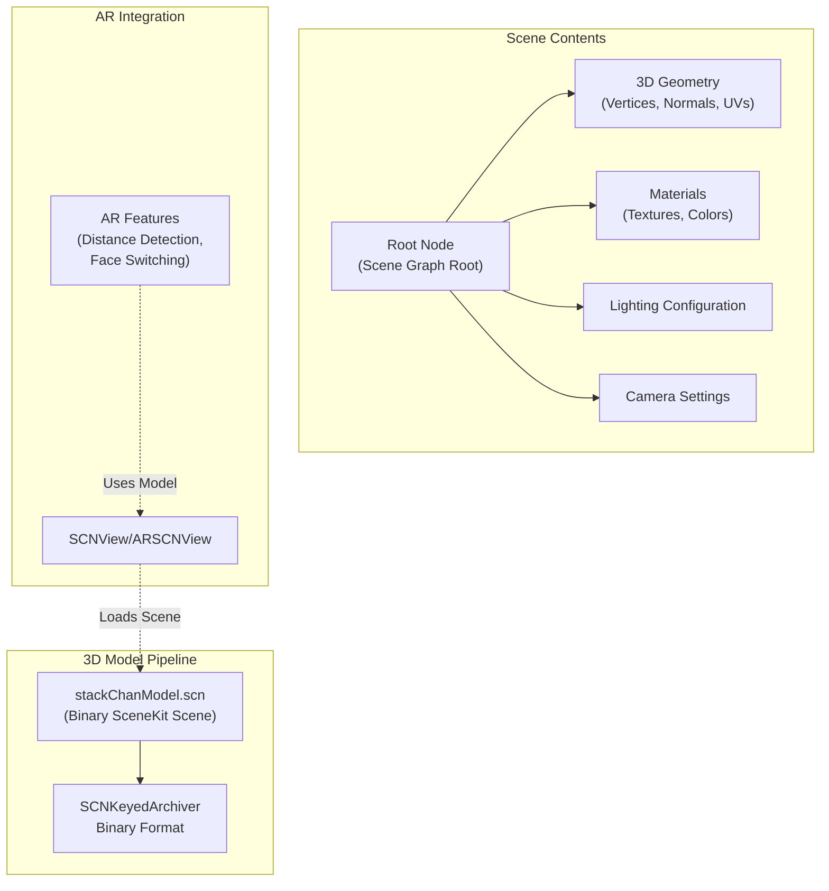
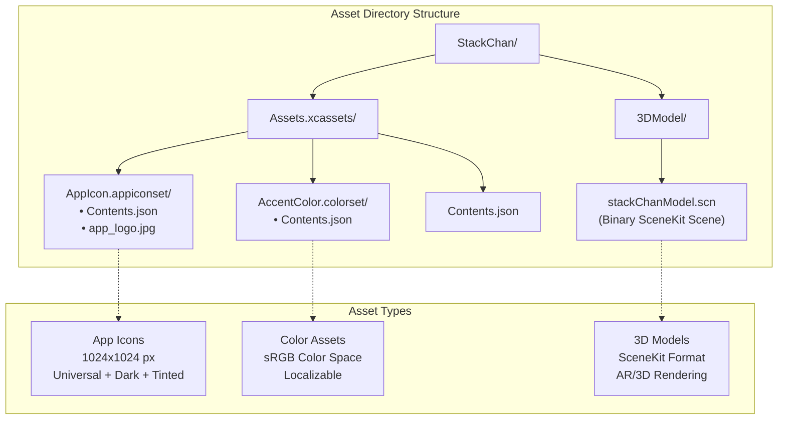

StackChan User Interface and Assets

# User Interface and Assets

<details>
<summary>Relevant source files</summary>

The following files were used as context for generating this wiki page:

- [app/StackChan/3DModel/stackChanModel.scn](app/StackChan/3DModel/stackChanModel.scn)
- [app/StackChan/Assets.xcassets/AccentColor.colorset/Contents.json](app/StackChan/Assets.xcassets/AccentColor.colorset/Contents.json)
- [app/StackChan/Assets.xcassets/AppIcon.appiconset/Contents.json](app/StackChan/Assets.xcassets/AppIcon.appiconset/Contents.json)
- [app/StackChan/Assets.xcassets/Contents.json](app/StackChan/Assets.xcassets/Contents.json)

</details>


This document describes the visual assets, color schemes, and 3D models used in the StackChan World iOS application. This includes the asset catalog structure, app icon configuration, color definitions, and the SceneKit 3D model used for AR features.

For information about the SwiftUI views and UI code structure, see [5.4](#5.4) Data Models and [5.3](#5.3) Application State Management. For details on AR-related app capabilities and permissions, see [5.6](#5.6) App Capabilities and Permissions.

## Asset Catalog Overview

The iOS app uses Xcode's Asset Catalog system (`.xcassets`) to manage visual resources. The asset catalog provides a centralized location for app icons, colors, and image assets with support for multiple device types and appearance modes (light/dark).



**Sources:** [app/StackChan/Assets.xcassets/Contents.json:1-7](), [app/StackChan/Assets.xcassets/AppIcon.appiconset/Contents.json:1-37](), [app/StackChan/Assets.xcassets/AccentColor.colorset/Contents.json:1-24]()

## App Icon Configuration

The app icon is defined in the `AppIcon.appiconset` directory and uses a single 1024x1024 pixel image (`app_logo.jpg`) that iOS automatically scales for different contexts.

### Icon Variants

| Variant | Size | Usage | File Reference |
|---------|------|-------|----------------|
| Universal | 1024x1024 | Default light mode | `app_logo.jpg` |
| Dark Mode | 1024x1024 | Dark appearance | Uses default |
| Tinted | 1024x1024 | iOS tinted icons | Uses default |

The icon configuration supports three appearance modes as defined in [app/StackChan/Assets.xcassets/AppIcon.appiconset/Contents.json:10-30]():

```json
{
  "images" : [
    {
      "filename" : "app_logo.jpg",
      "idiom" : "universal",
      "platform" : "ios",
      "size" : "1024x1024"
    },
    {
      "appearances" : [
        { "appearance" : "luminosity", "value" : "dark" }
      ],
      ...
    },
    {
      "appearances" : [
        { "appearance" : "luminosity", "value" : "tinted" }
      ],
      ...
    }
  ]
}
```

**Sources:** [app/StackChan/Assets.xcassets/AppIcon.appiconset/Contents.json:1-37]()

## Color Assets

### Accent Color

The app defines a custom accent color used throughout the UI for interactive elements, highlights, and branding. The accent color is configured as a localizable asset, allowing for potential localization of color schemes.



The accent color is defined in [app/StackChan/Assets.xcassets/AccentColor.colorset/Contents.json:4-11]() with the following values:

| Component | Normalized (0-1) | 8-bit (0-255) | Hex |
|-----------|------------------|---------------|-----|
| Red | 0.936 | 239 | EF |
| Green | 0.689 | 176 | B0 |
| Blue | 0.057 | 15 | 0F |
| Alpha | 1.000 | 255 | FF |

**Resulting Color:** `#EFB00F` (orange/amber)

This creates a warm orange/amber color scheme that provides high visibility and matches the StackChan robot's friendly, approachable aesthetic.

The color is marked as localizable in [app/StackChan/Assets.xcassets/AccentColor.colorset/Contents.json:20-22](), allowing different regions to potentially use different color schemes:

```json
"properties" : {
  "localizable" : true
}
```

**Sources:** [app/StackChan/Assets.xcassets/AccentColor.colorset/Contents.json:1-24]()

## 3D Model for AR Features

The app includes a SceneKit 3D model (`stackChanModel.scn`) used for AR visualization and face switching features. This model is stored in binary property list format and contains the 3D geometry, materials, and scene graph for rendering the StackChan robot in augmented reality contexts.



### Model Structure

The SceneKit scene file is stored in binary property list format as indicated by the file header [app/StackChan/3DModel/stackChanModel.scn:1-2]():

```
bplist00�
X$versionY$archiverT$topX$objects
```

The file contains:
- **Scene Graph:** Hierarchical node structure with root node and child nodes
- **Geometry Data:** 3D mesh vertices, normals, texture coordinates, and tangents
- **Materials:** Surface materials with properties for rendering
- **Lighting:** Scene lighting configuration and environment maps
- **Camera:** Default camera position and settings

Key scene properties defined in the model:
- `screenSpaceReflectionMaximumDistance`: Maximum reflection distance
- `screenSpaceReflectionSampleCount`: Quality of reflections
- `fogColor`: Atmospheric fog color
- `fogStartDistance` / `fogEndDistance`: Fog range
- `fogDensityExponent`: Fog density curve
- `frameRate`: Target frame rate
- `wantsScreenSpaceReflection`: Enable/disable reflections

### Usage in AR

The 3D model is referenced by AR-related features mentioned in the system architecture, specifically:
- **Distance Detection:** Model used for spatial positioning and measurement
- **Face Switching:** Multiple facial expressions or views may be contained in the model

**Sources:** [app/StackChan/3DModel/stackChanModel.scn:1-50]()

## Asset Organization Summary



### Directory Structure

The visual assets are organized as follows:

```
app/StackChan/
├── Assets.xcassets/
│   ├── Contents.json              # Root asset catalog config
│   ├── AppIcon.appiconset/
│   │   ├── Contents.json          # Icon configuration
│   │   └── app_logo.jpg           # 1024x1024 icon image
│   └── AccentColor.colorset/
│       └── Contents.json          # Accent color definition
└── 3DModel/
    └── stackChanModel.scn         # Binary SceneKit 3D model
```

**Sources:** [app/StackChan/Assets.xcassets/Contents.json:1-7](), [app/StackChan/Assets.xcassets/AppIcon.appiconset/Contents.json:1-37](), [app/StackChan/Assets.xcassets/AccentColor.colorset/Contents.json:1-24](), [app/StackChan/3DModel/stackChanModel.scn:1-50]()

## Referencing Assets in Code

### Loading Colors

SwiftUI views can reference the accent color using the built-in `Color` type:

```swift
// Accent color is automatically applied to interactive elements
Button("Action") { }
  .accentColor(.accentColor)  // References Assets.xcassets/AccentColor

// Or use directly in views
Color.accentColor
Color("AccentColor")  // Explicit name reference
```

### Loading the 3D Model

The SceneKit model can be loaded using `SCNScene`:

```swift
// Load the 3D model
guard let scene = SCNScene(named: "stackChanModel.scn") else {
    fatalError("Failed to load 3D model")
}

// Use in SceneKit view
let scnView = SCNView()
scnView.scene = scene

// Or in ARKit
let arView = ARSCNView()
arView.scene = scene
```

### Accessing App Icon

The app icon is automatically used by iOS and does not need to be loaded programmatically. It appears in:
- Home screen
- App Switcher
- Settings
- App Store listing
- Notifications

**Sources:** [app/StackChan/Assets.xcassets/AccentColor.colorset/Contents.json:1-24](), [app/StackChan/3DModel/stackChanModel.scn:1-50]()