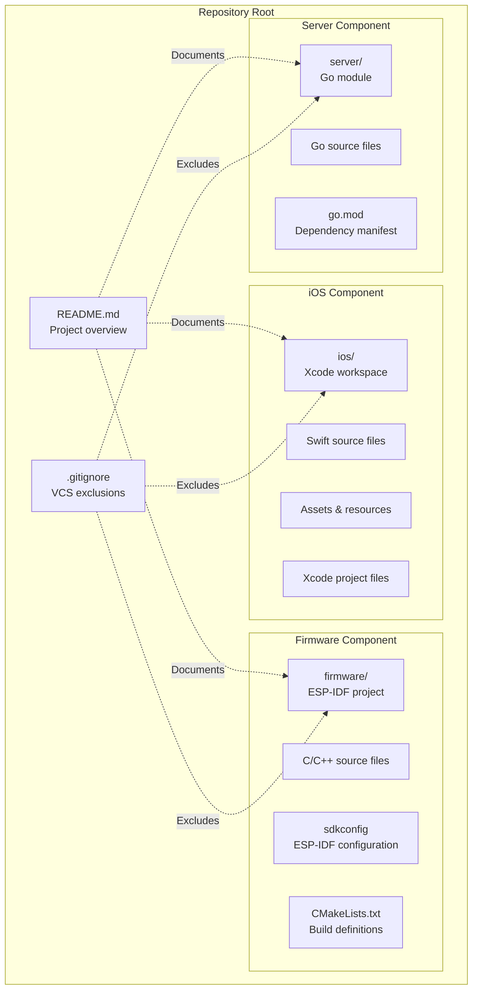
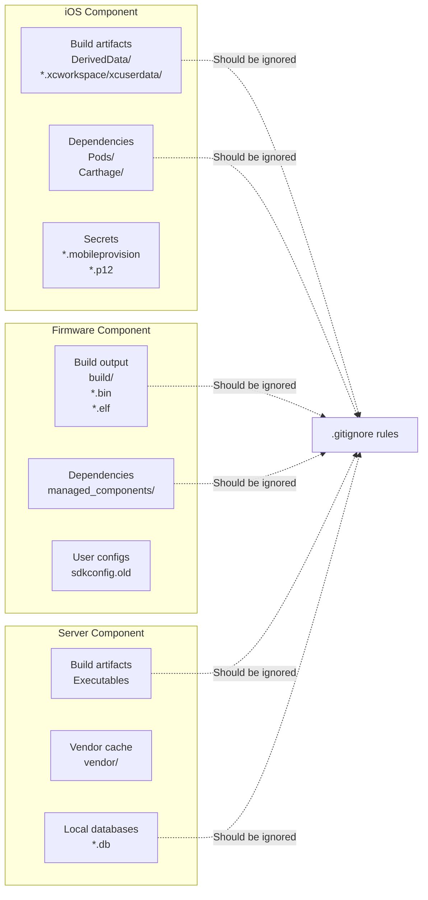
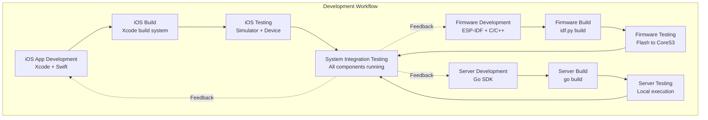
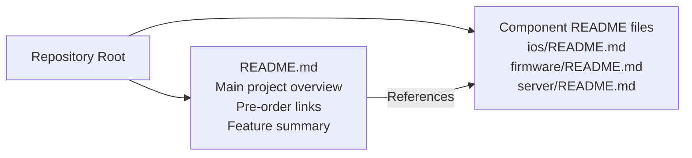
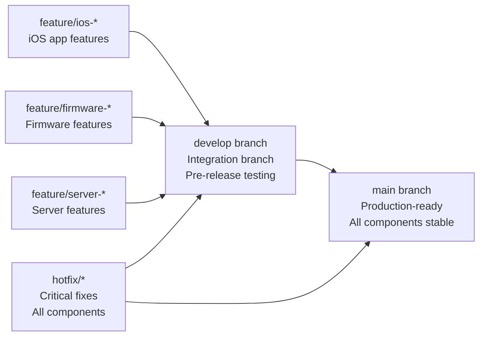
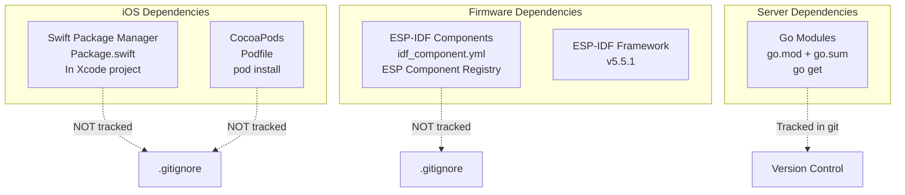
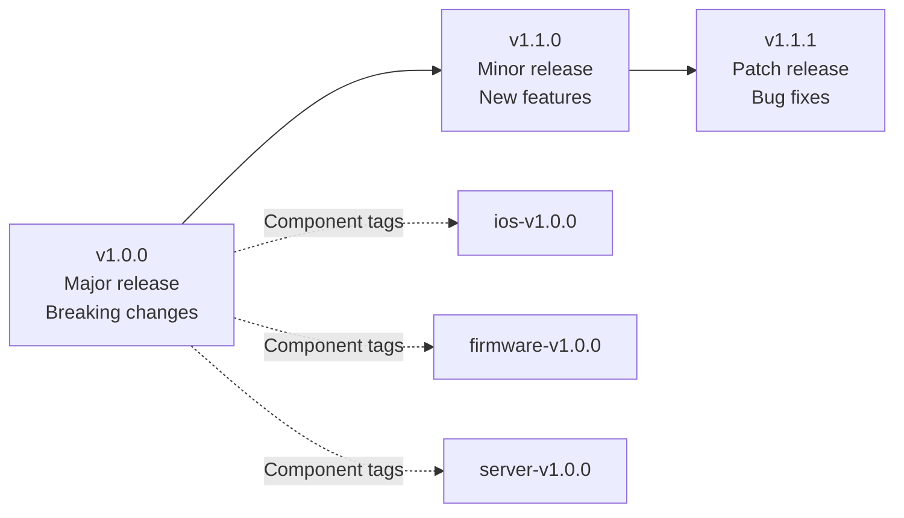
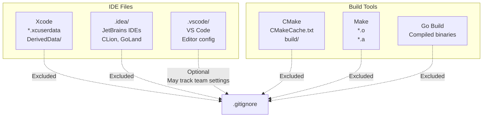

StackChan Version Control and Project Organization

# Version Control and Project Organization

Relevant source files

The following files were used as context for generating this wiki page:

- [.gitignore](.gitignore)
- [README.md](README.md)

## Purpose and Scope

This page documents the repository structure, version control practices, and project organization for the StackChan codebase. It explains how the multi-component system (iOS app, ESP32-S3 firmware, and Go server) is organized within the repository, what files are tracked or ignored by git, and best practices for managing changes across components.

For instructions on setting up your development environment, see [Development Environment Setup](#8.1). For guidance on building components, see [Building All Components](#8.2).

---

## Repository Structure Overview

The StackChan repository is a monorepo containing three major components, each with distinct build systems and dependencies. The repository is structured to maintain separation between components while enabling coordinated development.

### High-Level Repository Layout

**Sources:** [README.md:1-22](), [.gitignore:1-2]()

---

## Version Control Configuration

### Git Ignore Rules

The repository maintains a minimal `.gitignore` file at the root level, focusing on IDE-specific and platform-specific files that should not be tracked in version control.

**Current Exclusions:**

| Pattern | Purpose | Affected Platforms |
|---------|---------|-------------------|
| `.DS_Store` | macOS file system metadata files | macOS only |
| `.idea/` | JetBrains IDE (CLion, GoLand) configuration | All platforms |

**Sources:** [.gitignore:1-2]()

### Component-Specific Ignore Patterns

While the root `.gitignore` is minimal, each component directory should maintain its own ignore patterns:

**Recommended Ignore Patterns by Component:**

#### iOS App Exclusions
- `**/*.xcworkspace/xcuserdata/` - User-specific workspace settings
- `**/DerivedData/` - Xcode build output
- `**/*.xcodeproj/xcuserdata/` - User-specific project settings
- `**/*.xcodeproj/project.xcworkspace/xcuserdata/` - User workspace data
- `**/Pods/` - CocoaPods dependencies (if used)
- `**/.swiftpm/` - Swift Package Manager build artifacts
- `**/*.mobileprovision` - Provisioning profiles with sensitive data
- `**/*.p12` - Certificate files

#### Firmware Exclusions
- `**/build/` - ESP-IDF build output directory
- `**/sdkconfig.old` - Old configuration backups
- `**/*.bin` - Compiled binary files
- `**/*.elf` - Executable and linkable format files
- `**/*.map` - Memory map files
- `**/managed_components/` - ESP-IDF managed component cache

#### Server Exclusions
- `**/server` - Compiled Go binary
- `**/stackchan-server` - Alternative binary name
- `**/*.db` - SQLite database files
- `**/*.log` - Log files
- `**/vendor/` - Go vendor directory (if used)

**Sources:** [.gitignore:1-2]()

---

## Multi-Component Development Workflow

### Component Independence and Integration

The StackChan project consists of three loosely-coupled components that can be developed and versioned independently while maintaining integration points.

**Sources:** [README.md:11-15]()

### Integration Points Across Components

The components share integration contracts through communication protocols and data formats. Changes to these contracts require coordinated updates across components.

| Integration Point | Components Involved | Coordination Required |
|-------------------|---------------------|----------------------|
| **WebSocket Message Format** | iOS App ↔ Server ↔ Firmware | Message type IDs, binary protocol structure |
| **HTTP REST API** | iOS App ↔ Server | Endpoint paths, request/response schemas |
| **Blufi Protocol** | iOS App ↔ Firmware | Bluetooth service UUIDs, characteristic format |
| **Server IP Configuration** | iOS App → Server, Firmware → Server | Hardcoded URLs in source |
| **Device Identification** | All components | MAC address format, device ID schema |

**Sources:** High-level architecture diagrams

---

## Project Documentation Structure

The repository root contains the primary project documentation that provides an overview of the entire system.

### Root Documentation Files

The root `README.md` serves as the primary entry point for the repository:

**Key Information in Root README:**
- **Project Description**: StackChan as an AI desktop robot ([README.md:11]())
- **Hardware Overview**: CoreS3 ESP32-S3 specifications ([README.md:11]())
- **Factory Features**: Pre-installed firmware capabilities ([README.md:15]())
- **External Resources**: 
  - iOS App: `https://apps.apple.com/app/stackchan-world/id6756086326` ([README.md:19]())
  - Website: `https://stackchan.world/home` ([README.md:21]())
- **Safety Warnings**: Motor handling precautions ([README.md:17]())
- **Product Availability**: Pre-order link at `https://m5stack.com/stackchan` ([README.md:5]())

**Sources:** [README.md:1-22]()

---

## Version Control Best Practices

### Branching Strategy

For multi-component development, a structured branching strategy prevents integration issues:

**Recommended Branch Prefixes:**
- `feature/ios-*` - iOS app feature development
- `feature/firmware-*` - Firmware feature development
- `feature/server-*` - Server feature development
- `feature/protocol-*` - Protocol changes affecting multiple components
- `bugfix/*` - Bug fixes for specific components
- `hotfix/*` - Critical production fixes
- `release/*` - Release preparation branches

### Commit Message Conventions

Use prefixes to indicate which component is affected:

| Prefix | Component | Example |
|--------|-----------|---------|
| `ios:` | iOS App | `ios: Add distance detection to AR view` |
| `firmware:` | ESP32-S3 Firmware | `firmware: Implement dance sequence playback` |
| `server:` | Go Server | `server: Add WebSocket message routing` |
| `protocol:` | Communication Protocol | `protocol: Update WebSocket binary message format` |
| `docs:` | Documentation | `docs: Update firmware build instructions` |
| `chore:` | Repository Maintenance | `chore: Update .gitignore for build artifacts` |

**Sources:** General software engineering best practices

---

## Dependency Management Per Component

Each component manages its dependencies independently using its ecosystem's standard tools:

### Dependency Management Overview

**Version Control Rules for Dependencies:**

| Component | Dependency Files Tracked | Dependency Artifacts Ignored |
|-----------|--------------------------|------------------------------|
| **iOS** | `Package.swift`, `Podfile`, `Podfile.lock` (if used) | `.swiftpm/`, `Pods/`, `DerivedData/` |
| **Firmware** | `idf_component.yml` | `managed_components/`, `build/` |
| **Server** | `go.mod`, `go.sum` | `vendor/` (unless vendoring is used) |

**Sources:** Industry standard practices for each ecosystem

---

## Configuration and Secrets Management

### Environment-Specific Configuration

Configuration that varies between development, staging, and production should not be hardcoded in source files tracked by git.

**Configuration Categories:**

| Type | Example | Should be in Git? |
|------|---------|-------------------|
| **Default Configuration** | Default server port, feature flags | ✅ Yes - in source |
| **Development Configuration** | Local dev server URLs | ✅ Yes - in source or config files |
| **Secrets** | API keys, certificates, passwords | ❌ No - use environment variables or secure storage |
| **User-Specific Settings** | IDE preferences, local paths | ❌ No - ignored via `.gitignore` |

### Secrets That Must Not Be Committed

- iOS provisioning profiles (`*.mobileprovision`)
- Code signing certificates (`*.p12`, `*.cer`)
- Private keys for any purpose
- API keys for external services
- Database credentials
- Wi-Fi passwords
- OAuth tokens

**Sources:** Security best practices

---

## Release and Tagging Strategy

### Semantic Versioning Approach

For coordinated releases across components:

**Tagging Conventions:**
- `v*.*.*` - Coordinated release tag for all components
- `ios-v*.*.*` - iOS app-specific release
- `firmware-v*.*.*` - Firmware-specific release
- `server-v*.*.*` - Server-specific release

Components can have independent minor and patch versions but should coordinate on major versions that involve protocol changes.

**Sources:** Semantic Versioning specification (semver.org)

---

## IDE-Specific Files and Configurations

### Files Generated by Development Tools

Different IDEs and build tools generate files that should typically be excluded from version control:

**Currently Tracked IDE Configuration:**

The root `.gitignore` explicitly excludes:
- `.idea/` - JetBrains IDEs ([.gitignore:2]())
- `.DS_Store` - macOS Finder metadata ([.gitignore:1]())

**Sources:** [.gitignore:1-2]()

---

## Working with the Monorepo

### Component-Specific Development

Developers can work on individual components without building or running the entire system:

**iOS Development Workflow:**
1. Navigate to iOS app directory
2. Open Xcode workspace
3. Build and test in iOS Simulator
4. No firmware or server required for UI development

**Firmware Development Workflow:**
1. Navigate to firmware directory
2. Configure ESP-IDF environment
3. Build with `idf.py build`
4. Flash to device with `idf.py flash`
5. Monitor output with `idf.py monitor`

**Server Development Workflow:**
1. Navigate to server directory
2. Build with `go build`
3. Run locally for testing
4. Mock client connections for testing

### Cross-Component Development

When working on features that span multiple components (e.g., new WebSocket message types):

1. **Protocol Definition Phase**: Document the protocol change in design docs
2. **Implementation Phase**: Implement in parallel across components
3. **Testing Phase**: Test integration with all components running
4. **Coordination**: Merge changes in coordinated PRs to avoid breaking compatibility

**Sources:** Multi-component development best practices

---

## Repository Maintenance

### Keeping the Repository Clean

Regular maintenance tasks:

1. **Review `.gitignore`**: Add patterns as new build artifacts are discovered
2. **Remove Stale Branches**: Delete merged feature branches
3. **Clean Build Artifacts**: Ensure build outputs are properly ignored
4. **Update Documentation**: Keep README files synchronized with code changes
5. **Verify Secrets**: Audit for accidentally committed secrets using tools like `git-secrets`

### Migrating to Better Organization

If the repository structure needs reorganization:

1. Create a migration plan documenting the new structure
2. Move files using `git mv` to preserve history
3. Update build scripts and documentation references
4. Coordinate with all active developers
5. Create a migration guide for pending PRs

**Sources:** Git best practices and repository management

---

## Summary

The StackChan repository is organized as a monorepo containing three major components (iOS app, firmware, server), each with its own build system and dependencies. The minimal root `.gitignore` excludes IDE files (`.idea/`) and macOS metadata (`.DS_Store`), while component-specific ignore patterns should handle build artifacts and dependencies. Developers can work on individual components independently or coordinate changes across components when integration points are affected. The root `README.md` provides project overview and links to external resources, serving as the entry point for new developers.

**Sources:** [README.md:1-22](), [.gitignore:1-2]()