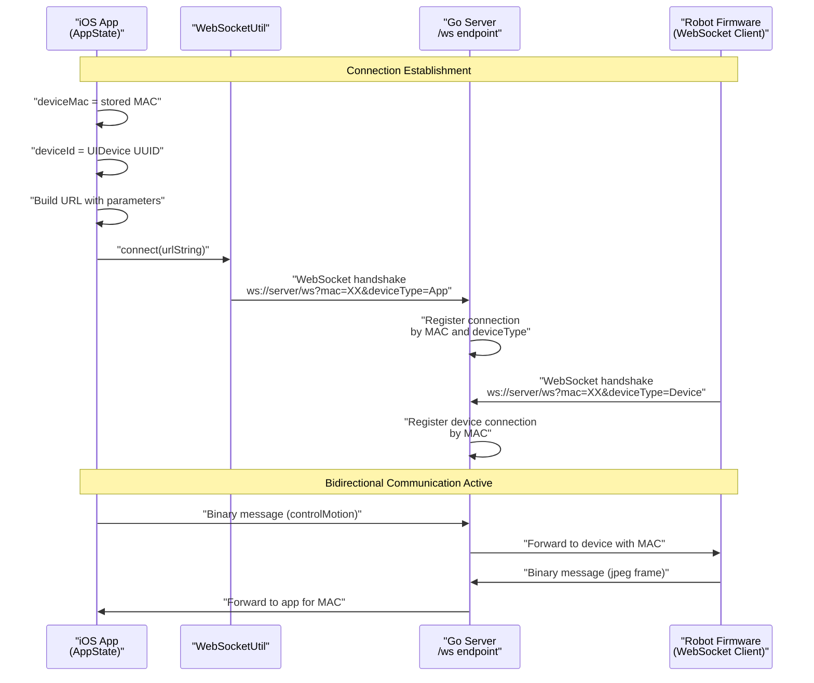
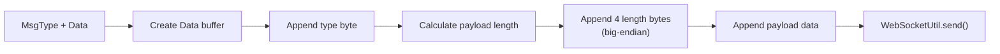
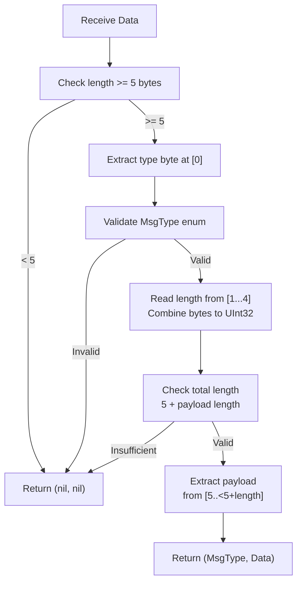
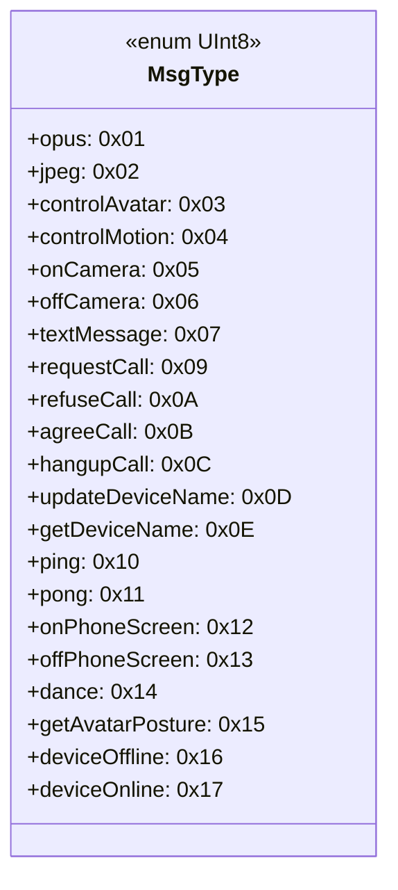
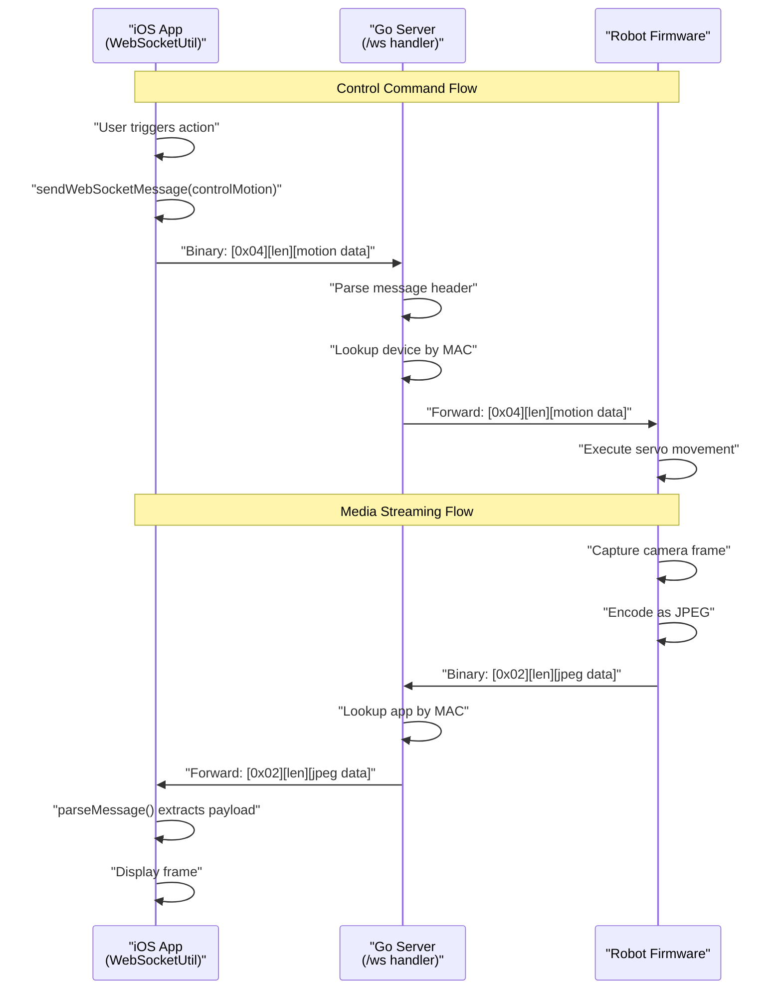
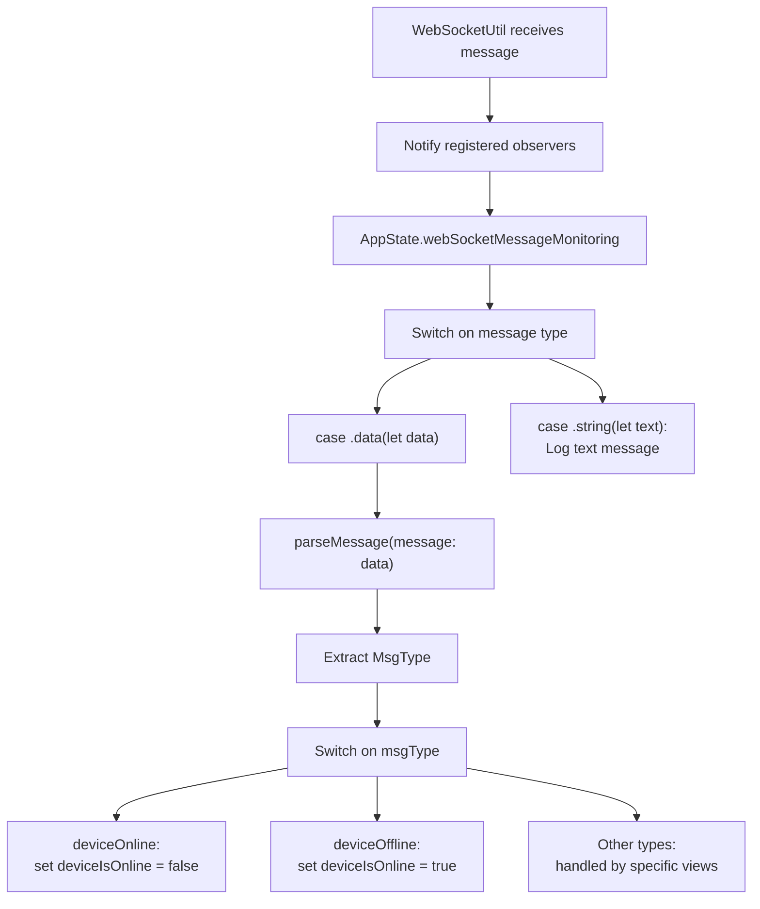
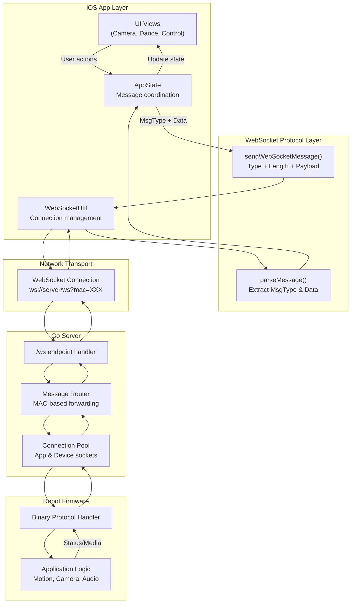

StackChan WebSocket Protocol

# WebSocket Protocol

<details>
<summary>Relevant source files</summary>

The following files were used as context for generating this wiki page:

- [app/StackChan/AppState.swift](app/StackChan/AppState.swift)
- [app/StackChan/Model/MessageModel.swift](app/StackChan/Model/MessageModel.swift)

</details>


This page documents the WebSocket protocol used for real-time bidirectional communication between StackChan components (iOS app, robot firmware, and backend server). The protocol defines the binary message format, message types, and communication patterns that enable live video streaming, audio transmission, motion control, and status updates.

For information about the initial device configuration over Bluetooth, see [Bluetooth LE (Blufi Protocol)](#7.1). For HTTP-based device management endpoints, see [HTTP REST API](#7.3). For a complete reference of all message types and their purposes, see [Message Types Reference](#7.4).

## Connection Establishment

WebSocket connections are initiated by both the iOS app and the robot firmware to the backend server. The server acts as a central relay hub, forwarding messages between connected clients based on their device MAC addresses.

### Connection URL Format

The WebSocket endpoint uses query parameters to identify the connecting client:

```
ws://<server-address>/ws?mac=<device-mac>&deviceType=<client-type>&deviceId=<unique-id>
```

**Parameters:**
- `mac`: The MAC address of the StackChan robot device
- `deviceType`: Either `"App"` for iOS clients or `"Device"` for robot firmware
- `deviceId`: A unique identifier for the connecting client (iOS uses `UIDevice.current.identifierForVendor`)

**Connection Flow:**



**Sources:** [app/StackChan/AppState.swift:93-96]()

### iOS Implementation

The iOS app establishes the WebSocket connection through the `AppState` class:

```swift
func connectWebSocket() {
    let webSocketUrl = Urls.getWebSocketUrl() + "?mac=" + deviceMac + 
                       "&deviceType=App&deviceId=" + AppState.deviceId
    WebSocketUtil.shared.connect(urlString: webSocketUrl)
}
```

**Sources:** [app/StackChan/AppState.swift:93-96]()

## Binary Protocol Structure

All messages transmitted over the WebSocket connection use a binary protocol format consisting of a type byte, length field, and payload.

### Message Format

```
+--------+--------+--------+--------+--------+----------------+
| Type   | Length (4 bytes, big-endian)       | Payload        |
| 1 byte | byte1  | byte2  | byte3  | byte4  | N bytes        |
+--------+--------+--------+--------+--------+----------------+
```

**Field Descriptions:**

| Field | Size | Type | Description |
|-------|------|------|-------------|
| Type | 1 byte | UInt8 | Message type identifier (see `MsgType` enum) |
| Length | 4 bytes | UInt32 | Payload size in bytes (big-endian) |
| Payload | Variable | Data | Message-specific data |

### Encoding Messages

The iOS app constructs messages using the `sendWebSocketMessage` function:



**Encoding Process:**
1. Create a `Data` buffer starting with the message type byte
2. Calculate payload length as `UInt32`
3. Append 4 bytes representing length in big-endian order:
   - Byte 1: `(length >> 24) & 0xFF`
   - Byte 2: `(length >> 16) & 0xFF`
   - Byte 3: `(length >> 8) & 0xFF`
   - Byte 4: `length & 0xFF`
4. Append the payload data
5. Send via WebSocket

**Sources:** [app/StackChan/AppState.swift:98-114]()

### Decoding Messages

The iOS app parses received messages using the `parseMessage` function:



**Decoding Process:**
1. Verify minimum message length (5 bytes for header)
2. Read type byte at position 0
3. Validate against `MsgType` enum
4. Reconstruct length from 4 bytes: `(b1 << 24) | (b2 << 16) | (b3 << 8) | b4`
5. Verify total message length matches header + payload
6. Extract payload data from position 5 onwards
7. Return tuple of `(MsgType?, Data?)`

**Sources:** [app/StackChan/AppState.swift:117-139]()

## Message Types

The `MsgType` enum defines all supported message types with their hexadecimal identifiers:



### Message Type Categories

| Category | Message Types | Direction | Description |
|----------|---------------|-----------|-------------|
| **Media Streaming** | `opus` (0x01), `jpeg` (0x02) | Robot → App | Audio frames (Opus codec) and video frames (JPEG images) |
| **Control Commands** | `controlAvatar` (0x03), `controlMotion` (0x04) | App → Robot | Facial expression control and servo motion commands |
| **Camera Control** | `onCamera` (0x05), `offCamera` (0x06) | App → Robot | Enable/disable camera streaming |
| **Text Communication** | `textMessage` (0x07) | Bidirectional | Text message exchange |
| **Call Management** | `requestCall` (0x09), `refuseCall` (0x0A), `agreeCall` (0x0B), `hangupCall` (0x0C) | Bidirectional | Video call session lifecycle |
| **Device Management** | `updateDeviceName` (0x0D), `getDeviceName` (0x0E) | Bidirectional | Device name synchronization |
| **Connection Health** | `ping` (0x10), `pong` (0x11) | Bidirectional | Keep-alive and latency measurement |
| **Screen State** | `onPhoneScreen` (0x12), `offPhoneScreen` (0x13) | App → Robot | Mobile app foreground/background state |
| **Entertainment** | `dance` (0x14), `getAvatarPosture` (0x15) | App → Robot | Dance sequence playback and posture queries |
| **Status Events** | `deviceOffline` (0x16), `deviceOnline` (0x17) | Server → App | Device connectivity status notifications |

**Sources:** [app/StackChan/Model/MessageModel.swift:9-39]()

## Communication Patterns

### Server-Mediated Relay

The Go backend server acts as a WebSocket relay, maintaining separate connections to both the iOS app and the robot, and forwarding messages based on MAC address routing:



### Message Monitoring and Handling

The iOS app implements a message observation pattern to handle incoming WebSocket messages:



The `AppState` class registers observers for WebSocket messages and processes status updates:

```swift
func webSocketMessageMonitoring() {
    WebSocketUtil.shared.addObserver(for: "App") { (message) in
        switch message {
        case .data(let data):
            let result = self.parseMessage(message: data)
            if let msgType = result.0 {
                switch msgType {
                case MsgType.deviceOnline:
                    self.deviceIsOnline = false
                case MsgType.deviceOffline:
                    self.deviceIsOnline = true
                default:
                    break
                }
            }
        case .string(let text):
            print("Received a regular message: \(text)")
        }
    }
}
```

**Sources:** [app/StackChan/AppState.swift:246-267]()

## Protocol Extension Points

### Custom Message Types

To add new message types to the protocol:

1. **Define enum case** in `MsgType` enum with unique hexadecimal identifier
2. **Implement encoding** logic in message sender (if payload structure differs)
3. **Implement decoding** logic in message receiver
4. **Update server relay** logic to handle routing (if special behavior needed)
5. **Document payload format** in [Message Types Reference](#7.4)

### Payload Structures

The binary protocol does not enforce payload structure beyond the header. Each message type defines its own payload format, which may be:
- **Raw binary data**: JPEG images, Opus audio frames
- **JSON-encoded data**: Control commands with parameters
- **Empty payload**: Simple flag messages (camera on/off)
- **Custom binary structures**: Optimized formats for performance

Specific payload formats for each message type are documented in [Message Types Reference](#7.4).

**Sources:** [app/StackChan/Model/MessageModel.swift:9-39](), [app/StackChan/AppState.swift:98-139]()

## Implementation References

### Key Code Entities

| Entity | Location | Purpose |
|--------|----------|---------|
| `MsgType` | [app/StackChan/Model/MessageModel.swift:9-39]() | Enum defining all message type identifiers |
| `AppState.connectWebSocket()` | [app/StackChan/AppState.swift:93-96]() | Establishes WebSocket connection with URL parameters |
| `AppState.sendWebSocketMessage()` | [app/StackChan/AppState.swift:98-114]() | Encodes and sends binary messages |
| `AppState.parseMessage()` | [app/StackChan/AppState.swift:117-139]() | Decodes received binary messages |
| `AppState.webSocketMessageMonitoring()` | [app/StackChan/AppState.swift:246-267]() | Registers observer and handles status messages |
| `WebSocketUtil.shared` | Referenced in AppState | Singleton managing WebSocket connection lifecycle |

### Message Flow Architecture



**Sources:** [app/StackChan/AppState.swift:93-267](), [app/StackChan/Model/MessageModel.swift:9-39]()