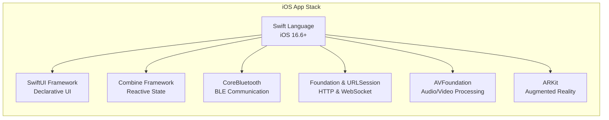
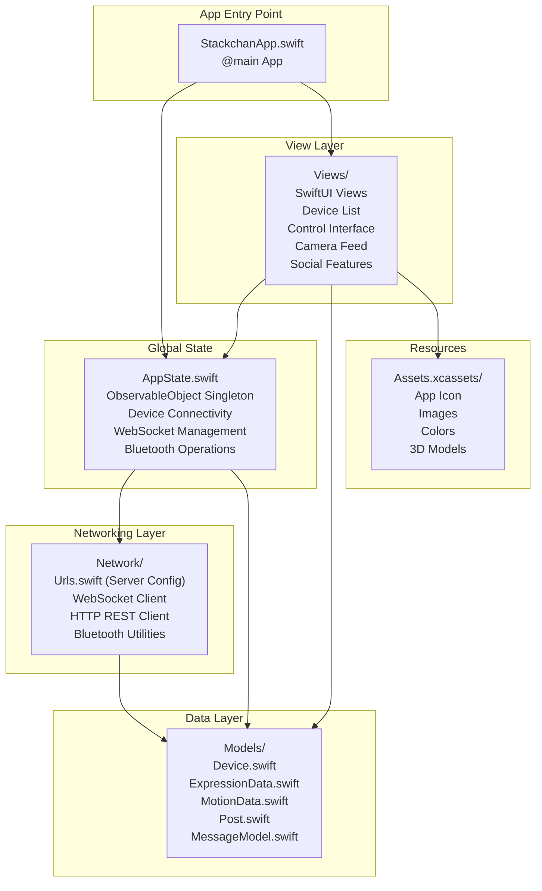
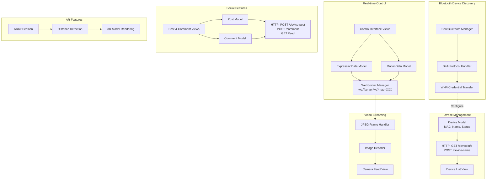
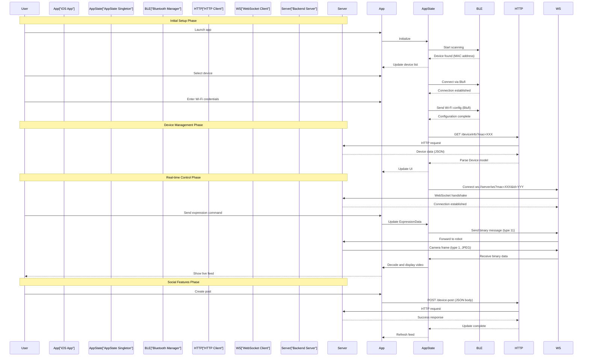

StackChan iOS Application

# iOS Application

<details>
<summary>Relevant source files</summary>

The following files were used as context for generating this wiki page:

- [README.md](README.md)
- [app/README.md](app/README.md)

</details>


This page provides an overview of the StackChan World iOS application, which serves as the primary user interface for interacting with StackChan robots. The app enables device discovery, configuration, real-time control, video streaming, and access to social features.

For detailed setup instructions, see [Getting Started with the iOS App](#5.1). For information about the backend server that the app communicates with, see [Backend Server](#6). For details on communication protocols, see [Communication Protocols](#7).

## Purpose and Scope

The iOS application is a native Swift/SwiftUI mobile client that provides comprehensive control and interaction capabilities for StackChan robots. It handles the complete device lifecycle from initial Bluetooth discovery and Wi-Fi configuration through real-time motion control, expression management, video streaming, and social networking features. The app requires iOS 16.6 or later and is distributed as StackChan World on the App Store.

Sources: [README.md:19](), [app/README.md:1-62]()

## Role in the StackChan Ecosystem

The iOS application acts as the primary control interface between users and StackChan robots. It serves three main functions:

1. **Device Setup and Configuration**: Uses Bluetooth LE with the Blufi protocol to discover nearby StackChan devices, establish initial pairing, and configure Wi-Fi network credentials on the robot.

2. **Real-time Robot Control**: Connects to robots via WebSocket through the backend server to send control commands (expressions, motions, audio) and receive live camera feeds, status updates, and sensor data.

3. **Social Platform Client**: Provides access to the StackChan World social features, allowing users to create posts, browse device feeds, and interact with the community through HTTP REST API calls.

The app does not communicate directly with robots over Wi-Fi. Instead, all network-based interactions are mediated through the Go backend server, which acts as a relay and coordination point.

Sources: [README.md:11-15](), High-level architecture diagrams

## Technology Stack



**Technology Stack Overview**

| Component | Technology | Purpose |
|-----------|-----------|---------|
| UI Framework | SwiftUI | Declarative user interface construction |
| Language | Swift | Native iOS development language |
| State Management | Combine + `@Published` properties | Reactive data binding and state updates |
| Bluetooth | CoreBluetooth | Device discovery and Blufi protocol |
| Networking | URLSession | HTTP REST API and WebSocket communication |
| Audio/Video | AVFoundation | Opus audio encoding/decoding, JPEG processing |
| AR Features | ARKit | Distance detection and 3D model rendering |
| Minimum OS | iOS 16.6+ | Target deployment platform |

Sources: High-level architecture diagrams, [app/README.md:22-26]()

## Application Architecture



**Architecture Components**

The iOS application follows a standard SwiftUI architecture pattern with centralized state management:

- **App Entry**: `StackchanApp.swift` serves as the `@main` entry point, initializing the app and injecting dependencies.

- **State Management**: `AppState` class acts as an `ObservableObject` singleton managing global application state including active device connections, WebSocket sessions, and Bluetooth operations.

- **Data Models**: Swift structs and classes in the `Models/` directory define the data structures for devices, expressions, motions, posts, and communication messages. These implement `Codable` for JSON serialization.

- **Networking**: The `Network/` directory contains utilities for HTTP requests, WebSocket management, and Bluetooth operations. The file `Urls.swift` defines the server IP and port configuration.

- **Views**: SwiftUI views provide the user interface, binding to `AppState` properties via the `@ObservedObject` and `@EnvironmentObject` property wrappers.

- **Assets**: Images, colors, app icons, and 3D models stored in `Assets.xcassets/`.

Sources: [app/README.md:9-12](), [app/README.md:42-52]()

## Core Features and Code Mapping



**Feature-to-Code Mapping**

| Feature | Primary Code Components | Communication Protocol |
|---------|------------------------|----------------------|
| Device Discovery | CoreBluetooth manager, Blufi protocol handler | Bluetooth LE |
| Wi-Fi Configuration | Blufi credential transfer | Bluetooth LE |
| Device Information | `Device` model, HTTP client, `/deviceInfo` endpoint | HTTP REST |
| Expression Control | `ExpressionData` model, WebSocket client, control message | WebSocket (binary protocol) |
| Motion Control | `MotionData` model, WebSocket client, motion command | WebSocket (binary protocol) |
| Video Streaming | JPEG handler, video decoder, camera view | WebSocket (binary protocol) |
| Audio Streaming | Opus encoder/decoder, audio buffer | WebSocket (binary protocol) |
| Post Creation | `Post` model, `/device-post` endpoint | HTTP REST |
| Comments | `Comment` model, `/comment` endpoint | HTTP REST |
| Feed Browsing | Feed views, `/feed` endpoint | HTTP REST |
| Distance Detection | ARKit session, distance calculator | Local processing |

Sources: High-level architecture diagrams, [README.md:14-15]()

## Communication Flow



**Communication Protocol Summary**

The iOS app uses three distinct communication channels:

1. **Bluetooth LE (Blufi)**: Used exclusively during initial setup for device discovery and Wi-Fi configuration. Implemented using CoreBluetooth framework. Connection is closed after Wi-Fi credentials are transferred.

2. **WebSocket**: Persistent bidirectional connection to `ws://SERVER_IP:12800/ws?mac=DEVICE_MAC&id=USER_ID` for real-time robot control and video streaming. Uses a custom binary protocol with message type identifiers (e.g., type 1 for JPEG, type 11 for expression control).

3. **HTTP REST**: Standard REST API calls to `http://SERVER_IP:12800/` for device management (GET `/deviceInfo`, POST `/device-name`) and social features (POST `/device-post`, POST `/comment`, GET `/feed`). All requests and responses use JSON encoding.

Sources: [app/README.md:42-52](), High-level communication diagrams

## Network Configuration

The iOS app requires manual configuration of the backend server IP address before deployment:

```
Network/Urls.swift:
  static let url = "192.168.51.24:12800/"
```

This static configuration defines:
- **Server IP**: The IP address where the Go backend server is running (e.g., `192.168.51.24`)
- **Server Port**: The port number for HTTP and WebSocket communication (default: `12800`)

The base URL is used to construct:
- HTTP endpoints: `http://{url}deviceInfo`, `http://{url}device-post`, etc.
- WebSocket URL: `ws://{url}ws?mac={mac}&id={id}`

**Configuration Process**: Developers must edit `Network/Urls.swift` and replace the IP address with the actual server IP before building the app. This value is compiled into the application binary.

Sources: [app/README.md:42-52]()

## Development Environment

The iOS application is developed using the standard Apple development toolchain:

| Requirement | Version | Purpose |
|-------------|---------|---------|
| Xcode | Latest version | IDE for Swift/SwiftUI development |
| macOS | Compatible with Xcode | Development platform |
| Apple ID | Free or paid | Code signing and device installation |
| iOS Device (optional) | iOS 16.6+ | Physical testing (recommended) |
| Developer Mode | Enabled on device | Required for iOS 16+ deployment |

**Project Structure**: The app is organized as a standard Xcode project with a `.xcodeproj` file in the `app/` directory. No external dependency managers (CocoaPods, Swift Package Manager) are required; all dependencies are provided by iOS SDK frameworks.

**Build Process**: 
1. Clone repository to local machine
2. Open `.xcodeproj` in Xcode
3. Configure signing with Apple ID
4. Modify `Network/Urls.swift` with server IP
5. Select target device (iPhone or simulator)
6. Build and run with `Cmd + R`

For detailed setup instructions, see [Getting Started with the iOS App](#5.1).

Sources: [app/README.md:1-62]()

## Key Capabilities

The iOS application implements the following system capabilities, configured in the Xcode project settings:

- **Local Network Access**: Required for WebSocket connections to the backend server and device discovery on local networks
- **Microphone**: Used for audio streaming during video calls with robots
- **Photo Library**: Allows saving captured images from robot camera feeds
- **Wi-Fi Information**: Enables reading current Wi-Fi SSID for network configuration features
- **Camera (AR)**: Required for ARKit distance detection features
- **Background Modes**: May be configured for maintaining WebSocket connections

These capabilities require user permission at runtime and must be approved by users when the app first requests access.

For detailed documentation of app capabilities and permissions, see [App Capabilities and Permissions](#5.6).

Sources: High-level architecture diagrams, iOS development patterns

## Summary

The StackChan World iOS application is a comprehensive Swift/SwiftUI mobile client that provides the primary user interface for StackChan robots. It implements a three-protocol communication architecture (Bluetooth LE for setup, WebSocket for real-time control, HTTP REST for management), uses a centralized `AppState` singleton for state management, and integrates with the backend server for all network-based robot interactions. The app serves dual roles as both a robot controller and a social platform client, enabling users to interact with their robots while participating in the broader StackChan community.

Sources: [README.md:1-22](), [app/README.md:1-62](), High-level architecture diagrams