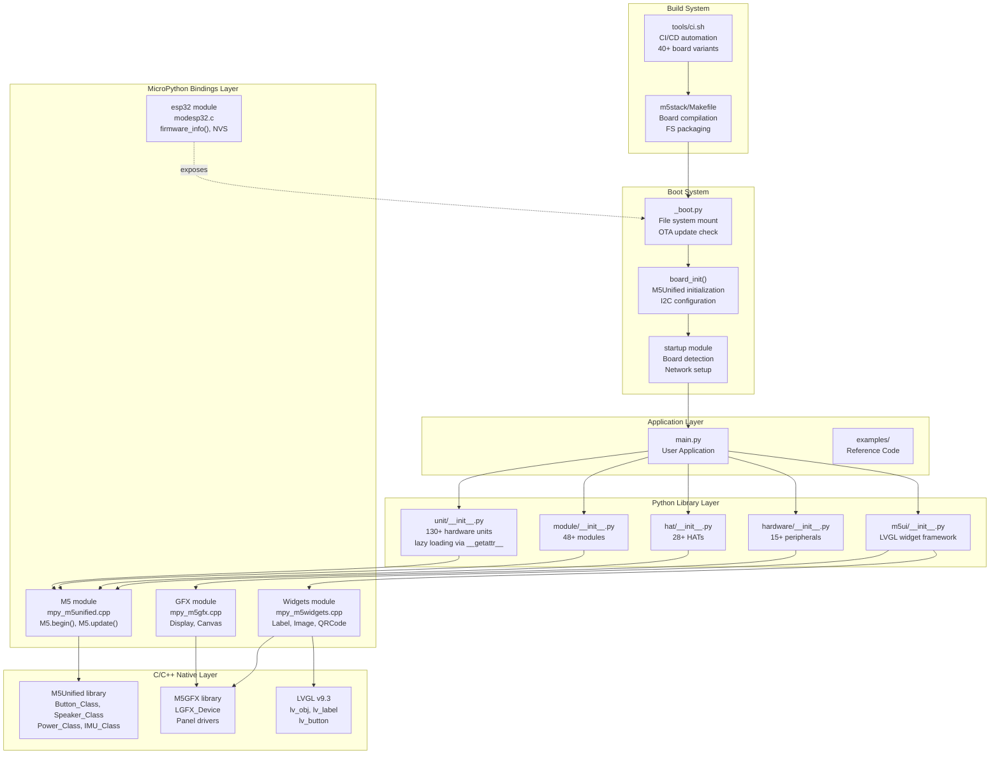
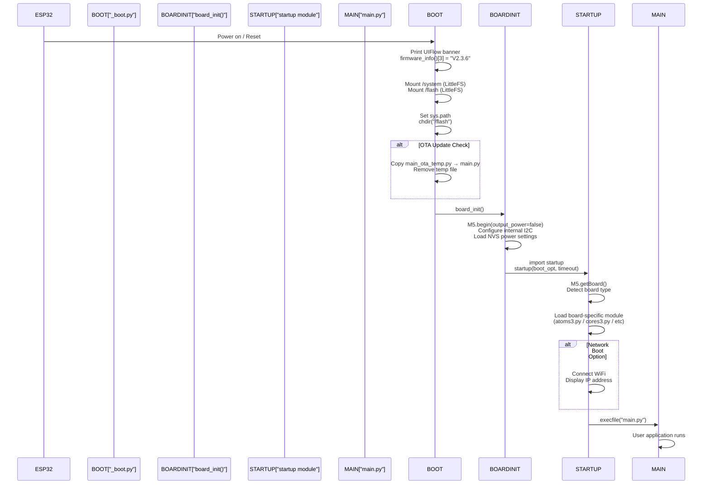
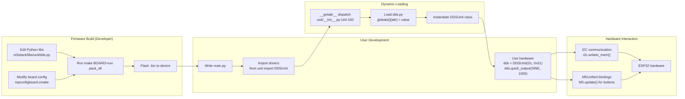

# Overview

<details>
<summary>Relevant source files</summary>

The following files were used as context for generating this wiki page:

- [.github/workflows/build-release.yml](.github/workflows/build-release.yml)
- [.github/workflows/code_formatting.yml](.github/workflows/code_formatting.yml)
- [.github/workflows/nightly-build.yml](.github/workflows/nightly-build.yml)
- [.github/workflows/ports_m5stack.yml](.github/workflows/ports_m5stack.yml)
- [.gitlab-ci.yml](.gitlab-ci.yml)
- [README.md](README.md)
- [docs/en/refs/unit.dds.ref](docs/en/refs/unit.dds.ref)
- [docs/en/refs/unit.digi_clock.ref](docs/en/refs/unit.digi_clock.ref)
- [docs/en/units/dds.rst](docs/en/units/dds.rst)
- [docs/en/units/digi_clock.rst](docs/en/units/digi_clock.rst)
- [docs/en/units/index.rst](docs/en/units/index.rst)
- [m5stack/boards/M5STACK_AtomS3R_CAM/board.json](m5stack/boards/M5STACK_AtomS3R_CAM/board.json)
- [m5stack/boards/M5STACK_AtomS3R_CAM/mpconfigboard.cmake](m5stack/boards/M5STACK_AtomS3R_CAM/mpconfigboard.cmake)
- [m5stack/boards/M5STACK_AtomS3R_CAM/mpconfigboard.h](m5stack/boards/M5STACK_AtomS3R_CAM/mpconfigboard.h)
- [m5stack/boards/M5STACK_AtomS3R_CAM/sdkconfig.board](m5stack/boards/M5STACK_AtomS3R_CAM/sdkconfig.board)
- [m5stack/boards/M5STACK_CoreInk/mpconfigboard.cmake](m5stack/boards/M5STACK_CoreInk/mpconfigboard.cmake)
- [m5stack/boards/M5STACK_CoreInk/mpconfigboard.h](m5stack/boards/M5STACK_CoreInk/mpconfigboard.h)
- [m5stack/boards/M5STACK_CoreInk/sdkconfig.board](m5stack/boards/M5STACK_CoreInk/sdkconfig.board)
- [m5stack/libs/driver/manifest.py](m5stack/libs/driver/manifest.py)
- [m5stack/libs/m5ble/m5ble.py](m5stack/libs/m5ble/m5ble.py)
- [m5stack/libs/unit/__init__.py](m5stack/libs/unit/__init__.py)
- [m5stack/libs/unit/dds.py](m5stack/libs/unit/dds.py)
- [m5stack/libs/unit/digi_clock.py](m5stack/libs/unit/digi_clock.py)
- [m5stack/libs/unit/manifest.py](m5stack/libs/unit/manifest.py)
- [m5stack/libs/unit/thermal2.py](m5stack/libs/unit/thermal2.py)
- [m5stack/modesp32.c](m5stack/modesp32.c)
- [m5stack/modules/_boot.py](m5stack/modules/_boot.py)
- [m5stack/modules/startup/manifest_coreink.py](m5stack/modules/startup/manifest_coreink.py)
- [m5stack/version.txt](m5stack/version.txt)
- [third-party/CMakeListsLvgl.cmake](third-party/CMakeListsLvgl.cmake)
- [third-party/modules/_boot.py](third-party/modules/_boot.py)
- [third-party/modules/startup/box3/apps/app_run.py](third-party/modules/startup/box3/apps/app_run.py)
- [third-party/version.txt](third-party/version.txt)
- [tools/ci.sh](tools/ci.sh)

</details>


This document provides a comprehensive overview of the M5Stack UIFlow MicroPython firmware repository, a production-ready embedded Python platform for M5Stack ESP32-based devices. The firmware supports 40+ board variants, provides 200+ hardware drivers through dynamic loading, and integrates LVGL v9.3 for graphical user interfaces.

For detailed information about specific subsystems, see:
- Hardware drivers and abstraction: [Hardware Abstraction Libraries](#2)
- Graphics and UI development: [User Interface Framework](#3)
- Firmware internals and boot process: [Core System Architecture](#4)
- Compilation and CI/CD: [Build and Deployment System](#5)

## Firmware Version and Target Hardware

The current firmware version is **V2.3.6** ([m5stack/version.txt:1](), [third-party/version.txt:1]()). The firmware is built on ESP-IDF v5.4.2 and targets ESP32, ESP32-S2, ESP32-S3, ESP32-C3, ESP32-C6, and ESP32-P4 microcontrollers.

**Supported Board Categories:**

| Category | Examples | Count | Location |
|----------|----------|-------|----------|
| M5Stack Boards | CoreS3, Core2, Basic, Fire, Tough | 30+ | `m5stack/boards/` |
| Atom Series | AtomS3, AtomS3R_CAM, Atom Lite | 10+ | `m5stack/boards/M5STACK_Atom*` |
| Third-Party | ESP32-S3-BOX-3, XIAO ESP32S3 | 2+ | `third-party/boards/` |

Sources: [m5stack/version.txt:1](https://github.com/m5stack/uiflow-micropython/blob/7af4551a/m5stack/version.txt#L1), [.github/workflows/nightly-build.yml:57-93](https://github.com/m5stack/uiflow-micropython/blob/7af4551a/.github/workflows/nightly-build.yml#L57-L93), [tools/ci.sh:334-369](https://github.com/m5stack/uiflow-micropython/blob/7af4551a/tools/ci.sh#L334-L369)

## Architecture Overview

The firmware implements a layered architecture separating hardware abstraction, graphics, Python libraries, and application code:



**Key Architecture Principles:**

1. **Lazy Loading**: Hardware drivers load on-demand via `__getattr__` to minimize memory usage ([m5stack/libs/unit/__init__.py:144-150]())
2. **Multi-Layer Abstraction**: Python APIs → MicroPython bindings → C++ libraries → ESP32 hardware
3. **Dynamic Board Detection**: Runtime board identification via `M5.getBoard()` enables universal firmware images
4. **Dual File Systems**: `/system` (read-only) and `/flash` (user-writable) LittleFS partitions

Sources: [m5stack/libs/unit/__init__.py:1-151](https://github.com/m5stack/uiflow-micropython/blob/7af4551a/m5stack/libs/unit/__init__.py#L1-L151), [m5stack/modules/_boot.py:1-59](https://github.com/m5stack/uiflow-micropython/blob/7af4551a/m5stack/modules/_boot.py#L1-L59), [m5stack/modesp32.c:216-242](https://github.com/m5stack/uiflow-micropython/blob/7af4551a/m5stack/modesp32.c#L216-L242)

## Core Subsystems

### Hardware Abstraction Layer

The firmware organizes hardware drivers into four packages with consistent lazy-loading patterns:

**Unit Package** (`m5stack/libs/unit/`): 130+ I2C/UART-based sensor and actuator modules
- Dynamic class loading: `from unit import DDSUnit` triggers `__getattr__` dispatch
- Class-to-module mapping: `_attrs` dictionary maps class names to implementation files
- Example: `DDSUnit` (signal generator) maps to `dds.py` ([m5stack/libs/unit/__init__.py:36]())

**Module Package** (`m5stack/libs/module/`): 48+ larger functional modules
- Includes complex devices like LTEModule, PPSModule, LlmModule
- Same lazy-loading architecture as Unit package

**HAT Package** (`m5stack/libs/hat/`): 28+ expansion HATs for compact devices
- Form-factor specific drivers (e.g., ServoHat, PIRHat)
- Often inherits from Unit classes for code reuse

**Hardware Package** (`m5stack/libs/hardware/`): Board-agnostic peripheral drivers
- IR communication, keyboard input (TCA8418, matrix keyboards)
- Environmental sensors (SHT30)

Sources: [m5stack/libs/unit/__init__.py:5-141](https://github.com/m5stack/uiflow-micropython/blob/7af4551a/m5stack/libs/unit/__init__.py#L5-L141), [m5stack/libs/unit/manifest.py:4-141](https://github.com/m5stack/uiflow-micropython/blob/7af4551a/m5stack/libs/unit/manifest.py#L4-L141), [docs/en/units/index.rst:1-126](https://github.com/m5stack/uiflow-micropython/blob/7af4551a/docs/en/units/index.rst#L1-L126)

### Graphics and UI System

The firmware supports two graphics programming paradigms:

**M5GFX Low-Level Graphics** (`components/M5Unified/mpy_m5gfx.cpp`):
- Direct pixel manipulation via `M5.Lcd` object
- VLW font rendering from LittleFS/FatFS
- Image loading (JPEG, PNG, BMP) through VFS streams
- C++ implementation wraps `LGFX_Device` class

**M5UI Widget Framework** (`m5stack/libs/m5ui/`):
- LVGL v9.3-based declarative UI
- 22+ widget types: `M5Bar`, `M5Label`, `M5Button`, `M5Canvas`
- Page management system for multi-screen applications
- Dynamic method binding via `M5Base` metaclass pattern

The graphics system integrates with the VFS layer to load fonts and images from either `/system` (bundled resources) or `/flash` (user uploads).

Sources: [m5stack/libs/unit/dds.py:1-299](https://github.com/m5stack/uiflow-micropython/blob/7af4551a/m5stack/libs/unit/dds.py#L1-L299), [m5stack/libs/unit/digi_clock.py:1-146](https://github.com/m5stack/uiflow-micropython/blob/7af4551a/m5stack/libs/unit/digi_clock.py#L1-L146), [docs/en/units/dds.rst:1-240](https://github.com/m5stack/uiflow-micropython/blob/7af4551a/docs/en/units/dds.rst#L1-L240)

### Boot and Runtime System

The boot sequence consists of three phases:



**Phase 1 - Boot** ([m5stack/modules/_boot.py:1-59]()):
- Mounts `/system` and `/flash` LittleFS partitions via `flashbdev` module
- Prints firmware version from `esp32.firmware_info()[3]` → `"V2.3.6"`
- Checks for OTA update file (`main_ota_temp.py`)
- Configures garbage collection: `gc.threshold(56 * 1024)`
- Sets `sys.path = ["/system", "/flash/libs"]`

**Phase 2 - Board Initialization**:
- Calls `M5.begin(cfg)` with `output_power=false` to prevent automatic power management
- Manually reconfigures internal I2C bus with board-specific pins
- Reads power management settings from NVS (Non-Volatile Storage)

**Phase 3 - Startup**:
- Detects board type via `M5.getBoard()` (returns board ID from `mpconfigboard.cmake`)
- Loads board-specific startup module (e.g., `atoms3.py` for AtomS3)
- Optionally connects WiFi and displays network status
- Executes user's `main.py`

Sources: [m5stack/modules/_boot.py:11-18](https://github.com/m5stack/uiflow-micropython/blob/7af4551a/m5stack/modules/_boot.py#L11-L18), [third-party/modules/_boot.py:10-17](https://github.com/m5stack/uiflow-micropython/blob/7af4551a/third-party/modules/_boot.py#L10-L17), [m5stack/modesp32.c:216-242](https://github.com/m5stack/uiflow-micropython/blob/7af4551a/m5stack/modesp32.c#L216-L242)

### Build System

The build system compiles firmware for 40+ board variants using parallel CI/CD pipelines:

**Local Build** ([m5stack/Makefile]()):
```bash
make submodules   # Clone 11 git submodules (MicroPython, ESP-IDF, M5Unified, LVGL)
make patch        # Apply 12 MicroPython patches + 7 component patches
make littlefs     # Build LittleFS2 tools
make mpy-cross    # Build cross-compiler
make BOARD=M5STACK_CoreS3 pack_all  # Compile firmware for CoreS3
```

**Board Configuration Hierarchy**:
1. **Base configuration**: `boards/sdkconfig.base` (common ESP32 settings)
2. **Flash size**: `boards/sdkconfig.flash_4mb` or `flash_8mb`
3. **Memory**: `boards/sdkconfig.spiram`, `sdkconfig.spiram_oct`
4. **Connectivity**: `boards/sdkconfig.ble`, `sdkconfig.usb`
5. **Board-specific**: `boards/M5STACK_CoreInk/sdkconfig.board`

Example board configuration for CoreInk ([m5stack/boards/M5STACK_CoreInk/mpconfigboard.cmake:1-40]()):
- Sets `BOARD_ID = 6` (for runtime detection)
- Disables LVGL: `MICROPY_PY_LVGL = 0` (e-ink display incompatible)
- Uses 4MB flash configuration
- Marks as `TINY_FLAG = 1` for resource-constrained build

Example board configuration for AtomS3R_CAM ([m5stack/boards/M5STACK_AtomS3R_CAM/mpconfigboard.cmake:1-43]()):
- Sets `BOARD_ID = 144`
- Enables USB CDC: `sdkconfig.usb_cdc`
- Uses 8MB flash + OctoSPI SPIRAM
- Enables camera support via `CONFIG_SCCB_SOFTWARE_SUPPORT`

**CI/CD Pipeline** ([.github/workflows/nightly-build.yml:1-149](), [.gitlab-ci.yml:1-85]()):
- **Triggers**: Push, tag, nightly schedule (cron: `0 0 * * *`)
- **ESP-IDF Caching**: Stores ~2GB toolchain in GitHub Actions cache
- **Parallel Builds**: Matrix strategy compiles 4 boards simultaneously
- **Artifacts**: Generates `.bin` firmware files (e.g., `uiflow-CoreS3-V2.3.6.bin`)
- **Release**: On git tags matching `/^release\/[0-9]+\.[0-9]+\.[0-9]+$/`, uploads to GitHub Releases

Sources: [m5stack/boards/M5STACK_CoreInk/mpconfigboard.cmake:1-40](https://github.com/m5stack/uiflow-micropython/blob/7af4551a/m5stack/boards/M5STACK_CoreInk/mpconfigboard.cmake#L1-L40), [m5stack/boards/M5STACK_AtomS3R_CAM/mpconfigboard.cmake:1-43](https://github.com/m5stack/uiflow-micropython/blob/7af4551a/m5stack/boards/M5STACK_AtomS3R_CAM/mpconfigboard.cmake#L1-L43), [.github/workflows/nightly-build.yml:1-149](https://github.com/m5stack/uiflow-micropython/blob/7af4551a/.github/workflows/nightly-build.yml#L1-L149)

## Development Workflow

The typical development workflow spans from hardware driver usage to firmware compilation:



**User-Level Development** (Python only):
1. Write `main.py` in `/flash` partition
2. Import drivers: `from unit import DDSUnit` triggers lazy loading
3. Instantiate hardware: `dds = DDSUnit(i2c, 0x31)`
4. Call methods: `dds.quick_output(DDSUnit.WAVE_SINE, 1000, 0)`

**Firmware Development** (requires local build):
1. Clone repository with submodules
2. Modify Python libraries in `m5stack/libs/`
3. Adjust board configurations in `m5stack/boards/`
4. Build: `make BOARD=M5STACK_CoreS3 pack_all`
5. Flash: `esptool.py write_flash 0x0 uiflow-CoreS3-V2.3.6.bin`

Sources: [m5stack/libs/unit/__init__.py:144-150](https://github.com/m5stack/uiflow-micropython/blob/7af4551a/m5stack/libs/unit/__init__.py#L144-L150), [m5stack/libs/unit/dds.py:68-76](https://github.com/m5stack/uiflow-micropython/blob/7af4551a/m5stack/libs/unit/dds.py#L68-L76), [README.md:1-72](https://github.com/m5stack/uiflow-micropython/blob/7af4551a/README.md#L1-L72)

## File System Organization

The firmware uses a dual-partition file system layout:

**Partition Structure:**

| Partition | Mount Point | Type | Size | Purpose |
|-----------|------------|------|------|---------|
| `sys_bdev` | `/system` | LittleFS2 | ~1-2MB | Read-only system files, fonts, board-specific UI resources |
| `vfs_bdev` | `/flash` | LittleFS2 | ~3-6MB | User-writable code, libraries, data |

**Directory Layout:**

```
/system/
├── common/font/          # VLW fonts for M5GFX rendering
├── box3/                 # ESP32-S3-BOX-3 specific UI resources
│   ├── Selection/*.png
│   └── Run/*.png
└── [board-specific]/     # Per-board startup modules

/flash/
├── main.py              # User application entry point
├── main_ota_temp.py     # OTA update staging file (auto-deleted)
└── libs/                # User-installed libraries
    ├── unit/
    ├── module/
    ├── hat/
    └── hardware/
```

**Boot-Time File System Operations** ([m5stack/modules/_boot.py:22-33]()):
```python
# Mount /system (bundled with firmware)
vfs.mount(sys_bdev, "/system")

# Mount /flash (user partition)
vfs.mount(vfs_bdev, "/flash")

# Change working directory
os.chdir("/flash")

# OTA update: Replace main.py if temp file exists
s = open("/flash/main_ota_temp.py", "rb")
f = open("/flash/main.py", "wb")
f.write(s.read())
os.remove("/flash/main_ota_temp.py")
```

**VFS Integration with Graphics**:
- M5GFX loads fonts via `LFS2Wrapper` class bridging VFS to C++ file I/O
- LVGL file operations use `lv_fs_drv_t` with LittleFS backend
- Supports both LittleFS (flash) and FatFS (SD card) simultaneously

Sources: [m5stack/modules/_boot.py:22-58](https://github.com/m5stack/uiflow-micropython/blob/7af4551a/m5stack/modules/_boot.py#L22-L58), [third-party/modules/_boot.py:22-57](https://github.com/m5stack/uiflow-micropython/blob/7af4551a/third-party/modules/_boot.py#L22-L57), [third-party/modules/startup/box3/apps/app_run.py:1-153](https://github.com/m5stack/uiflow-micropython/blob/7af4551a/third-party/modules/startup/box3/apps/app_run.py#L1-L153)

## Module Loading and Memory Optimization

The firmware implements sophisticated lazy-loading to minimize RAM usage on resource-constrained embedded systems:

**Lazy Loading Mechanism** ([m5stack/libs/unit/__init__.py:144-150]()):
```python
_attrs = {
    "DDSUnit": "dds",
    "DigiClockUnit": "digi_clock",
    "Thermal2Unit": "thermal2",
    # ... 127 more mappings
}

def __getattr__(attr):
    mod = _attrs.get(attr, None)
    if mod is None:
        raise AttributeError(attr)
    value = getattr(__import__(mod, None, None, True, 1), attr)
    globals()[attr] = value  # Cache for subsequent imports
    return value
```

**Memory Benefits**:
- Only loads drivers when accessed: `from unit import DDSUnit` loads only `dds.py`, not all 130 modules
- First import performs dynamic load + caches in `globals()`
- Subsequent imports retrieve from cache (no file I/O)
- Typical memory savings: ~200KB+ for applications using <10 drivers

**Package Manifest System**:
Each package defines its module list in `manifest.py` for build-time integration:
- `m5stack/libs/unit/manifest.py` lists all 130+ unit modules ([m5stack/libs/unit/manifest.py:4-141]())
- `m5stack/libs/driver/manifest.py` lists low-level drivers ([m5stack/libs/driver/manifest.py:5-105]())
- Build system freezes modules into firmware or packages into file system based on `opt` parameter

Sources: [m5stack/libs/unit/__init__.py:5-150](https://github.com/m5stack/uiflow-micropython/blob/7af4551a/m5stack/libs/unit/__init__.py#L5-L150), [m5stack/libs/unit/manifest.py:1-142](https://github.com/m5stack/uiflow-micropython/blob/7af4551a/m5stack/libs/unit/manifest.py#L1-L142), [m5stack/libs/driver/manifest.py:1-109](https://github.com/m5stack/uiflow-micropython/blob/7af4551a/m5stack/libs/driver/manifest.py#L1-L109)

## Hardware Example: DDS Unit Driver

The DDSUnit demonstrates typical hardware driver architecture:

**I2C Register Interface** ([m5stack/libs/unit/dds.py:50-54]()):
```python
DDS_DESC_ADDR = const(0x10)   # Device descriptor
DDS_MODE_ADDR = const(0x20)   # Waveform mode
DDS_CTRL_ADDR = const(0x21)   # Control register
DDS_FREQ_ADDR = const(0x30)   # Frequency register (4 bytes)
DDS_PHASE_ADDR = const(0x34)  # Phase register (2 bytes)
```

**Initialization** ([m5stack/libs/unit/dds.py:68-76]()):
```python
class DDSUnit:
    def __init__(self, i2c: I2C, address: int = 0x31) -> None:
        self.i2c = i2c
        self.addr = address
        self._available()  # Check device on I2C bus
```

**High-Level API** ([m5stack/libs/unit/dds.py:220-241]()):
```python
def quick_output(self, mode: int = WAVE_SINE, freq: int = 1000, phase: int = 0):
    """Set waveform type, frequency (Hz), and phase (degrees)"""
    if mode <= self.WAVE_SQUARE:
        self.set_freq_phase(0, freq, 0, phase)
    self.i2c.writeto_mem(self.addr, self.DDS_MODE_ADDR, struct.pack("B", 0x80 | mode))
    self.i2c.writeto_mem(self.addr, self.DDS_CTRL_ADDR, struct.pack("B", 0x80))
```

**Documentation Integration**:
- RST API docs: [docs/en/units/dds.rst:1-240]()
- UIFLOW2 block references: [docs/en/refs/unit.dds.ref:1-30]()
- Python example: `examples/unit/dds/cores3_dds_example.py`
- Visual programming: `.m5f2` project file for UIFLOW2 IDE

Sources: [m5stack/libs/unit/dds.py:1-299](https://github.com/m5stack/uiflow-micropython/blob/7af4551a/m5stack/libs/unit/dds.py#L1-L299), [docs/en/units/dds.rst:1-240](https://github.com/m5stack/uiflow-micropython/blob/7af4551a/docs/en/units/dds.rst#L1-L240), [docs/en/refs/unit.dds.ref:1-30](https://github.com/m5stack/uiflow-micropython/blob/7af4551a/docs/en/refs/unit.dds.ref#L1-L30)

## ESP32 Module and Firmware Information

The `esp32` module exposes low-level hardware features and firmware metadata:

**Firmware Version Query** ([m5stack/modesp32.c:216-242]()):
```c
static mp_obj_t esp32_firmware_info(void) {
    const esp_app_desc_t *app_desc = esp_app_get_description();
    
    mp_obj_t data[10];
    data[3] = mp_obj_new_str(app_desc->version, strlen(app_desc->version));  // "V2.3.6"
    data[4] = mp_obj_new_str(app_desc->project_name, ...);
    data[7] = mp_obj_new_str(app_desc->idf_ver, ...);  // "v5.4.2"
    // ... returns tuple with 10 fields
}
```

**Usage in Boot Banner** ([m5stack/modules/_boot.py:11-18]()):
```python
uiflow_str = f"""
       _  __ _               
 _   _(_)/ _| | _____      __
| | | | | |_| |/ _ \ \ /\ / /
| |_| | |  _| | (_) \ V  V / 
 \__,_|_|_| |_|\___/ \_/\_/  {esp32.firmware_info()[3]}
"""
print(uiflow_str)  # Displays "V2.3.6" on boot
```

**Other ESP32 Module Features**:
- `esp32.wake_on_touch(True)`: Enable capacitive touch wake from deep sleep
- `esp32.wake_on_ext0(pin, level)`: Wake on GPIO edge trigger
- `esp32.wake_on_ext1(pins, level)`: Wake on multiple GPIO OR condition
- `esp32.mcu_temperature()`: Read internal temperature sensor (ESP32-S2/S3/C3)
- `esp32.NVS`: Non-volatile storage for configuration persistence
- `esp32.idf_heap_info(cap)`: Query heap memory by capability flags

Sources: [m5stack/modesp32.c:52-263](https://github.com/m5stack/uiflow-micropython/blob/7af4551a/m5stack/modesp32.c#L52-L263), [m5stack/modules/_boot.py:11-18](https://github.com/m5stack/uiflow-micropython/blob/7af4551a/m5stack/modules/_boot.py#L11-L18), [third-party/modules/startup/box3/apps/app_run.py:122](https://github.com/m5stack/uiflow-micropython/blob/7af4551a/third-party/modules/startup/box3/apps/app_run.py#L122)

## Summary

The M5Stack UIFlow MicroPython firmware (V2.3.6) provides a complete embedded development platform with:

- **200+ hardware drivers** across Unit, Module, HAT, and Hardware packages
- **40+ board variants** built via automated CI/CD (GitHub Actions, GitLab CI)
- **Dual graphics systems**: M5GFX (low-level) and M5UI (LVGL-based widgets)
- **Lazy loading architecture** minimizing memory footprint through dynamic module imports
- **Dual file systems**: `/system` (bundled resources) and `/flash` (user code)
- **Three-phase boot**: File system mount → Board initialization → Board-specific startup
- **ESP-IDF v5.4.2** foundation with MicroPython v1.22+

The architecture enables both high-level Python development (import drivers, call methods) and low-level firmware customization (modify board configs, rebuild with custom patches). All components integrate through consistent patterns: lazy loading, I2C/UART communication, and MicroPython → C++ binding layers.

Sources: [m5stack/version.txt:1](https://github.com/m5stack/uiflow-micropython/blob/7af4551a/m5stack/version.txt#L1), [README.md:1-72](https://github.com/m5stack/uiflow-micropython/blob/7af4551a/README.md#L1-L72), [m5stack/modules/_boot.py:1-59](https://github.com/m5stack/uiflow-micropython/blob/7af4551a/m5stack/modules/_boot.py#L1-L59), [m5stack/libs/unit/__init__.py:1-151](https://github.com/m5stack/uiflow-micropython/blob/7af4551a/m5stack/libs/unit/__init__.py#L1-L151)