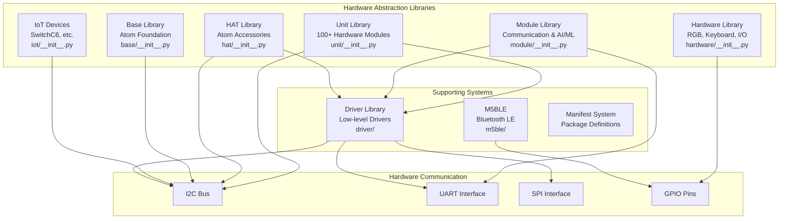
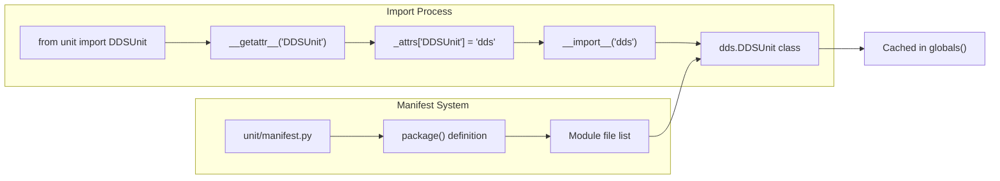
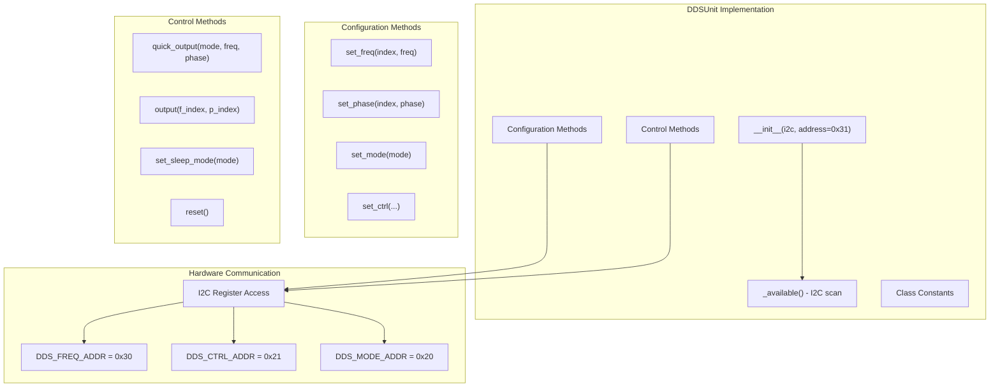
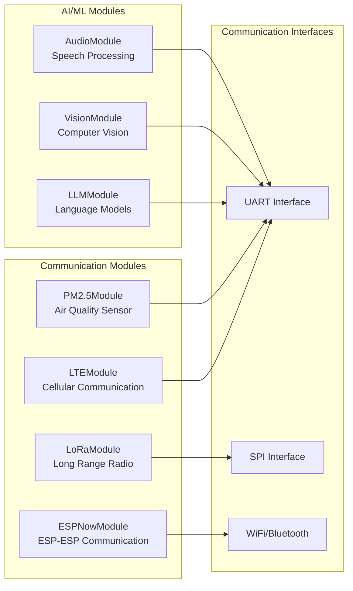
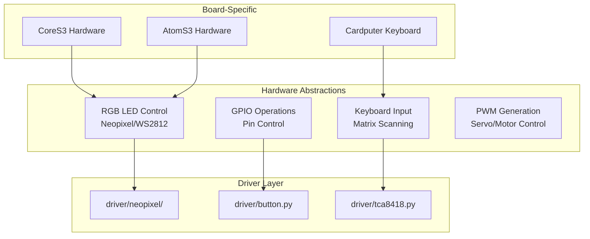

# Hardware Abstraction Libraries

<details>
<summary>Relevant source files</summary>

The following files were used as context for generating this wiki page:

- [docs/en/hardware/can.rst](docs/en/hardware/can.rst)
- [docs/en/hats/index.rst](docs/en/hats/index.rst)
- [docs/en/hats/pir.rst](docs/en/hats/pir.rst)
- [docs/en/hats/servo.rst](docs/en/hats/servo.rst)
- [docs/en/module/index.rst](docs/en/module/index.rst)
- [docs/en/module/pps.rst](docs/en/module/pps.rst)
- [docs/en/refs/hat.pir.ref](docs/en/refs/hat.pir.ref)
- [docs/en/refs/hat.servo.ref](docs/en/refs/hat.servo.ref)
- [docs/en/refs/module.pps.ref](docs/en/refs/module.pps.ref)
- [docs/en/refs/system.bleuart.client.ref](docs/en/refs/system.bleuart.client.ref)
- [docs/en/refs/system.bleuart.ref](docs/en/refs/system.bleuart.ref)
- [docs/en/refs/system.bleuart.server.ref](docs/en/refs/system.bleuart.server.ref)
- [docs/en/refs/unit.dds.ref](docs/en/refs/unit.dds.ref)
- [docs/en/refs/unit.digi_clock.ref](docs/en/refs/unit.digi_clock.ref)
- [docs/en/system/bleuart.client.rst](docs/en/system/bleuart.client.rst)
- [docs/en/system/bleuart.rst](docs/en/system/bleuart.rst)
- [docs/en/units/dds.rst](docs/en/units/dds.rst)
- [docs/en/units/digi_clock.rst](docs/en/units/digi_clock.rst)
- [docs/en/units/index.rst](docs/en/units/index.rst)
- [docs/zh_CN/module/pps.rst](docs/zh_CN/module/pps.rst)
- [docs/zh_CN/refs/module.pps.ref](docs/zh_CN/refs/module.pps.ref)
- [docs/zh_CN/refs/unit.dac2.ref](docs/zh_CN/refs/unit.dac2.ref)
- [docs/zh_CN/unit/dac2.rst](docs/zh_CN/unit/dac2.rst)
- [m5stack/libs/driver/manifest.py](m5stack/libs/driver/manifest.py)
- [m5stack/libs/driver/tca8418.py](m5stack/libs/driver/tca8418.py)
- [m5stack/libs/hardware/__init__.py](m5stack/libs/hardware/__init__.py)
- [m5stack/libs/hardware/ir.py](m5stack/libs/hardware/ir.py)
- [m5stack/libs/hardware/keyboard/__init__.py](m5stack/libs/hardware/keyboard/__init__.py)
- [m5stack/libs/hardware/keyboard/asciimap.py](m5stack/libs/hardware/keyboard/asciimap.py)
- [m5stack/libs/hardware/manifest.py](m5stack/libs/hardware/manifest.py)
- [m5stack/libs/hardware/matrix_keyboard.py](m5stack/libs/hardware/matrix_keyboard.py)
- [m5stack/libs/hardware/plcio.py](m5stack/libs/hardware/plcio.py)
- [m5stack/libs/hardware/sht30.py](m5stack/libs/hardware/sht30.py)
- [m5stack/libs/hat/__init__.py](m5stack/libs/hat/__init__.py)
- [m5stack/libs/hat/hat_helper.py](m5stack/libs/hat/hat_helper.py)
- [m5stack/libs/hat/manifest.py](m5stack/libs/hat/manifest.py)
- [m5stack/libs/hat/pir.py](m5stack/libs/hat/pir.py)
- [m5stack/libs/hat/rs485.py](m5stack/libs/hat/rs485.py)
- [m5stack/libs/hat/servo.py](m5stack/libs/hat/servo.py)
- [m5stack/libs/m5ble/m5ble.py](m5stack/libs/m5ble/m5ble.py)
- [m5stack/libs/module/__init__.py](m5stack/libs/module/__init__.py)
- [m5stack/libs/module/lte.py](m5stack/libs/module/lte.py)
- [m5stack/libs/module/manifest.py](m5stack/libs/module/manifest.py)
- [m5stack/libs/module/module_helper.py](m5stack/libs/module/module_helper.py)
- [m5stack/libs/module/pm25.py](m5stack/libs/module/pm25.py)
- [m5stack/libs/module/pps.py](m5stack/libs/module/pps.py)
- [m5stack/libs/module/relay_4.py](m5stack/libs/module/relay_4.py)
- [m5stack/libs/unit/__init__.py](m5stack/libs/unit/__init__.py)
- [m5stack/libs/unit/cardkb.py](m5stack/libs/unit/cardkb.py)
- [m5stack/libs/unit/dds.py](m5stack/libs/unit/dds.py)
- [m5stack/libs/unit/digi_clock.py](m5stack/libs/unit/digi_clock.py)
- [m5stack/libs/unit/manifest.py](m5stack/libs/unit/manifest.py)
- [m5stack/libs/unit/thermal2.py](m5stack/libs/unit/thermal2.py)
- [m5stack/modules/espnow.py](m5stack/modules/espnow.py)
- [m5stack/modules/manifest.py](m5stack/modules/manifest.py)

</details>


The hardware abstraction libraries provide a comprehensive modular ecosystem that enables unified interfaces to diverse M5Stack hardware peripherals. These libraries abstract the complexity of direct hardware communication through standardized Python APIs, with dynamic loading mechanisms that optimize memory usage and provide seamless hardware integration.

For information about the underlying M5Unified C++ bindings that these libraries build upon, see [M5Unified Hardware Abstraction](#4.1). For details about the user interface components, see [User Interface Framework](#3).

## Architecture Overview

The hardware abstraction system consists of six primary library categories, each serving distinct hardware domains through a consistent dynamic loading pattern:



Sources: [m5stack/libs/unit/__init__.py:1-151](https://github.com/m5stack/uiflow-micropython/blob/7af4551a/m5stack/libs/unit/__init__.py#L1-L151), [m5stack/libs/driver/manifest.py:1-109](https://github.com/m5stack/uiflow-micropython/blob/7af4551a/m5stack/libs/driver/manifest.py#L1-L109), [m5stack/libs/m5ble/m5ble.py:1-595](https://github.com/m5stack/uiflow-micropython/blob/7af4551a/m5stack/libs/m5ble/m5ble.py#L1-L595)

## Dynamic Loading Architecture

All hardware abstraction libraries implement a consistent lazy loading mechanism that imports modules only when accessed, optimizing memory usage and startup time:



The dynamic loading implementation follows this pattern across all libraries:

```python
# Pattern used in unit/__init__.py, module/__init__.py, etc.
_attrs = {
    "DDSUnit": "dds",
    "ColorUnit": "color",
    # ... mapping class names to module names
}

def __getattr__(attr):
    mod = _attrs.get(attr, None)
    if mod is None:
        raise AttributeError(attr)
    value = getattr(__import__(mod, None, None, True, 1), attr)
    globals()[attr] = value  # Cache for future use
    return value
```

Sources: [m5stack/libs/unit/__init__.py:144-151](https://github.com/m5stack/uiflow-micropython/blob/7af4551a/m5stack/libs/unit/__init__.py#L144-L151), [m5stack/libs/unit/manifest.py:4-141](https://github.com/m5stack/uiflow-micropython/blob/7af4551a/m5stack/libs/unit/manifest.py#L4-L141)

## Library Categories

### Unit Library

The Unit Library is the largest hardware abstraction library with over 100 hardware modules covering sensors, actuators, displays, and communication devices. Each unit implements standardized I2C communication patterns:

| Category | Examples | Communication |
|----------|----------|---------------|
| Sensors | `ENVUnit`, `ColorUnit`, `TOFUnit` | I2C |
| Displays | `OLEDUnit`, `LCDUnit`, `DigiClockUnit` | I2C |
| Actuators | `ServoUnit`, `RelayUnit`, `BuzzerUnit` | I2C/PWM |
| Communication | `LoRaWANUnit`, `NBIOTUnit`, `CANUnit` | UART/SPI |

The DDSUnit example demonstrates the typical unit structure:



Sources: [m5stack/libs/unit/dds.py:19-283](https://github.com/m5stack/uiflow-micropython/blob/7af4551a/m5stack/libs/unit/dds.py#L19-L283), [docs/en/units/dds.rst:1-240](https://github.com/m5stack/uiflow-micropython/blob/7af4551a/docs/en/units/dds.rst#L1-L240)

### Module Library

The Module Library focuses on communication protocols and AI/ML integration, handling complex devices that require UART or advanced protocol support:



Sources: System architecture diagrams, [m5stack/libs/driver/manifest.py:46-56](https://github.com/m5stack/uiflow-micropython/blob/7af4551a/m5stack/libs/driver/manifest.py#L46-L56)

### Hardware Library

The Hardware Library provides low-level abstractions for fundamental I/O operations, keyboards, RGB LEDs, and board-specific implementations:



Sources: [m5stack/libs/driver/manifest.py:37-39](https://github.com/m5stack/uiflow-micropython/blob/7af4551a/m5stack/libs/driver/manifest.py#L37-L39), [m5stack/libs/driver/manifest.py:95](https://github.com/m5stack/uiflow-micropython/blob/7af4551a/m5stack/libs/driver/manifest.py#L95)

### Communication Protocol Integration

The libraries implement consistent patterns for hardware communication across different interfaces:

```mermaid
graph TB
    subgraph "I2C Communication Pattern"
        I2C_INIT["Device Initialization<br/>i2c.scan() validation"]
        I2C_READ["Register Reading<br/>readfrom_mem()"]
        I2C_WRITE["Register Writing<br/>writeto_mem()"]
        I2C_ERROR["Error Handling<br/>UnitError exceptions"]
    end
    
    subgraph "UART Communication Pattern"
        UART_INIT["Serial Initialization<br/>Baud rate, pins"]
        UART_AT["AT Command Protocol<br/>Request/Response"]
        UART_PARSE["Response Parsing<br/>Status codes"]
        UART_BUFFER["Buffer Management<br/>Async data"]
    end
    
    subgraph "BLE Communication Pattern"
        BLE_INIT["BLE Device Setup<br/>Active, IRQ handler"]
        BLE_ADV["Advertisement<br/>Service discovery"]
        BLE_GATT["GATT Operations<br/>Characteristics R/W"]
        BLE_EVENT["Event Processing<br/>Connection management"]
    end
    
    I2C_INIT --> I2C_READ
    I2C_READ --> I2C_WRITE
    I2C_WRITE --> I2C_ERROR
    
    UART_INIT --> UART_AT
    UART_AT --> UART_PARSE
    UART_PARSE --> UART_BUFFER
    
    BLE_INIT --> BLE_ADV
    BLE_ADV --> BLE_GATT
    BLE_GATT --> BLE_EVENT
```



The M5BLE library exemplifies advanced protocol handling with comprehensive event management:

| IRQ Event | Purpose | Handler |
|-----------|---------|---------|
| `_IRQ_CENTRAL_CONNECT` | Client connection | Connection tracking |
| `_IRQ_GATTS_WRITE` | Data reception | Buffer management |
| `_IRQ_GATTC_NOTIFY` | Server notifications | Data processing |
| `_IRQ_SCAN_RESULT` | Device discovery | Service enumeration |

Sources: [m5stack/libs/unit/dds.py:84-86](https://github.com/m5stack/uiflow-micropython/blob/7af4551a/m5stack/libs/unit/dds.py#L84-L86), [m5stack/libs/unit/thermal2.py:309-311](https://github.com/m5stack/uiflow-micropython/blob/7af4551a/m5stack/libs/unit/thermal2.py#L309-L311), [m5stack/libs/m5ble/m5ble.py:12-41](https://github.com/m5stack/uiflow-micropython/blob/7af4551a/m5stack/libs/m5ble/m5ble.py#L12-L41)

## Manifest and Package Management

Each library uses a manifest system to define which modules are included in the build process:

```python
# Example from unit/manifest.py
package(
    "unit",
    (
        "__init__.py",
        "dds.py",
        "color.py",
        "env.py",
        # ... 100+ module files
    ),
    base_path="..",
    # opt=3,  # Optimization level
)
```

This manifest system enables:
- Selective module inclusion for different firmware builds
- Optimization level control per package
- Dependency tracking and validation
- Automated build system integration

Sources: [m5stack/libs/unit/manifest.py:4-141](https://github.com/m5stack/uiflow-micropython/blob/7af4551a/m5stack/libs/unit/manifest.py#L4-L141), [m5stack/libs/driver/manifest.py:5-108](https://github.com/m5stack/uiflow-micropython/blob/7af4551a/m5stack/libs/driver/manifest.py#L5-L108)

The hardware abstraction libraries form the foundation of the M5Stack UIFlow ecosystem, providing consistent, memory-efficient access to diverse hardware capabilities through a unified Python interface. The dynamic loading architecture ensures optimal resource utilization while maintaining ease of use for application developers.