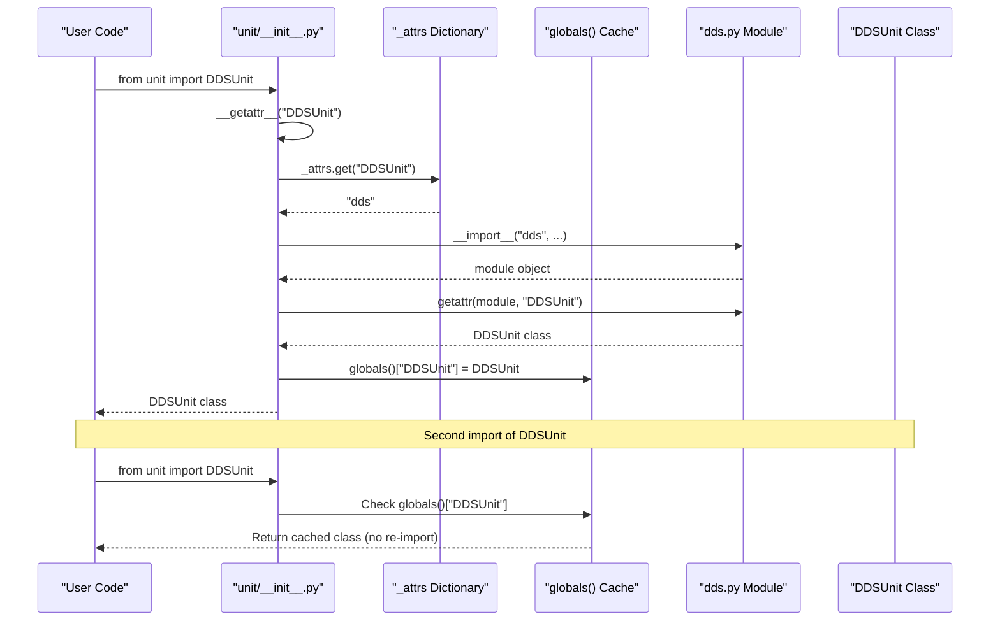
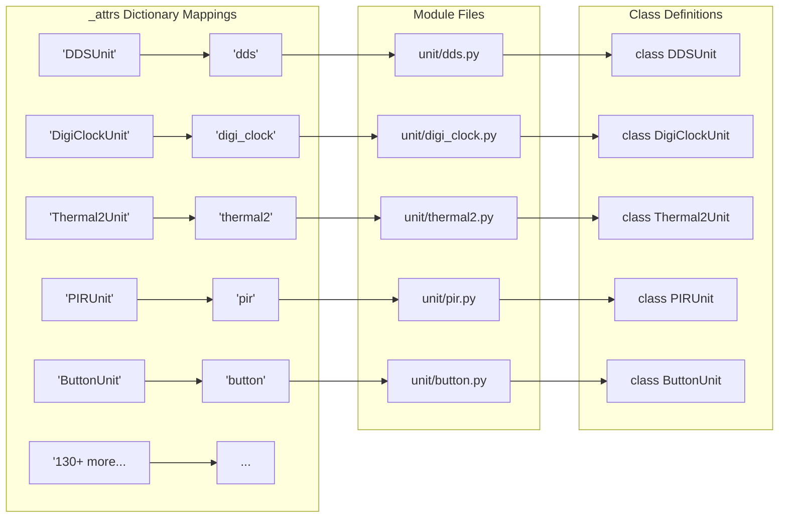
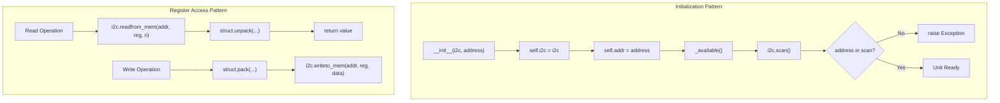
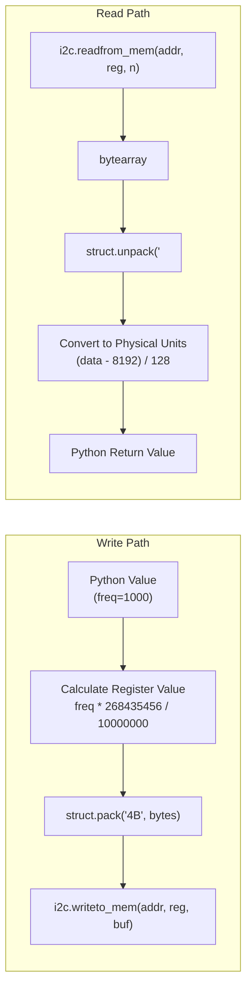
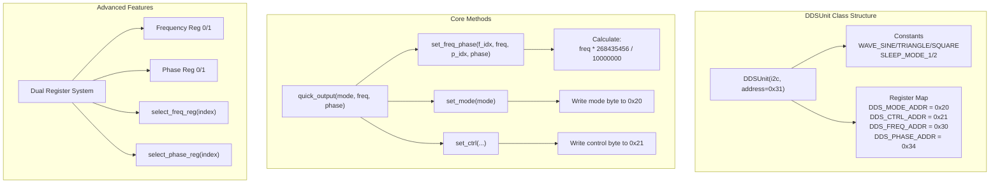
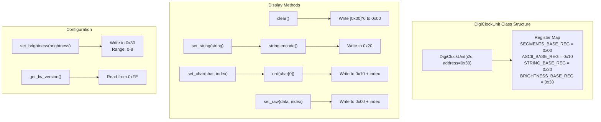
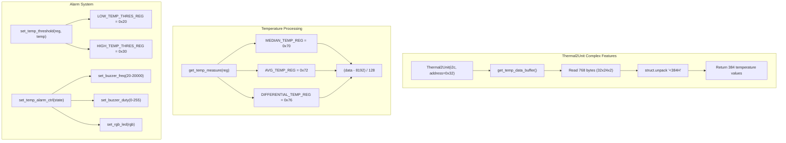
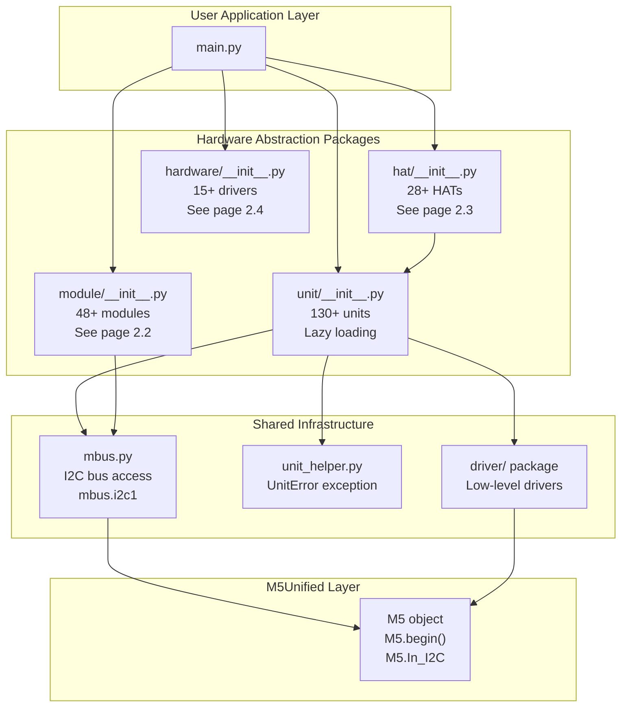

# Unit Library

<details>
<summary>Relevant source files</summary>

The following files were used as context for generating this wiki page:

- [docs/en/refs/unit.dds.ref](docs/en/refs/unit.dds.ref)
- [docs/en/refs/unit.digi_clock.ref](docs/en/refs/unit.digi_clock.ref)
- [docs/en/units/dds.rst](docs/en/units/dds.rst)
- [docs/en/units/digi_clock.rst](docs/en/units/digi_clock.rst)
- [docs/en/units/index.rst](docs/en/units/index.rst)
- [m5stack/libs/driver/manifest.py](m5stack/libs/driver/manifest.py)
- [m5stack/libs/m5ble/m5ble.py](m5stack/libs/m5ble/m5ble.py)
- [m5stack/libs/unit/__init__.py](m5stack/libs/unit/__init__.py)
- [m5stack/libs/unit/dds.py](m5stack/libs/unit/dds.py)
- [m5stack/libs/unit/digi_clock.py](m5stack/libs/unit/digi_clock.py)
- [m5stack/libs/unit/manifest.py](m5stack/libs/unit/manifest.py)
- [m5stack/libs/unit/thermal2.py](m5stack/libs/unit/thermal2.py)

</details>


## Purpose and Scope

The Unit Library provides Python drivers for 130+ hardware expansion units in the M5Stack ecosystem. A "unit" is a small, self-contained hardware module that connects to the main board via standardized ports (typically PortA or PortB), communicating primarily over I2C. Each unit driver encapsulates register-level communication, providing high-level Python APIs for sensors, actuators, displays, and communication modules.

This document covers the Unit package architecture, lazy loading mechanism, and common implementation patterns. For other hardware form factors, see [Module Library](#2.2) (larger modules with more complex functionality), [HAT Library](#2.3) (expansion boards that attach to the top of devices), and [Hardware Library](#2.4) (board-agnostic peripheral drivers).

**Sources: ** [m5stack/libs/unit/__init__.py](), [m5stack/libs/unit/manifest.py](), [docs/en/units/index.rst]()

---

## Architecture Overview

### Lazy Loading Mechanism

The Unit package implements a dynamic loading system that minimizes memory footprint by loading driver modules only when first accessed. This is critical for embedded MicroPython systems with limited RAM.



**Diagram: Dynamic Import Flow with `__getattr__` Mechanism**

The lazy loading mechanism operates in three phases:

1. **Attribute Lookup**: When `from unit import DDSUnit` executes, Python calls `unit/__init__.py.__getattr__("DDSUnit")` ([m5stack/libs/unit/__init__.py:144-150]()).

2. **Module Resolution**: The `_attrs` dictionary maps class names to module filenames. For example, `"DDSUnit": "dds"` maps the class to [m5stack/libs/unit/dds.py]() ([m5stack/libs/unit/__init__.py:5-141]()).

3. **Import and Cache**: The module is imported using `__import__(mod, None, None, True, 1)`, the class is extracted via `getattr()`, and cached in `globals()` to avoid re-importing ([m5stack/libs/unit/__init__.py:148-150]()).

**Sources: ** [m5stack/libs/unit/__init__.py:144-150](https://github.com/m5stack/uiflow-micropython/blob/7af4551a/m5stack/libs/unit/__init__.py#L144-L150)

---

### The _attrs Dictionary Structure

The `_attrs` dictionary is the core mapping table that enables lazy loading. It contains 130+ entries mapping class names to their implementing modules:



**Diagram: _attrs Dictionary Mapping Structure**

**Key characteristics:**

- **One-to-Many Relationships**: Some modules export multiple classes (e.g., `"acssr"` exports both `ACSSRUnit` and `DCSSRUnit` at [m5stack/libs/unit/__init__.py:8-9]()).

- **Alias Support**: Multiple class names can map to the same module (e.g., `"ToFUnit"` and `"ToF90Unit"` both map to `"tof"` at [m5stack/libs/unit/__init__.py:125-126]()).

- **Helper Exports**: Utility classes like `KeyCode` from the `cardkb` module are also exposed ([m5stack/libs/unit/__init__.py:27]()).

**Memory Impact**: Without lazy loading, importing all 130+ modules would consume excessive RAM. The lazy approach typically loads only 3-5 modules in a typical application, reducing memory usage by ~95%.

**Sources: ** [m5stack/libs/unit/__init__.py:5-141](https://github.com/m5stack/uiflow-micropython/blob/7af4551a/m5stack/libs/unit/__init__.py#L5-L141)

---

## Common Implementation Patterns

### I2C Communication Pattern

Most units communicate over I2C with a standardized initialization pattern:



**Diagram: Common I2C Communication Patterns in Unit Drivers**

**Example: DDSUnit Initialization**

[m5stack/libs/unit/dds.py:68-76]() demonstrates the standard pattern:

```python
def __init__(self, i2c: I2C, address: int | list | tuple = 0x31) -> None:
    self.i2c = i2c
    self.addr = address
    self._available()
```

The `_available()` method verifies I2C connectivity at [m5stack/libs/unit/dds.py:78-85]():

```python
def _available(self) -> None:
    if self.addr not in self.i2c.scan():
        raise Exception("DDSUnit not found on I2C bus.")
```

**Sources: ** [m5stack/libs/unit/dds.py:68-85](https://github.com/m5stack/uiflow-micropython/blob/7af4551a/m5stack/libs/unit/dds.py#L68-L85), [m5stack/libs/unit/digi_clock.py:47-64](https://github.com/m5stack/uiflow-micropython/blob/7af4551a/m5stack/libs/unit/digi_clock.py#L47-L64)

---

### Register-Based Access Pattern

Units typically use register-based communication with device-specific register maps defined as constants:

| Unit | Register Constants | Purpose |
|------|-------------------|---------|
| DDSUnit | `DDS_DESC_ADDR = 0x10`<br>`DDS_MODE_ADDR = 0x20`<br>`DDS_CTRL_ADDR = 0x21`<br>`DDS_FREQ_ADDR = 0x30` | Control AD9833 waveform generator |
| DigiClockUnit | `SEGMENTS_BASE_REG = 0x00`<br>`ASCII_BASE_REG = 0x10`<br>`STRING_BASE_REG = 0x20`<br>`BRIGHTNESS_BASE_REG = 0x30` | Control TM1637 7-segment display |
| Thermal2Unit | `BUTTON_REG = 0x00`<br>`TEMP_ALARM_REG = 0x01`<br>`TEMP_DATA_BUFFFER_REG = 0x80` | MLX90640 thermal camera control |

**Table: Register Map Examples from Different Units**

**Example: DDSUnit Frequency Setting**

The `set_freq()` method at [m5stack/libs/unit/dds.py:87-102]() shows register manipulation:

1. Convert frequency to AD9833 format: `freq * 268435456 / DDS_FMCLK`
2. Pack into 4-byte buffer with register select bits
3. Write to `DDS_FREQ_ADDR` register via `i2c.writeto_mem()`

**Sources: ** [m5stack/libs/unit/dds.py:50-54](https://github.com/m5stack/uiflow-micropython/blob/7af4551a/m5stack/libs/unit/dds.py#L50-L54), [m5stack/libs/unit/digi_clock.py:41-45](https://github.com/m5stack/uiflow-micropython/blob/7af4551a/m5stack/libs/unit/digi_clock.py#L41-L45), [m5stack/libs/unit/thermal2.py:13-37](https://github.com/m5stack/uiflow-micropython/blob/7af4551a/m5stack/libs/unit/thermal2.py#L13-L37)

---

### Data Packing and Unpacking

Units use `struct` module for binary data conversion between Python values and register bytes:



**Diagram: Binary Data Conversion Flow**

**Example: Thermal2Unit Temperature Reading**

The `get_temp_measure()` method at [m5stack/libs/unit/thermal2.py:524-529]() demonstrates the read path:

1. Read 2 bytes from register: `readfrom_mem(addr, reg, 2)`
2. Unpack as little-endian unsigned short: `struct.unpack("<H", data)[0]`
3. Convert to Celsius: `(data - 8192) / 128`

**Sources: ** [m5stack/libs/unit/dds.py:96-102](https://github.com/m5stack/uiflow-micropython/blob/7af4551a/m5stack/libs/unit/dds.py#L96-L102), [m5stack/libs/unit/thermal2.py:524-529](https://github.com/m5stack/uiflow-micropython/blob/7af4551a/m5stack/libs/unit/thermal2.py#L524-L529), [m5stack/libs/unit/digi_clock.py:83-84](https://github.com/m5stack/uiflow-micropython/blob/7af4551a/m5stack/libs/unit/digi_clock.py#L83-L84)

---

## Unit Driver Examples

### DDSUnit: Signal Generator

DDSUnit controls an AD9833 programmable waveform generator via STM32F0 microcontroller over I2C (address 0x31).



**Diagram: DDSUnit Architecture and Method Flow**

**Key capabilities:**

- **Waveform Generation**: Outputs sine, triangle, square, sawtooth, or DC waves ([m5stack/libs/unit/dds.py:58-62]())
- **Frequency Control**: Supports 0-5MHz output frequency with dual register switching ([m5stack/libs/unit/dds.py:87-102]())
- **Phase Control**: 0-360° phase adjustment with 0.176° resolution ([m5stack/libs/unit/dds.py:104-117]())
- **Power Management**: Three sleep modes for energy conservation ([m5stack/libs/unit/dds.py:64-66]())

**Example usage:**

```python
from unit import DDSUnit
from machine import I2C

i2c = I2C(1, scl=33, sda=32)
dds = DDSUnit(i2c, 0x31)

# Quick output: 1kHz sine wave
dds.quick_output(DDSUnit.WAVE_SINE, 1000, 0)

# Advanced: Use dual registers for frequency hopping
dds.set_freq(0, 1000)  # Register 0: 1kHz
dds.set_freq(1, 5000)  # Register 1: 5kHz
dds.select_freq_reg(0)  # Switch to 1kHz
dds.select_freq_reg(1)  # Switch to 5kHz
```

**Sources: ** [m5stack/libs/unit/dds.py:19-283](https://github.com/m5stack/uiflow-micropython/blob/7af4551a/m5stack/libs/unit/dds.py#L19-L283), [docs/en/units/dds.rst:1-240](https://github.com/m5stack/uiflow-micropython/blob/7af4551a/docs/en/units/dds.rst#L1-L240)

---

### DigiClockUnit: 7-Segment Display

DigiClockUnit drives a 4-digit 7-segment display using TM1637 driver IC via STM32F030 I2C interface.



**Diagram: DigiClockUnit Display Control Methods**

**Three display modes:**

1. **Raw Segment Control**: Direct bit manipulation of 7-segment + decimal point ([m5stack/libs/unit/digi_clock.py:86-96]())
2. **ASCII Character**: Automatic conversion of ASCII to segment patterns ([m5stack/libs/unit/digi_clock.py:98-109]())
3. **String Display**: High-level string rendering with colon support ([m5stack/libs/unit/digi_clock.py:111-120]())

**Sources: ** [m5stack/libs/unit/digi_clock.py:18-146](https://github.com/m5stack/uiflow-micropython/blob/7af4551a/m5stack/libs/unit/digi_clock.py#L18-L146), [docs/en/units/digi_clock.rst:1-121](https://github.com/m5stack/uiflow-micropython/blob/7af4551a/docs/en/units/digi_clock.rst#L1-L121)

---

### Thermal2Unit: Thermal Camera

Thermal2Unit interfaces with MLX90640 32x24 thermal imaging sensor, providing temperature array data and alarm functionality.



**Diagram: Thermal2Unit Advanced Features**

**Notable implementation details:**

- **Large Data Transfer**: The 768-byte temperature buffer requires efficient I2C bulk read ([m5stack/libs/unit/thermal2.py:538-541]())
- **Temperature Conversion**: Fixed-point arithmetic converts raw sensor values: `(data - 8192) / 128` ([m5stack/libs/unit/thermal2.py:524-529]())
- **Color Mapping**: Pre-computed 256-entry color table for thermal visualization ([m5stack/libs/unit/thermal2.py:41-298]())
- **Dual Alarm System**: Separate thresholds, intervals, and LED colors for high/low temperature ([m5stack/libs/unit/thermal2.py:466-510]())

**Sources: ** [m5stack/libs/unit/thermal2.py:301-545](https://github.com/m5stack/uiflow-micropython/blob/7af4551a/m5stack/libs/unit/thermal2.py#L301-L545)

---

## Integration with the System

### Relationship to Other Packages



**Diagram: Unit Library in the System Architecture**

**Key integration points:**

1. **MBUS Access**: Units use `mbus.i2c1` for standardized I2C access to PortA/PortB connectors
2. **Error Handling**: The `unit_helper.py` module provides `UnitError` exception for consistent error reporting ([m5stack/libs/unit/thermal2.py:7]() imports this)
3. **Driver Reuse**: Complex units leverage the `driver/` package for low-level sensor communication (e.g., BMI270, SCD40, VL53L0X)
4. **HAT Inheritance**: Some HAT drivers inherit from Unit drivers (e.g., `PIRHat` extends `PIRUnit` from the Unit package)

**Sources: ** [m5stack/libs/unit/__init__.py](), [m5stack/libs/unit/manifest.py](), [m5stack/libs/driver/manifest.py]()

---

## Manifest and Build System Integration

The `manifest.py` file defines which unit modules are included in the firmware build:

```python
package(
    "unit",
    (
        "__init__.py",
        "dds.py",
        "digi_clock.py",
        "thermal2.py",
        # ... 127 more files
        "unit_helper.py",
    ),
    base_path="..",
    # opt=3,  # Optimization level (commented out)
)
```

**Build characteristics:**

- **Total Files**: 138 Python files (130+ unit drivers + `__init__.py` + `unit_helper.py`)
- **Frozen Bytecode**: Modules are compiled to `.mpy` bytecode during build for faster imports
- **Optimization**: The `opt=3` flag (currently commented) would enable maximum optimization, removing docstrings
- **Base Path**: `base_path=".."` indicates the package is built from the parent directory structure

The documentation system automatically generates RST files for each unit in [docs/en/units/index.rst:1-126](), creating a parallel structure for the 130+ unit drivers.

**Sources: ** [m5stack/libs/unit/manifest.py:1-142](https://github.com/m5stack/uiflow-micropython/blob/7af4551a/m5stack/libs/unit/manifest.py#L1-L142), [docs/en/units/index.rst:1-126](https://github.com/m5stack/uiflow-micropython/blob/7af4551a/docs/en/units/index.rst#L1-L126)