# Module Library

<details>
<summary>Relevant source files</summary>

The following files were used as context for generating this wiki page:

- [docs/en/module/index.rst](docs/en/module/index.rst)
- [docs/en/module/pps.rst](docs/en/module/pps.rst)
- [docs/en/refs/module.pps.ref](docs/en/refs/module.pps.ref)
- [docs/zh_CN/module/pps.rst](docs/zh_CN/module/pps.rst)
- [docs/zh_CN/refs/module.pps.ref](docs/zh_CN/refs/module.pps.ref)
- [docs/zh_CN/refs/unit.dac2.ref](docs/zh_CN/refs/unit.dac2.ref)
- [docs/zh_CN/unit/dac2.rst](docs/zh_CN/unit/dac2.rst)
- [m5stack/libs/module/__init__.py](m5stack/libs/module/__init__.py)
- [m5stack/libs/module/lte.py](m5stack/libs/module/lte.py)
- [m5stack/libs/module/manifest.py](m5stack/libs/module/manifest.py)
- [m5stack/libs/module/module_helper.py](m5stack/libs/module/module_helper.py)
- [m5stack/libs/module/pm25.py](m5stack/libs/module/pm25.py)
- [m5stack/libs/module/pps.py](m5stack/libs/module/pps.py)
- [m5stack/libs/module/relay_4.py](m5stack/libs/module/relay_4.py)
- [m5stack/modules/espnow.py](m5stack/modules/espnow.py)
- [m5stack/modules/manifest.py](m5stack/modules/manifest.py)

</details>


## Purpose and Scope

The Module Library provides Python drivers for 48+ M5Stack hardware modules that extend device capabilities through modular expansion. Modules are larger form-factor peripherals that connect to M5Stack devices via I2C or UART interfaces, providing functionality such as programmable power supplies, relay control, wireless communication (LTE, LoRa, Zigbee), motor control, and environmental sensing.

This document covers the architecture, communication patterns, and implementation details of the Module package located at [m5stack/libs/module/](). For smaller hardware units, see [Unit Library](#2.1). For expansion HATs, see [HAT Library](#2.3). For board-agnostic peripheral drivers, see [Hardware Library](#2.4).

## Package Architecture

The Module package implements the same lazy-loading pattern used across all M5Stack hardware libraries to optimize memory usage on embedded devices.

### Lazy Loading Mechanism

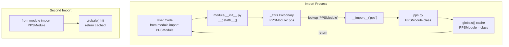

**Figure 1: Module Lazy Loading Flow**

The `__getattr__` dispatcher in [m5stack/libs/module/__init__.py:61-67]() intercepts attribute access and dynamically loads module files only when requested. The `_attrs` dictionary maps 48 class names to their implementing module files.

| Module Category | Example Classes | Module Files |
|----------------|-----------------|--------------|
| Power Management | `PPSModule` | `pps.py` |
| Relay Control | `Relay2Module`, `Relay4Module` | `relay_2.py`, `relay_4.py` |
| Wireless Comm | `LTEModule`, `LoraModule`, `ZigbeeModule` | `lte.py`, `lora.py`, `zigbee.py` |
| Motor Control | `DCMotorModule`, `Encoder4MotorModule`, `StepMotorDriverModule` | `dc_motor.py`, `encoder4_motor.py`, `step_motor_driver.py` |
| Environmental | `PM25Module`, `ECGModule` | `pm25.py`, `ecg.py` |
| Display/UI | `DisplayModule`, `HMIModule`, `QRCodeModule` | `display.py`, `hmi.py`, `qrcode.py` |
| Communication Bus | `CommuModuleCAN`, `CommuModuleI2C`, `CommuModuleRS485`, `RS232Module` | `commu.py`, `rs232.py` |
| Network | `LANModule`, `NBIOTModule`, `IotBaseCatmModule` | `lan.py`, `nbiot.py`, `iot_base_catm.py` |

**Table 1: Module Categories and Implementations**

Sources: [m5stack/libs/module/__init__.py:7-53](https://github.com/m5stack/uiflow-micropython/blob/7af4551a/m5stack/libs/module/__init__.py#L7-L53), [m5stack/libs/module/manifest.py:1-58](https://github.com/m5stack/uiflow-micropython/blob/7af4551a/m5stack/libs/module/manifest.py#L1-L58)

## Communication Patterns

Module hardware interfaces fall into two primary categories: I2C register-based communication and UART command-based communication.

### I2C Register-Based Communication

Most modules use I2C with memory-mapped register access. The shared I2C bus is accessed via `mbus.i2c1`.

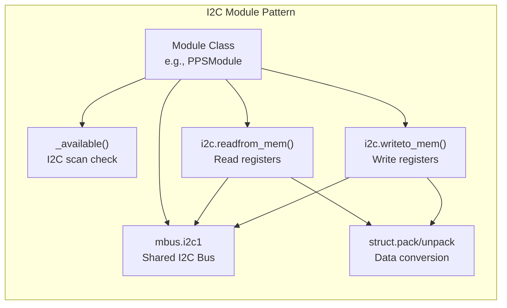

**Figure 2: I2C Communication Pattern**

#### PPSModule Example (Programmable Power Supply)

The PPSModule demonstrates typical I2C register-based control for a 30V/5A programmable power supply:

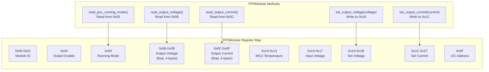

**Figure 3: PPSModule Register Interface**

Key implementation details from [m5stack/libs/module/pps.py]():
- Constructor at [m5stack/libs/module/pps.py:47-58]() initializes I2C from `mbus.i2c1` and validates device presence
- Voltage setting at [m5stack/libs/module/pps.py:96-111]() uses `struct.pack("<f", voltage)` to convert float to 4-byte little-endian format
- Current setting at [m5stack/libs/module/pps.py:113-125]() follows identical pattern with range validation (0.0A to 5.0A)
- Readback operations at [m5stack/libs/module/pps.py:139-173]() use `struct.unpack("<f", data)` to convert raw bytes back to floats
- Running mode constants at [m5stack/libs/module/pps.py:43-45]() define `OUT_DISABLED=0`, `OUT_CV_MODE=1`, `OUT_CC_MODE=2`

Sources: [m5stack/libs/module/pps.py:1-243](https://github.com/m5stack/uiflow-micropython/blob/7af4551a/m5stack/libs/module/pps.py#L1-L243), [docs/en/module/pps.rst:1-190](https://github.com/m5stack/uiflow-micropython/blob/7af4551a/docs/en/module/pps.rst#L1-L190)

#### Relay4Module Example (Digital I/O Control)

The Relay4Module uses a simpler bit-mask register approach for controlling four relay channels:

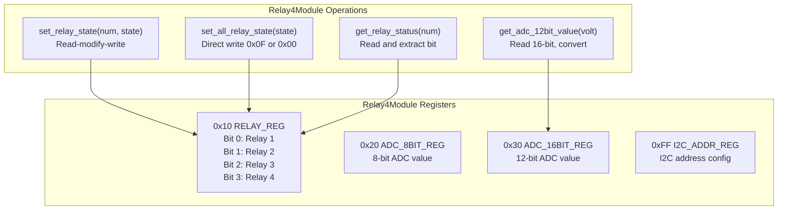

**Figure 4: Relay4Module Bit-Mask Interface**

Implementation at [m5stack/libs/module/relay_4.py:36-49]() shows read-modify-write pattern:
1. Read current register value: `data = i2c.readfrom_mem(addr, RELAY_REG, 1)[0]`
2. Modify specific bit: `data |= 0x01 << (num - 1)` or `data &= ~(0x01 << (num - 1))`
3. Write back: `i2c.writeto_mem(addr, RELAY_REG, bytes([data]))`

The module also includes 8-bit and 12-bit ADC inputs at [m5stack/libs/module/relay_4.py:62-83]() for reading analog voltages (0-3.3V input scaled to 0-26.4V range with factor of 8).

Sources: [m5stack/libs/module/relay_4.py:1-104](https://github.com/m5stack/uiflow-micropython/blob/7af4551a/m5stack/libs/module/relay_4.py#L1-L104)

### UART Command-Based Communication

Modules requiring higher bandwidth or specific protocol support use UART communication with AT commands or binary protocols.

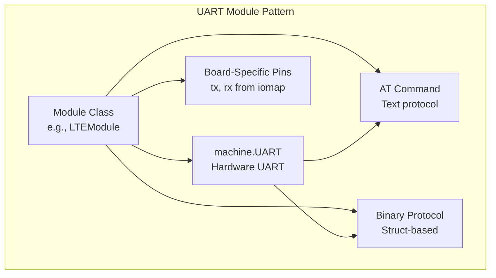

**Figure 5: UART Communication Pattern**

#### LTEModule Example (AT Command Protocol)

The LTEModule implements PPP (Point-to-Point Protocol) over UART for cellular connectivity:

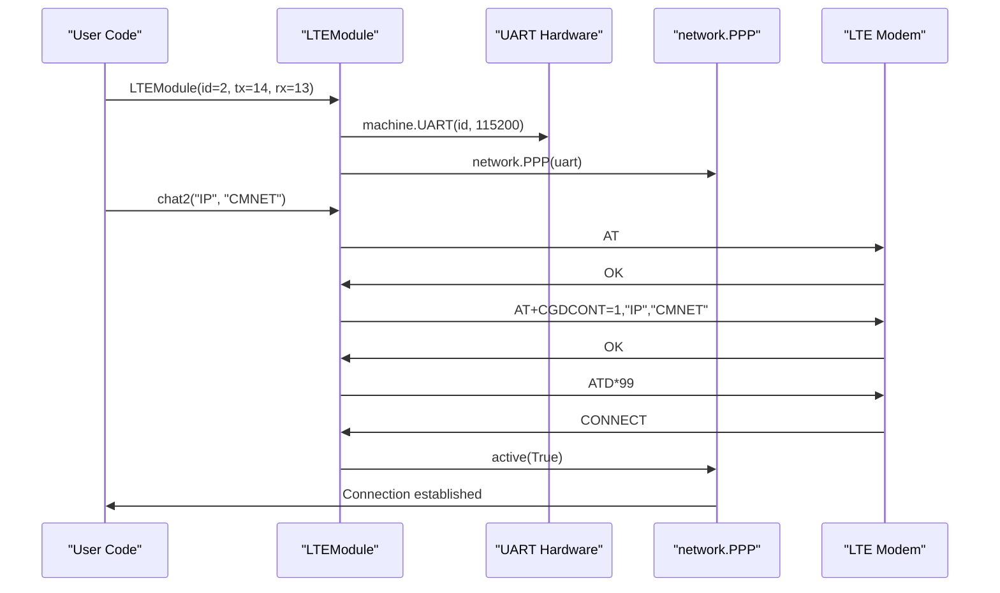

**Figure 6: LTEModule PPP Initialization Sequence**

Key implementation features at [m5stack/libs/module/lte.py]():
- ATCommand named tuple at [m5stack/libs/module/lte.py:10]() defines `(cmd, rsp1, rsp2, timeout)` structure
- `execute_at_command2()` at [m5stack/libs/module/lte.py:60-72]() sends commands and waits for responses
- Response parsing at [m5stack/libs/module/lte.py:75-114]() handles timeout detection and keyword matching
- `chat()` method at [m5stack/libs/module/lte.py:116-171]() implements script-based AT command sequences
- PPP delegation at [m5stack/libs/module/lte.py:210-211]() forwards network methods via `__getattr__` to underlying PPP object

Sources: [m5stack/libs/module/lte.py:1-239](https://github.com/m5stack/uiflow-micropython/blob/7af4551a/m5stack/libs/module/lte.py#L1-L239)

#### PM25Module Example (Binary UART Protocol)

The PM25Module reads particulate matter sensor data using a binary protocol:

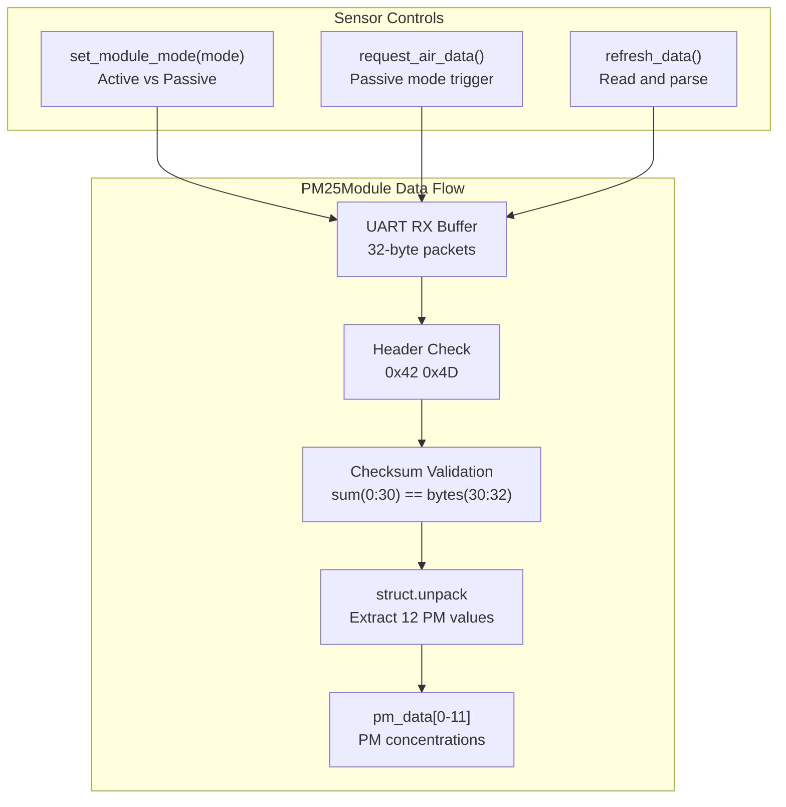

**Figure 7: PM25Module Binary Protocol Flow**

Implementation details at [m5stack/libs/module/pm25.py]():
- Board-specific pin mapping at [m5stack/libs/module/pm25.py:19-25]() uses `M5.getBoard()` to select correct UART pins
- Binary protocol validation at [m5stack/libs/module/pm25.py:126-133]() computes checksum over first 30 bytes
- Data parsing at [m5stack/libs/module/pm25.py:92-101]() uses `struct.unpack(">HHHHHHHHHHHH", buffer, 4)` to extract 12 16-bit PM values
- Active/passive mode control at [m5stack/libs/module/pm25.py:73-90]() sends mode-selection commands
- Additional I2C sensor support at [m5stack/libs/module/pm25.py:38-44]() detects SHT30 or SHT20 for temperature/humidity

Sources: [m5stack/libs/module/pm25.py:1-178](https://github.com/m5stack/uiflow-micropython/blob/7af4551a/m5stack/libs/module/pm25.py#L1-L178)

## Common Module Patterns

### Device Availability Checking

All modules implement availability checking in their constructors to fail early if hardware is not connected.

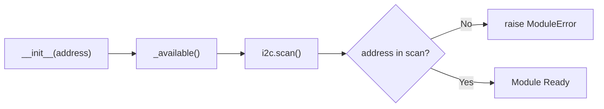

**Figure 8: Device Availability Check Pattern**

Example from PPSModule at [m5stack/libs/module/pps.py:60-67]():
```python
def _available(self):
    if self.addr not in self.i2c.scan():
        raise ModuleError("PPS Module not found.")
```

The `ModuleError` exception is defined in [m5stack/libs/module/module_helper.py:6-7]() as a simple exception subclass for consistent error handling across all modules.

Sources: [m5stack/libs/module/pps.py:60-67](https://github.com/m5stack/uiflow-micropython/blob/7af4551a/m5stack/libs/module/pps.py#L60-L67), [m5stack/libs/module/module_helper.py:1-8](https://github.com/m5stack/uiflow-micropython/blob/7af4551a/m5stack/libs/module/module_helper.py#L1-L8)

### I2C Address Configuration

Many modules support runtime I2C address reconfiguration for multi-device setups:

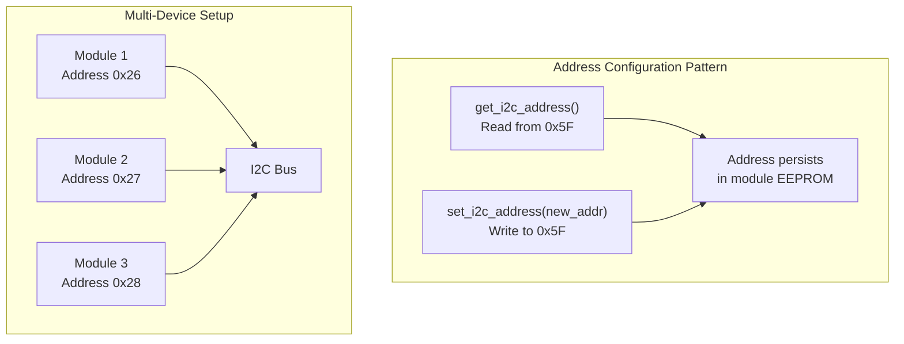

**Figure 9: I2C Address Configuration Pattern**

Implementation in PPSModule at [m5stack/libs/module/pps.py:222-242]() and Relay4Module at [m5stack/libs/module/relay_4.py:85-94]() show consistent pattern of reading from and writing to register 0x5F or 0xFF.

Sources: [m5stack/libs/module/pps.py:222-242](https://github.com/m5stack/uiflow-micropython/blob/7af4551a/m5stack/libs/module/pps.py#L222-L242), [m5stack/libs/module/relay_4.py:85-94](https://github.com/m5stack/uiflow-micropython/blob/7af4551a/m5stack/libs/module/relay_4.py#L85-L94)

### Data Type Conversion

Modules use `struct` module for converting between Python types and binary register formats:

| Data Type | struct Format | Size | Example Usage |
|-----------|---------------|------|---------------|
| Unsigned byte | `"B"` | 1 byte | Status flags, mode values |
| Unsigned short | `"<H"` | 2 bytes | Module ID, 16-bit ADC |
| Float (little-endian) | `"<f"` | 4 bytes | Voltage, current, temperature |
| Float (big-endian) | `">f"` | 4 bytes | Alternative float format |
| 12 unsigned shorts | `">HHHHHHHHHHHH"` | 24 bytes | PM25 sensor array |

**Table 2: Common struct Formats**

Examples:
- PPSModule voltage: [m5stack/libs/module/pps.py:108]() uses `struct.pack("<f", voltage)`
- Relay4Module ADC: [m5stack/libs/module/relay_4.py:78]() uses `struct.unpack("<H", buf)[0]`
- PM25Module data: [m5stack/libs/module/pm25.py:98]() uses `struct.unpack(">HHHHHHHHHHHH", buffer, 4)`

Sources: [m5stack/libs/module/pps.py:96-125](https://github.com/m5stack/uiflow-micropython/blob/7af4551a/m5stack/libs/module/pps.py#L96-L125), [m5stack/libs/module/relay_4.py:73-83](https://github.com/m5stack/uiflow-micropython/blob/7af4551a/m5stack/libs/module/relay_4.py#L73-L83), [m5stack/libs/module/pm25.py:92-101](https://github.com/m5stack/uiflow-micropython/blob/7af4551a/m5stack/libs/module/pm25.py#L92-L101)

## Module Integration

### mbus Shared Bus Access

All I2C-based modules access the shared I2C bus through `mbus.i2c1`:

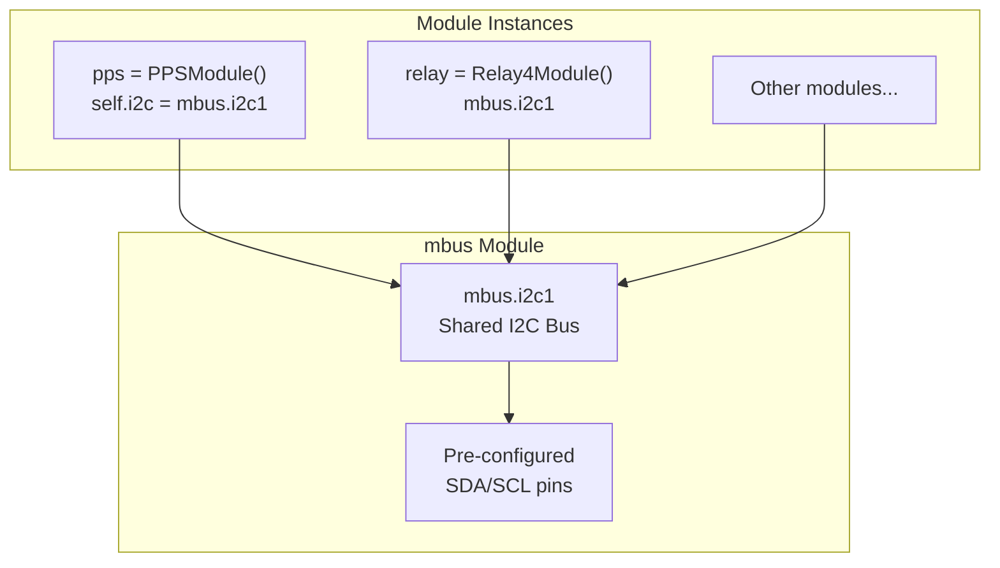

**Figure 10: Shared I2C Bus Access**

The `mbus` module is imported at [m5stack/libs/module/__init__.py:5]() and used by all I2C modules (e.g., [m5stack/libs/module/pps.py:6](), [m5stack/libs/module/relay_4.py:5]()).

Sources: [m5stack/libs/module/__init__.py:5](https://github.com/m5stack/uiflow-micropython/blob/7af4551a/m5stack/libs/module/__init__.py#L5), [m5stack/libs/module/pps.py:54](https://github.com/m5stack/uiflow-micropython/blob/7af4551a/m5stack/libs/module/pps.py#L54)

### Documentation and Examples

Each module has corresponding documentation and examples:

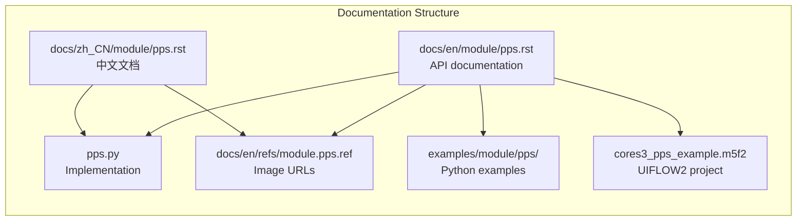

**Figure 11: Module Documentation Structure**

The documentation index at [docs/en/module/index.rst:1-46]() lists all 45 documented modules. Each module's `.ref` file (e.g., [docs/en/refs/module.pps.ref:1-48]()) defines reusable image URLs for product photos and UIFLOW2 block diagrams.

Sources: [docs/en/module/index.rst:1-46](https://github.com/m5stack/uiflow-micropython/blob/7af4551a/docs/en/module/index.rst#L1-L46), [docs/en/module/pps.rst:1-190](https://github.com/m5stack/uiflow-micropython/blob/7af4551a/docs/en/module/pps.rst#L1-L190), [docs/en/refs/module.pps.ref:1-48](https://github.com/m5stack/uiflow-micropython/blob/7af4551a/docs/en/refs/module.pps.ref#L1-L48)

## Module Categories Reference

### Complete Module Listing

The following table maps all 48 module classes to their implementations:

| Class Name | Module File | Communication | Primary Function |
|------------|-------------|---------------|------------------|
| `AIN4Module` | `ain4.py` | I2C | 4-channel analog input |
| `AudioModule` | `audio.py` | I2C | Audio playback |
| `Bala2Module` | `bala2.py` | I2C | Balance robot control |
| `CommuModuleCAN/I2C/RS485` | `commu.py` | I2C | Multi-protocol communication |
| `DCMotorModule` | `dc_motor.py` | I2C | DC motor driver |
| `DisplayModule` | `display.py` | I2C | External display |
| `DMX512Module` | `dmx.py` | I2C | DMX512 lighting control |
| `DualKmeterModule` | `dual_kmeter.py` | I2C | Dual thermocouple reader |
| `ECGModule` | `ecg.py` | I2C | ECG sensor |
| `Encoder4MotorModule` | `encoder4_motor.py` | I2C | 4-channel encoder motor |
| `FanModule` | `fan.py` | I2C | Fan control |
| `GatewayH2Module` | `gateway_h2.py` | I2C | Gateway module |
| `GNSSModule` | `gnss.py` | UART | GNSS positioning |
| `GPSModule` | `gps.py` | UART | GPS receiver |
| `GPSV2Module` | `gpsv2.py` | UART | GPS receiver v2 |
| `GRBLModule` | `grbl.py` | UART | CNC controller |
| `GoPlus2Module` | `goplus2.py` | I2C | Multi-function expansion |
| `HMIModule` | `hmi.py` | UART | HMI display |
| `IotBaseCatmModule` | `iot_base_catm.py` | UART | Cat-M cellular |
| `LANModule` | `lan.py` | SPI | Ethernet |
| `LlmModule` | `llm.py` | UART | AI/LLM processor |
| `LoraModule` | `lora.py` | I2C/SPI | LoRa communication |
| `LoRa868V12Module` | `lora868_v12.py` | I2C | LoRa 868MHz |
| `LoRaWANModule` | `lorawan.py` | I2C | LoRaWAN |
| `LoRaWAN868Module` | `lorawan868.py` | I2C | LoRaWAN 868MHz |
| `LTEModule` | `lte.py` | UART | LTE cellular |
| `Module4In8Out` | `module_4in8out.py` | I2C | 4-in/8-out I/O |
| `NBIOTModule` | `nbiot.py` | UART | NB-IoT cellular |
| `ODriveModule` | `odrive.py` | UART | ODrive motor controller |
| `PLUSModule` | `plus.py` | I2C | Multi-function plus |
| `PM25Module` | `pm25.py` | UART | PM2.5 sensor |
| `PPSModule` | `pps.py` | I2C | Programmable power supply |
| `PwrCANModule/RS485` | `pwrcan.py` | CAN/RS485 | Power CAN bus |
| `QRCodeModule` | `qrcode.py` | UART | QR code scanner |
| `RCAModule` | `rca.py` | I2C | RCA audio/video |
| `Relay2Module` | `relay_2.py` | I2C | 2-relay control |
| `Relay4Module` | `relay_4.py` | I2C | 4-relay control |
| `RS232Module` | `rs232.py` | UART | RS232 serial |
| `Servo2Module` | `servo2.py` | I2C | 2-channel servo |
| `StepMotorDriverModule` | `step_motor_driver.py` | I2C | Stepper motor |
| `USBModule` | `usb.py` | USB | USB host |
| `ZigbeeModule` | `zigbee.py` | UART | Zigbee wireless |

**Table 3: Complete Module Class Reference**

Sources: [m5stack/libs/module/__init__.py:7-53](https://github.com/m5stack/uiflow-micropython/blob/7af4551a/m5stack/libs/module/__init__.py#L7-L53), [m5stack/libs/module/manifest.py:5-58](https://github.com/m5stack/uiflow-micropython/blob/7af4551a/m5stack/libs/module/manifest.py#L5-L58)