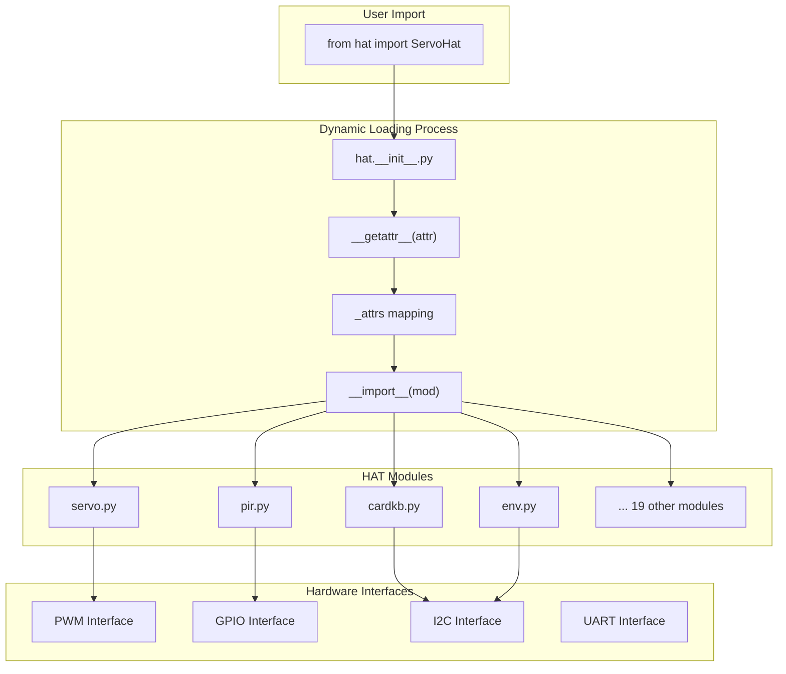
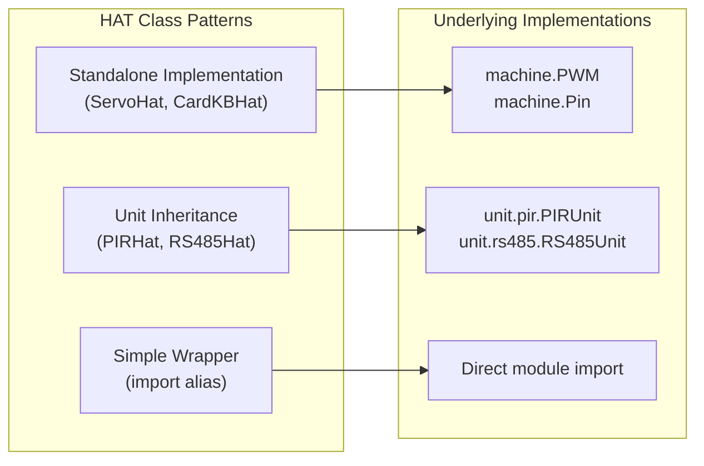
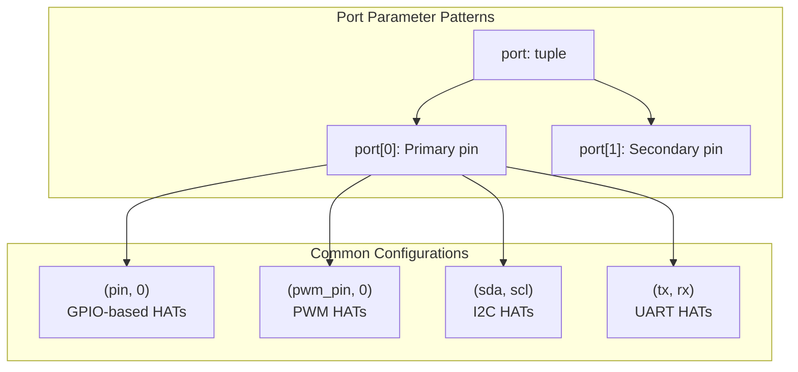
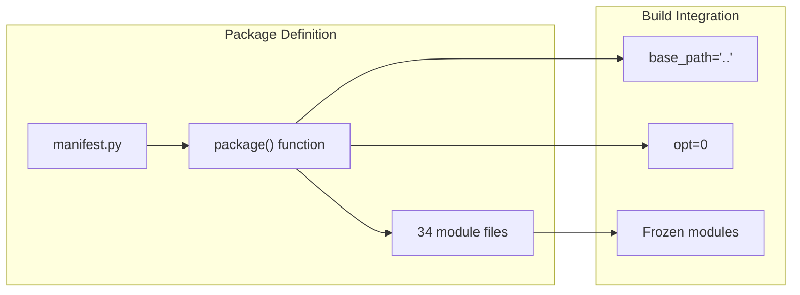

# HAT Library

<details>
<summary>Relevant source files</summary>

The following files were used as context for generating this wiki page:

- [docs/en/hats/index.rst](docs/en/hats/index.rst)
- [docs/en/hats/pir.rst](docs/en/hats/pir.rst)
- [docs/en/hats/servo.rst](docs/en/hats/servo.rst)
- [docs/en/refs/hat.pir.ref](docs/en/refs/hat.pir.ref)
- [docs/en/refs/hat.servo.ref](docs/en/refs/hat.servo.ref)
- [m5stack/libs/hat/__init__.py](m5stack/libs/hat/__init__.py)
- [m5stack/libs/hat/hat_helper.py](m5stack/libs/hat/hat_helper.py)
- [m5stack/libs/hat/manifest.py](m5stack/libs/hat/manifest.py)
- [m5stack/libs/hat/pir.py](m5stack/libs/hat/pir.py)
- [m5stack/libs/hat/rs485.py](m5stack/libs/hat/rs485.py)
- [m5stack/libs/hat/servo.py](m5stack/libs/hat/servo.py)

</details>


The HAT Library provides a unified interface for M5Stack HAT (Hardware Attached on Top) modules, which are compact accessories designed for M5Stack Atom series devices. This library manages 23+ different HAT modules including sensors, actuators, input devices, and communication interfaces through a dynamic loading architecture.

For general hardware abstraction functionality, see [Hardware Library](#2.4). For larger sensor and actuator modules, see [Unit Library](#2.1). For Atom-specific base modules, see [Base Library](#2.5).

## Architecture Overview

The HAT Library uses the same dynamic loading pattern found throughout the M5Stack ecosystem, allowing modules to be imported on-demand to minimize memory usage.

### Dynamic Loading Mechanism



**Sources: ** [m5stack/libs/hat/__init__.py:34-40](https://github.com/m5stack/uiflow-micropython/blob/7af4551a/m5stack/libs/hat/__init__.py#L34-L40), [m5stack/libs/hat/__init__.py:5-31](https://github.com/m5stack/uiflow-micropython/blob/7af4551a/m5stack/libs/hat/__init__.py#L5-L31)

The `__getattr__` function in [m5stack/libs/hat/__init__.py:34-40]() intercepts attribute access and dynamically imports the corresponding module based on the `_attrs` mapping defined in [m5stack/libs/hat/__init__.py:5-31]().

## HAT Module Categories

The HAT library contains modules organized by functionality:

| Category | HAT Modules | Communication Interface |
|----------|-------------|------------------------|
| **Input Devices** | `JoyCHat`, `JoystickHat`, `MiniJoyHat`, `MiniEncoderCHat`, `CardKBHat` | I2C, GPIO |
| **Sensors** | `ENVHat`, `PIRHat`, `NCIRHat`, `ThermalHat`, `ToFHat`, `DLightHat`, `HeartHat` | I2C, GPIO |
| **Actuators** | `ServoHat`, `Servos8Hat`, `SpeakerHat`, `Speaker2Hat`, `VibratorHat`, `NeoFlashHat` | PWM, I2C |
| **Communication** | `RS485Hat`, `YUNHat` | UART, I2C |
| **Signal Processing** | `ADCHat`, `DACHat`, `DAC2Hat` | I2C |

**Sources: ** [m5stack/libs/hat/__init__.py:5-31](https://github.com/m5stack/uiflow-micropython/blob/7af4551a/m5stack/libs/hat/__init__.py#L5-L31), [m5stack/libs/hat/manifest.py:6-34](https://github.com/m5stack/uiflow-micropython/blob/7af4551a/m5stack/libs/hat/manifest.py#L6-L34)

## Implementation Patterns

### Module Structure



**Sources: ** [m5stack/libs/hat/servo.py:17-91](https://github.com/m5stack/uiflow-micropython/blob/7af4551a/m5stack/libs/hat/servo.py#L17-L91), [m5stack/libs/hat/pir.py:8-11](https://github.com/m5stack/uiflow-micropython/blob/7af4551a/m5stack/libs/hat/pir.py#L8-L11), [m5stack/libs/hat/rs485.py:5](https://github.com/m5stack/uiflow-micropython/blob/7af4551a/m5stack/libs/hat/rs485.py#L5)

### Inheritance Pattern Example

Many HAT modules inherit from existing Unit implementations to provide specialized interfaces for Atom devices:

```python
# PIRHat inherits from PIRUnit with Atom-specific port defaults
class PIRHat(PIRUnit):
    def __init__(self, port: tuple = (36, 0)) -> None:
        super().__init__(port)
```

**Sources: ** [m5stack/libs/hat/pir.py:8-11](https://github.com/m5stack/uiflow-micropython/blob/7af4551a/m5stack/libs/hat/pir.py#L8-L11)

### Standalone Implementation Example

Some HATs implement their own functionality directly:

```python
# ServoHat implements PWM control for servo motors
class ServoHat:
    def __init__(self, port: tuple) -> None:
        self.pwm = PWM(port[0], freq=50)
    
    def set_duty(self, duty: int) -> None:
        self.pwm.duty(duty)
```

**Sources: ** [m5stack/libs/hat/servo.py:37-56](https://github.com/m5stack/uiflow-micropython/blob/7af4551a/m5stack/libs/hat/servo.py#L37-L56)

## Port Configuration Patterns

HAT modules follow consistent port parameter conventions:



**Sources: ** [m5stack/libs/hat/servo.py:37-45](https://github.com/m5stack/uiflow-micropython/blob/7af4551a/m5stack/libs/hat/servo.py#L37-L45), [m5stack/libs/hat/pir.py:9](https://github.com/m5stack/uiflow-micropython/blob/7af4551a/m5stack/libs/hat/pir.py#L9)

## Package Management

The HAT library is configured as a MicroPython package in the manifest system:



**Sources: ** [m5stack/libs/hat/manifest.py:5-37](https://github.com/m5stack/uiflow-micropython/blob/7af4551a/m5stack/libs/hat/manifest.py#L5-L37)

The manifest defines all 34 module files that are included in the HAT package, with optimization level 0 to preserve debugging information.

## Usage Examples

### Basic HAT Usage

```python
from hat import ServoHat, PIRHat, ENVHat

# Initialize HAT modules with port configurations
servo = ServoHat((26, 0))  # PWM on pin 26
pir = PIRHat((36, 0))      # GPIO on pin 36  
env = ENVHat()             # I2C HAT with default address

# Control servo position
servo.set_percent(50)      # 50% position
servo.set_angle(90)        # 90 degree angle

# Read sensor data
motion_detected = pir.get_status()
temperature = env.read_temperature()
```

**Sources: ** [docs/en/hats/servo.rst:18-28](https://github.com/m5stack/uiflow-micropython/blob/7af4551a/docs/en/hats/servo.rst#L18-L28), [m5stack/libs/hat/servo.py:28-34](https://github.com/m5stack/uiflow-micropython/blob/7af4551a/m5stack/libs/hat/servo.py#L28-L34)

### Error Handling

The HAT library includes a helper module for error handling:

```python
from hat.hat_helper import HatError

# Custom exception for HAT-specific errors
try:
    hat_operation()
except HatError as e:
    print(f"HAT error: {e}")
```

**Sources: ** [m5stack/libs/hat/hat_helper.py:6-8](https://github.com/m5stack/uiflow-micropython/blob/7af4551a/m5stack/libs/hat/hat_helper.py#L6-L8)

## Integration with M5Stack Ecosystem

The HAT Library integrates seamlessly with other M5Stack libraries and follows the same architectural patterns used throughout the ecosystem for consistency and maintainability.

**Sources: ** [m5stack/libs/hat/__init__.py:1-41](https://github.com/m5stack/uiflow-micropython/blob/7af4551a/m5stack/libs/hat/__init__.py#L1-L41), [m5stack/libs/hat/manifest.py:1-38](https://github.com/m5stack/uiflow-micropython/blob/7af4551a/m5stack/libs/hat/manifest.py#L1-L38), [docs/en/hats/index.rst:1-29](https://github.com/m5stack/uiflow-micropython/blob/7af4551a/docs/en/hats/index.rst#L1-L29)