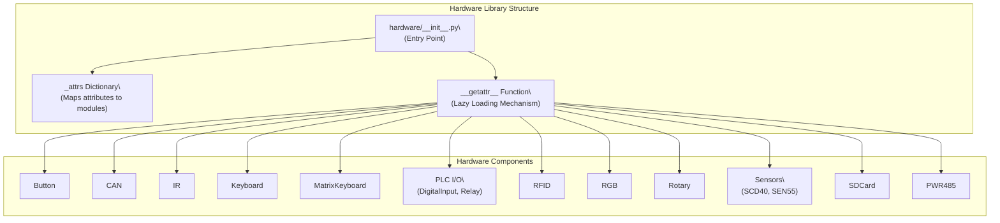
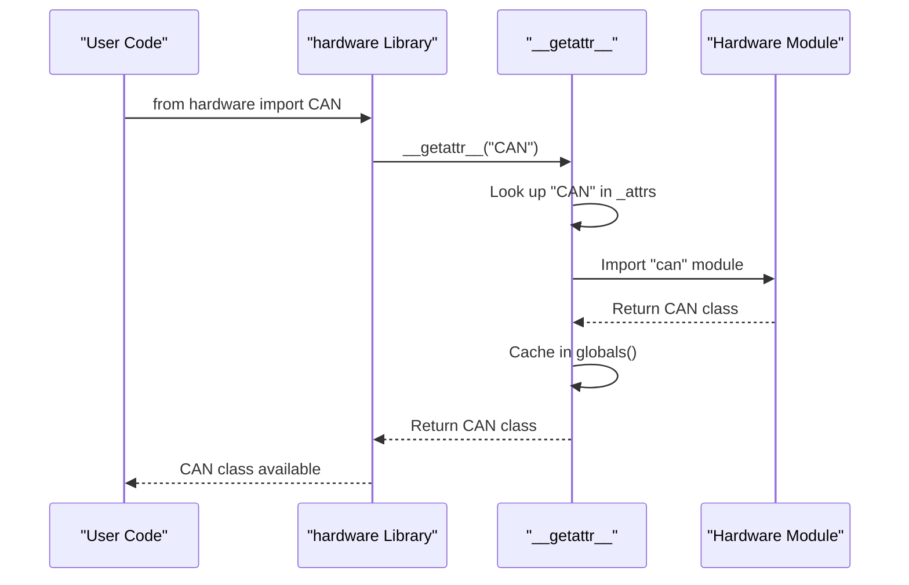
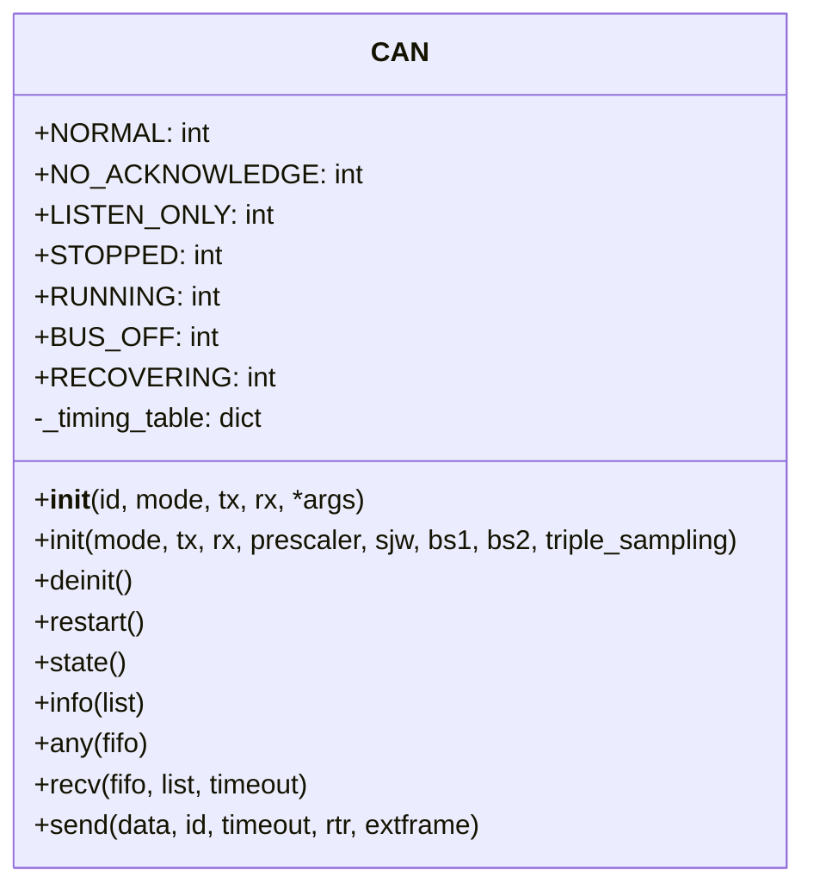
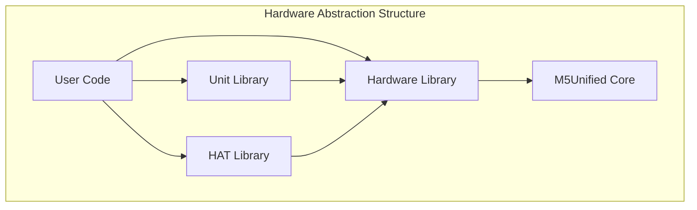

# Hardware Library

<details>
<summary>Relevant source files</summary>

The following files were used as context for generating this wiki page:

- [docs/en/hardware/can.rst](docs/en/hardware/can.rst)
- [docs/en/refs/system.bleuart.client.ref](docs/en/refs/system.bleuart.client.ref)
- [docs/en/refs/system.bleuart.ref](docs/en/refs/system.bleuart.ref)
- [docs/en/refs/system.bleuart.server.ref](docs/en/refs/system.bleuart.server.ref)
- [docs/en/system/bleuart.client.rst](docs/en/system/bleuart.client.rst)
- [docs/en/system/bleuart.rst](docs/en/system/bleuart.rst)
- [m5stack/libs/driver/tca8418.py](m5stack/libs/driver/tca8418.py)
- [m5stack/libs/hardware/__init__.py](m5stack/libs/hardware/__init__.py)
- [m5stack/libs/hardware/ir.py](m5stack/libs/hardware/ir.py)
- [m5stack/libs/hardware/keyboard/__init__.py](m5stack/libs/hardware/keyboard/__init__.py)
- [m5stack/libs/hardware/keyboard/asciimap.py](m5stack/libs/hardware/keyboard/asciimap.py)
- [m5stack/libs/hardware/manifest.py](m5stack/libs/hardware/manifest.py)
- [m5stack/libs/hardware/matrix_keyboard.py](m5stack/libs/hardware/matrix_keyboard.py)
- [m5stack/libs/hardware/plcio.py](m5stack/libs/hardware/plcio.py)
- [m5stack/libs/hardware/sht30.py](m5stack/libs/hardware/sht30.py)
- [m5stack/libs/unit/cardkb.py](m5stack/libs/unit/cardkb.py)

</details>


The Hardware Library provides interfaces to core hardware components available across M5Stack devices. This library is part of the Hardware Abstraction Layer system, providing direct interfaces to fundamental hardware functionality such as CAN bus communication, button inputs, keyboards, sensors, and I/O modules. Unlike the [Unit Library](#2.1) which handles external attachable units or the [HAT Library](#2.2) for hardware attached on top, this library focuses on core built-in hardware functionality.

## Library Architecture

The Hardware Library implements a lazy loading pattern to efficiently manage memory usage on resource-constrained M5Stack devices.



Sources: [m5stack/libs/hardware/__init__.py:5-20](https://github.com/m5stack/uiflow-micropython/blob/7af4551a/m5stack/libs/hardware/__init__.py#L5-L20), [m5stack/libs/hardware/manifest.py:5-26](https://github.com/m5stack/uiflow-micropython/blob/7af4551a/m5stack/libs/hardware/manifest.py#L5-L26)

## Lazy Loading Mechanism

The Hardware Library uses a dynamic module loading system to optimize memory usage, only importing modules when they are actually requested.



Sources: [m5stack/libs/hardware/__init__.py:23-41](https://github.com/m5stack/uiflow-micropython/blob/7af4551a/m5stack/libs/hardware/__init__.py#L23-L41)

## Available Hardware Components

The Hardware Library provides access to the following components:

| Component | Description | Module Path |
|-----------|-------------|-------------|
| `Button` | Interface for button input | hardware/button.py |
| `CAN` | Controller Area Network communication | hardware/can.py |
| `IR` | Infrared communication | hardware/ir.py |
| `Keyboard` | Keyboard input handling | hardware/keyboard/__init__.py |
| `MatrixKeyboard` | Matrix keyboard interface | hardware/matrix_keyboard.py |
| `DigitalInput` | PLC digital input interface | hardware/plcio.py |
| `Relay` | PLC relay control | hardware/plcio.py |
| `PWR485` | RS-485 communication interface | hardware/pwr485.py |
| `RFID` | RFID communication | hardware/rfid.py |
| `RGB` | RGB LED control | hardware/rgb.py |
| `Rotary` | Rotary encoder interface | hardware/rotary.py |
| `SCD40` | SCD40 CO2 sensor interface | hardware/scd40.py |
| `SDCard` | SD card interface | hardware/sdcard.py |
| `SEN55` | SEN55 environmental sensor | hardware/sen55.py |

Sources: [m5stack/libs/hardware/__init__.py:5-20](https://github.com/m5stack/uiflow-micropython/blob/7af4551a/m5stack/libs/hardware/__init__.py#L5-L20), [m5stack/libs/hardware/manifest.py:5-26](https://github.com/m5stack/uiflow-micropython/blob/7af4551a/m5stack/libs/hardware/manifest.py#L5-L26)

## Key Components in Detail

### CAN (Controller Area Network)

The CAN module provides a communication interface using the CAN bus protocol, which is commonly used in automotive and industrial applications for robust communication between devices.



The CAN class implements support for classic CAN controllers and provides methods for sending and receiving messages on the CAN bus. It supports various modes of operation and bit timing parameters.

Sources: [m5stack/libs/hardware/can.py:12-48](https://github.com/m5stack/uiflow-micropython/blob/7af4551a/m5stack/libs/hardware/can.py#L12-L48), [docs/en/hardware/can.rst:1-232](https://github.com/m5stack/uiflow-micropython/blob/7af4551a/docs/en/hardware/can.rst#L1-L232)

### PLC I/O (DigitalInput and Relay)

The PLC I/O module provides interfaces for Programmable Logic Controller functionality, specifically for digital inputs and relay controls. This is particularly useful for industrial automation applications.

```mermaid
classDiagram
    class DigitalInput {
        -_pin_map: dict
        +__init__(id)
        +get_status() bool
    }
    
    class Relay {
        -_pin_map: dict
        +__init__(id)
        +get_status() bool
        +set_status(status)
    }
    
    DigitalInput --|> "aw9523.Pin"
    Relay --|> "aw9523.Pin"
```

The `DigitalInput` class is used to read the status of digital inputs, while the `Relay` class provides control over relay outputs. Both classes are built on top of the AW9523 I/O expander driver.

Sources: [m5stack/libs/hardware/plcio.py:24-91](https://github.com/m5stack/uiflow-micropython/blob/7af4551a/m5stack/libs/hardware/plcio.py#L24-L91)

## Usage Examples

### Using the CAN Interface

```python
from hardware import CAN

# Initialize CAN with baudrate 125000
can = CAN(0, CAN.NORMAL, tx_pin, rx_pin, 125000)

# Send a message with ID 123
can.send('message!', 123)

# Receive a message
msg = can.recv(0)
```

Sources: [docs/en/hardware/can.rst:15-18](https://github.com/m5stack/uiflow-micropython/blob/7af4551a/docs/en/hardware/can.rst#L15-L18)

### Using PLC I/O

```python
from hardware import DigitalInput, Relay

# Initialize digital input 1
digital_input = DigitalInput(1)

# Read the status of the digital input
status = digital_input.get_status()

# Initialize relay 2
relay = Relay(2)

# Control the relay
relay.set_status(True)  # Turn on
relay.set_status(False)  # Turn off
```

Sources: [m5stack/libs/hardware/plcio.py:46-52](https://github.com/m5stack/uiflow-micropython/blob/7af4551a/m5stack/libs/hardware/plcio.py#L46-L52), [m5stack/libs/hardware/plcio.py:72-86](https://github.com/m5stack/uiflow-micropython/blob/7af4551a/m5stack/libs/hardware/plcio.py#L72-L86)

## Integration with Other Libraries

The Hardware Library serves as a foundational layer for higher-level libraries in the M5Stack ecosystem. For example, the [Unit Library](#2.1) builds upon the Hardware Library to provide interfaces for external hardware units. The CAN functionality in the Hardware Library is directly used by the CANUnit in the Unit Library.



Sources: [m5stack/libs/unit/can.py:12-55](https://github.com/m5stack/uiflow-micropython/blob/7af4551a/m5stack/libs/unit/can.py#L12-L55), [docs/en/units/can.rst:89-89](https://github.com/m5stack/uiflow-micropython/blob/7af4551a/docs/en/units/can.rst#L89-L89)

## Summary

The Hardware Library provides essential interfaces to core hardware components on M5Stack devices. Through its lazy loading mechanism, it efficiently manages memory usage while providing a comprehensive API for interacting with hardware features. This library serves as a foundation for higher-level libraries and enables direct control of hardware functionality in user applications.