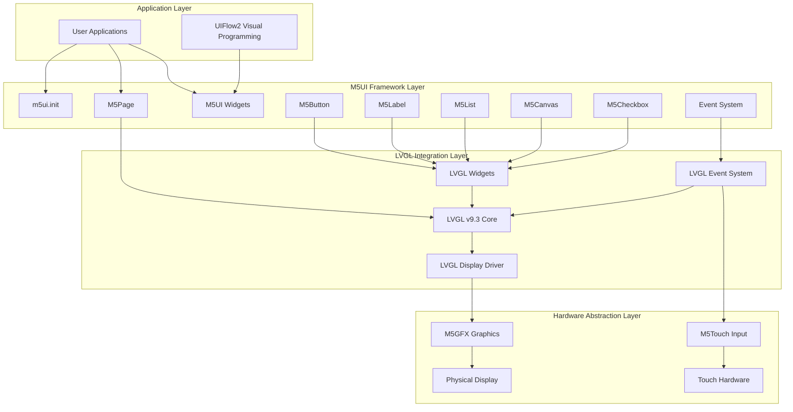
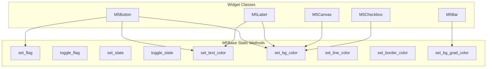
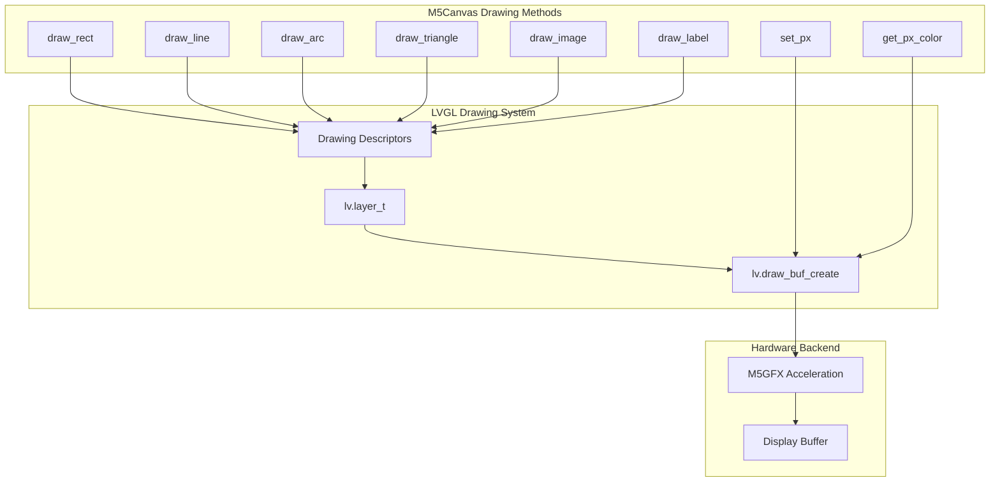
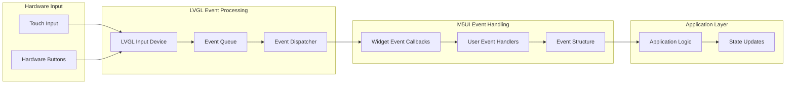

# User Interface Framework

<details>
<summary>Relevant source files</summary>

The following files were used as context for generating this wiki page:

- [docs/en/m5ui/bar.rst](docs/en/m5ui/bar.rst)
- [docs/en/m5ui/index.rst](docs/en/m5ui/index.rst)
- [docs/en/refs/m5ui.bar.ref](docs/en/refs/m5ui.bar.ref)
- [docs/locales/zh_CN/LC_MESSAGES/m5ui/bar.po](docs/locales/zh_CN/LC_MESSAGES/m5ui/bar.po)
- [examples/m5ui/bar/cores3_temperature_meter_example.m5f2](examples/m5ui/bar/cores3_temperature_meter_example.m5f2)
- [examples/m5ui/bar/cores3_temperature_meter_example.py](examples/m5ui/bar/cores3_temperature_meter_example.py)
- [m5stack/_vfs_stream.c](m5stack/_vfs_stream.c)
- [m5stack/_vfs_stream.h](m5stack/_vfs_stream.h)
- [m5stack/board.h](m5stack/board.h)
- [m5stack/cmodules/adf_module/vfs_stream.h](m5stack/cmodules/adf_module/vfs_stream.h)
- [m5stack/cmodules/lv_utils/modlv_utils.c](m5stack/cmodules/lv_utils/modlv_utils.c)
- [m5stack/cmodules/m5audio2/m5audio2.cmake](m5stack/cmodules/m5audio2/m5audio2.cmake)
- [m5stack/cmodules/m5unified/README.md](m5stack/cmodules/m5unified/README.md)
- [m5stack/cmodules/m5unified/m5unified_gfx.c](m5stack/cmodules/m5unified/m5unified_gfx.c)
- [m5stack/cmodules/m5unified/m5unified_imu.c](m5stack/cmodules/m5unified/m5unified_imu.c)
- [m5stack/cmodules/m5unified/m5unified_power.c](m5stack/cmodules/m5unified/m5unified_power.c)
- [m5stack/cmodules/m5unified/m5unified_touch.c](m5stack/cmodules/m5unified/m5unified_touch.c)
- [m5stack/cmodules/m5unified/m5unified_widgets.c](m5stack/cmodules/m5unified/m5unified_widgets.c)
- [m5stack/components/M5Unified/mpy_gfx_stream.c](m5stack/components/M5Unified/mpy_gfx_stream.c)
- [m5stack/components/M5Unified/mpy_m5gfx.cpp](m5stack/components/M5Unified/mpy_m5gfx.cpp)
- [m5stack/components/M5Unified/mpy_m5gfx.h](m5stack/components/M5Unified/mpy_m5gfx.h)
- [m5stack/components/M5Unified/mpy_m5imu.cpp](m5stack/components/M5Unified/mpy_m5imu.cpp)
- [m5stack/components/M5Unified/mpy_m5imu.h](m5stack/components/M5Unified/mpy_m5imu.h)
- [m5stack/components/M5Unified/mpy_m5lfs2.txt](m5stack/components/M5Unified/mpy_m5lfs2.txt)
- [m5stack/components/M5Unified/mpy_m5power.cpp](m5stack/components/M5Unified/mpy_m5power.cpp)
- [m5stack/components/M5Unified/mpy_m5touch.cpp](m5stack/components/M5Unified/mpy_m5touch.cpp)
- [m5stack/components/M5Unified/mpy_m5widgets.cpp](m5stack/components/M5Unified/mpy_m5widgets.cpp)
- [m5stack/components/M5Unified/mpy_user_lcd.txt](m5stack/components/M5Unified/mpy_user_lcd.txt)
- [m5stack/libs/m5ui/__init__.py](m5stack/libs/m5ui/__init__.py)
- [m5stack/libs/m5ui/bar.py](m5stack/libs/m5ui/bar.py)
- [m5stack/libs/m5ui/base.py](m5stack/libs/m5ui/base.py)
- [m5stack/libs/m5ui/button.py](m5stack/libs/m5ui/button.py)
- [m5stack/libs/m5ui/canvas.py](m5stack/libs/m5ui/canvas.py)
- [m5stack/libs/m5ui/checkbox.py](m5stack/libs/m5ui/checkbox.py)
- [m5stack/libs/m5ui/label.py](m5stack/libs/m5ui/label.py)
- [m5stack/libs/m5ui/manifest.py](m5stack/libs/m5ui/manifest.py)
- [m5stack/libs/m5ui/page.py](m5stack/libs/m5ui/page.py)
- [m5stack/patches/2003-Support-LTR553.patch](m5stack/patches/2003-Support-LTR553.patch)
- [tests/display/user_lcd.py](tests/display/user_lcd.py)
- [tests/m5ui/test_bar.py](tests/m5ui/test_bar.py)

</details>


The User Interface Framework provides a comprehensive graphical user interface system for M5Stack devices, built on top of the LVGL graphics library. This framework enables developers to create interactive applications with pages, widgets, and event handling through a Python API that abstracts the complexity of low-level graphics operations.

For low-level graphics operations and display management, see [Graphics and Display System](#3.2). For hardware abstraction of displays and input devices, see [M5Unified Hardware Abstraction](#4.1).

## Architecture Overview

The UI framework operates as a three-tier system, with M5UI serving as the highest-level abstraction for application developers.

### UI Framework Architecture



Sources: [docs/en/m5ui/index.rst:1-36](https://github.com/m5stack/uiflow-micropython/blob/7af4551a/docs/en/m5ui/index.rst#L1-L36), [m5stack/libs/m5ui/__init__.py:1-40](https://github.com/m5stack/uiflow-micropython/blob/7af4551a/m5stack/libs/m5ui/__init__.py#L1-L40)

The framework follows a strict layering approach where applications interact exclusively with M5UI components, which internally delegate to LVGL primitives. This design ensures compatibility warnings exist when mixing different UI layers, as noted in the documentation's usage tips.

### Dynamic Loading System

The M5UI library implements a sophisticated dynamic loading mechanism that reduces memory footprint by loading widgets only when accessed.

```mermaid
graph LR
    subgraph "Import Process"
        USER_IMPORT["from m5ui import M5Button"]
        M5UI_INIT[m5ui.__init__.py]
        GETATTR["__getattr__('M5Button')"]
    end
    
    subgraph "Attribute Resolution"
        ATTRS_MAP["_attrs mapping"]
        MODULE_NAME["'button'"]
        IMPORT_MODULE["__import__('button')"]
    end
    
    subgraph "Widget Loading"
        BUTTON_MODULE[button.py]
        M5BUTTON_CLASS[M5Button class]
        CACHE_GLOBAL["globals()['M5Button']"]
    end
    
    USER_IMPORT --> M5UI_INIT
    M5UI_INIT --> GETATTR
    GETATTR --> ATTRS_MAP
    ATTRS_MAP --> MODULE_NAME
    MODULE_NAME --> IMPORT_MODULE
    IMPORT_MODULE --> BUTTON_MODULE
    BUTTON_MODULE --> M5BUTTON_CLASS
    M5BUTTON_CLASS --> CACHE_GLOBAL
```



Sources: [m5stack/libs/m5ui/__init__.py:33-39](https://github.com/m5stack/uiflow-micropython/blob/7af4551a/m5stack/libs/m5ui/__init__.py#L33-L39), [m5stack/libs/m5ui/manifest.py:5-36](https://github.com/m5stack/uiflow-micropython/blob/7af4551a/m5stack/libs/m5ui/manifest.py#L5-L36)

The `_attrs` dictionary in [m5stack/libs/m5ui/__init__.py:5-30]() maps public class names to their corresponding module files, enabling the `__getattr__` method to dynamically import and cache widgets on first access.

## Core Components

### Initialization and Port Interface

The framework requires initialization through `m5ui.init()` before use, handled by the port module.

| Function | Purpose | Implementation |
|----------|---------|----------------|
| `m5ui.init()` | Initialize LVGL and M5UI system | [m5stack/libs/m5ui/port.py]() |
| `m5ui.deinit()` | Clean up resources | [m5stack/libs/m5ui/port.py]() |

Sources: [docs/en/m5ui/index.rst:41-52](https://github.com/m5stack/uiflow-micropython/blob/7af4551a/docs/en/m5ui/index.rst#L41-L52), [m5stack/libs/m5ui/__init__.py:6-7](https://github.com/m5stack/uiflow-micropython/blob/7af4551a/m5stack/libs/m5ui/__init__.py#L6-L7)

### M5Base Utility Framework

The `M5Base` class provides common functionality shared across all UI widgets through static methods.



Sources: [m5stack/libs/m5ui/base.py:9-171](https://github.com/m5stack/uiflow-micropython/blob/7af4551a/m5stack/libs/m5ui/base.py#L9-L171)

Each widget class implements `__getattr__` to dynamically bind M5Base methods, providing consistent styling and state management APIs across all components. The implementation in [m5stack/libs/m5ui/base.py:61-75]() demonstrates the color conversion and opacity handling pattern used throughout the framework.

## Widget System

### Widget Hierarchy

The M5UI library provides 20+ widget types, each inheriting from corresponding LVGL base classes while adding M5Stack-specific functionality.

| Widget Class | LVGL Base | Primary Purpose | Key Features |
|--------------|-----------|-----------------|--------------|
| `M5Page` | `lv.obj` | Screen container | Background management, screen loading |
| `M5Button` | `lv.button` | Interactive buttons | Text, events, visual effects |
| `M5Label` | `lv.label` | Text display | Shadow effects, font management |
| `M5List` | `lv.list` | Item containers | Dynamic button/text addition |
| `M5Canvas` | `lv.canvas` | Custom drawing | Shapes, images, pixel operations |
| `M5Bar` | `lv.bar` | Progress indicators | Value display, gradients |
| `M5Checkbox` | `lv.checkbox` | Boolean input | State management, styling |

Sources: [m5stack/libs/m5ui/manifest.py:7-32](https://github.com/m5stack/uiflow-micropython/blob/7af4551a/m5stack/libs/m5ui/manifest.py#L7-L32), [m5stack/libs/m5ui/page.py:9-59](https://github.com/m5stack/uiflow-micropython/blob/7af4551a/m5stack/libs/m5ui/page.py#L9-L59), [m5stack/libs/m5ui/button.py:9-176](https://github.com/m5stack/uiflow-micropython/blob/7af4551a/m5stack/libs/m5ui/button.py#L9-L176)

### Page Management

The `M5Page` class serves as the root container for UI applications, managing screen-level properties and transitions.

```python
# Page creation and activation pattern
page0 = m5ui.M5Page(bg_c=0xFFFFFF)
page0.screen_load()  # Activates as current screen
```

Sources: [m5stack/libs/m5ui/page.py:29-46](https://github.com/m5stack/uiflow-micropython/blob/7af4551a/m5stack/libs/m5ui/page.py#L29-L46), [examples/m5ui/list/cores3_list_example.py:83-88](https://github.com/m5stack/uiflow-micropython/blob/7af4551a/examples/m5ui/list/cores3_list_example.py#L83-L88)

The `screen_load()` method in [m5stack/libs/m5ui/page.py:33-46]() delegates to LVGL's screen management system, enabling multiple page applications with seamless transitions.

### Advanced Drawing with M5Canvas

The `M5Canvas` widget provides comprehensive 2D drawing capabilities with hardware acceleration through LVGL's drawing engine.



Sources: [m5stack/libs/m5ui/canvas.py:133-481](https://github.com/m5stack/uiflow-micropython/blob/7af4551a/m5stack/libs/m5ui/canvas.py#L133-L481)

The canvas implementation in [m5stack/libs/m5ui/canvas.py:38-45]() creates a drawing buffer with configurable color formats and maintains drawing layer state for complex graphics operations.

## Event System

### Event Handling Architecture

The framework implements a unified event system that bridges user interactions to application callbacks through LVGL's event mechanism.



Sources: [examples/m5ui/list/cores3_list_example.py:45-96](https://github.com/m5stack/uiflow-micropython/blob/7af4551a/examples/m5ui/list/cores3_list_example.py#L45-L96)

### Event Registration Pattern

The standard pattern for event handling involves registering callbacks that receive event structures containing context information.

```python
# Event handler registration pattern from examples
def button_event_handler(event_struct):
    event = event_struct.code
    if event == lv.EVENT.CLICKED:
        # Handle click event
        print("Button clicked")

button.add_event_cb(button_event_handler, lv.EVENT.ALL, None)
```

Sources: [examples/m5ui/list/cores3_list_example.py:21-96](https://github.com/m5stack/uiflow-micropython/blob/7af4551a/examples/m5ui/list/cores3_list_example.py#L21-L96)

The event handling pattern in [examples/m5ui/list/cores3_list_example.py:45-74]() demonstrates the recommended approach of checking event codes within handlers to support multiple event types with single callback functions.

## Integration Points

### LVGL Compatibility

M5UI maintains full compatibility with LVGL v9.3 APIs while adding convenience methods and M5Stack-specific optimizations.

| Integration Aspect | Implementation | Benefits |
|-------------------|----------------|----------|
| Widget Inheritance | Direct subclassing of LVGL widgets | Full API compatibility |
| Event System | Pass-through to LVGL events | No performance overhead |
| Styling | Extension of LVGL style system | Enhanced ease of use |
| Drawing | LVGL drawing primitives | Hardware acceleration |

Sources: [docs/en/m5ui/index.rst:25-35](https://github.com/m5stack/uiflow-micropython/blob/7af4551a/docs/en/m5ui/index.rst#L25-L35), [m5stack/libs/m5ui/base.py:68-74](https://github.com/m5stack/uiflow-micropython/blob/7af4551a/m5stack/libs/m5ui/base.py#L68-L74)

### Resource Management

The framework implements automatic resource cleanup and memory management through proper initialization and deinitialization sequences.

```python
# Recommended application structure
try:
    m5ui.init()
    # Create UI components
    # Application main loop
except (Exception, KeyboardInterrupt) as e:
    m5ui.deinit()  # Clean shutdown
```

Sources: [examples/m5ui/list/cores3_list_example.py:110-122](https://github.com/m5stack/uiflow-micropython/blob/7af4551a/examples/m5ui/list/cores3_list_example.py#L110-L122)

The cleanup pattern in [examples/m5ui/list/cores3_list_example.py:115-121]() ensures proper resource deallocation and graceful handling of application termination scenarios.