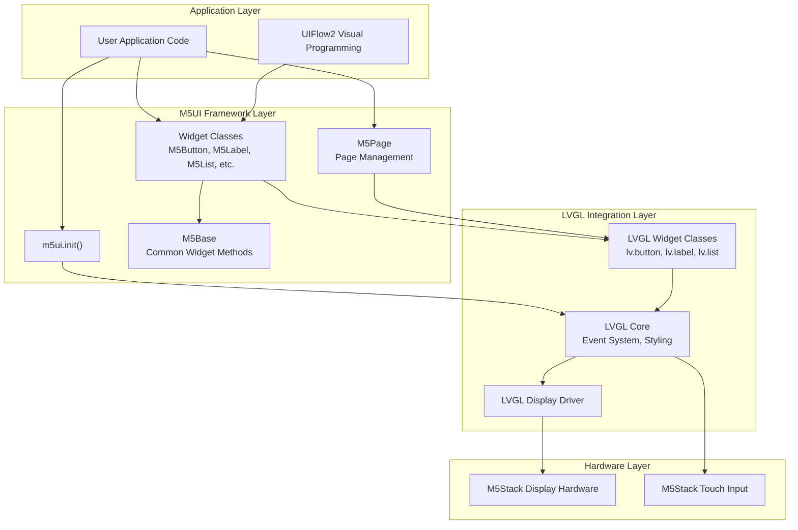
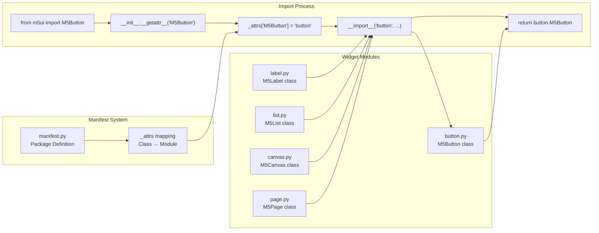
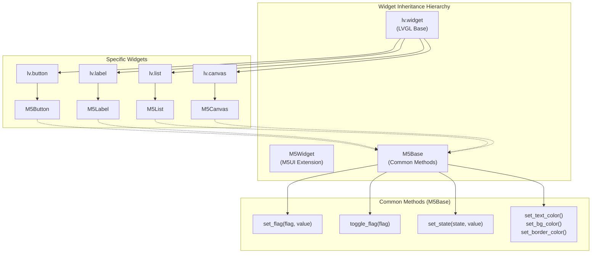
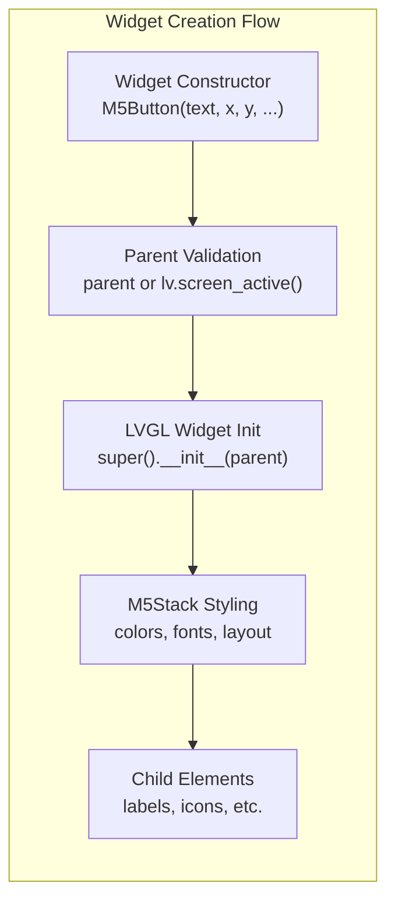
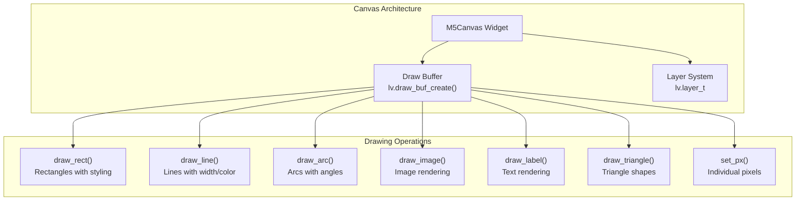
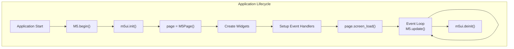

# M5UI Library

Relevant source files

The following files were used as context for generating this wiki page:

- [docs/en/m5ui/bar.rst](docs/en/m5ui/bar.rst)
- [docs/en/m5ui/index.rst](docs/en/m5ui/index.rst)
- [docs/en/refs/m5ui.bar.ref](docs/en/refs/m5ui.bar.ref)
- [docs/locales/zh_CN/LC_MESSAGES/m5ui/bar.po](docs/locales/zh_CN/LC_MESSAGES/m5ui/bar.po)
- [examples/m5ui/bar/cores3_temperature_meter_example.m5f2](examples/m5ui/bar/cores3_temperature_meter_example.m5f2)
- [examples/m5ui/bar/cores3_temperature_meter_example.py](examples/m5ui/bar/cores3_temperature_meter_example.py)
- [m5stack/libs/m5ui/__init__.py](m5stack/libs/m5ui/__init__.py)
- [m5stack/libs/m5ui/bar.py](m5stack/libs/m5ui/bar.py)
- [m5stack/libs/m5ui/base.py](m5stack/libs/m5ui/base.py)
- [m5stack/libs/m5ui/button.py](m5stack/libs/m5ui/button.py)
- [m5stack/libs/m5ui/canvas.py](m5stack/libs/m5ui/canvas.py)
- [m5stack/libs/m5ui/checkbox.py](m5stack/libs/m5ui/checkbox.py)
- [m5stack/libs/m5ui/label.py](m5stack/libs/m5ui/label.py)
- [m5stack/libs/m5ui/manifest.py](m5stack/libs/m5ui/manifest.py)
- [m5stack/libs/m5ui/page.py](m5stack/libs/m5ui/page.py)
- [tests/m5ui/test_bar.py](tests/m5ui/test_bar.py)

The M5UI Library is a high-level user interface framework built on LVGL v9.3 that provides a comprehensive widget system and page management for M5Stack devices. It offers a unified programming model for creating interactive graphical applications with multi-widget layouts, event handling, and visual styling capabilities.

This document covers the M5UI framework's architecture, widget system, and usage patterns. For low-level graphics operations, see [Graphics and Display System](#3.2). For hardware abstraction layer functionality, see [M5Unified Hardware Abstraction](#4.1).

## Architecture Overview

The M5UI Library implements a layered architecture that abstracts LVGL complexity while providing M5Stack-specific optimizations and a unified API surface.

**Framework Layers:**
- **Application Layer**: User code and UIFlow2 visual programming interface
- **M5UI Framework**: High-level widget abstractions and page management
- **LVGL Integration**: Direct LVGL widget inheritance and event handling
- **Hardware Layer**: M5Stack display and input hardware

Sources: [docs/en/m5ui/index.rst:1-36](https://github.com/m5stack/uiflow-micropython/blob/7af4551a/docs/en/m5ui/index.rst#L1-L36), [m5stack/libs/m5ui/__init__.py:1-40](https://github.com/m5stack/uiflow-micropython/blob/7af4551a/m5stack/libs/m5ui/__init__.py#L1-L40)

## Dynamic Loading System

M5UI uses the same dynamic loading pattern as other M5Stack libraries, enabling on-demand widget loading to optimize memory usage.

**Key Components:**
- **_attrs Dictionary**: Maps widget class names to their module files
- **__getattr__ Function**: Handles dynamic imports when attributes are accessed
- **Manifest System**: Defines the complete package structure

Sources: [m5stack/libs/m5ui/__init__.py:5-40](https://github.com/m5stack/uiflow-micropython/blob/7af4551a/m5stack/libs/m5ui/__init__.py#L5-L40), [m5stack/libs/m5ui/manifest.py:1-37](https://github.com/m5stack/uiflow-micropython/blob/7af4551a/m5stack/libs/m5ui/manifest.py#L1-L37)

## Core Components

### Initialization and Page Management

The M5UI system requires explicit initialization and provides a page-based application model.

| Function | Purpose | Implementation |
|----------|---------|----------------|
| `m5ui.init()` | Initialize LVGL and M5UI system | [m5stack/libs/m5ui/port.py]() |
| `m5ui.deinit()` | Cleanup M5UI resources | [m5stack/libs/m5ui/port.py]() |
| `M5Page` | Root container for UI elements | [m5stack/libs/m5ui/page.py:9-60]() |

### Base Widget Architecture

All M5UI widgets inherit from corresponding LVGL widgets and extend functionality through the `M5Base` mixin class.

**M5Base Mixin Pattern:**
Each widget implements `__getattr__` to dynamically bind M5Base methods, providing consistent styling and state management APIs across all widgets.

Sources: [m5stack/libs/m5ui/base.py:9-171](https://github.com/m5stack/uiflow-micropython/blob/7af4551a/m5stack/libs/m5ui/base.py#L9-L171), [m5stack/libs/m5ui/button.py:170-177](https://github.com/m5stack/uiflow-micropython/blob/7af4551a/m5stack/libs/m5ui/button.py#L170-L177)

## Widget System

### Available Widget Types

The M5UI Library provides a comprehensive set of UI widgets, each implementing specific interaction patterns.

| Widget Class | LVGL Base | Primary Use Case | Key Features |
|--------------|-----------|------------------|--------------|
| `M5Page` | `lv.obj` | Root container | Screen management, background styling |
| `M5Button` | `lv.button` | User interaction | Text display, event handling, effects |
| `M5Label` | `lv.label` | Text display | Shadow effects, font styling |
| `M5List` | `lv.list` | Item collections | Dynamic item addition, button/text mixing |
| `M5Canvas` | `lv.canvas` | Custom drawing | Pixel manipulation, shape drawing |
| `M5Checkbox` | `lv.checkbox` | Boolean input | State management, custom styling |
| `M5Bar` | `lv.bar` | Progress indication | Value display, gradient backgrounds |

### Widget Creation Patterns

M5UI widgets follow consistent initialization patterns with M5Stack-specific default styling:

**Common Constructor Parameters:**
- Position: `x`, `y` coordinates
- Size: `w`, `h` dimensions  
- Styling: `bg_c` (background color), `text_c` (text color)
- Content: `text`, `font` parameters
- Hierarchy: `parent` object reference

Sources: [m5stack/libs/m5ui/button.py:41-65](https://github.com/m5stack/uiflow-micropython/blob/7af4551a/m5stack/libs/m5ui/button.py#L41-L65), [m5stack/libs/m5ui/label.py:36-57](https://github.com/m5stack/uiflow-micropython/blob/7af4551a/m5stack/libs/m5ui/label.py#L36-L57)

### Advanced Widget Features

#### Canvas Drawing System

The `M5Canvas` widget provides comprehensive 2D drawing capabilities with immediate-mode rendering:

#### List Widget Composition

The `M5List` widget demonstrates M5UI's composite widget pattern, allowing dynamic addition of different element types:

**List Element Types:**
- `add_text()`: Creates `M5Label` instances with list-specific styling
- `add_button()`: Creates `M5Button` instances with icons and text
- List-specific styling: margins, padding, and layout adjustments

Sources: [m5stack/libs/m5ui/canvas.py:133-481](https://github.com/m5stack/uiflow-micropython/blob/7af4551a/m5stack/libs/m5ui/canvas.py#L133-L481), [m5stack/libs/m5ui/list.py:48-146](https://github.com/m5stack/uiflow-micropython/blob/7af4551a/m5stack/libs/m5ui/list.py#L48-L146)

## Usage Patterns and Integration

### Application Initialization Flow

M5UI applications follow a standardized initialization and event loop pattern:

### Event Handling Pattern

M5UI widgets use LVGL's event system with M5Stack-specific event handler patterns:

**Event Handler Structure:**
1. Event callback functions with `event_struct` parameter
2. Event filtering by `event_struct.code` 
3. Widget registration with `add_event_cb(handler, lv.EVENT.ALL, None)`
4. Event types: `CLICKED`, `PRESSED`, `RELEASED`, `LONG_PRESSED`

### UIFlow2 Integration

M5UI widgets are designed for seamless integration with UIFlow2 visual programming:

**Code Generation Patterns:**
- Widget creation with explicit parameter specification
- Event handler generation with standardized naming
- Automatic screen loading and update loop integration
- Block-based styling and property configuration

Sources: [examples/m5ui/list/cores3_list_example.py:77-122](https://github.com/m5stack/uiflow-micropython/blob/7af4551a/examples/m5ui/list/cores3_list_example.py#L77-L122), [docs/en/m5ui/label.rst:67-93](https://github.com/m5stack/uiflow-micropython/blob/7af4551a/docs/en/m5ui/label.rst#L67-L93)