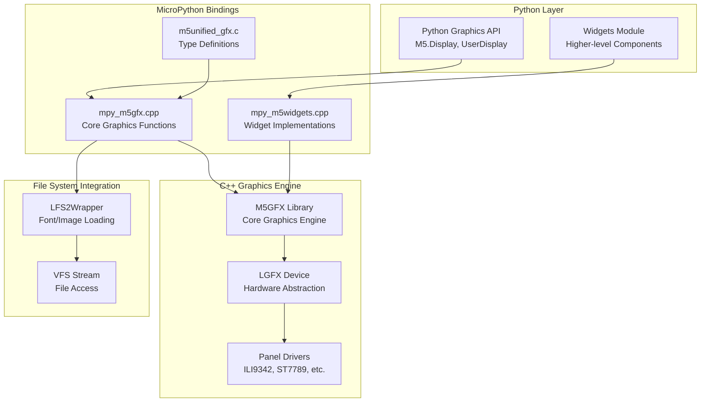
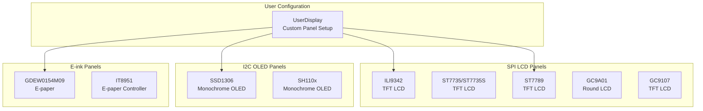
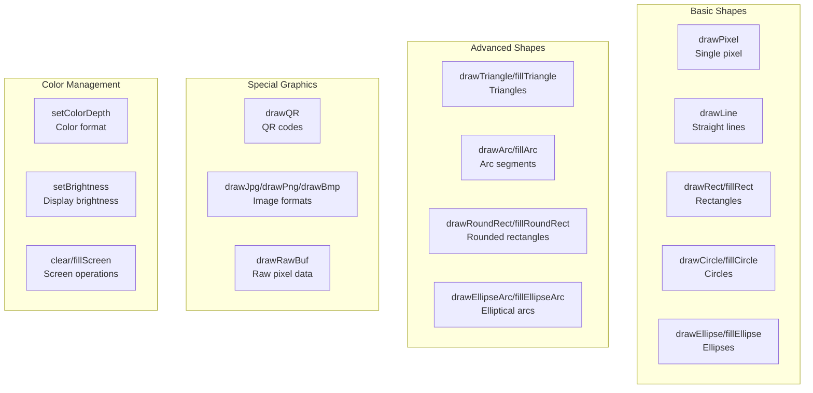
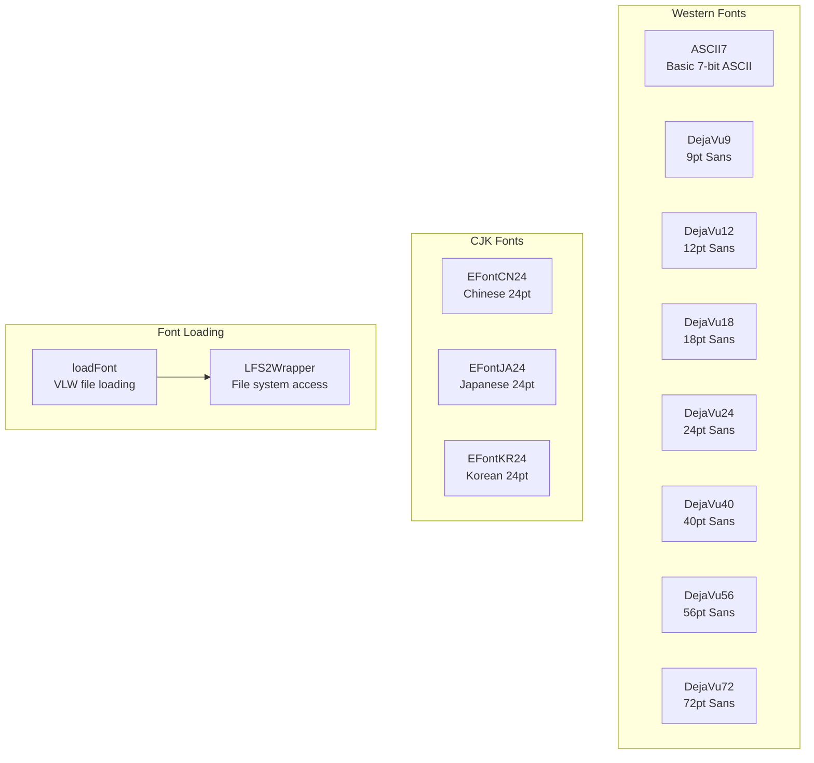
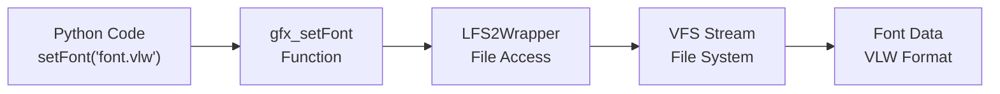
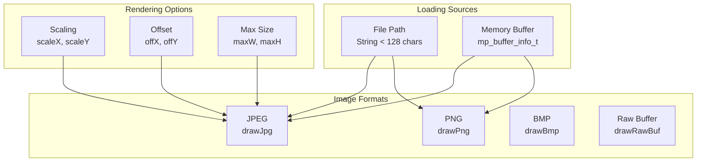
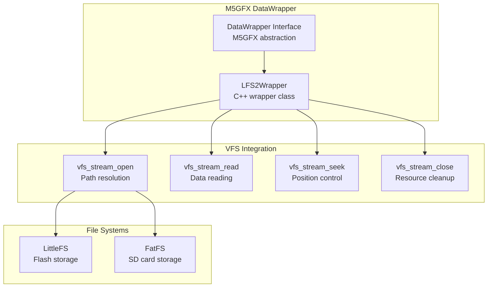
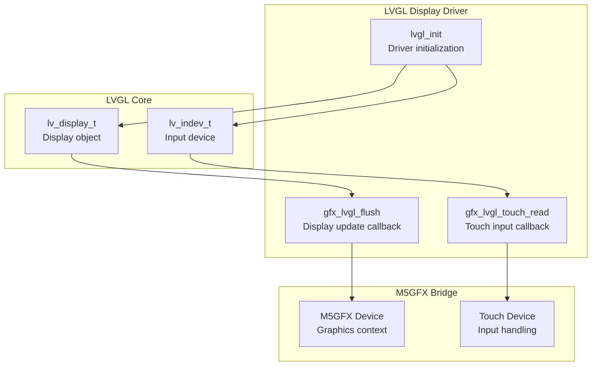
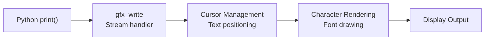

# Graphics and Display System

<details>
<summary>Relevant source files</summary>

The following files were used as context for generating this wiki page:

- [m5stack/_vfs_stream.c](m5stack/_vfs_stream.c)
- [m5stack/_vfs_stream.h](m5stack/_vfs_stream.h)
- [m5stack/board.h](m5stack/board.h)
- [m5stack/cmodules/adf_module/vfs_stream.h](m5stack/cmodules/adf_module/vfs_stream.h)
- [m5stack/cmodules/lv_utils/modlv_utils.c](m5stack/cmodules/lv_utils/modlv_utils.c)
- [m5stack/cmodules/m5audio2/m5audio2.cmake](m5stack/cmodules/m5audio2/m5audio2.cmake)
- [m5stack/cmodules/m5unified/README.md](m5stack/cmodules/m5unified/README.md)
- [m5stack/cmodules/m5unified/m5unified_gfx.c](m5stack/cmodules/m5unified/m5unified_gfx.c)
- [m5stack/cmodules/m5unified/m5unified_imu.c](m5stack/cmodules/m5unified/m5unified_imu.c)
- [m5stack/cmodules/m5unified/m5unified_power.c](m5stack/cmodules/m5unified/m5unified_power.c)
- [m5stack/cmodules/m5unified/m5unified_touch.c](m5stack/cmodules/m5unified/m5unified_touch.c)
- [m5stack/cmodules/m5unified/m5unified_widgets.c](m5stack/cmodules/m5unified/m5unified_widgets.c)
- [m5stack/components/M5Unified/mpy_gfx_stream.c](m5stack/components/M5Unified/mpy_gfx_stream.c)
- [m5stack/components/M5Unified/mpy_m5gfx.cpp](m5stack/components/M5Unified/mpy_m5gfx.cpp)
- [m5stack/components/M5Unified/mpy_m5gfx.h](m5stack/components/M5Unified/mpy_m5gfx.h)
- [m5stack/components/M5Unified/mpy_m5imu.cpp](m5stack/components/M5Unified/mpy_m5imu.cpp)
- [m5stack/components/M5Unified/mpy_m5imu.h](m5stack/components/M5Unified/mpy_m5imu.h)
- [m5stack/components/M5Unified/mpy_m5lfs2.txt](m5stack/components/M5Unified/mpy_m5lfs2.txt)
- [m5stack/components/M5Unified/mpy_m5power.cpp](m5stack/components/M5Unified/mpy_m5power.cpp)
- [m5stack/components/M5Unified/mpy_m5touch.cpp](m5stack/components/M5Unified/mpy_m5touch.cpp)
- [m5stack/components/M5Unified/mpy_m5widgets.cpp](m5stack/components/M5Unified/mpy_m5widgets.cpp)
- [m5stack/components/M5Unified/mpy_user_lcd.txt](m5stack/components/M5Unified/mpy_user_lcd.txt)
- [m5stack/patches/2003-Support-LTR553.patch](m5stack/patches/2003-Support-LTR553.patch)
- [tests/display/user_lcd.py](tests/display/user_lcd.py)

</details>


This document covers the low-level graphics bindings, display management, font handling, and drawing operations through M5GFX integration. The system provides MicroPython bindings for the M5GFX C++ graphics library, enabling direct pixel manipulation, geometric drawing, text rendering, and image display on various M5Stack devices.

For high-level UI widgets and LVGL-based applications, see [M5UI Library](#3.1). For hardware abstraction of displays and touch interfaces, see [M5Unified Hardware Abstraction](#4.1).

## System Architecture

The graphics system operates through a layered architecture that bridges MicroPython to the underlying M5GFX C++ library:



Sources: [m5stack/components/M5Unified/mpy_m5gfx.cpp:1-50](https://github.com/m5stack/uiflow-micropython/blob/7af4551a/m5stack/components/M5Unified/mpy_m5gfx.cpp#L1-L50), [m5stack/cmodules/m5unified/m5unified_gfx.c:1-100](https://github.com/m5stack/uiflow-micropython/blob/7af4551a/m5stack/cmodules/m5unified/m5unified_gfx.c#L1-L100), [m5stack/components/M5Unified/mpy_m5gfx.h:40-50](https://github.com/m5stack/uiflow-micropython/blob/7af4551a/m5stack/components/M5Unified/mpy_m5gfx.h#L40-L50)

## Display Panel Support

The system supports multiple display technologies through configurable panel types:

### Built-in Display Types



Sources: [m5stack/components/M5Unified/mpy_m5gfx.h:15-38](https://github.com/m5stack/uiflow-micropython/blob/7af4551a/m5stack/components/M5Unified/mpy_m5gfx.h#L15-L38), [m5stack/cmodules/m5unified/m5unified_gfx.c:295-310](https://github.com/m5stack/uiflow-micropython/blob/7af4551a/m5stack/cmodules/m5unified/m5unified_gfx.c#L295-L310)

### Panel Configuration Structure

The `UserDisplay` class enables custom panel configuration with comprehensive hardware setup:

| Configuration Category | Parameters | Purpose |
|------------------------|------------|---------|
| Panel Type | `panel`, `w`, `h`, `ox`, `oy` | Display identification and resolution |
| SPI Interface | `spi_host`, `sclk`, `mosi`, `dc`, `cs`, `rst` | SPI communication setup |
| I2C Interface | `i2c_host`, `sda`, `scl`, `i2c_addr` | I2C communication setup |
| Backlight | `bl`, `bl_invert`, `bl_pwm_freq` | Brightness control |
| Touch | `touch`, `tp_*` parameters | Touch panel integration |

Sources: [m5stack/components/M5Unified/mpy_user_lcd.txt:194-260](https://github.com/m5stack/uiflow-micropython/blob/7af4551a/m5stack/components/M5Unified/mpy_user_lcd.txt#L194-L260)

## Core Drawing Operations

### Basic Drawing Functions

The graphics system provides comprehensive 2D drawing primitives through MicroPython bindings:



Sources: [m5stack/components/M5Unified/mpy_m5gfx.cpp:379-846](https://github.com/m5stack/uiflow-micropython/blob/7af4551a/m5stack/components/M5Unified/mpy_m5gfx.cpp#L379-L846), [m5stack/cmodules/m5unified/m5unified_gfx.c:51-87](https://github.com/m5stack/uiflow-micropython/blob/7af4551a/m5stack/cmodules/m5unified/m5unified_gfx.c#L51-L87)

### Drawing Function Implementation Pattern

Each drawing function follows a consistent implementation pattern:

1. **Parameter Parsing** - Extract coordinates, dimensions, and optional color parameters
2. **Color Setting** - Apply color if specified, otherwise use current color  
3. **Drawing Execution** - Call underlying M5GFX method
4. **Return** - Return `mp_const_none`

Example from `gfx_drawCircle`:
```cpp
// Extract x, y, radius, optional color
// Set color if provided: gfx->setColor((uint32_t)args[ARG_color].u_int)
// Draw: gfx->drawCircle(args[ARG_x].u_int, args[ARG_y].u_int, args[ARG_r].u_int)
```

Sources: [m5stack/components/M5Unified/mpy_m5gfx.cpp:400-420](https://github.com/m5stack/uiflow-micropython/blob/7af4551a/m5stack/components/M5Unified/mpy_m5gfx.cpp#L400-L420)

## Font System

### Built-in Font Support

The system includes multiple font families with various sizes:



Sources: [m5stack/cmodules/m5unified/m5unified_gfx.c:162-187](https://github.com/m5stack/uiflow-micropython/blob/7af4551a/m5stack/cmodules/m5unified/m5unified_gfx.c#L162-L187), [m5stack/components/M5Unified/mpy_m5gfx.h:56-74](https://github.com/m5stack/uiflow-micropython/blob/7af4551a/m5stack/components/M5Unified/mpy_m5gfx.h#L56-L74)

### Font Management Functions

The font system provides comprehensive text rendering capabilities:

| Function | Purpose | Parameters |
|----------|---------|------------|
| `setFont(font)` | Set active font | Font object or file path |
| `loadFont(font)` | Load VLW font from file | File path or buffer |
| `unloadFont()` | Unload current font | None |
| `setTextColor(fg, bg)` | Set text colors | Foreground, background colors |
| `setTextSize(size)` | Set text scaling | Float scaling factor |
| `textWidth(text, font)` | Measure text width | Text string, optional font |
| `fontHeight(font)` | Get font height | Optional font |

Sources: [m5stack/components/M5Unified/mpy_m5gfx.cpp:129-300](https://github.com/m5stack/uiflow-micropython/blob/7af4551a/m5stack/components/M5Unified/mpy_m5gfx.cpp#L129-L300)

### Font Loading with VFS Integration

Font loading utilizes the VFS system for file access:



Sources: [m5stack/components/M5Unified/mpy_m5gfx.cpp:168-195](https://github.com/m5stack/uiflow-micropython/blob/7af4551a/m5stack/components/M5Unified/mpy_m5gfx.cpp#L168-L195), [m5stack/components/M5Unified/mpy_m5lfs2.txt:12-68](https://github.com/m5stack/uiflow-micropython/blob/7af4551a/m5stack/components/M5Unified/mpy_m5lfs2.txt#L12-L68)

## Image Handling

### Supported Image Formats

The system supports multiple image formats with comprehensive decoding capabilities:



Sources: [m5stack/components/M5Unified/mpy_m5gfx.cpp:806-890](https://github.com/m5stack/uiflow-micropython/blob/7af4551a/m5stack/components/M5Unified/mpy_m5gfx.cpp#L806-L890)

### Image Loading Implementation

Image functions support both file-based and memory-based loading:

1. **Path Detection** - Check if parameter is string with length < 128 (file path)
2. **File Loading** - Use `LFS2Wrapper` for file system access
3. **Buffer Loading** - Direct memory buffer processing via `mp_get_buffer_raise`
4. **Format-Specific Decoding** - Call appropriate M5GFX decoder

Sources: [m5stack/components/M5Unified/mpy_m5gfx.cpp:825-845](https://github.com/m5stack/uiflow-micropython/blob/7af4551a/m5stack/components/M5Unified/mpy_m5gfx.cpp#L825-L845)

## File System Integration

### VFS Stream Wrapper

The `LFS2Wrapper` class bridges M5GFX file operations to MicroPython's VFS:



Sources: [m5stack/components/M5Unified/mpy_m5lfs2.txt:12-68](https://github.com/m5stack/uiflow-micropython/blob/7af4551a/m5stack/components/M5Unified/mpy_m5lfs2.txt#L12-L68), [m5stack/_vfs_stream.c:67-131](https://github.com/m5stack/uiflow-micropython/blob/7af4551a/m5stack/_vfs_stream.c#L67-L131)

### File Access Modes

The VFS stream supports multiple access modes for different use cases:

| Mode | Flag Value | Usage |
|------|------------|-------|
| `VFS_READ` | 0x01 | Read-only access |
| `VFS_WRITE` | 0x02 | Write access |
| `VFS_APPEND` | 0x04 | Append mode |
| `VFS_CREATE` | 0x08 | Create new file |

Sources: [m5stack/_vfs_stream.h:25-28](https://github.com/m5stack/uiflow-micropython/blob/7af4551a/m5stack/_vfs_stream.h#L25-L28)

## LVGL Integration

### Display Driver Integration

The graphics system provides LVGL integration for advanced UI frameworks:



Sources: [m5stack/cmodules/m5unified/m5unified_gfx.c:18-25](https://github.com/m5stack/uiflow-micropython/blob/7af4551a/m5stack/cmodules/m5unified/m5unified_gfx.c#L18-L25), [m5stack/cmodules/m5unified/m5unified_gfx.c:281-291](https://github.com/m5stack/uiflow-micropython/blob/7af4551a/m5stack/cmodules/m5unified/m5unified_gfx.c#L281-L291)

### LVGL File System Bridge

LVGL can access files through the VFS system using specialized callbacks:

| Callback Function | Purpose |
|-------------------|---------|
| `lv_utils_fs_open_cb` | Open file for LVGL |
| `lv_utils_fs_read_cb` | Read data for LVGL |
| `lv_utils_fs_write_cb` | Write data for LVGL |
| `lv_utils_fs_seek_cb` | Seek position for LVGL |
| `lv_utils_fs_close_cb` | Close file for LVGL |

Sources: [m5stack/cmodules/lv_utils/modlv_utils.c:45-217](https://github.com/m5stack/uiflow-micropython/blob/7af4551a/m5stack/cmodules/lv_utils/modlv_utils.c#L45-L217)

## Stream Interface

### Graphics as Stream Device

The graphics system implements MicroPython's stream protocol, enabling `print()` and `write()` operations directly to the display:



The stream implementation handles:
- **UTF-8 Character Decoding** - Multi-byte character support
- **ANSI Escape Sequences** - Terminal control codes
- **Cursor Management** - Automatic line wrapping and positioning
- **Background Clearing** - Text area cleanup for updates

Sources: [m5stack/components/M5Unified/mpy_gfx_stream.c:15-103](https://github.com/m5stack/uiflow-micropython/blob/7af4551a/m5stack/components/M5Unified/mpy_gfx_stream.c#L15-L103), [m5stack/cmodules/m5unified/m5unified_gfx.c:378-382](https://github.com/m5stack/uiflow-micropython/blob/7af4551a/m5stack/cmodules/m5unified/m5unified_gfx.c#L378-L382)