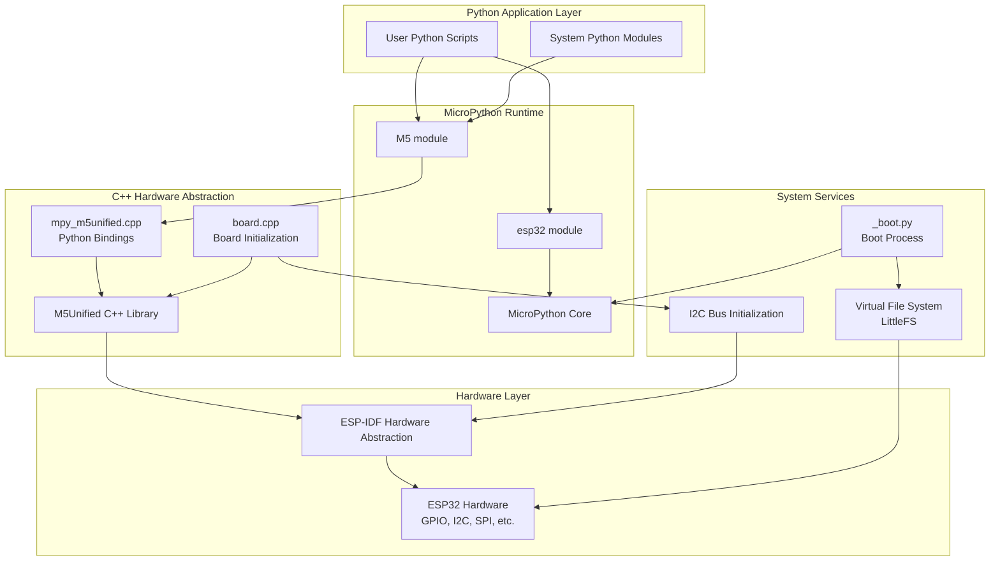
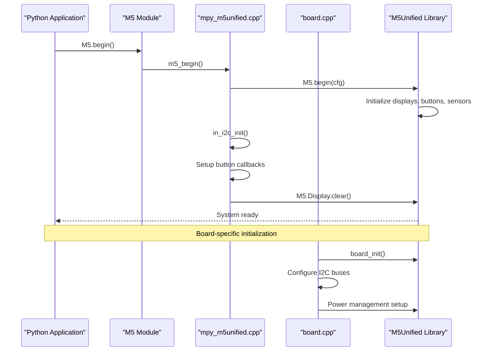
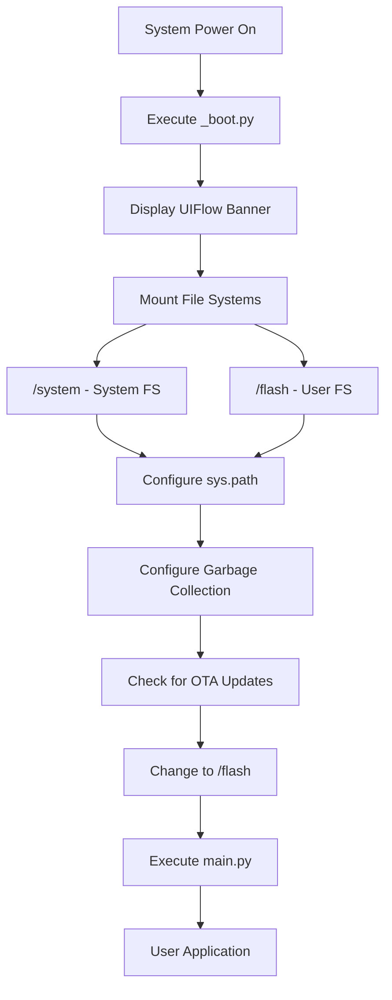
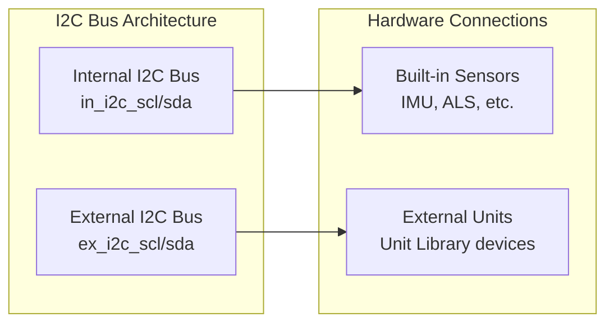
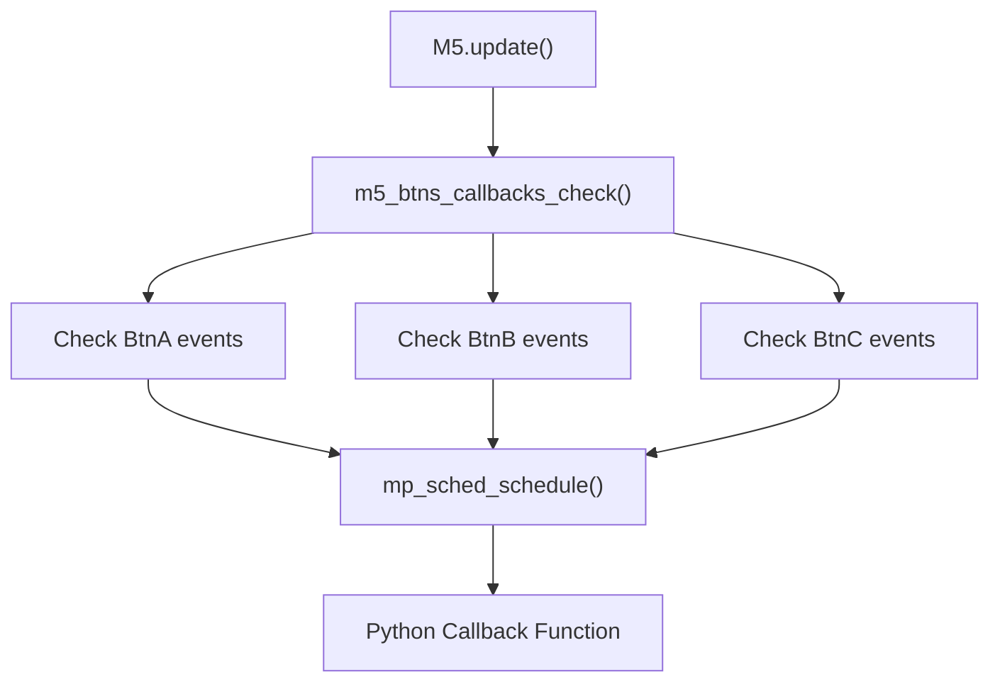

# Core System Architecture

Relevant source files

The following files were used as context for generating this wiki page:

- [m5stack/Makefile](m5stack/Makefile)
- [m5stack/board.cpp](m5stack/board.cpp)
- [m5stack/boards/M5STACK_Atom_Lite/mpconfigboard.h](m5stack/boards/M5STACK_Atom_Lite/mpconfigboard.h)
- [m5stack/boards/M5STACK_Atom_Lite/sdkconfig.board](m5stack/boards/M5STACK_Atom_Lite/sdkconfig.board)
- [m5stack/cmodules/m5unified/m5unified.c](m5stack/cmodules/m5unified/m5unified.c)
- [m5stack/cmodules/m5unified/m5unified.cmake](m5stack/cmodules/m5unified/m5unified.cmake)
- [m5stack/cmodules/m5unified/m5unified.h](m5stack/cmodules/m5unified/m5unified.h)
- [m5stack/cmodules/m5unified/m5unified_button.c](m5stack/cmodules/m5unified/m5unified_button.c)
- [m5stack/cmodules/m5unified/m5unified_speaker.c](m5stack/cmodules/m5unified/m5unified_speaker.c)
- [m5stack/cmodules/m5unified/speaker_config_t.c](m5stack/cmodules/m5unified/speaker_config_t.c)
- [m5stack/cmodules/m5unified/speaker_config_t.h](m5stack/cmodules/m5unified/speaker_config_t.h)
- [m5stack/components/M5Unified/mpy_m5btn.cpp](m5stack/components/M5Unified/mpy_m5btn.cpp)
- [m5stack/components/M5Unified/mpy_m5btn.h](m5stack/components/M5Unified/mpy_m5btn.h)
- [m5stack/components/M5Unified/mpy_m5spk.cpp](m5stack/components/M5Unified/mpy_m5spk.cpp)
- [m5stack/components/M5Unified/mpy_m5spk.h](m5stack/components/M5Unified/mpy_m5spk.h)
- [m5stack/components/M5Unified/mpy_m5unified.cpp](m5stack/components/M5Unified/mpy_m5unified.cpp)
- [m5stack/components/M5Unified/mpy_m5unified.h](m5stack/components/M5Unified/mpy_m5unified.h)
- [m5stack/libs/driver/neopixel/__init__.py](m5stack/libs/driver/neopixel/__init__.py)
- [m5stack/libs/driver/neopixel/ws2812.py](m5stack/libs/driver/neopixel/ws2812.py)
- [m5stack/libs/hardware/rgb.py](m5stack/libs/hardware/rgb.py)
- [m5stack/modesp32.c](m5stack/modesp32.c)
- [m5stack/modules/_boot.py](m5stack/modules/_boot.py)
- [m5stack/modules/startup/__init__.py](m5stack/modules/startup/__init__.py)
- [m5stack/modules/startup/atoms3.py](m5stack/modules/startup/atoms3.py)
- [m5stack/modules/startup/atoms3lite.py](m5stack/modules/startup/atoms3lite.py)
- [m5stack/modules/startup/atoms3u.py](m5stack/modules/startup/atoms3u.py)
- [m5stack/modules/startup/stamps3.py](m5stack/modules/startup/stamps3.py)
- [m5stack/patches/1001-Fix-I2C-timeout.patch](m5stack/patches/1001-Fix-I2C-timeout.patch)
- [m5stack/version.txt](m5stack/version.txt)
- [tests/display/multi_display.py](tests/display/multi_display.py)
- [tests/hardware/button_cb.py](tests/hardware/button_cb.py)
- [tests/hardware/user_speaker.py](tests/hardware/user_speaker.py)
- [third-party/CMakeListsLvgl.cmake](third-party/CMakeListsLvgl.cmake)
- [third-party/Makefile](third-party/Makefile)
- [third-party/modules/_boot.py](third-party/modules/_boot.py)
- [third-party/modules/startup/box3/apps/app_run.py](third-party/modules/startup/box3/apps/app_run.py)
- [third-party/version.txt](third-party/version.txt)

This document covers the fundamental system components that form the foundation of the M5Stack UIFlow MicroPython firmware. It describes the hardware abstraction layer, boot process, ESP32-specific features, and the overall system initialization flow. For information about the higher-level hardware abstraction libraries (Unit, Module, HAT, etc.), see [Hardware Abstraction Libraries](#2). For details about the build system and firmware assembly, see [Build and Deployment System](#5).

## System Architecture Overview

The core system is built in layers, with the M5Unified C++ library providing hardware abstraction, MicroPython bindings exposing this functionality to Python code, and a structured boot process that initializes the entire system.

**Sources: ** [m5stack/components/M5Unified/mpy_m5unified.cpp:1-643](https://github.com/m5stack/uiflow-micropython/blob/7af4551a/m5stack/components/M5Unified/mpy_m5unified.cpp#L1-L643), [m5stack/cmodules/m5unified/m5unified.c:1-137](https://github.com/m5stack/uiflow-micropython/blob/7af4551a/m5stack/cmodules/m5unified/m5unified.c#L1-L137), [m5stack/modules/_boot.py:1-59](https://github.com/m5stack/uiflow-micropython/blob/7af4551a/m5stack/modules/_boot.py#L1-L59), [m5stack/board.cpp:1-103](https://github.com/m5stack/uiflow-micropython/blob/7af4551a/m5stack/board.cpp#L1-L103)

## M5Unified Hardware Abstraction Layer

The M5Unified layer provides a unified C++ interface to all M5Stack hardware, which is then exposed to MicroPython through carefully crafted bindings. This abstraction enables consistent hardware access across different M5Stack device variants.

### Core Hardware Objects

The system exposes several key hardware objects that provide standardized interfaces:

| Object | Type | Purpose | Source File |
|--------|------|---------|-------------|
| `M5.Display` | Display/Graphics | Primary display interface | mpy_m5unified.cpp |
| `M5.BtnA/B/C` | Button | Physical button inputs | mpy_m5unified.cpp |
| `M5.Speaker` | Audio | Audio output | mpy_m5unified.cpp |
| `M5.Power` | Power Management | Battery/power control | mpy_m5unified.cpp |
| `M5.Touch` | Touch Input | Touch screen interface | mpy_m5unified.cpp |
| `M5.Imu` | Sensor | Inertial measurement unit | mpy_m5unified.cpp |

### System Initialization Flow

The `m5_begin()` function in [mpy_m5unified.cpp:456-528]() serves as the main system initialization entry point, configuring all hardware subsystems and preparing them for use by Python applications.

**Sources: ** [m5stack/components/M5Unified/mpy_m5unified.cpp:456-528](https://github.com/m5stack/uiflow-micropython/blob/7af4551a/m5stack/components/M5Unified/mpy_m5unified.cpp#L456-L528), [m5stack/board.cpp:46-54](https://github.com/m5stack/uiflow-micropython/blob/7af4551a/m5stack/board.cpp#L46-L54), [m5stack/cmodules/m5unified/m5unified.c:80-136](https://github.com/m5stack/uiflow-micropython/blob/7af4551a/m5stack/cmodules/m5unified/m5unified.c#L80-L136)

## Boot Process and System Initialization

The boot process is handled by `_boot.py`, which performs essential system setup before any user code runs. This includes file system mounting, memory management, and path configuration.

### Boot Sequence

The boot process includes several critical steps:

1. **Banner Display**: Shows the UIFlow version from [_boot.py:11-19]()
2. **File System Mounting**: Mounts system and flash partitions at [_boot.py:22-33]()
3. **Memory Management**: Sets garbage collection threshold at [_boot.py:34-35]()
4. **Path Configuration**: Adds system and library paths at [_boot.py:42-43]()
5. **OTA Handling**: Processes over-the-air updates at [_boot.py:48-58]()

### File System Layout

The system uses a dual-partition approach:
- `/system` - Read-only system files and libraries
- `/flash` - User-writable space for applications and data

**Sources: ** [m5stack/modules/_boot.py:1-59](https://github.com/m5stack/uiflow-micropython/blob/7af4551a/m5stack/modules/_boot.py#L1-L59), [third-party/modules/_boot.py:1-58](https://github.com/m5stack/uiflow-micropython/blob/7af4551a/third-party/modules/_boot.py#L1-L58)

## ESP32-Specific Features and Services

The ESP32 module provides access to chip-specific functionality including wake-up sources, power management, and hardware monitoring capabilities.

### Wake-up and Power Management

The system supports multiple wake-up sources for deep sleep functionality:

| Wake Source | Function | Configuration |
|------------|----------|---------------|
| External Pin 0 | `esp32.wake_on_ext0()` | Single pin with level trigger |
| External Pin 1 | `esp32.wake_on_ext1()` | Multiple pins with level trigger |
| Touch Pad | `esp32.wake_on_touch()` | Touch sensor wake-up |
| ULP | `esp32.wake_on_ulp()` | Ultra-low-power coprocessor |

### Hardware Monitoring

The ESP32 module exposes several hardware monitoring functions:

- `esp32.mcu_temperature()` - Internal temperature sensor (ESP32-C3/S2/S3)
- `esp32.raw_temperature()` - Raw temperature reading (ESP32 classic)
- `esp32.idf_heap_info()` - Memory heap analysis
- `esp32.firmware_info()` - Firmware metadata and version information

### Board-Specific Power Configuration

The power initialization system in [board.cpp:55-102]() configures USB and bus power output based on NVS settings, supporting different power modes for various M5Stack devices.

**Sources: ** [m5stack/modesp32.c:52-283](https://github.com/m5stack/uiflow-micropython/blob/7af4551a/m5stack/modesp32.c#L52-L283), [m5stack/board.cpp:55-102](https://github.com/m5stack/uiflow-micropython/blob/7af4551a/m5stack/board.cpp#L55-L102)

## Dynamic Module Loading Architecture

While the core system provides the foundation, it also supports dynamic loading of hardware abstraction modules. This architecture enables the lazy loading pattern used throughout the system.

### I2C Bus Management

The system initializes separate I2C buses for internal and external peripherals:

The I2C initialization in [mpy_m5unified.cpp:418-452]() and [board.cpp:14-44]() sets up these buses with appropriate pin configurations for each board type.

### Button Callback System

The core system implements an event-driven button callback mechanism that integrates with the MicroPython scheduler:

This system allows Python applications to register callback functions that are executed when button events occur, as implemented in [mpy_m5unified.cpp:582-622]().

**Sources: ** [m5stack/components/M5Unified/mpy_m5unified.cpp:418-452](https://github.com/m5stack/uiflow-micropython/blob/7af4551a/m5stack/components/M5Unified/mpy_m5unified.cpp#L418-L452), [m5stack/components/M5Unified/mpy_m5unified.cpp:582-622](https://github.com/m5stack/uiflow-micropython/blob/7af4551a/m5stack/components/M5Unified/mpy_m5unified.cpp#L582-L622), [m5stack/board.cpp:14-44](https://github.com/m5stack/uiflow-micropython/blob/7af4551a/m5stack/board.cpp#L14-L44)

## Integration with Higher-Level Systems

The core system architecture provides the foundation for higher-level abstractions. It integrates with:

- **Hardware Libraries**: The Unit, Module, HAT, and Base libraries all depend on the M5Unified foundation
- **UI Framework**: The M5UI and graphics systems build on the display abstractions
- **Communication**: Bluetooth, WiFi, and other communication modules utilize the ESP32 features
- **Build System**: The CMake and build infrastructure compiles all these components together

The modular design ensures that the core system remains stable while allowing extensive customization and expansion through the higher-level library ecosystem.

**Sources: ** [m5stack/cmodules/m5unified/m5unified.cmake:1-40](https://github.com/m5stack/uiflow-micropython/blob/7af4551a/m5stack/cmodules/m5unified/m5unified.cmake#L1-L40), [m5stack/components/M5Unified/mpy_m5unified.h:1-47](https://github.com/m5stack/uiflow-micropython/blob/7af4551a/m5stack/components/M5Unified/mpy_m5unified.h#L1-L47)