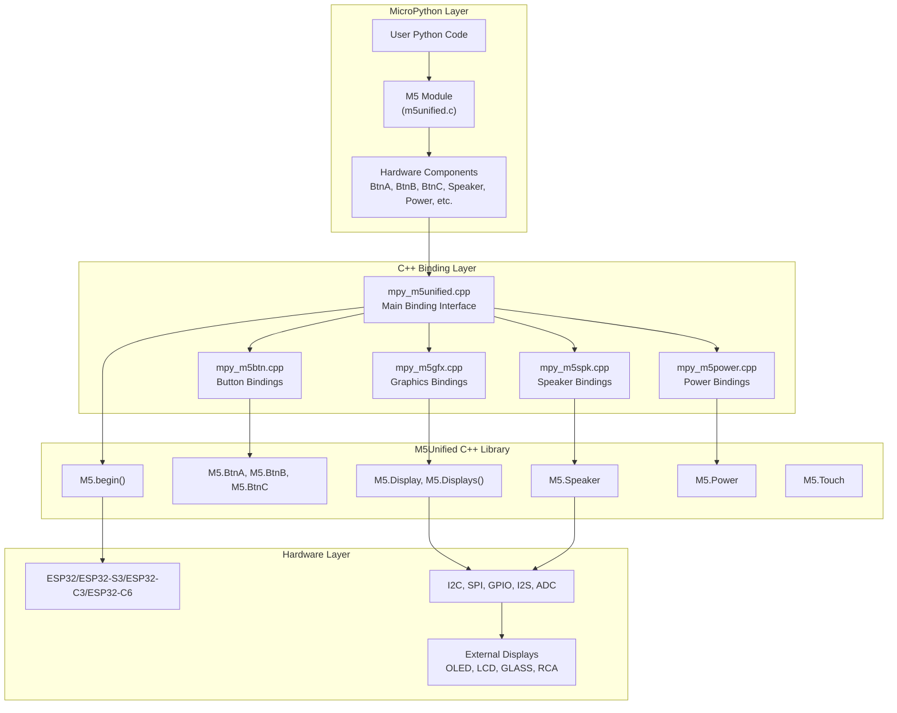
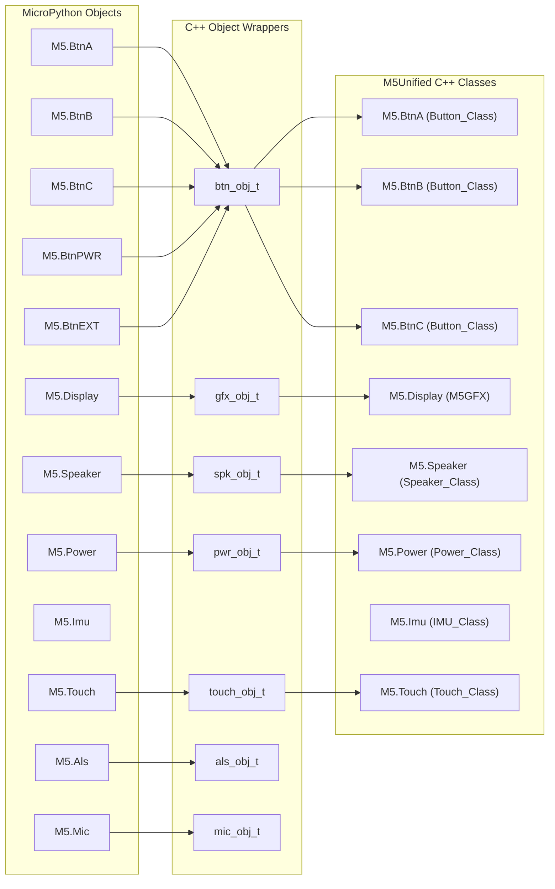
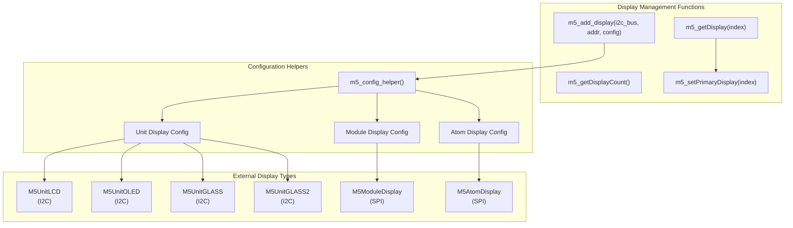
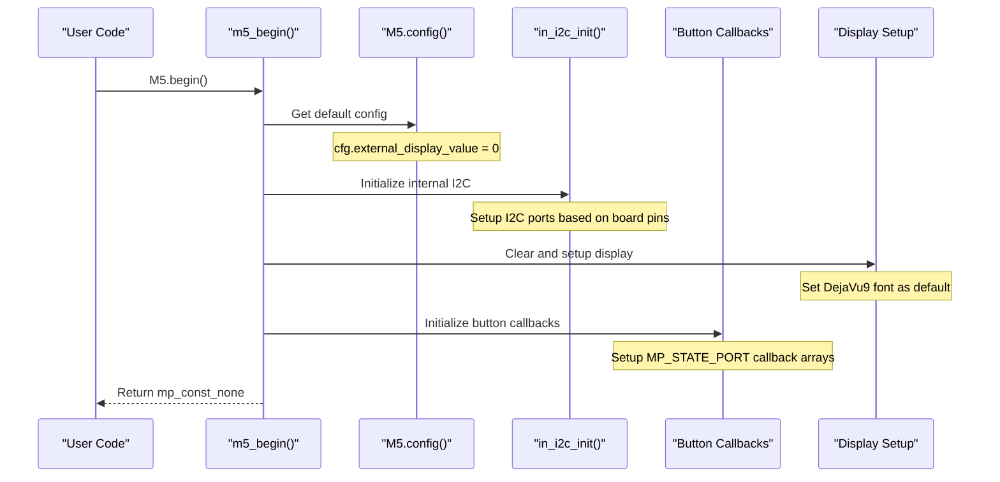
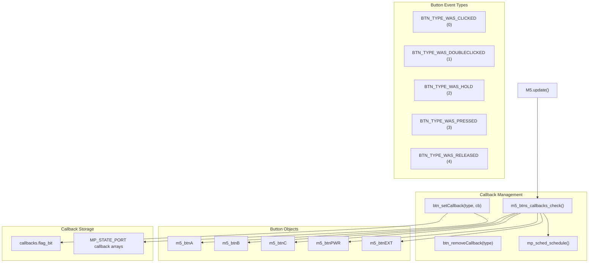
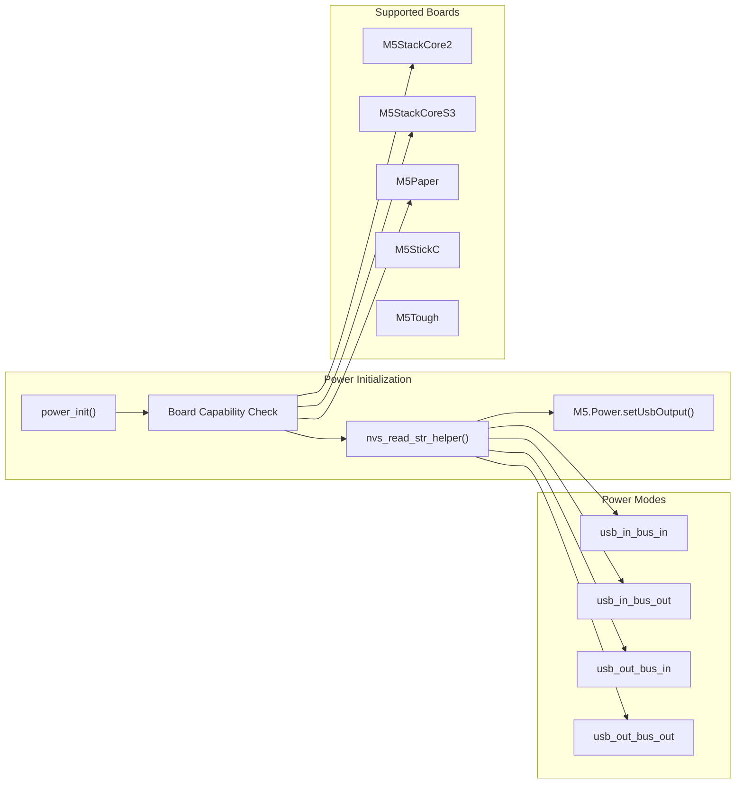

# M5Unified Hardware Abstraction

Relevant source files

The following files were used as context for generating this wiki page:

- [m5stack/board.cpp](m5stack/board.cpp)
- [m5stack/cmodules/m5unified/m5unified.c](m5stack/cmodules/m5unified/m5unified.c)
- [m5stack/cmodules/m5unified/m5unified.cmake](m5stack/cmodules/m5unified/m5unified.cmake)
- [m5stack/cmodules/m5unified/m5unified.h](m5stack/cmodules/m5unified/m5unified.h)
- [m5stack/cmodules/m5unified/m5unified_button.c](m5stack/cmodules/m5unified/m5unified_button.c)
- [m5stack/cmodules/m5unified/m5unified_speaker.c](m5stack/cmodules/m5unified/m5unified_speaker.c)
- [m5stack/cmodules/m5unified/speaker_config_t.c](m5stack/cmodules/m5unified/speaker_config_t.c)
- [m5stack/cmodules/m5unified/speaker_config_t.h](m5stack/cmodules/m5unified/speaker_config_t.h)
- [m5stack/components/M5Unified/mpy_m5btn.cpp](m5stack/components/M5Unified/mpy_m5btn.cpp)
- [m5stack/components/M5Unified/mpy_m5btn.h](m5stack/components/M5Unified/mpy_m5btn.h)
- [m5stack/components/M5Unified/mpy_m5spk.cpp](m5stack/components/M5Unified/mpy_m5spk.cpp)
- [m5stack/components/M5Unified/mpy_m5spk.h](m5stack/components/M5Unified/mpy_m5spk.h)
- [m5stack/components/M5Unified/mpy_m5unified.cpp](m5stack/components/M5Unified/mpy_m5unified.cpp)
- [m5stack/components/M5Unified/mpy_m5unified.h](m5stack/components/M5Unified/mpy_m5unified.h)
- [m5stack/patches/1001-Fix-I2C-timeout.patch](m5stack/patches/1001-Fix-I2C-timeout.patch)
- [tests/display/multi_display.py](tests/display/multi_display.py)
- [tests/hardware/button_cb.py](tests/hardware/button_cb.py)
- [tests/hardware/user_speaker.py](tests/hardware/user_speaker.py)

M5Unified Hardware Abstraction provides a unified C++ to MicroPython interface layer that abstracts hardware components across the entire M5Stack device ecosystem. This system enables consistent access to displays, buttons, sensors, audio devices, and power management regardless of the specific M5Stack hardware variant being used.

This document covers the core hardware abstraction bindings and initialization system. For graphics and display operations, see [Graphics and Display System](#3.2). For hardware-specific implementations like RGB LEDs and keyboards, see [Hardware Library](#2.4).

## Core Architecture

The M5Unified system acts as a bridge between the underlying M5Unified C++ library and MicroPython, providing device-agnostic hardware access through a consistent API surface.

**M5Unified Architecture**

Sources: [m5stack/components/M5Unified/mpy_m5unified.cpp:1-643](https://github.com/m5stack/uiflow-micropython/blob/7af4551a/m5stack/components/M5Unified/mpy_m5unified.cpp#L1-L643), [m5stack/cmodules/m5unified/m5unified.c:1-137](https://github.com/m5stack/uiflow-micropython/blob/7af4551a/m5stack/cmodules/m5unified/m5unified.c#L1-L137), [m5stack/cmodules/m5unified/m5unified.cmake:1-40](https://github.com/m5stack/uiflow-micropython/blob/7af4551a/m5stack/cmodules/m5unified/m5unified.cmake#L1-L40)

## Hardware Component Abstraction

M5Unified exposes hardware components as global singleton objects accessible through the M5 module. Each component wraps the corresponding C++ class with MicroPython bindings.

**Component Object Mapping**

| Component | MicroPython Object | C++ Wrapper Type | Purpose |
|-----------|-------------------|------------------|---------|
| Buttons | `M5.BtnA`, `M5.BtnB`, `M5.BtnC`, `M5.BtnPWR`, `M5.BtnEXT` | `btn_obj_t` | Physical button input with callback support |
| Display | `M5.Display`, `M5.Lcd` | `gfx_obj_t` | Primary display interface |
| Audio | `M5.Speaker`, `M5.Mic` | `spk_obj_t`, `mic_obj_t` | Audio output and input |
| Sensors | `M5.Imu`, `M5.Als` | `pwr_obj_t`, `als_obj_t` | Motion and ambient light sensors |
| Power | `M5.Power` | `pwr_obj_t` | Battery and power management |
| Touch | `M5.Touch` | `touch_obj_t` | Touchscreen input |

Sources: [m5stack/components/M5Unified/mpy_m5unified.cpp:57-71](https://github.com/m5stack/uiflow-micropython/blob/7af4551a/m5stack/components/M5Unified/mpy_m5unified.cpp#L57-L71), [m5stack/cmodules/m5unified/m5unified.c:94-127](https://github.com/m5stack/uiflow-micropython/blob/7af4551a/m5stack/cmodules/m5unified/m5unified.c#L94-L127)

## Board Detection and Configuration

The system automatically detects the M5Stack device type and provides board-specific configuration. Board types are defined as constants in the `M5.BOARD` namespace.

**Board Type Constants**

```mermaid
graph TB
    subgraph "Display Boards"
        CORES3["M5.BOARD.M5StackCoreS3 (10)"]
        CORE2["M5.BOARD.M5StackCore2 (2)"]
        ATOMS3["M5.BOARD.M5AtomS3 (11)"]
        CARDPUTER["M5.BOARD.M5Cardputer (14)"]
        TAB5["M5.BOARD.M5Tab5 (22)"]
        DIAL["M5.BOARD.M5Dial (12)"]
    end
    
    subgraph "Non-Display Boards"
        ATOM["M5.BOARD.M5Atom (128)"]
        STAMPS3["M5.BOARD.M5StampS3 (136)"]
        NANOC6["M5.BOARD.M5NanoC6 (140)"]
        STAMPPICO["M5.BOARD.M5StampPico (133)"]
    end
    
    subgraph "External Displays"
        UNITLCD["M5.BOARD.M5UnitLCD (193)"]
        UNITOLED["M5.BOARD.M5UnitOLED (194)"]
        UNITGLASS["M5.BOARD.M5UnitGLASS (196)"]
        MODULEDISPLAY["M5.BOARD.M5ModuleDisplay (199)"]
    end
    
    GETBOARD["M5.getBoard()"] --> CORES3
    GETBOARD --> ATOM
    GETBOARD --> UNITLCD
```

Sources: [m5stack/cmodules/m5unified/m5unified.c:10-62](https://github.com/m5stack/uiflow-micropython/blob/7af4551a/m5stack/cmodules/m5unified/m5unified.c#L10-L62)

## Multi-Display System

M5Unified supports multiple displays simultaneously, allowing external displays to be added dynamically to any M5Stack device. The system manages display indexing and provides methods to switch between displays.

**Multi-Display Architecture**

Sources: [m5stack/components/M5Unified/mpy_m5unified.cpp:296-399](https://github.com/m5stack/uiflow-micropython/blob/7af4551a/m5stack/components/M5Unified/mpy_m5unified.cpp#L296-L399), [m5stack/components/M5Unified/mpy_m5unified.cpp:549-579](https://github.com/m5stack/uiflow-micropython/blob/7af4551a/m5stack/components/M5Unified/mpy_m5unified.cpp#L549-L579)

## Initialization and Configuration

The `M5.begin()` function initializes the M5Unified system and sets up hardware components. It handles I2C initialization, display setup, and callback system preparation.

**Initialization Sequence**

Key initialization steps:
1. **Configuration Setup**: Creates default `M5.config()` with external displays disabled
2. **I2C Initialization**: Calls `in_i2c_init()` to set up internal I2C buses based on board-specific pin mappings
3. **Display Setup**: Clears display and sets default DejaVu9 font
4. **Callback Preparation**: Initializes button callback arrays in `MP_STATE_PORT`

Sources: [m5stack/components/M5Unified/mpy_m5unified.cpp:456-528](https://github.com/m5stack/uiflow-micropython/blob/7af4551a/m5stack/components/M5Unified/mpy_m5unified.cpp#L456-L528), [m5stack/components/M5Unified/mpy_m5unified.cpp:418-452](https://github.com/m5stack/uiflow-micropython/blob/7af4551a/m5stack/components/M5Unified/mpy_m5unified.cpp#L418-L452), [m5stack/board.cpp:46-53](https://github.com/m5stack/uiflow-micropython/blob/7af4551a/m5stack/board.cpp#L46-L53)

## Event Handling and Callbacks

The system provides an event-driven callback mechanism for button inputs. Button events are checked during `M5.update()` calls and callbacks are scheduled using MicroPython's scheduler.

**Button Callback System**

The callback system uses bit flags to track which events are enabled for each button and stores callback functions in MicroPython's root pointer system for garbage collection safety.

Sources: [m5stack/components/M5Unified/mpy_m5btn.cpp:72-109](https://github.com/m5stack/uiflow-micropython/blob/7af4551a/m5stack/components/M5Unified/mpy_m5btn.cpp#L72-L109), [m5stack/components/M5Unified/mpy_m5unified.cpp:582-622](https://github.com/m5stack/uiflow-micropython/blob/7af4551a/m5stack/components/M5Unified/mpy_m5unified.cpp#L582-L622), [m5stack/components/M5Unified/mpy_m5btn.h:22-46](https://github.com/m5stack/uiflow-micropython/blob/7af4551a/m5stack/components/M5Unified/mpy_m5btn.h#L22-L46)

## Power Management Integration

The system includes power management functionality that handles USB and bus power output configuration based on board capabilities and NVS storage settings.

**Power Configuration**

Sources: [m5stack/board.cpp:55-101](https://github.com/m5stack/uiflow-micropython/blob/7af4551a/m5stack/board.cpp#L55-L101)